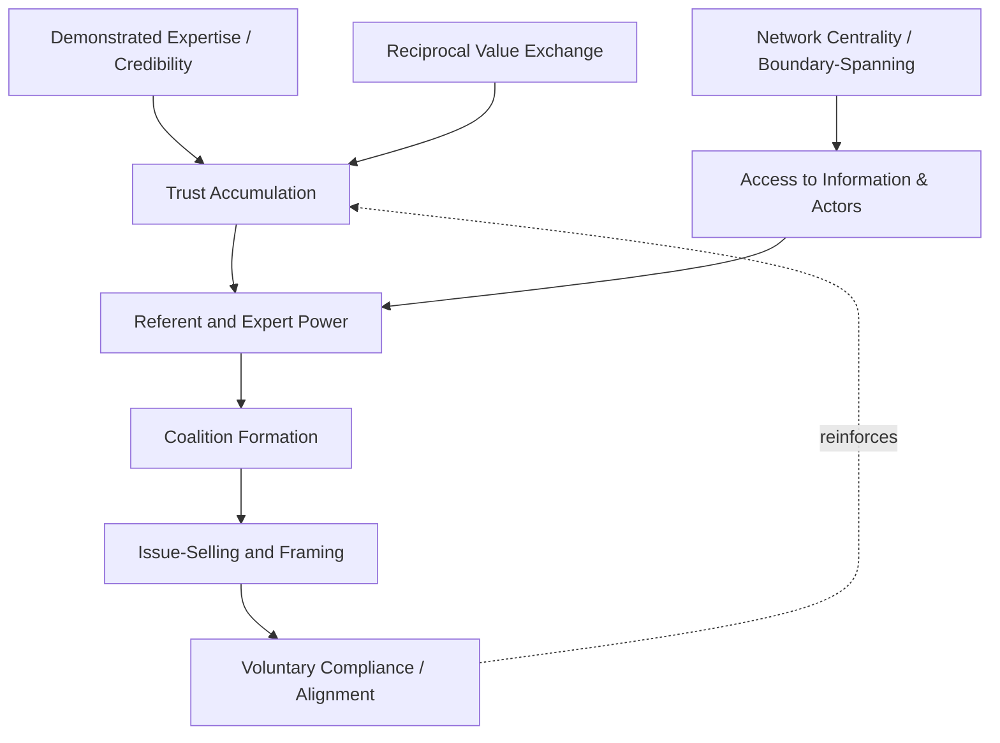

## Leading Without Formal Authority

### Definition and Conceptual Placement

Leading without formal authority refers to the exercise of genuine leadership influence in the absence of positional power — hierarchical rank, legal authority to command, or formal organizational standing that would otherwise compel compliance. This phenomenon is variously termed "informal leadership," "leadership by influence," or, in French and diplomatic literature, "leadership d'influence." It is a central concern across organizational behavior, negotiation theory, and diplomatic practice because a substantial share of real-world leadership challenges — particularly in matrixed organizations, coalitions, multilateral institutions, and cross-boundary settings — occur precisely where the actor seeking to lead has no formal command authority over those they must influence.

The theoretical foundation rests on separating two distinct bases of leadership capacity:

$$\text{Leadership Capacity} = \text{Positional Power} + \text{Personal/Relational Power}$$

Leading without formal authority isolates and depends entirely on the second term, since the first is by definition absent or minimal.

### French and Raven's Bases of Power (Foundational Framework)

John French and Bertram Raven's classic five (later six) bases of social power remain the standard framework for distinguishing which power sources remain available absent formal authority:

**Key Points**

1. **Legitimate power** — authority derived from formal position; **largely unavailable** to the informal leader.
2. **Reward power** — capacity to provide valued outcomes; typically **limited or absent** without formal control over resources, though informal actors may offer social/reputational rewards.
3. **Coercive power** — capacity to punish; **generally unavailable** to informal leaders.
4. **Expert power** — influence derived from perceived knowledge or skill; **highly available** and central to informal leadership.
5. **Referent power** — influence derived from being liked, respected, or admired (identification-based); **highly available** and often the primary lever for informal leaders.
6. **Informational power** (added later by Raven) — influence derived from possessing or controlling access to valuable information; **available** to informal leaders who occupy network positions with privileged information access.

[Inference] The practical implication consistently drawn across the leadership-without-authority literature is that expert, referent, and informational power substitute for the legitimate, reward, and coercive power that formal leaders can draw upon, requiring a fundamentally relational rather than positional influence strategy.

### Core Influence Mechanisms

**Key Points**

- **Coalition-building**: Assembling a critical mass of informal support before attempting to move a decision forward, since the informal leader cannot simply mandate compliance.
- **Reciprocity and exchange**: Building influence through a track record of providing value to others (information, favors, credibility), creating social obligation that can later be drawn upon (related to social exchange theory).
- **Framing and issue-selling**: Strategically presenting an idea or proposal in terms that align with the interests and values of those whose buy-in is needed (Dutton & Ashford's "issue-selling" literature is foundational here).
- **Boundary-spanning and network centrality**: Occupying a structural position that connects otherwise disconnected groups (a "broker" position in social network terms), which confers influence through control of information flow rather than hierarchical rank.
- **Credibility and expertise signaling**: Establishing demonstrated competence in a relevant domain such that others voluntarily defer, even absent any obligation to do so.
- **Consistency and reliability**: Repeated trustworthy behavior over time that builds a reputation others can rely on when uncertain, substituting for the predictability that formal authority structures would otherwise guarantee.

### Process Model: How Informal Influence Accumulates

### Distinguishing from Related Constructs

| Construct | Relationship to Leading Without Formal Authority |
| --- | --- |
| Emergent Leadership | Closely related — describes the process by which an individual comes to be perceived as a leader within a leaderless or informally structured group, often through the same expert/referent power mechanisms |
| Servant Leadership | An orientation a formal or informal leader can hold; not specifically about the absence of positional authority |
| Shared/Distributed Leadership | Concerns leadership function distributed across multiple actors within a structure; leading without authority can occur within such distributed systems but is a narrower individual-level phenomenon |
| Followership Theory | Examines the follower's active role in conferring leadership status — directly relevant, since informal leadership exists only to the extent followers choose to grant it |
| Lateral Leadership / Peer Leadership | Near-synonym, emphasizing influence directed at organizational peers rather than subordinates |

### Organizational Contexts Where This Capability Is Central

**Key Points**

- **Matrix organizations**: Project or program leads frequently must influence functional staff who report administratively to a different manager, requiring influence without direct authority.
- **Cross-functional and cross-agency initiatives**: Coordinators bringing together representatives from multiple departments or institutions with no formal authority over any of them.
- **Professional and technical experts**: Subject-matter specialists (legal counsel, technical advisors) who must shape decisions made by more senior formal decision-makers.
- **Coalitions and multilateral bodies**: Representatives of member states or agencies within a body where no single actor holds command authority over others — a defining structural feature of most international organizations.
- **Volunteer and civil-society organizations**: Leadership entirely dependent on voluntary follower engagement, since formal sanctions for non-compliance are largely unavailable.

### Example: Informal Leadership in an Interagency Coordination Setting

**Example**

A mid-level technical officer coordinating a joint interagency working group with representatives from finance, foreign affairs, and defense ministries, none of whom report to the coordinator:

- Establishes **expert power** by consistently providing the most rigorous, well-sourced technical analysis at each session, becoming the default reference point for factual questions.
- Builds **reciprocity** by proactively sharing useful information with each ministry's representative outside formal sessions, creating goodwill independent of any single meeting's agenda.
- Uses **issue-selling** by framing a proposed joint protocol in terms specific to each ministry's institutional interest (cost savings for finance, diplomatic reputational benefit for foreign affairs, operational efficiency for defense) rather than a single generic pitch.
- Builds a **coalition** incrementally — securing informal agreement from the two most cooperative representatives first, then leveraging that momentum ("two of three ministries already see the value") to bring the third into alignment.
- Never issues directives (unavailable to a non-hierarchical convener), instead consistently proposing, framing, and facilitating consensus — illustrating referent and expert power substituting fully for absent legitimate/coercive power.

### Risks, Limits, and Failure Modes

**Key Points**

- **Fragility of influence**: Because informal authority rests entirely on relational and reputational capital rather than institutional backing, a single credibility-damaging error can collapse influence far more quickly than it would for a formally empowered leader, whose position offers some institutional buffer.
- **Attribution and credit risk**: Informal leaders who successfully drive outcomes may find credit attributed to formally positioned actors, a recognized organizational dynamic that can undermine sustained motivation to continue exercising informal leadership.
- **Overreliance on personal relationships**: Influence built primarily on individual rapport may not transfer if the informal leader changes roles, is absent, or if key formal counterparts turn over — unlike positional authority, which persists independent of the specific individual holding it.
- **Limits on scale**: Informal influence mechanisms (issue-selling, coalition-building, reciprocity) are comparatively slow and resource-intensive compared to command authority, constraining the pace and scale at which change can be driven without eventual formal backing.
- **Legitimacy ceiling**: [Inference] There is likely a practical ceiling on how far informal leadership can substitute for formal authority in decisions requiring binding commitment or accountability — most informal-leadership success stories in the literature describe shaping, shepherding, or accelerating decisions, rather than fully substituting for the formal authority ultimately required to finalize binding action.

### Empirical and Theoretical Support

**Key Points**

- Emergent leadership research (small-group and team studies) consistently finds that perceived expertise and communication frequency/quality are stronger predictors of informal leadership emergence than any formal credential.
- Social network analysis research on organizational influence finds that **betweenness centrality** (occupying brokerage positions connecting otherwise unconnected actors) is a robust predictor of informal influence, independent of hierarchical rank.
- Issue-selling research (Dutton, Ashford, and colleagues) demonstrates that the framing and timing of how an idea is "packaged" for upward or lateral audiences significantly affects its uptake, providing an empirically grounded tactical toolkit for informal leaders.

### Relevance to Diplomatic Leadership Contexts

**Key Points**

- Diplomacy is structurally a domain where formal command authority over counterparts is categorically absent by design — sovereign states are not subordinate to one another — making "leading without formal authority" arguably the default operating condition of diplomatic practice rather than an exceptional case.
- Middle-power and smaller-state diplomats frequently rely disproportionately on expert power (technical/legal drafting capability), coalition-building, and informational brokerage to shape multilateral outcomes that their formal voting weight or material power alone would not secure — a well-documented dynamic in middle-power diplomacy literature.
- Multilateral chairship and facilitator roles (e.g., chairing a negotiating committee) formally confer only procedural authority, not substantive authority over outcomes, making these positions a paradigmatic real-world case of leadership exercised almost entirely through referent, expert, and informational power rather than command authority.
- [Inference] The fragility-of-influence risk noted above carries heightened stakes in diplomatic settings, where a single credibility-damaging incident (a broken confidence, a misrepresented position) can disproportionately and durably damage an individual diplomat's or delegation's capacity for future informal influence, given the closed, reputation-dense nature of diplomatic professional networks.

**Related Topics**

- French and Raven's Bases of Social Power
- Emergent Leadership in Small Groups
- Issue-Selling and Upward Influence (Dutton & Ashford)
- Social Network Analysis and Brokerage in Organizations
- Coalition-Building and Negotiation Strategy
- Middle-Power Diplomacy and Multilateral Influence
- Followership Theory