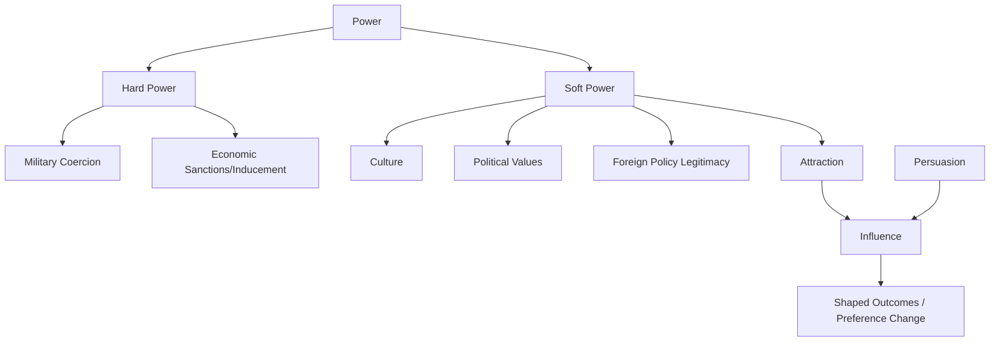

## Influence, Persuasion, and Soft Power

### Overview

Influence, persuasion, and soft power form the behavioral and strategic toolkit through which diplomatic leaders shape outcomes without recourse to coercion or hard power (military force, economic sanctions, legal compulsion). This item sits at the intersection of political science, psychology, and applied leadership practice: it examines *how* actors get others to want what they want, rather than *forcing* them to comply.

### Core Definitions

**Influence**

The capacity to affect the beliefs, decisions, or behavior of others through non-coercive means. Influence is the broadest of the three terms and encompasses both persuasion and soft power as mechanisms.

**Persuasion**

A deliberate, communicative act aimed at changing another party's attitudes, beliefs, or actions through argument, framing, or appeal, while preserving their sense of free choice. Persuasion is interpersonal/tactical in scale — it operates in negotiations, speeches, and one-on-one diplomacy.

**Soft Power**

A term coined by Joseph Nye (1990) denoting a state's or actor's ability to shape the preferences of others through attraction and appeal rather than coercion (hard power) or payment. Soft power is structural/systemic in scale — it operates through culture, values, institutions, and policies over long time horizons.

$$\text{Power} = \text{Hard Power (coercion, payment)} + \text{Soft Power (attraction, co-optation)}$$

### Conceptual Relationship Diagram

### Nye's Three Resources of Soft Power

1. **Culture** — the export and global appeal of an actor's cultural products, language, and lifestyle (film, music, education, cuisine)
2. **Political Values** — the perceived legitimacy and attractiveness of domestic and international values (democracy, human rights, rule of law) when the actor is seen to live up to them
3. **Foreign Policy** — the extent to which policies are viewed by others as legitimate, moral, and having authority

**Key Points**

- Soft power is *relational* and *perceptual* — it exists in the eyes of the target audience, not as an intrinsic attribute of the source
- Soft power can be squandered rapidly by policy hypocrisy (perceived gaps between stated values and actual conduct)
- Soft power and hard power are not mutually exclusive; Nye's later work introduces "smart power" as their deliberate combination

### Mechanisms of Persuasion in Diplomatic Contexts

Diplomatic persuasion draws heavily on classical rhetoric and modern behavioral science.

**1. Classical Rhetorical Appeals (Aristotle)**

- *Ethos* — credibility and character of the speaker (a diplomat's track record, institutional backing)
- *Pathos* — emotional resonance (appeals to shared history, moral urgency, empathy)
- *Logos* — logical argument (data, precedent, treaty text, cost-benefit framing)

**2. Cialdini's Principles of Influence**

| Principle | Diplomatic Application |
| --- | --- |
| Reciprocity | Concessions offered to invite concessions in return |
| Commitment/Consistency | Securing small public commitments before larger ones |
| Social Proof | Citing coalition support ("40 nations have already signed") |
| Authority | Invoking expert consensus, legal precedent, or institutional mandate |
| Liking | Building rapport, cultural fluency, personal relationships pre-negotiation |
| Scarcity | Framing an agreement window as time-limited or unique |

**3. Framing and Anchoring**

The way an issue is presented (as a "security threat" vs. a "humanitarian crisis," for instance) changes the perceived stakes and available responses. Anchoring the first-offered position in a negotiation shapes the psychological reference point for subsequent bargaining. [Inference: the magnitude of anchoring effects in high-stakes diplomatic negotiation is not as rigorously quantified as in controlled behavioral-economics settings, since real-world diplomacy has confounding variables that lab studies exclude.]

### Instruments of Soft Power in Practice

- **Public Diplomacy** — direct engagement with foreign publics (broadcasting, cultural centers, exchange programs such as Fulbright)
- **Nation Branding** — cultivating a coherent national image (e.g., tourism campaigns, Olympic hosting)
- **Multilateral Institution-Building** — shaping norms via participation in and leadership of international bodies (UN, WTO, regional blocs)
- **Educational and Academic Exchange** — long-horizon relationship-building with future foreign elites
- **Development Assistance and Aid Diplomacy** — foreign aid framed around partnership rather than dependency
- **Digital/Media Diplomacy** — state-backed media outlets and social media diplomacy ("digital diplomacy" or "Twiplomacy")

### Worked Example: A Bilateral Trade Negotiation

**Scenario**: Country A wants Country B to lower tariffs on agricultural exports.

**Persuasion tactics deployed**:

- *Ethos*: Lead negotiator references a prior successful agreement they brokered
- *Reciprocity*: Country A offers to ease visa restrictions for Country B's students in exchange
- *Framing*: The deal is presented as "mutual economic resilience" rather than "trade concession"
- *Social proof*: Reference to similar tariff arrangements Country B has with other allies

**Soft power backdrop**:

- Country A's universities already host thousands of Country B's students (educational soft power), creating pre-existing goodwill among B's negotiating elite
- Country A's cultural exports (film, media) have shaped a favorable public perception in B, reducing domestic political resistance to a deal

**Output**: A negotiated tariff reduction framed publicly in both countries as a "partnership milestone," reducing the political cost for B's leadership.

### Measuring Soft Power (Selected Indices)

- **Soft Power 30 / Global Soft Power Index** — composite indices ranking countries on metrics like culture, digital engagement, education, and enterprise
- Metrics typically include: diplomatic missions count, cultural export volume, international student enrollment, media reach, and international polling on favorability

[Unverified: exact current index methodologies and rankings change annually and are maintained by external organizations (e.g., Brand Finance, Portland Communications); consult the current year's published report for up-to-date figures.]

### Limits and Critiques

- **Soft power is slow-acting** and difficult to mobilize for urgent crises compared to hard power instruments
- **Attribution problem**: it is difficult to empirically isolate soft power's causal effect on a specific diplomatic outcome from other variables (economic ties, hard-power deterrence, historical alliances)
- **Asymmetry of attraction**: soft power built for one audience (domestic legitimacy) may fail or backfire with another (foreign public perception)
- **Persuasion ethics boundary**: there is a contested line between legitimate persuasion and manipulation/propaganda — [Speculation: this boundary is frequently adjudicated post hoc by public and scholarly opinion rather than by a fixed a priori standard]

### Illustrative Diagram: Influence Pathway Over Time (svg_diagram)

<svg xmlns="http://www.w3.org/2000/svg" viewBox="0 0 720 320">
<text x="360" y="24" font-size="16" text-anchor="middle" font-family="sans-serif" font-weight="bold">Influence Pathway Over Time (svg_diagram)</text>
<line x1="60" y1="280" x2="680" y2="280" stroke="black" stroke-width="2" />
<text x="360" y="305" font-size="12" text-anchor="middle" font-family="sans-serif">Time Horizon</text>
<line x1="60" y1="280" x2="60" y2="50" stroke="black" stroke-width="2" />
<text x="30" y="165" font-size="12" text-anchor="middle" font-family="sans-serif" transform="rotate(-90 30,165)">Effect Strength</text>
<path d="M 80 250 C 150 150, 200 100, 260 90" stroke="#2563eb" stroke-width="3" fill="none" />
<text x="150" y="80" font-size="12" fill="#2563eb" font-family="sans-serif">Persuasion (fast, tactical)</text>
<path d="M 80 270 C 250 260, 450 150, 660 70" stroke="#16a34a" stroke-width="3" fill="none" />
<text x="470" y="130" font-size="12" fill="#16a34a" font-family="sans-serif">Soft Power (slow, structural)</text>
<circle cx="260" cy="90" r="4" fill="#2563eb" />
<circle cx="660" cy="70" r="4" fill="#16a34a" />
</svg>

### Interdisciplinary Foundations

- **Political Science**: realism vs. liberalism debates on power (Nye, Morgenthau)
- **Psychology**: social influence theory (Cialdini), cognitive framing effects (Kahneman/Tversky)
- **Communication Studies**: rhetoric, public diplomacy theory
- **Sociology**: cultural capital and legitimacy (Bourdieu's concept of "symbolic power" is sometimes cross-referenced with soft power)

**Related Topics**

- Negotiation Theory and BATNA Analysis
- Public Diplomacy and Nation Branding Strategy
- Coalition-Building and Multilateral Consensus Formation
- Cross-Cultural Communication in Diplomatic Settings
- Track II Diplomacy and Informal Influence Channels
- Propaganda, Disinformation, and the Ethics of Persuasion
- Smart Power and the Integration of Hard/Soft Instruments
- Digital Diplomacy and Social Media Statecraft