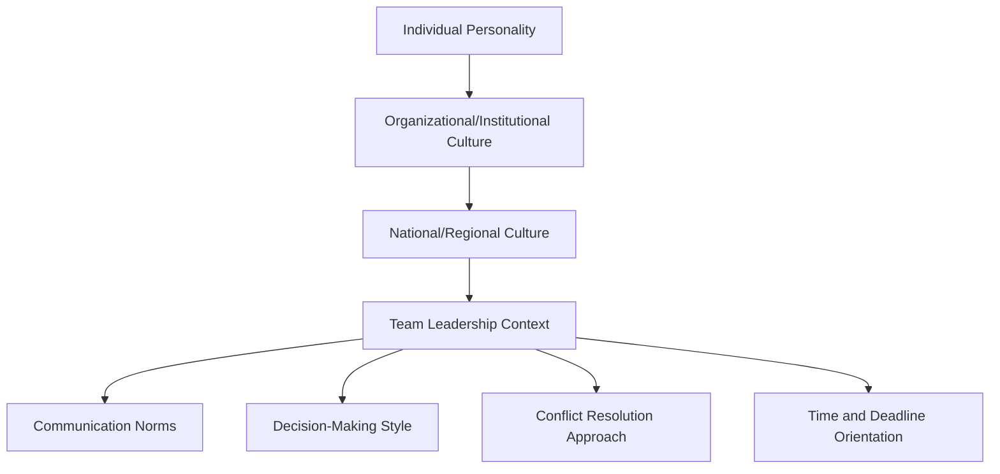

## Leading Multicultural and Multinational Teams

### Overview

Leading multicultural and multinational teams addresses the applied leadership competencies required to manage groups whose members differ in national origin, cultural values, language, and institutional norms. In diplomatic contexts, this occurs both internally (leading a diverse embassy staff, mission team, or delegation) and externally (chairing multinational working groups, coalitions, or negotiation teams). The discipline draws on cross-cultural psychology, organizational behavior, and comparative management theory.

### Core Definitions

**Multicultural Team**

A team whose members hold differing cultural value orientations, which may or may not correlate with nationality (e.g., a single-nationality team can still be multicultural along ethnic, regional, or generational lines).

**Multinational Team**

A team whose members come from different national/legal jurisdictions, often distributed geographically, adding structural complexity (time zones, labor law, language of operation) on top of cultural variation.

**Cultural Intelligence (CQ)**

A leader's capability to function effectively across culturally diverse settings, typically decomposed into four dimensions: CQ Drive (motivation), CQ Knowledge (cognitive understanding of cultural systems), CQ Strategy (metacognitive planning), and CQ Action (behavioral adaptability).

### Foundational Frameworks for Cultural Variation

**1. Hofstede's Cultural Dimensions**

A widely cited (and widely critiqued) framework for comparing national cultures along measurable axes:

| Dimension | Description |
| --- | --- |
| Power Distance | Acceptance of unequal power distribution in institutions |
| Individualism vs. Collectivism | Emphasis on individual vs. group identity and loyalty |
| Masculinity vs. Femininity | Preference for achievement/assertiveness vs. cooperation/quality of life |
| Uncertainty Avoidance | Tolerance for ambiguity and unstructured situations |
| Long-Term vs. Short-Term Orientation | Emphasis on future reward vs. tradition and immediate results |
| Indulgence vs. Restraint | Degree of gratification of basic human desires permitted |

[Inference: Hofstede's dimensions are treated in diplomatic and business training as practical heuristics; academic critique (notably by McSweeney and others) questions treating national averages as predictive of individual behavior, so leaders should use the framework as a starting hypothesis rather than a deterministic rule.]

**2. Trompenaars' Seven Dimensions**

A complementary model emphasizing dilemmas such as universalism vs. particularism (rule-based vs. relationship-based judgment), and neutral vs. affective (emotional expressiveness norms) — often used alongside Hofstede in diplomatic training curricula.

**3. Erin Meyer's Culture Map**

An eight-scale framework specifically designed for management/leadership application, including axes such as:

- Communicating (low-context vs. high-context)
- Evaluating (direct vs. indirect negative feedback)
- Persuading (principles-first vs. applications-first reasoning)
- Leading (egalitarian vs. hierarchical)
- Deciding (consensual vs. top-down)
- Trusting (task-based vs. relationship-based)
- Disagreeing (confrontational vs. avoids confrontation)
- Scheduling (linear-time vs. flexible-time)

### Diagram: Layers of Cultural Complexity in Team Leadership

### Key Leadership Challenges

**1. Communication Breakdown**

Low-context communicators (explicit, literal) working with high-context communicators (implicit, relationship-dependent) can misread intent — a direct "no" from one culture may be perceived as rude, while an indirect "we will consider it" from another may be misread as a "yes."

**2. Differing Feedback Norms**

Direct negative feedback (common in some Northern European and North American professional norms) can be perceived as face-threatening in cultures with strong face-saving norms (common across parts of East and Southeast Asia, among others), requiring leaders to adapt feedback delivery per team member.

**3. Hierarchy and Decision Authority**

High power-distance team members may expect and defer to top-down decisions from the leader, while low power-distance members may expect consultative, consensus-driven processes — applying a single decision style uniformly can alienate part of the team.

**4. Time Orientation Conflicts**

Monochronic cultures (linear, one-task-at-a-time, punctuality-emphasized) versus polychronic cultures (fluid, relationship-prioritized, flexible scheduling) can create friction around deadlines and meeting structure.

**5. In-Group/Out-Group Dynamics and Subgrouping**

Multinational teams risk fracturing into national or linguistic subgroups ("faultlines"), reducing overall team cohesion and information sharing across the fault line.

### Leadership Strategies and Practices

**Key Points**

- **Establish a shared team culture ("third culture")**: rather than defaulting to the leader's home culture, negotiate explicit team norms (meeting cadence, feedback protocols, decision rules) collaboratively
- **Adapt communication style situationally**: switch between low-context and high-context framing depending on the audience member, and confirm understanding through active listening/paraphrasing
- **Use structured processes to reduce ambiguity**: written follow-ups after verbal meetings, explicit agenda-setting, and documented decisions reduce misinterpretation risk
- **Rotate meeting times and formats** to distribute the burden of accommodation across time zones and cultural preferences rather than always favoring headquarters' norms
- **Invest in relationship-building time**, especially for relationship-based-trust cultures, before pushing into task execution
- **Provide multiple feedback channels** (private one-on-ones vs. group settings) so team members can choose the mode that fits their comfort level
- **Build psychological safety** explicitly, since its behavioral signals (e.g., speaking up, admitting error) vary significantly by cultural context

### Worked Example: Chairing a Multinational Coordination Team

**Scenario**: A diplomat leads a five-country task force on refugee resettlement coordination, with members from a high-power-distance/high-context culture, a low-power-distance/low-context culture, and three intermediate profiles.

**Applied leadership adaptations**:

- Pre-circulates a written agenda before each session (reduces ambiguity for low-context members; gives high-context members time to consult with their home ministries before speaking)
- Opens each meeting with informal relationship-building time (accommodates relationship-based-trust members) before moving to task items
- Solicits input privately from more hierarchical/deferential members before the group session, then invites them to voice that input publicly with the leader's visible support (reduces face-risk of contradicting more senior voices in open forum)
- Documents all decisions in written minutes circulated within 24 hours, creating an explicit record that reduces reliance on any single high-context oral understanding

**Output**: Higher participation equity across delegations and reduced downstream disputes over "what was actually agreed."

### Illustrative Diagram: Communication Style Spectrum (svg_diagram)

<svg xmlns="http://www.w3.org/2000/svg" viewBox="0 0 700 260">
<text x="350" y="24" font-size="16" text-anchor="middle" font-family="sans-serif" font-weight="bold">Communication Style Spectrum (svg_diagram)</text>
<line x1="60" y1="130" x2="640" y2="130" stroke="black" stroke-width="2" />
<polygon points="640,130 628,124 628,136" fill="black" />
<polygon points="60,130 72,124 72,136" fill="black" />

<text x="60" y="160" font-size="13" text-anchor="middle" font-family="sans-serif">Low-Context</text>

<text x="60" y="176" font-size="11" text-anchor="middle" font-family="sans-serif">(explicit, direct)</text>

<text x="640" y="160" font-size="13" text-anchor="middle" font-family="sans-serif">High-Context</text>

<text x="640" y="176" font-size="11" text-anchor="middle" font-family="sans-serif">(implicit, relational)</text>

<circle cx="150" cy="130" r="8" fill="#2563eb" />
<text x="150" y="105" font-size="11" text-anchor="middle" font-family="sans-serif">Member A</text>
<circle cx="330" cy="130" r="8" fill="#16a34a" />
<text x="330" y="105" font-size="11" text-anchor="middle" font-family="sans-serif">Member B</text>
<circle cx="520" cy="130" r="8" fill="#dc2626" />
<text x="520" y="105" font-size="11" text-anchor="middle" font-family="sans-serif">Member C</text>
</svg>

### Common Pitfalls

- **Assuming national culture predicts individual behavior**: treating cultural frameworks as deterministic rather than probabilistic tendencies
- **One-size-fits-all leadership style**: applying a single feedback or decision-making approach uniformly across a heterogeneous team
- **Over-indexing on language fluency as competence**: mistaking accent or fluency gaps for lower capability or lower confidence
- **Ignoring subgroup fault lines**: failing to actively counteract national/linguistic clustering within the team
- **Underestimating the cognitive load of cross-cultural code-switching** placed on team members operating in a non-native language or unfamiliar norm set

### Interdisciplinary Foundations

- **Cross-Cultural Psychology**: Hofstede, Trompenaars, Meyer frameworks
- **Organizational Behavior**: team faultline theory, psychological safety research (Edmondson)
- **Linguistics**: high-/low-context communication theory (Edward T. Hall)
- **Diplomatic Practice**: protocol and etiquette training, multilateral negotiation coordination

**Related Topics**

- Cross-Cultural Negotiation Techniques
- Cultural Intelligence (CQ) Development and Assessment
- Psychological Safety in Diverse Teams
- Virtual and Distributed Team Leadership Across Time Zones
- Conflict Resolution Styles Across Cultures
- Protocol, Etiquette, and Diplomatic Communication Norms
- Team Faultline Theory and Subgroup Dynamics
- Inclusive Leadership and Equity of Voice in Group Settings