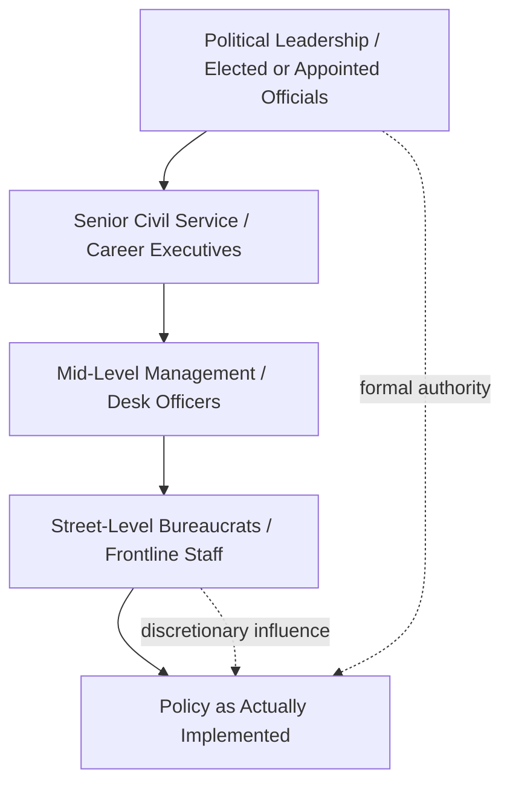

## Leadership Within Hierarchical Government Bureaucracies

### Overview

Leadership within hierarchical government bureaucracies concerns how diplomatic and public-sector leaders exercise influence, drive initiative, and manage change inside formalized, rule-bound organizational structures. Unlike corporate or ad hoc team leadership, bureaucratic leadership operates under constraints of legal authority, procedural accountability, civil-service protections, and multi-level chains of command — requiring a distinct leadership repertoire from that used in flatter or more fluid organizations.

### Core Definitions

**Bureaucracy** (Weberian sense)

A form of organization characterized by hierarchical authority, formalized rules and procedures, division of labor by specialized function, impersonality (decisions based on rules rather than personal relationships), and career-based advancement.

**Hierarchical Authority**

The formal chain of command through which directives flow downward and accountability flows upward; positional authority is derived from rank/office rather than expertise or charisma alone.

**Bureaucratic Leadership**

The exercise of influence and decision-making *within* the constraints of formal rules, standard operating procedures (SOPs), and multi-tiered approval chains — distinct from entrepreneurial or charismatic leadership models that assume greater structural flexibility.

**Street-Level Bureaucrat** (Lipsky's concept)

Frontline civil servants (e.g., consular officers, visa adjudicators) who exercise substantial discretion in applying policy despite operating at the bottom of the hierarchy — a key leadership consideration since formal hierarchy does not fully determine actual policy implementation.

### Weber's Ideal-Type Bureaucracy: Core Characteristics

1. **Hierarchical structure** — clear chain of command and supervision
2. **Formal rules and procedures** — codified regulations govern decisions, reducing arbitrary action
3. **Specialization/division of labor** — functions are distributed across defined roles
4. **Impersonality** — rules apply uniformly regardless of personal relationships
5. **Career orientation** — advancement based on qualification, tenure, and merit criteria
6. **Written documentation** — decisions and precedents are formally recorded

**Key Points**

- Weber's model was intended as an *ideal type* (analytical abstraction), not a literal description of any single real bureaucracy — real government bureaucracies deviate from it in practice
- Bureaucratic structure provides predictability and legal accountability but can produce rigidity, slow decision cycles, and diffusion of responsibility

### Diagram: Layers of Bureaucratic Leadership Constraint

### Leadership Challenges Specific to Hierarchical Bureaucracies

**1. The Authority-Influence Gap**

Formal positional authority does not automatically translate into compliance or genuine buy-in; leaders must build informal influence (credibility, coalition-building) to complement formal rank.

**2. Principal-Agent Problems**

Political leadership (principals) cannot fully monitor or control career civil servants (agents), who may have their own institutional incentives, risk aversion, or professional norms diverging from stated political priorities.

**3. Change Management Under Procedural Constraint**

Reforms must navigate existing SOPs, procurement rules, personnel regulations, and legal review processes — meaning bureaucratic change is typically incremental rather than disruptive, and leaders who attempt rapid unilateral change risk legal or procedural pushback.

**4. Turf Protection and Interagency Rivalry**

Bureaucratic units compete for budget, mandate, and jurisdiction; a leader coordinating across agencies (e.g., a diplomat coordinating with defense, intelligence, and development agencies) must manage inter-organizational politics without formal authority over other agencies' staff.

**5. Risk-Averse Culture**

Because bureaucratic accountability structures often penalize visible errors more than they reward visible successes, career staff can develop excessive caution ("CYA" — cover-your-actions — behavior), which leaders must counteract to enable initiative.

**6. Rotational/Tenure Discontinuity**

In diplomatic services specifically, leaders (e.g., ambassadors, desk chiefs) often rotate every few years, creating discontinuity in institutional relationships and requiring rapid onboarding into existing bureaucratic dynamics.

### Leadership Strategies for Operating Within Hierarchy

- **Lead upward as well as downward**: managing the expectations, framing, and information flow to superiors ("managing up") is as critical as directing subordinates, since bureaucratic leaders are simultaneously agents of a principal above them
- **Build coalitions horizontally**: because cross-agency authority is often absent, effective bureaucratic leaders invest in informal networks and reciprocal favor-exchange across parallel units
- **Use procedural fluency as a leadership tool**: deep knowledge of how to work within (and expedite) formal approval processes is itself a source of influence and a differentiator between effective and ineffective bureaucratic leaders
- **Delegate discretion deliberately to street-level actors**: given that frontline staff exercise real policy-shaping discretion regardless of formal hierarchy, leaders benefit from explicit guidance and trust-building with frontline implementers rather than assuming top-down directives alone determine outcomes
- **Sequence reforms incrementally**: pilot programs and phased rollouts reduce the legal/procedural friction of full-scale bureaucratic change
- **Create psychological safety for calculated risk-taking**: explicitly rewarding good-faith initiative (even when outcomes are imperfect) counteracts default risk-aversion
- **Translate political mandates into operational language**: bridging the gap between politically framed objectives (from appointed leadership) and the technical/procedural language career staff require to execute

### Worked Example: A New Ambassador Driving Policy Change

**Scenario**: A newly appointed ambassador wants to accelerate visa processing at post to support a new bilateral trade initiative, but the consular section operates under standardized, risk-averse vetting SOPs set by headquarters.

**Applied leadership approach**:

1. **Managing up**: the ambassador secures explicit, written backing from headquarters leadership for a pilot expedited-processing track, converting a personal preference into formal political cover for consular staff
2. **Managing across**: coordinates informally with the regional security office and legal counsel early, rather than presenting the initiative as a fait accompli, to pre-empt objections
3. **Managing down**: engages consular officers (street-level bureaucrats) directly to understand which specific procedural steps create bottlenecks, incorporating their frontline expertise into the redesign rather than imposing a top-down solution
4. **Incremental rollout**: proposes a limited pilot (e.g., one visa category) with defined success metrics, rather than a wholesale SOP rewrite, reducing procedural and legal risk exposure

**Output**: A pilot program with documented outcomes that can be formally institutionalized, building the evidentiary and political basis for wider bureaucratic change.

### Illustrative Diagram: Formal Authority vs. Informal Influence (svg_diagram)

<svg xmlns="http://www.w3.org/2000/svg" viewBox="0 0 700 300">
<text x="350" y="24" font-size="16" text-anchor="middle" font-family="sans-serif" font-weight="bold">Formal Authority vs. Informal Influence (svg_diagram)</text>
<line x1="80" y1="260" x2="80" y2="60" stroke="black" stroke-width="2" />
<text x="40" y="160" font-size="12" text-anchor="middle" font-family="sans-serif" transform="rotate(-90 40,160)">Formal Authority</text>
<line x1="80" y1="260" x2="640" y2="260" stroke="black" stroke-width="2" />
<text x="360" y="285" font-size="12" text-anchor="middle" font-family="sans-serif">Informal Influence / Coalition-Building</text>
<circle cx="180" cy="220" r="10" fill="#dc2626" />
<text x="180" y="200" font-size="11" text-anchor="middle" font-family="sans-serif">Rigid Manager</text>
<circle cx="560" cy="220" r="10" fill="#2563eb" />
<text x="560" y="200" font-size="11" text-anchor="middle" font-family="sans-serif">Network Broker</text>
<circle cx="180" cy="100" r="10" fill="#f59e0b" />
<text x="180" y="85" font-size="11" text-anchor="middle" font-family="sans-serif">Command-Only Leader</text>
<circle cx="560" cy="100" r="10" fill="#16a34a" />
<text x="560" y="85" font-size="11" text-anchor="middle" font-family="sans-serif">Effective Bureaucratic Leader</text>
</svg>

### Common Pitfalls

- **Overreliance on positional authority**: assuming rank alone secures genuine cooperation from career staff or peer agencies
- **Underestimating procedural veto points**: attempting reforms without early legal/procedural review, resulting in late-stage blockage
- **Neglecting street-level discretion**: designing policy without frontline input, leading to implementation gaps between stated policy and actual practice
- **Excessive centralization attempts**: trying to eliminate all subordinate discretion, which typically increases delay and reduces adaptive capacity
- **Failure to document and institutionalize gains**: leaving successful informal workarounds undocumented, so they evaporate at leadership rotation

### Interdisciplinary Foundations

- **Public Administration**: Weberian bureaucratic theory, New Public Management critiques
- **Political Science**: principal-agent theory, Lipsky's street-level bureaucracy theory
- **Organizational Behavior**: formal vs. informal organizational network theory
- **Diplomatic Practice**: interagency process management, foreign ministry organizational design

**Related Topics**

- Principal-Agent Theory in Public Administration
- Street-Level Bureaucracy and Discretionary Policy Implementation
- Interagency Coordination and Turf Management
- Change Management in Public-Sector Institutions
- Managing Up: Influencing Political Leadership as a Career Official
- New Public Management vs. Traditional Weberian Administration
- Institutional Memory and Leadership Transition in Rotational Postings