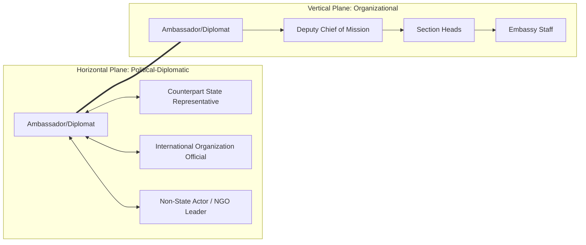

## Political-Diplomatic Leadership Versus Organizational Leadership

### Overview

This item examines the conceptual and practical distinction between two leadership modes that diplomats must often exercise simultaneously: **political-diplomatic leadership** (shaping outcomes among sovereign, formally equal actors with no shared chain of command) and **organizational leadership** (directing subordinates and managing operations within a bounded institution). Diplomats routinely shift between these modes within a single day — negotiating with a counterpart state where no one has authority over the other, then returning to manage their own embassy staff, where formal hierarchy applies. Understanding when each mode is operative, and where they conflict, is a core integrative competency.

### Core Definitions

**Political-Diplomatic Leadership**

The exercise of influence among formally sovereign or co-equal actors (states, international organizations, non-state parties) in the absence of a shared hierarchical authority. Legitimacy here is negotiated, relational, and contingent on mutual recognition rather than positional rank.

**Organizational Leadership**

The exercise of authority and influence within a bounded institution possessing formal hierarchy, job roles, and internal accountability mechanisms (e.g., an embassy, a foreign ministry desk, a delegation staff).

**Horizontal Leadership**

A leadership mode operating among peers or formally equal parties, relying on persuasion, coalition-building, and reciprocity rather than command — closely associated with political-diplomatic leadership.

**Vertical Leadership**

A leadership mode operating through a chain of command with clear superior-subordinate relationships — closely associated with organizational leadership.

### Comparative Framework

| Dimension | Political-Diplomatic Leadership | Organizational Leadership |
| --- | --- | --- |
| Authority basis | Negotiated legitimacy, mutual recognition, reputation | Formal position, institutional rank |
| Relationship structure | Horizontal (among sovereign/co-equal actors) | Vertical (hierarchical chain of command) |
| Primary tools | Persuasion, soft power, coalition-building, reciprocity | Directives, delegation, performance management, SOPs |
| Accountability | To domestic constituencies, international norms, reputation | To institutional superiors and formal procedures |
| Compliance mechanism | Voluntary alignment of interests | Formal authority backed by institutional sanction |
| Time horizon of consequence | Often long-term (reputational, relational) | Often short/medium-term (operational, procedural) |
| Failure mode | Breakdown of trust, loss of credibility, isolation | Insubordination, inefficiency, morale/legal issues |

### Diagram: Two Leadership Planes Diplomats Must Operate On

### Points of Convergence and Tension

**1. Role-Switching Within a Single Day**

A diplomat may spend the morning negotiating horizontally with a foreign counterpart (no authority over them) and the afternoon issuing vertical directives to embassy staff — requiring rapid cognitive and behavioral mode-switching.

**2. Internal Cohesion as a Precondition for External Credibility**

Weak organizational leadership (e.g., a poorly managed, demoralized embassy team) undermines political-diplomatic effectiveness, since external counterparts often perceive institutional dysfunction and factor it into their assessment of reliability.

**3. Divergent Legitimacy Sources Can Create Role Conflict**

A political appointee leader (legitimacy from political appointment) directing career organizational staff (legitimacy from technical expertise and institutional continuity) can create friction if the two legitimacy bases are not reconciled — this is a recurring tension in ambassadorial leadership of career foreign-service staff.

**4. Negotiation Mandate vs. Organizational Constraint**

A diplomat's horizontal negotiating flexibility is itself bounded by vertical organizational constraints (instructions from capital, budget authority, legal limits) — meaning political-diplomatic leadership is never fully autonomous from the organizational hierarchy the diplomat also answers to.

**5. Reputation Spans Both Planes**

A leader's reputation for reliability, built through consistent organizational leadership (keeping internal commitments, fair treatment of staff), often transfers into and reinforces credibility in the horizontal political-diplomatic plane, and vice versa.

### Leadership Competencies Required for Integration

**Key Points**

- **Mode recognition**: correctly diagnosing which plane a given interaction belongs to (e.g., recognizing that a seemingly internal staff meeting has diplomatic-sensitivity implications, or that an informal conversation with a counterpart carries organizational-resourcing consequences)
- **Authority translation**: converting horizontally-negotiated outcomes (agreements, understandings with counterparts) into vertically actionable organizational directives (implementation instructions for staff)
- **Legitimacy stewardship**: maintaining credibility simultaneously with superiors (vertical, upward), subordinates (vertical, downward), and counterparts (horizontal) — since a legitimacy failure in one plane often propagates to the others
- **Boundary-spanning communication**: framing the same substantive content differently depending on whether the audience is a peer counterpart (persuasion-oriented) or subordinate staff (directive/procedural-oriented)
- **Escalation judgment**: knowing when a horizontal diplomatic issue requires vertical escalation to political leadership at capital, versus when it can be resolved through direct negotiation

### Worked Example: Managing a Cross-Border Incident

**Scenario**: A minor border incident occurs between the host country and the diplomat's home country, requiring both an external diplomatic response and internal staff coordination.

**Political-diplomatic leadership actions (horizontal plane)**:

- Diplomat contacts the host-country foreign ministry counterpart directly to de-escalate rhetoric and establish a shared fact-finding process, relying on personal credibility and reciprocal trust built over prior interactions
- No authority exists to compel the counterpart's cooperation; the diplomat relies on persuasion, framing (mutual interest in stability), and relationship capital

**Organizational leadership actions (vertical plane)**:

- Simultaneously, the diplomat directs the political section to draft a factual reporting cable to capital within a defined deadline, assigns the press office to prepare a holding statement, and instructs the consular section to check on any affected nationals
- These are executed through direct organizational authority, with clear task ownership and accountability

**Integration point**: The diplomat must ensure the internally drafted cable and statement (organizational output) are consistent with, and do not undermine, the tone being carefully calibrated in the horizontal counterpart engagement — requiring the diplomat to personally bridge both planes rather than delegating either in isolation.

### Illustrative Diagram: Mode-Switching Under Time Pressure (svg_diagram)

<svg xmlns="http://www.w3.org/2000/svg" viewBox="0 0 700 260">
<text x="350" y="24" font-size="16" text-anchor="middle" font-family="sans-serif" font-weight="bold">Mode-Switching Under Time Pressure (svg_diagram)</text>
<line x1="60" y1="220" x2="640" y2="220" stroke="black" stroke-width="2" />
<text x="350" y="245" font-size="12" text-anchor="middle" font-family="sans-serif">Time of Day</text>
<rect x="90" y="150" width="140" height="40" fill="#2563eb" opacity="0.7" />
<text x="160" y="175" font-size="11" fill="white" text-anchor="middle" font-family="sans-serif">Horizontal: Negotiation</text>
<rect x="260" y="80" width="140" height="40" fill="#16a34a" opacity="0.7" />
<text x="330" y="105" font-size="11" fill="white" text-anchor="middle" font-family="sans-serif">Vertical: Staff Directive</text>
<rect x="430" y="150" width="140" height="40" fill="#2563eb" opacity="0.7" />
<text x="500" y="175" font-size="11" fill="white" text-anchor="middle" font-family="sans-serif">Horizontal: Counterpart Call</text>
</svg>

### Common Pitfalls

- **Applying command-style directness to horizontal counterparts**: attempting to "instruct" a sovereign counterpart as if they were a subordinate, damaging the relationship
- **Applying purely persuasive/consultative style to urgent organizational directives**: over-negotiating internal tasks that require clear, timely directive leadership, causing operational delay
- **Neglecting internal legitimacy while focused externally**: prioritizing external diplomatic relationships at the expense of internal staff morale/trust, which eventually undermines external credibility
- **Political appointee/career staff friction**: failing to explicitly reconcile differing legitimacy bases between politically appointed leadership and career organizational staff
- **Escalation misjudgment**: either over-escalating routine horizontal matters to capital (signaling lack of independent judgment) or under-escalating matters that require political-level vertical authorization

### Interdisciplinary Foundations

- **International Relations Theory**: sovereign equality principle, anarchic international system (absence of overarching hierarchy among states)
- **Organizational Behavior**: hierarchy and authority theory, leader-member exchange (LMX) theory
- **Public Administration**: political appointee/career civil service dynamics
- **Diplomatic Practice**: ambassadorial role theory, chief-of-mission authority doctrine

**Related Topics**

- Sovereign Equality and the Absence of Hierarchy in International Relations
- Chief-of-Mission Authority and Ambassadorial Role Theory
- Political Appointee and Career Civil Service Dynamics
- Coalition-Building Among Formally Equal State Actors
- Escalation Protocols Between Post and Capital
- Leader-Member Exchange (LMX) Theory in Diplomatic Institutions
- Reputation and Credibility as Cross-Plane Leadership Capital