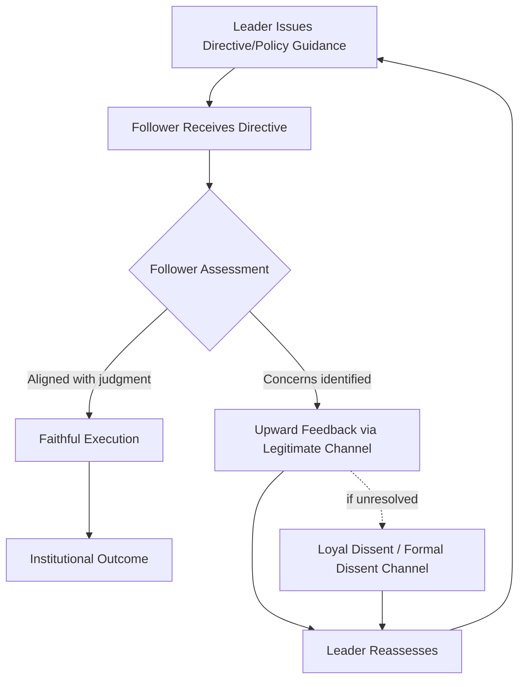

## Followership Within Diplomatic Institutions

### Overview

Followership within diplomatic institutions examines the often-overlooked complement to leadership studies: how subordinate actors in a diplomatic hierarchy exercise judgment, discretion, and influence upward and laterally, and how their behavior shapes institutional effectiveness independent of formal leadership quality. Diplomatic institutions rely heavily on skilled followership — career officers who must simultaneously execute instructions, exercise professional judgment, and manage the risks of both over-compliance and insubordination — making this a distinct leadership-adjacent competency area rather than a passive counterpart to leadership.

### Core Definitions

**Followership**

The set of behaviors, attitudes, and relational dynamics exhibited by subordinates in their interaction with leaders and institutional authority, encompassing both compliance and constructive dissent.

**Exemplary Followership** (Kelley's typology)

A followership style characterized by independent critical thinking combined with high engagement/initiative, as distinguished from passive, conformist, alienated, or pragmatist styles.

**Loyal Dissent**

The practice of raising substantive disagreement or concern through legitimate internal channels while maintaining outward institutional loyalty and discipline — a core tension in diplomatic followership given the premium placed on message discipline and unified representation of state positions.

**Dissent Channel**

A formal or informal institutional mechanism allowing career officers to register policy disagreement without violating hierarchical discipline (e.g., the U.S. State Department's formal Dissent Channel is a well-known institutionalized example).

### Kelley's Followership Typology

| Style | Independent Critical Thinking | Active Engagement |
| --- | --- | --- |
| Exemplary/Star Follower | High | High |
| Conformist | Low | High |
| Passive | Low | Low |
| Alienated | High | Low |
| Pragmatist (Survivor) | Moderate | Moderate |

[Inference: Kelley's typology is a widely used heuristic in leadership/followership training rather than a rigorously validated psychometric instrument; treat placement on these axes as descriptive rather than diagnostic.]

### Diagram: The Followership-Leadership Interaction Loop

### Why Followership Matters Distinctly in Diplomatic Institutions

**1. High-Discretion Frontline Roles**

Diplomatic followers (desk officers, consular officers, political/economic section staff) routinely exercise substantial interpretive discretion in applying broad policy guidance to specific, fast-moving situations — meaning institutional outcomes depend heavily on follower judgment, not just leader directives.

**2. Premium on Institutional Discipline**

Diplomacy requires unified external messaging (a state must speak with one voice internationally), which constrains the *visible* expression of internal disagreement more than in many other professional contexts, elevating the importance of *internal* channels for dissent.

**3. Long Institutional Memory Held by Followers**

Career diplomatic staff often possess longer institutional tenure and country/regional expertise than politically appointed or rotating leadership, meaning effective followership includes actively surfacing historical context and precedent leadership may lack.

**4. Rotational Leadership, Persistent Followership**

Because leadership positions (ambassadors, desk chiefs) frequently rotate while career staff remain, followers often serve as institutional continuity-bearers across leadership transitions — a distinct structural feature compared to organizations with more stable leadership tenure.

### Behavioral Dimensions of Effective Diplomatic Followership

**Key Points**

- **Constructive candor**: providing leaders with honest risk assessments and dissenting views through appropriate channels, rather than simply telling leadership what it wants to hear
- **Judicious initiative**: exercising discretion to act within the spirit of guidance when explicit direction is unavailable or outdated, without exceeding legitimate authority
- **Institutional memory stewardship**: proactively surfacing relevant precedent, historical context, and stakeholder sensitivities that inbound leadership may not yet know
- **Message discipline balanced with internal voice**: maintaining unified external representation while using internal, legitimate channels (cables, dissent memos, direct briefings) to register substantive concerns
- **Followership as talent pipeline**: recognizing that today's high-quality follower is frequently tomorrow's leader, making the *development* of followership skill a leadership-succession concern, not merely a compliance concern

### Worked Example: A Desk Officer's Dissent on Policy Guidance

**Scenario**: A regional desk officer receives instructions from senior leadership to publicly support a position that the officer believes, based on on-the-ground reporting, risks destabilizing a key relationship.

**Followership behavior demonstrated**:

1. The officer first seeks clarification through the direct chain of command, presenting evidence-based concerns rather than simply refusing or delaying compliance (avoiding both alienated and conformist failure modes)
2. If concerns are not resolved informally, the officer uses the institution's formal dissent channel to register the disagreement on the record, preserving both institutional discipline (no public contradiction of policy) and professional integrity (formal documented objection)
3. Pending resolution, the officer faithfully executes the current instruction externally while continuing to advocate internally — avoiding unilateral deviation from stated policy

**Output**: The dissent is either incorporated into revised guidance, or the original policy proceeds with leadership now fully informed of the documented risk — in both cases, institutional decision quality improves without compromising unified external representation.

### Illustrative Diagram: Kelley's Followership Grid (svg_diagram)

<svg xmlns="http://www.w3.org/2000/svg" viewBox="0 0 620 420">
<text x="310" y="24" font-size="16" text-anchor="middle" font-family="sans-serif" font-weight="bold">Kelley's Followership Grid (svg_diagram)</text>
<line x1="100" y1="360" x2="100" y2="60" stroke="black" stroke-width="2" />
<line x1="100" y1="360" x2="560" y2="360" stroke="black" stroke-width="2" />

<text x="40" y="210" font-size="12" text-anchor="middle" font-family="sans-serif" transform="rotate(-90 40,210)">Independent Critical Thinking</text>

<text x="330" y="390" font-size="12" text-anchor="middle" font-family="sans-serif">Active Engagement</text>

<text x="115" y="80" font-size="11" font-family="sans-serif">High</text>

<text x="115" y="350" font-size="11" font-family="sans-serif">Low</text>

<text x="520" y="378" font-size="11" font-family="sans-serif">High</text>

<text x="115" y="378" font-size="11" font-family="sans-serif">Low</text>

<circle cx="480" cy="100" r="9" fill="#16a34a" />
<text x="480" y="85" font-size="11" text-anchor="middle" font-family="sans-serif">Exemplary</text>
<circle cx="480" cy="320" r="9" fill="#f59e0b" />
<text x="480" y="340" font-size="11" text-anchor="middle" font-family="sans-serif">Conformist</text>
<circle cx="160" cy="100" r="9" fill="#dc2626" />
<text x="160" y="85" font-size="11" text-anchor="middle" font-family="sans-serif">Alienated</text>
<circle cx="160" cy="320" r="9" fill="#6b7280" />
<text x="160" y="340" font-size="11" text-anchor="middle" font-family="sans-serif">Passive</text>
<circle cx="320" cy="210" r="9" fill="#2563eb" />
<text x="320" y="195" font-size="11" text-anchor="middle" font-family="sans-serif">Pragmatist</text>
</svg>

### Common Pitfalls

- **Conflating loyalty with silence**: institutions that discourage any internal dissent lose the risk-detection value of frontline followers, increasing exposure to unanticipated policy failure
- **Alienated followership from unresolved dissent**: followers whose legitimate concerns are repeatedly ignored through formal channels may disengage entirely or, in severe cases, leak/resign — a known institutional risk in high-discipline diplomatic services
- **Overcorrection into conformism**: excessive emphasis on message discipline can suppress the critical thinking that makes followership valuable, producing purely compliant staff who fail to flag emerging risks
- **Undervaluing followership in leadership development**: treating followership purely as a precursor stage to "real" leadership, rather than a distinct skill set worth deliberately cultivating and assessing
- **Institutional memory loss at leadership transitions**: new leaders who dismiss career-staff input during onboarding forfeit a key structural advantage of experienced followership

### Interdisciplinary Foundations

- **Leadership Studies**: Kelley's followership typology, Chaleff's "courageous follower" model
- **Public Administration**: civil-service neutrality doctrine, principal-agent theory (follower as agent)
- **Organizational Behavior**: voice vs. silence research, psychological safety theory
- **Diplomatic Practice**: institutionalized dissent-channel case studies, career vs. political-appointee dynamics

**Related Topics**

- Kelley's and Chaleff's Followership Models in Depth
- Institutionalized Dissent Channels: Design and Case Studies
- Voice, Silence, and Psychological Safety in Hierarchical Institutions
- Institutional Memory Transfer Across Leadership Rotations
- Civil-Service Neutrality and Professional Ethics
- Succession Planning: Followership as a Leadership Pipeline
- Principal-Agent Theory Applied to Diplomatic Staff Behavior

---

Five items generated back to back — happy to keep going exactly like this for the rest of the syllabus. Just flagging in case you wanted a natural pause point to check the set so far.