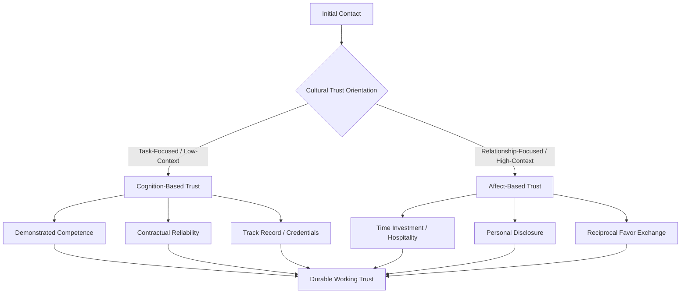

## Building Trust and Credibility Across Cultures

### Overview

Building trust and credibility across cultures examines how diplomatic leaders establish reliable, durable working relationships with counterparts whose norms for signaling trustworthiness differ systematically from their own. Trust is not a culturally universal construct with uniform cues — what signals reliability in one cultural context (e.g., strict punctuality, contractual precision) may signal coldness or bad faith in another (e.g., where relationship investment and reciprocal favor exchange are the primary trust signals). This item addresses both the theory of cross-cultural trust formation and the applied practice of credibility-building in diplomatic relationships.

### Core Definitions

**Trust**

A psychological state comprising the willingness to accept vulnerability to another party's actions based on positive expectations of their intentions or behavior.

**Credibility**

The perceived believability of an actor's statements and commitments, typically assessed along dimensions of competence (capability to deliver) and character (intention to deliver in good faith).

**Cognition-Based Trust**

Trust grounded in rational assessment of another party's competence, reliability, and track record — dominant in task-focused, low-context cultural settings.

**Affect-Based Trust**

Trust grounded in emotional bonds, mutual care, and relational investment — dominant in relationship-focused, high-context cultural settings.

**Swift Trust**

A provisional, role-based form of trust extended at the outset of a time-limited collaboration (e.g., a short multilateral working group), based on institutional role and reputation rather than personal history.

### Diagram: Trust Formation Pathways by Cultural Orientation

### Cultural Variation in Trust Signals

| Trust-Building Behavior | Task-Focused/Cognition-Based Contexts | Relationship-Focused/Affect-Based Contexts |
| --- | --- | --- |
| Meeting structure | Agenda-driven, efficient | Extended informal time before business |
| Contract emphasis | Written terms are primary reference | Relationship is primary reference; contract is secondary |
| Disclosure norm | Professional information only | Personal/family disclosure signals investment |
| Response to delay | Erodes trust quickly | Tolerated if relationship is intact |
| Trust repair after error | Corrective action/documentation | Personal apology and relationship reaffirmation |

[Inference: these are documented tendencies from cross-cultural management literature (e.g., Meyer, Hofstede-derived studies), not fixed rules; individual counterparts within any culture vary, and diplomatic practitioners should treat these as working hypotheses to test through direct observation.]

### The Competence-Character Credibility Model

Credibility assessments in diplomatic relationships typically combine two independent judgments:

$$\text{Credibility} = f(\text{Perceived Competence}, \text{Perceived Character})$$

- **Competence** — Does this actor have the capability, resources, and institutional backing to deliver on commitments?
- **Character** — Does this actor have good-faith intentions and will they act consistently even when unmonitored?

A counterpart may be judged highly competent but low in character (capable but untrustworthy), or high in character but low in competence (well-intentioned but unable to deliver) — diplomatic trust-building must address both dimensions, and cultural context shapes which cues are used as evidence for each.

### Strategies for Cross-Cultural Trust-Building

**Key Points**

- **Invest disproportionately in relationship-building time** with counterparts from affect-based/high-context trust cultures before pushing toward substantive negotiation, even when this feels procedurally inefficient by a cognition-based cultural standard
- **Demonstrate competence explicitly and early** with counterparts from cognition-based/low-context trust cultures through track record, credentials, and precise follow-through on small early commitments
- **Honor small commitments meticulously**: consistent delivery on minor commitments (meeting times, follow-up emails) builds a track record that transfers across both trust orientations
- **Use consistent, culturally attuned communication** rather than a single uniform style across all counterparts — recognizing when directness builds credibility versus when it damages it
- **Repair trust ruptures according to the counterpart's cultural expectations**: a purely procedural/corrective response to a breach may satisfy a cognition-based counterpart but feel hollow to an affect-based one expecting personal acknowledgment
- **Leverage third-party validators**: in cultures where direct self-promotion of competence is viewed skeptically, credible endorsement from a mutually trusted third party is often more effective than self-assertion
- **Recognize swift-trust conditions**: in short-duration multilateral settings, rely on institutional role, formal credentials, and reputation signals to establish provisional trust quickly, while continuing to build deeper trust over time if the relationship persists

### Worked Example: Establishing Credibility with a New Counterpart

**Scenario**: A diplomat begins a multi-year bilateral relationship with a counterpart from a strongly relationship-oriented, high-context negotiating culture, while the diplomat's own institutional culture is task-focused and low-context.

**Applied trust-building sequence**:

1. **Early phase**: the diplomat allocates unstructured time for informal meals and personal conversation before raising substantive agenda items, signaling relational investment rather than purely transactional intent
2. **Mid phase**: the diplomat follows through precisely on a small initial commitment (e.g., promptly sharing a requested piece of information), building cognition-based credibility as a secondary layer beneath the relational foundation
3. **Trust test**: when an unavoidable delay occurs on the diplomat's side, the diplomat personally communicates the delay directly and with a personal explanation, rather than sending a purely administrative notice — treating the disclosure itself as a relationship-preserving act, not just a status update
4. **Long-term phase**: the diplomat draws on the accumulated relational credibility to raise more sensitive or difficult topics that would not have been broachable absent the trust foundation

**Output**: A durable working relationship capable of absorbing occasional friction without rupture, because trust has been built on both relational and competence dimensions rather than either alone.

### Illustrative Diagram: Competence-Character Credibility Matrix (svg_diagram)

<svg xmlns="http://www.w3.org/2000/svg" viewBox="0 0 620 420">
<text x="310" y="24" font-size="16" text-anchor="middle" font-family="sans-serif" font-weight="bold">Competence-Character Credibility Matrix (svg_diagram)</text>
<line x1="100" y1="360" x2="100" y2="60" stroke="black" stroke-width="2" />
<line x1="100" y1="360" x2="560" y2="360" stroke="black" stroke-width="2" />

<text x="40" y="210" font-size="12" text-anchor="middle" font-family="sans-serif" transform="rotate(-90 40,210)">Perceived Character</text>

<text x="330" y="390" font-size="12" text-anchor="middle" font-family="sans-serif">Perceived Competence</text>

<text x="115" y="80" font-size="11" font-family="sans-serif">High</text>

<text x="115" y="350" font-size="11" font-family="sans-serif">Low</text>

<text x="520" y="378" font-size="11" font-family="sans-serif">High</text>

<text x="115" y="378" font-size="11" font-family="sans-serif">Low</text>

<circle cx="480" cy="100" r="9" fill="#16a34a" />
<text x="480" y="85" font-size="11" text-anchor="middle" font-family="sans-serif">Fully Credible</text>
<circle cx="160" cy="100" r="9" fill="#f59e0b" />
<text x="160" y="85" font-size="11" text-anchor="middle" font-family="sans-serif">Well-Intentioned, Unreliable</text>
<circle cx="480" cy="320" r="9" fill="#dc2626" />
<text x="480" y="340" font-size="11" text-anchor="middle" font-family="sans-serif">Capable, Untrustworthy</text>
<circle cx="160" cy="320" r="9" fill="#6b7280" />
<text x="160" y="340" font-size="11" text-anchor="middle" font-family="sans-serif">Neither</text>
</svg>

### Common Pitfalls

- **Projecting home-culture trust cues onto counterparts**: assuming that behaviors signaling trustworthiness at home (e.g., strict schedule adherence) will be read the same way abroad
- **Rushing to substantive negotiation** with relationship-oriented counterparts before adequate relational trust is established, perceived as transactional or disrespectful
- **Over-investing in relationship-building** with task-focused counterparts to the point of appearing to avoid substantive engagement, eroding competence-based credibility
- **Treating a single breach as terminal**: failing to attempt culturally appropriate trust-repair after an unavoidable error, when many ruptures are recoverable if addressed correctly
- **Confusing swift trust with deep trust**: assuming that provisional, role-based trust in a short multilateral setting is equivalent to durable bilateral trust, and under-investing in relationship maintenance for longer-term counterparts

### Interdisciplinary Foundations

- **Organizational Behavior**: cognition-based vs. affect-based trust theory (McAllister)
- **Cross-Cultural Psychology**: Hofstede, Trompenaars, and Meyer's trust-related cultural dimensions
- **Communication Studies**: credibility theory (competence/character models, Aristotelian ethos)
- **Diplomatic Practice**: relationship diplomacy, protocol norms around hospitality and disclosure

**Related Topics**

- Cognition-Based vs. Affect-Based Trust Theory
- Trust Repair and Rupture Recovery Across Cultures
- Swift Trust in Multilateral and Short-Duration Settings
- Third-Party Endorsement and Reputation Transfer in Diplomacy
- Protocol and Hospitality as Trust-Building Instruments
- Credibility Signaling in High-Context vs. Low-Context Communication
- Long-Term Relationship Diplomacy vs. Transactional Negotiation