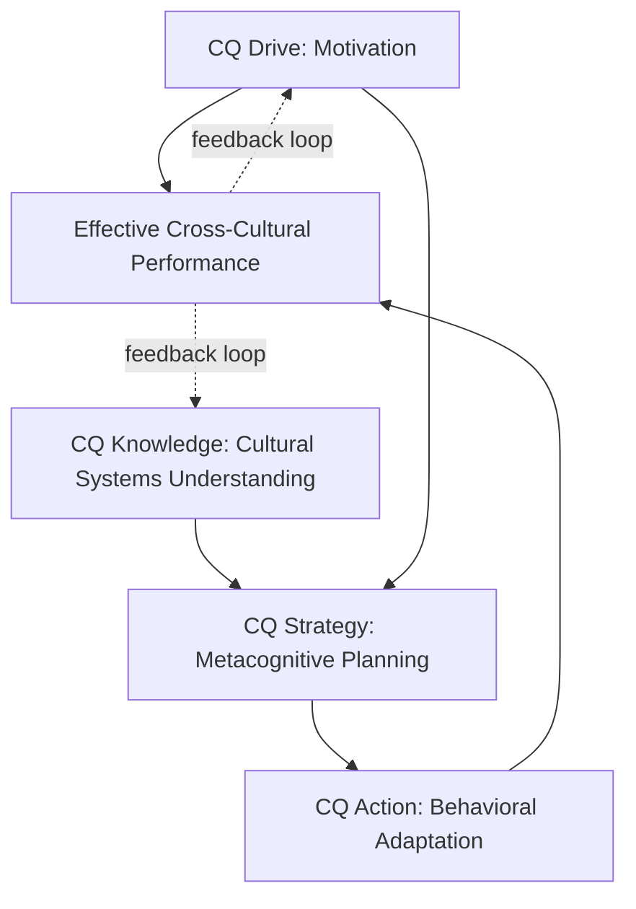

## Cultural Intelligence (CQ) Frameworks

### Overview

Cultural Intelligence (CQ) is a measurable capability construct describing an individual's ability to function effectively in culturally diverse settings. Developed primarily by P. Christopher Earley and Soon Ang (2003) and extended by David Livermore and others, CQ frameworks provide diplomatic practitioners with a structured, assessable model of cross-cultural competence — distinct from generic "cultural sensitivity" in that it is decomposed into discrete, trainable sub-capabilities with associated assessment instruments (notably the CQS, or Cultural Intelligence Scale).

### Core Definitions

**Cultural Intelligence (CQ)**

An individual's capability to function and manage effectively in culturally diverse settings, conceptualized as a form of intelligence analogous to but distinct from cognitive intelligence (IQ) and emotional intelligence (EQ).

**CQS (Cultural Intelligence Scale)**

The primary validated psychometric instrument used to measure the four CQ dimensions, developed and validated by Ang, Van Dyne, and colleagues.

**Cultural Metacognition**

The process of actively monitoring, questioning, and adjusting one's own cultural assumptions and mental models in real time during cross-cultural interaction — a central mechanism within the CQ Strategy dimension.

### The Four-Factor CQ Model

| Dimension | Definition | Core Question |
| --- | --- | --- |
| CQ Drive (Motivational) | Interest, confidence, and persistence in functioning across cultures | "Am I motivated to engage?" |
| CQ Knowledge (Cognitive) | Understanding of cultural systems, norms, and institutions | "Do I understand this culture?" |
| CQ Strategy (Metacognitive) | Awareness and planning for cross-cultural interactions; ability to adjust mental models | "Am I actively thinking about how to adapt?" |
| CQ Action (Behavioral) | Capability to exhibit appropriate verbal and nonverbal behaviors | "Can I actually adapt my behavior?" |

### Diagram: The Four CQ Dimensions and Their Interaction

**Key Points**

- The four dimensions are interdependent, not independent additive scores: high CQ Knowledge without CQ Strategy (metacognitive application) often produces "textbook" cultural awareness that fails to translate into adaptive behavior in real interactions
- CQ Drive is frequently identified as foundational — without motivation to engage, the other three dimensions are rarely developed or applied even when present
- CQ Action failures often stem from deficits upstream (inadequate Knowledge or Strategy) rather than from an inherent inability to perform culturally appropriate behaviors

### CQ Drive in Depth

Sub-components typically include:

- **Intrinsic interest** — genuine enjoyment of cross-cultural experiences
- **Extrinsic interest** — valuing tangible benefits of cross-cultural competence (career advancement, mission success)
- **Self-efficacy** — confidence in one's ability to adapt effectively to unfamiliar cultural settings

### CQ Knowledge in Depth

Typically decomposed into:

- **Cultural systems knowledge** — understanding of economic, legal, political, and social systems
- **Cultural values knowledge** — understanding of value dimensions (cf. Hofstede, Trompenaars, Meyer frameworks)
- **Sociolinguistic knowledge** — awareness of language use, communication norms, and pragmatics across cultural contexts

### CQ Strategy in Depth

Involves three sub-processes:

1. **Awareness** — noticing one's own cultural assumptions and the cultural cues present in an interaction
2. **Planning** — anticipating how to approach an upcoming cross-cultural interaction before it occurs
3. **Checking** — monitoring whether one's expectations were met during and after the interaction, and revising mental models accordingly

[Inference: CQ Strategy is often described in the literature as the dimension most closely linked to expertise development over time, since it governs the feedback loop that converts experience into refined cultural judgment; this causal sequencing is a theoretical claim within the CQ literature rather than something independently established through controlled experimental designs.]

### CQ Action in Depth

Encompasses:

- **Verbal behavior** — adapting speech patterns, pacing, and directness
- **Non-verbal behavior** — adapting gestures, eye contact norms, physical distance (proxemics)
- **Speech acts** — adapting the *form* of communicative acts (e.g., how requests, refusals, or apologies are phrased) to match cultural expectations

### Diplomatic Applications of CQ Frameworks

**1. Pre-Posting Training and Assessment**

Foreign services increasingly use CQ-based assessment (via the CQS or adapted instruments) to identify development needs before overseas assignments, rather than relying solely on generic cultural-briefing content.

**2. Negotiation Team Composition**

Team leaders can use CQ profiles to balance negotiating teams — pairing members strong in CQ Knowledge (subject-matter/cultural systems expertise) with members strong in CQ Action (real-time behavioral adaptability) to cover the full spectrum of required capability.

**3. Real-Time Diplomatic Interaction**

CQ Strategy's "plan-monitor-revise" cycle maps directly onto in-the-moment diplomatic practice: preparing cultural hypotheses before a meeting, actively checking whether counterpart reactions match expectations during the meeting, and revising approach mid-interaction if they do not.

**4. Post-Assignment Debriefing**

CQ Strategy's metacognitive "checking" process provides a structured basis for after-action review of cross-cultural missteps or successes, converting individual experience into transferable institutional knowledge.

### Worked Example: Preparing for a High-Stakes Bilateral Meeting

**Scenario**: A diplomat with strong CQ Knowledge but underdeveloped CQ Strategy prepares for a first meeting with a counterpart from an unfamiliar cultural context.

**Applying the CQ Strategy cycle**:

1. **Planning phase**: before the meeting, the diplomat explicitly hypothesizes likely communication norms (e.g., "indirect refusal is likely; a lack of firm commitment may signal polite decline rather than genuine consideration")
2. **Awareness during interaction**: the diplomat consciously monitors their own instinctive interpretations in real time, flagging moments where home-culture assumptions might be distorting the reading of the counterpart's signals
3. **Checking/revision**: after the meeting, the diplomat compares actual counterpart behavior against the pre-meeting hypothesis, updating their working model of that specific counterpart (not just the broad national culture) for future interactions

**Output**: A calibrated, individual-level model of the counterpart that improves over successive interactions, rather than relying on static, generic cultural-briefing assumptions throughout the relationship.

### Illustrative Diagram: CQ Strategy Plan-Monitor-Revise Cycle (svg_diagram)

<svg xmlns="http://www.w3.org/2000/svg" viewBox="0 0 620 360">
<text x="310" y="24" font-size="16" text-anchor="middle" font-family="sans-serif" font-weight="bold">CQ Strategy Plan-Monitor-Revise Cycle (svg_diagram)</text>
<circle cx="310" cy="200" r="150" fill="none" stroke="#d1d5db" stroke-width="2" />
<circle cx="310" cy="70" r="45" fill="#2563eb" />
<text x="310" y="65" font-size="12" fill="white" text-anchor="middle" font-family="sans-serif">Plan</text>
<text x="310" y="80" font-size="10" fill="white" text-anchor="middle" font-family="sans-serif">(pre-interaction)</text>
<circle cx="440" cy="290" r="45" fill="#16a34a" />
<text x="440" y="285" font-size="12" fill="white" text-anchor="middle" font-family="sans-serif">Monitor</text>
<text x="440" y="300" font-size="10" fill="white" text-anchor="middle" font-family="sans-serif">(in-interaction)</text>
<circle cx="180" cy="290" r="45" fill="#f59e0b" />
<text x="180" y="285" font-size="12" fill="white" text-anchor="middle" font-family="sans-serif">Revise</text>
<text x="180" y="300" font-size="10" fill="white" text-anchor="middle" font-family="sans-serif">(post-interaction)</text>
<path d="M 350 100 L 415 255" stroke="black" stroke-width="2" fill="none" marker-end="url(#arrow)" />
<path d="M 400 300 L 220 300" stroke="black" stroke-width="2" fill="none" marker-end="url(#arrow)" />
<path d="M 205 255 L 270 100" stroke="black" stroke-width="2" fill="none" marker-end="url(#arrow)" />
</svg>

### CQ Assessment and Development

- **CQS (Cultural Intelligence Scale)**: a validated 20-item self-report instrument measuring the four CQ dimensions, widely used in academic and organizational settings; multi-rater (360-degree) versions also exist to reduce self-assessment bias
- **Development approaches**: CQ Drive is developed through positive cross-cultural exposure and success experiences; CQ Knowledge through structured area-studies and cultural-systems education; CQ Strategy through reflective practice and coaching; CQ Action through role-play, simulation, and supervised field practice

[Unverified: specific normed benchmark scores and percentile comparisons for the CQS vary by publisher/version and population sample; consult the current CQS technical manual for up-to-date psychometric details.]

### Common Pitfalls

- **Treating CQ Knowledge as sufficient on its own**: assuming that studying a culture's facts and norms automatically produces effective real-time behavioral adaptation
- **Neglecting CQ Drive in team selection**: assigning highly knowledgeable but low-motivation personnel to postings, resulting in poor engagement despite technical cultural competence
- **Static rather than dynamic application**: using CQ Knowledge as a fixed lookup table rather than continuously updating via the CQ Strategy monitor-revise cycle
- **Conflating CQ with language fluency**: treating linguistic competence as a proxy for overall cultural intelligence, when the four CQ dimensions are conceptually and empirically distinct from language skill
- **Self-assessment bias**: relying solely on self-reported CQS scores without behavioral or multi-rater validation, particularly given that CQ Action (actual behavior) is the dimension most prone to self-overestimation

### Interdisciplinary Foundations

- **Organizational Psychology**: Earley and Ang's foundational CQ theory; multiple-intelligences theory (Gardner) as a conceptual precursor
- **Cross-Cultural Management**: integration with Hofstede, Trompenaars, and Meyer's cultural-dimension frameworks as inputs to CQ Knowledge
- **Educational Psychology**: metacognition research underlying the CQ Strategy dimension
- **Diplomatic Training**: foreign-service pre-posting assessment and simulation-based training design

**Related Topics**

- CQS Assessment Design and Multi-Rater Evaluation
- Metacognitive Strategy Development for Cross-Cultural Practitioners
- Simulation-Based Training for CQ Action Development
- Integrating CQ with Hofstede/Trompenaars/Meyer Cultural Frameworks
- CQ-Informed Negotiation Team Composition
- Post-Assignment Debriefing and Institutional Knowledge Capture
- Distinguishing Cultural Intelligence from Language Proficiency