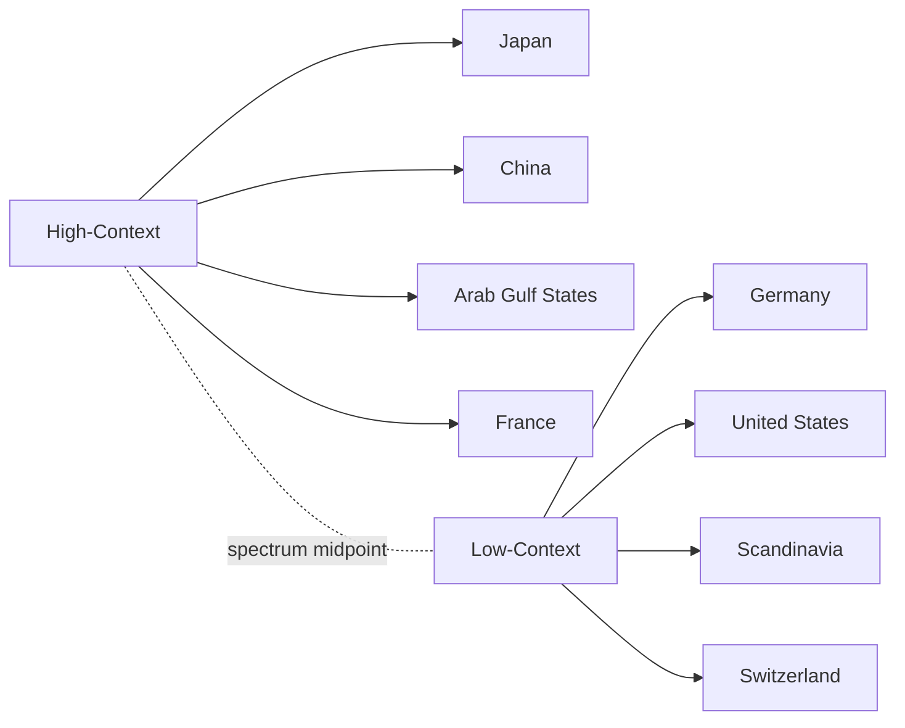
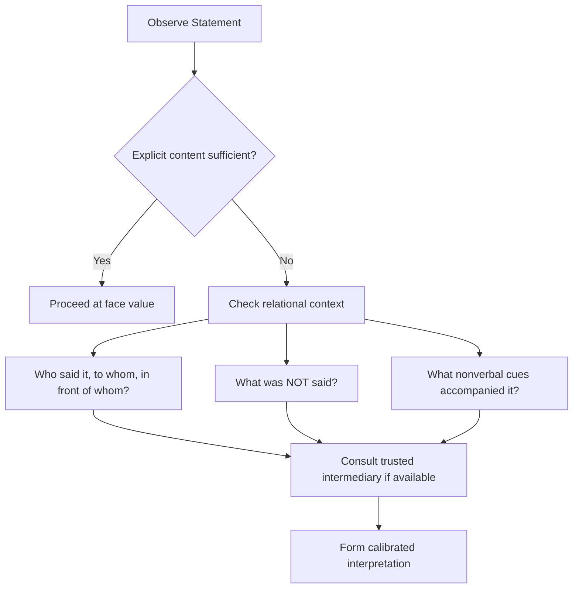

## High-Context Versus Low-Context Communication Cultures

### Definition and Theoretical Origin

High-context (HC) and low-context (LC) communication is a framework introduced by anthropologist Edward T. Hall in his 1976 work *Beyond Culture*. The framework describes how much meaning in an exchange is carried by explicit verbal content versus implicit contextual cues — shared history, relationship, social hierarchy, nonverbal signals, and situational understanding.

- **High-context communication**: Most of the meaning is embedded in the context — relationship, nonverbal cues, tone, silence, and shared background — rather than in the explicit words spoken.
- **Low-context communication**: Most of the meaning is encoded directly in explicit, precise language. Little is left to inference; messages are expected to be self-contained.

This is a spectrum, not a binary. National cultures, organizational cultures, and even individual communication styles can be placed at different points along it.

### The Hall Continuum

**Key Points**

- Placement on the continuum is relative, not absolute — e.g., the UK is lower-context than Japan but higher-context than Germany.
- The continuum correlates with, but is not identical to, other cultural frameworks (Hofstede's individualism-collectivism, Trompenaars' universalism-particularism).
- Context-orientation is often generational and situational within a single culture — a Japanese engineering team may communicate more low-context internally than a Japanese family negotiating a home purchase.

### Core Characteristics Compared

| Dimension | High-Context | Low-Context |
| --- | --- | --- |
| Message explicitness | Implicit, layered, indirect | Explicit, direct, literal |
| Role of relationship | Central — trust precedes business | Secondary — task precedes relationship |
| Nonverbal weight | Very high (silence, posture, tone) | Lower (words carry most meaning) |
| Written contracts | General frameworks; relationship governs execution | Detailed, exhaustive, legally binding |
| Conflict handling | Indirect, face-saving, third-party mediation | Direct confrontation, stated disagreement |
| Decision-making | Consensus-oriented, slower, group-anchored | Individual authority, faster, task-anchored |
| "Yes" meaning | May mean "I hear you," not agreement | Means literal agreement |
| Time orientation | Often polychronic | Often monochronic |

### Diplomatic Relevance

In diplomatic and international-relations settings, misreading context-orientation is a recurring source of negotiation breakdown, not because of hostile intent but because of mismatched decoding frameworks.

**Example**

A Western (low-context) negotiator proposes a detailed term sheet and asks a counterpart from a high-context culture, "Do you agree to these terms?" The counterpart replies "This is very interesting; we will study it carefully" — a face-saving indirect decline. The low-context negotiator interprets this as tentative agreement and proceeds to draft binding language, producing a diplomatic incident when the other side later says no terms were accepted.

**Key Points for Diplomatic Practice**

- High-context diplomats often signal disagreement through omission, delay, or third-party intermediaries rather than a direct "no."
- Low-context diplomats often signal good faith through comprehensive written documentation, which high-context counterparts may read as distrustful or excessively transactional.
- Silence carries opposite defaults: in high-context settings it often signals contemplation or displeasure; in low-context settings it can signal agreement, confusion, or disengagement.
- Seating arrangements, gift protocol, and order of speaking are load-bearing communicative content in high-context diplomatic settings — treating them as ceremonial formality rather than substantive signaling is a common low-context misstep.

### Decoding High-Context Signals: A Practical Framework

### Working Across the Divide: Strategies for Diplomatic Professionals

**High-Context Diplomat Engaging Low-Context Counterparts**

- Front-load explicit statements of position rather than expecting inference.
- Accept direct questions as information-seeking, not as disrespect.
- Provide written summaries even when a verbal understanding feels sufficiently binding.

**Low-Context Diplomat Engaging High-Context Counterparts**

- Invest time in relationship-building (meals, informal meetings) before substantive negotiation — rushing this reads as disrespect.
- Listen for what is omitted, deflected, or routed through a third party.
- Avoid public direct contradiction; raise disagreement privately or through intermediaries to preserve face.
- Treat vague affirmatives ("we will consider it") as requiring follow-up confirmation, not as commitments.

**Shared Mitigation Practices**

- Use bicultural or trained intermediaries/interpreters who can flag context-dependent subtext, not just translate words.
- Confirm understanding through restatement ("To make sure I've understood correctly...") rather than assuming shared interpretation.
- Document agreements in writing regardless of cultural default, framed as "for our records" to avoid implying distrust.
- Build in additional time for high-context negotiations; rushing toward explicit closure can be read as coercive.

### National and Regional Positioning (Illustrative, Not Exhaustive)

[Inference] The following placements reflect commonly cited comparative-culture research (Hall, Hofstede, Meyer's *Culture Map*) and represent general tendencies, not fixed rules for individuals:

- **Very High-Context**: Japan, Korea, China, Vietnam
- **High-Context**: Arab Gulf states, much of Sub-Saharan Africa, Latin America, India
- **Moderate**: France, Spain, Italy, Russia, UK
- **Low-Context**: United States, Australia, Netherlands
- **Very Low-Context**: Germany, Switzerland, Scandinavian countries

[Unverified] Precise rank-ordering varies across studies and should not be treated as a scored scale for any individual negotiator; these are population-level tendencies subject to significant individual, organizational, and generational variation.

### Common Failure Modes in Diplomatic Contexts

**Key Points**

- **Over-literalism**: Low-context actors treating a polite deferral as a firm commitment.
- **Over-inference**: High-context actors assuming a low-context counterpart's directness signals anger or aggression when none is intended.
- **Documentation asymmetry**: One side treats the written agreement as fully binding; the other treats it as a starting framework subject to relational renegotiation.
- **Face-loss escalation**: Direct public correction of a high-context counterpart, causing loss of face and hardening of position rather than resolution.
- **Silence misreading**: Interpreting a high-context pause as consent, or a low-context pause as evasiveness.

### Illustrative Diagram: Message Meaning Distribution (svg_diagram)

<svg xmlns="http://www.w3.org/2000/svg" viewBox="0 0 600 260">
<text x="300" y="20" text-anchor="middle" font-size="14" font-weight="bold">Message Meaning Distribution (svg_diagram)</text>
<text x="140" y="45" text-anchor="middle" font-size="12" font-weight="bold">High-Context</text>
<text x="460" y="45" text-anchor="middle" font-size="12" font-weight="bold">Low-Context</text>
<rect x="40" y="60" width="200" height="30" fill="#4a4a4a" />
<text x="140" y="80" text-anchor="middle" font-size="11" fill="white">Explicit Words (20%)</text>
<rect x="40" y="100" width="200" height="100" fill="#a0a0a0" />
<text x="140" y="150" text-anchor="middle" font-size="11">Context / Relationship /</text>
<text x="140" y="165" text-anchor="middle" font-size="11">Nonverbal (80%)</text>
<rect x="360" y="60" width="200" height="140" fill="#4a4a4a" />
<text x="460" y="130" text-anchor="middle" font-size="11" fill="white">Explicit Words (80%)</text>
<rect x="360" y="200" width="200" height="0" fill="#a0a0a0" />
<text x="460" y="215" text-anchor="middle" font-size="10">Context (20%)</text>
<line x1="250" y1="130" x2="350" y2="130" stroke="black" stroke-width="1" marker-end="url(#arrow)" />
</svg>

### Conclusion

The high-context/low-context framework is not a measure of communication skill but of where meaning is encoded. Diplomatic competence requires bidirectional fluency: the ability to both produce and decode messages across the continuum, and the judgment to recognize which mode a given counterpart, institution, or moment demands. Misattribution — reading directness as rudeness, or indirectness as evasion — is among the most common and avoidable causes of diplomatic friction.

**Related Topics**

- Edward T. Hall's Cultural Iceberg Model
- Hofstede's Cultural Dimensions Theory (Individualism vs. Collectivism)
- Erin Meyer's Culture Map: Communicating and Evaluating Dimensions
- Face and Face-Saving Behavior in Negotiation
- Indirect Speech Acts and Diplomatic Language
- Monochronic vs. Polychronic Time Orientation
- The Role of Interpreters and Cultural Intermediaries in Diplomacy
- Nonverbal Communication and Proxemics in Cross-Cultural Negotiation