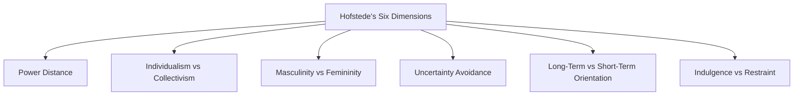
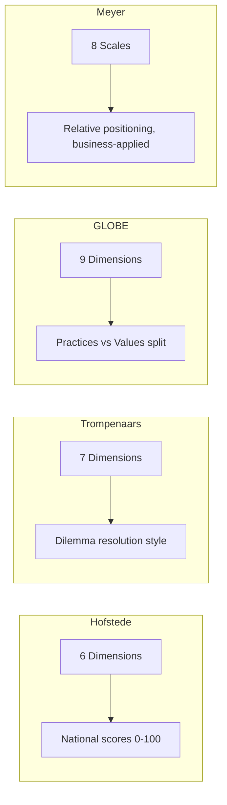

## Hofstede and Other Cultural Dimension Models

### Overview

Cultural dimension models are frameworks that reduce complex national and organizational cultural variation into measurable axes, enabling comparison across societies. They are widely used in diplomacy, international business, and negotiation training to anticipate value differences and communication patterns before engagement. The dominant frameworks are Hofstede's Dimensions, Trompenaars and Hampden-Turner's Seven Dimensions, the GLOBE Study, and Erin Meyer's Culture Map — each building on, critiquing, or extending the others.

### Hofstede's Cultural Dimensions Theory

Developed by Geert Hofstede from IBM employee survey data (1960s–1970s) and expanded through subsequent research, this is the foundational and most widely cited model. It now comprises six dimensions, scored on a 0–100 scale per country.

| Dimension | Low Score Tendency | High Score Tendency |
| --- | --- | --- |
| Power Distance Index (PDI) | Flat hierarchies, shared power | Accepted hierarchy, centralized authority |
| Individualism vs. Collectivism (IDV) | Group loyalty, "we" identity | Personal autonomy, "I" identity |
| Masculinity vs. Femininity (MAS) | Cooperation, quality of life, consensus | Competition, achievement, assertiveness |
| Uncertainty Avoidance Index (UAI) | Comfort with ambiguity, fewer rules | Preference for rules, low tolerance for ambiguity |
| Long-Term vs. Short-Term Orientation (LTO) | Tradition, quick results, near-term focus | Pragmatism, perseverance, long-horizon planning |
| Indulgence vs. Restraint (IVR) | Strict social norms, suppressed gratification | Free gratification of desires, leisure emphasis |

**Key Points**

- The sixth dimension (LTO) and fifth extension (IVR) were added later, incorporating Michael Bond's "Confucian Dynamism" research and Michael Minkov's World Values Survey analysis, respectively.
- Scores are national averages, not predictors of individual behavior — a common methodological caution known as the "ecological fallacy" when misapplied to individuals.
- The original dataset was drawn from a single multinational corporation (IBM), which constrains generalizability across other institutional contexts. [Inference: widely cited methodological critique, not a settled consensus judgment]

**Example**

Comparing PDI scores: Malaysia scores very high on Power Distance, meaning subordinates typically defer to hierarchical authority and expect directive leadership. Denmark scores very low, meaning consultative, flat decision-making is the norm. A diplomat briefing on protocol for a Malaysia-Denmark bilateral meeting would flag that Danish delegates may expect more open dissent-sharing than Malaysian counterparts are accustomed to offering superiors in front of others.

### Dimension Visualization

### Trompenaars and Hampden-Turner's Seven Dimensions

Fons Trompenaars and Charles Hampden-Turner developed a complementary model focused on how cultures resolve dilemmas in relationships, time, and environment, based on cross-national business surveys.

| Dimension | Poles |
| --- | --- |
| Universalism vs. Particularism | Rules applied uniformly vs. rules adapted to relationships |
| Individualism vs. Communitarianism | Personal freedom vs. group obligation |
| Neutral vs. Emotional | Controlled affect vs. open emotional expression |
| Specific vs. Diffuse | Compartmentalized relationships vs. holistic, overlapping relationships |
| Achievement vs. Ascription | Status earned vs. status inherited/assigned |
| Sequential vs. Synchronic Time | Linear, scheduled time vs. flexible, cyclical time |
| Internal vs. External Control | Mastery over environment vs. harmony with environment |

**Key Points**

- Particularly influential in negotiation and contract-culture analysis: universalist cultures (e.g., US, Germany) expect a contract to hold regardless of relationship; particularist cultures (e.g., China, Venezuela) treat the relationship as capable of overriding the letter of an agreement.
- The Achievement vs. Ascription axis is highly relevant to diplomatic protocol — ascription-oriented cultures place strong weight on age, title, and family lineage in determining whom to address and defer to.

### GLOBE Study (Global Leadership and Organizational Behavior Effectiveness)

A large-scale research program (House et al., initiated late 1990s) involving over 170 researchers across 62 societies, designed partly to test and extend Hofstede's dimensions using both "as is" (practices) and "should be" (values) measures — a distinction Hofstede's original model did not separate.

**Nine GLOBE Dimensions**: Power Distance, Uncertainty Avoidance, Institutional Collectivism, In-Group Collectivism, Gender Egalitarianism, Assertiveness, Future Orientation, Performance Orientation, Humane Orientation.

**Key Points**

- Splits Hofstede's single Individualism/Collectivism axis into Institutional Collectivism (societal-level cohesion) and In-Group Collectivism (family/organization loyalty) — a distinction relevant when diplomats must distinguish state-level cooperation from clan- or family-based loyalty structures.
- Also identifies culturally endorsed leadership prototypes (e.g., "Charismatic/Value-Based," "Team-Oriented," "Autonomous") — useful for anticipating what leadership style a counterpart delegation expects to see projected by a visiting diplomat.

### Erin Meyer's Culture Map

A more applied, business-communication-oriented framework (2014), built on eight scales, designed to be practically actionable rather than purely descriptive.

| Scale | Poles |
| --- | --- |
| Communicating | Low-Context ↔ High-Context |
| Evaluating (Feedback) | Direct Negative Feedback ↔ Indirect Negative Feedback |
| Persuading | Principles-First ↔ Applications-First |
| Leading | Egalitarian ↔ Hierarchical |
| Deciding | Consensual ↔ Top-Down |
| Trusting | Task-Based ↔ Relationship-Based |
| Disagreeing | Confrontational ↔ Avoids Confrontation |
| Scheduling | Linear-Time ↔ Flexible-Time |

**Key Points**

- Meyer emphasizes *relative positioning*: two cultures' absolute scores matter less than the gap between them for a given interaction (e.g., French and American feedback styles differ less in isolation than in how far apart they sit relative to each other).
- The Persuading axis (principles-first/deductive vs. applications-first/inductive reasoning) is particularly relevant to diplomatic argumentation — some traditions expect a theoretical or legal-principle framing before conclusions; others expect the practical proposal first, with justification supplied on request.

### Comparative Model Summary

### Diplomatic Application

**Key Points**

- **Pre-negotiation briefing**: Dimension scores inform anticipated decision-making speed (Uncertainty Avoidance, Deciding scale), expected hierarchy signaling (Power Distance, Leading scale), and feedback delivery norms (Evaluating scale) for a counterpart delegation.
- **Delegation composition**: In high Power Distance / high Ascription cultures, seniority and titles of the visiting delegation carry substantive diplomatic weight, not merely ceremonial significance.
- **Persuasion strategy**: Diplomats briefing on positions for principles-first cultures (e.g., many continental European traditions) may need to lead with legal/normative framing (e.g., international law, precedent) before proposals; applications-first cultures (e.g., US) may respond better to a concrete proposal followed by justification.
- **Time-based expectations**: Scheduling-scale mismatches (linear-time vs. flexible-time cultures) are a frequent source of perceived diplomatic disrespect around punctuality and meeting adherence.

### Critiques and Limitations

**Key Points**

- **Ecological fallacy risk**: National-level scores describe population tendencies, not individuals; applying them predictively to a specific counterpart risks stereotyping.
- **Temporal stability**: Dimension scores derived from historical survey data may not reflect rapid social change (generational shift, globalization, urbanization). [Inference: commonly raised critique, particularly regarding Hofstede's original 1970s IBM dataset]
- **National boundary assumption**: All major models treat nation-states as the primary cultural unit, which understates subnational, ethnic, religious, and organizational variation — a significant limitation in diplomatically sensitive multiethnic states.
- **Western research origin**: Early dimension models were developed primarily by Western researchers using Western-designed survey instruments, which some scholars argue embeds an etic (outsider) rather than emic (insider) perspective on non-Western cultures. [Unverified: contested within cross-cultural psychology literature, not a unanimous conclusion]

### Conclusion

Cultural dimension models provide diplomats and negotiators with a structured vocabulary for anticipating value and communication differences, but they function best as orientation tools and hypothesis-generators rather than deterministic predictors of any individual's behavior. Effective diplomatic practice combines dimensional awareness with direct relationship-building, active listening, and willingness to update assumptions against observed behavior.

**Related Topics**

- High-Context Versus Low-Context Communication Cultures
- Edward T. Hall's Cultural Iceberg Model
- Power Distance and Diplomatic Protocol
- Cross-Cultural Negotiation Strategy Design
- Cultural Intelligence (CQ) Assessment Frameworks
- Ecological Fallacy in Cross-Cultural Research
- Leadership Prototypes and the GLOBE Study
- Applying Erin Meyer's Culture Map to Bilateral Negotiation