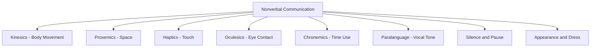
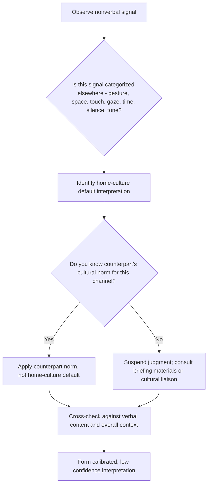

## Nonverbal Communication Across Cultures

### Overview

Nonverbal communication encompasses all meaning-bearing signals that are not spoken or written words: gesture, posture, facial expression, eye contact, touch, spatial distance, silence, and paralinguistic features (tone, pitch, pacing). Research consistently indicates nonverbal channels carry a substantial share of total meaning in interpersonal exchange, and their interpretation rules vary significantly across cultures — making nonverbal literacy a critical, and frequently underweighted, diplomatic skill. Misreadings in this domain rarely produce explicit correction, since nonverbal missteps are often processed subconsciously as a vague sense of discomfort or distrust rather than a nameable error.

### Major Categories of Nonverbal Communication

### Kinesics: Gesture, Posture, and Facial Expression

Body movement and gesture carry culturally specific — and sometimes contradictory — meanings.

| Gesture | Meaning in Some Cultures | Meaning in Others |
| --- | --- | --- |
| Thumbs up | Approval (US, much of Europe) | Highly offensive insult (parts of Middle East, West Africa) |
| "OK" hand sign (thumb-index circle) | Agreement/fine (US) | Obscene gesture (Brazil, parts of Europe, Middle East) |
| Head nod (up-down) | Yes | No, in some regions of Bulgaria, Greece (historically) |
| Head wobble (side-to-side) | Confusion (Western readings) | Agreement/acknowledgment (India) |
| Beckoning with palm up, finger curl | Neutral summons (US) | Reserved for calling animals; offensive to use on people (parts of East Asia, Middle East) |
| Showing sole of foot/shoe | Neutral | Deep insult (Middle East, parts of South/Southeast Asia) |

**Key Points**

- Facial expressions of core emotions (happiness, anger, fear, disgust, surprise, sadness) show cross-cultural similarity in basic recognizability, per Paul Ekman's research, but *display rules* — when and how intensely emotion is permitted to show — vary sharply by culture.
- High "display rule" restraint cultures (e.g., Japan) may mask negative emotion with a neutral or even smiling expression in formal or diplomatic settings, which low-restraint observers can misread as insincerity or agreement.

**Example**

During a diplomatic reception, a delegate offers a hand gesture intended as a casual affirmative signal. A counterpart from a culture where that gesture is obscene visibly stiffens but says nothing further, maintaining polite composure for the remainder of the event. The originating delegate, unaware of the offense, reports the meeting as having gone smoothly — illustrating how nonverbal breaches can go undetected by the offending party specifically because high-context, face-preserving cultures suppress visible reaction.

### Proxemics: Use of Personal Space

Edward T. Hall's proxemic research (also the originator of the high/low-context framework) defined culturally variable zones of interpersonal distance.

| Zone (approx., Hall's US baseline) | Distance | Typical Use |
| --- | --- | --- |
| Intimate | 0–45 cm | Close family, romantic partners |
| Personal | 45 cm–1.2 m | Friends, casual conversation |
| Social | 1.2–3.6 m | Formal/business interaction |
| Public | 3.6 m+ | Speeches, public address |

**Key Points**

- "Contact cultures" (Latin America, Southern Europe, Middle East) generally maintain closer conversational distance and more frequent touch; "non-contact cultures" (Northern Europe, East Asia, North America) maintain greater distance.
- A diplomat from a non-contact culture may unconsciously step backward during conversation with a contact-culture counterpart who keeps closing the distance, producing an unintentional "chase" dynamic readable as coldness or discomfort by the other party. [Inference: well-documented proxemic dynamic in cross-cultural communication literature]

### Haptics: Touch Norms

- Handshake firmness, duration, and appropriateness vary: a firm, brief handshake is standard US/UK protocol; prolonged double-handed handshakes signal warmth in parts of Africa and the Middle East; in some East Asian and observant Muslim contexts, cross-gender touch (including handshakes) may be avoided entirely for religious or cultural reasons.
- Diplomatic protocol offices generally brief delegations on touch norms in advance (e.g., waiting for the counterpart to initiate a handshake, or offering a slight bow/nod as an alternative) to avoid an awkward or offensive first-contact moment.

### Oculesics: Eye Contact

| Cultural Pattern | Interpretation |
| --- | --- |
| Direct, sustained eye contact expected | Signals honesty, confidence, engagement (much of North America, Western Europe) |
| Averted or minimal eye contact with superiors | Signals respect, deference (parts of East Asia, some Indigenous cultures, parts of the Middle East and Africa) |

**Key Points**

- A diplomat trained to read direct eye contact as a marker of trustworthiness risks misjudging a deferential counterpart's averted gaze as evasiveness or dishonesty.
- Gender norms frequently modify eye-contact rules within a single culture — direct eye contact between unrelated men and women may be more restricted than between same-gender interlocutors in some traditions.

### Chronemics: Cultural Use of Time as Nonverbal Signal

- **Monochronic cultures** (Germany, Switzerland, US, Northern Europe): Time is linear and segmented; punctuality signals respect; schedule adherence is a nonverbal statement of seriousness.
- **Polychronic cultures** (Latin America, Middle East, much of Africa, Southern Europe): Time is fluid and relationship-subordinate; multiple activities and relationships may take precedence over strict scheduling; lateness may carry little or no disrespect connotation.

**Example**

A monochronic-culture diplomat interprets a counterpart's 45-minute meeting delay as a deliberate slight or a sign the relationship is not valued. In the counterpart's polychronic framework, the delay reflects an unavoidable prior relational obligation and carries no disrespect signal at all — the mismatch in default interpretation, not any actual intent, is the source of diplomatic friction.

### Silence and Pause

- In many East Asian and Nordic communication traditions, silence is a meaningful, comfortable component of dialogue — used for reflection, respect, or implicit disagreement.
- In many North American and some Southern European traditions, silence in conversation can generate discomfort and is often filled quickly, sometimes read as awkwardness, disengagement, or unresolved tension.
- **Key Points**: Diplomats accustomed to silence-averse norms should resist the impulse to fill a counterpart's pause with concessions or rephrased offers — doing so in a negotiation with a silence-comfortable counterpart can result in unnecessary unilateral concessions, since the pause was not a request for revision.

### Paralanguage: Tone, Volume, Pacing

- Volume and pitch variation that signals enthusiasm or emphasis in one culture (e.g., animated, louder speech in some Mediterranean and Latin American contexts) can be perceived as aggression or loss of composure in cultures favoring measured, even-toned delivery (e.g., much of East Asia, Northern Europe, Japan).
- Rate of speech and use of interruption/overlap also vary: some cultures treat simultaneous speech as engaged collaborative dialogue; others treat any interruption as a face-threatening act.

### Interpreting Nonverbal Signals: A Decision Framework

### Diplomatic Protocol Practices to Mitigate Nonverbal Misreading

**Key Points**

- **Pre-mission cultural briefings**: Standard practice in foreign service training to cover gesture taboos, proxemic norms, and greeting protocol for the host country before deployment.
- **Mirroring with caution**: Adapting one's own nonverbal behavior toward a counterpart's norms (closer distance, more/less eye contact) can build rapport but should be done gradually and based on verified guidance, not assumption, to avoid caricature or overcorrection.
- **Delayed interpretation**: Treating any single nonverbal signal as low-confidence evidence pending confirmation from multiple channels (verbal content, other nonverbal cues, known relationship context) rather than acting on it in isolation.
- **Local liaison consultation**: Using in-country diplomatic staff, cultural attachés, or trained interpreters who can flag nonverbal subtext in real time during high-stakes engagements.

### Common Failure Modes

**Key Points**

- **Projected universalism**: Assuming a home-culture nonverbal default (e.g., direct eye contact = honesty) applies universally.
- **Gesture transfer**: Using a home-culture gesture abroad without verifying it is neutral or positive in the host culture.
- **Chronemic mismatch escalation**: Treating polychronic lateness as calculated disrespect and responding with visible irritation, which can itself be read as a diplomatic overreaction.
- **Silence-filling concession**: Interpreting a comfortable pause as a negotiating cue requiring a unilateral offer improvement.
- **Overcorrection/caricature**: Exaggerated mimicry of a counterpart's nonverbal norms (e.g., theatrical bowing) that can read as mockery rather than respect.

### Conclusion

Nonverbal communication operates largely below conscious awareness, which makes it simultaneously a powerful channel for building diplomatic rapport and a high-risk source of unintentional offense. Because nonverbal misreadings are frequently invisible to the party making them — the counterpart often absorbs the offense without visible correction — diplomatic professionals must rely on structured preparation (briefings, liaisons, deliberate low-confidence interpretation) rather than intuitive reading alone when operating across unfamiliar nonverbal systems.

**Related Topics**

- High-Context Versus Low-Context Communication Cultures
- Edward T. Hall's Proxemic Theory
- Face and Face-Saving Behavior in Negotiation
- Diplomatic Protocol and Etiquette Standards
- Paul Ekman's Research on Universal Facial Expressions
- Monochronic vs. Polychronic Time Orientation
- Gender Norms in Cross-Cultural Diplomatic Interaction
- Role of Cultural Liaisons and Interpreters in Diplomacy