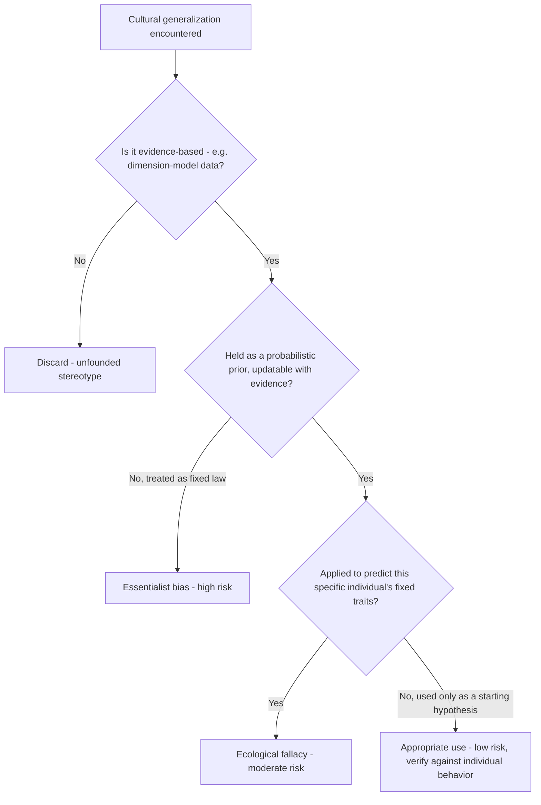
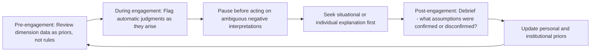

## Managing Cultural Bias and Stereotyping


### Overview

Cultural bias and stereotyping are cognitive shortcuts that distort perception and judgment in cross-cultural interaction. In diplomatic contexts, unmanaged bias degrades negotiation accuracy, damages trust, and can escalate into institutional-level friction. Managing bias is not about eliminating categorization — a cognitively impossible standard — but about recognizing when categorical thinking is operating, subjecting it to conscious scrutiny, and preventing it from overriding individualized evidence.

### Defining the Core Concepts

| Term | Definition |
| --- | --- |
| Stereotype | A generalized belief about the attributes of a group, applied to its individual members |
| Prejudice | An affective (emotional) prejudgment — positive or negative — toward a group, often rooted in stereotype |
| Discrimination | Differential behavioral treatment based on group membership |
| Implicit bias | Unconscious association or attitude that influences judgment without deliberate awareness or endorsement |
| Ethnocentrism | Evaluating other cultures using one's own culture's norms as the implicit standard of "normal" or "correct" |
| Cultural essentialism | Treating a culture as a fixed, internally uniform entity rather than a dynamic, internally diverse system |

**Key Points**

- Stereotypes are not inherently false in every instance — some reflect statistical tendencies in dimension-model data (see Hofstede, GLOBE) — but applying a population-level tendency to predict a specific individual's behavior is a reasoning error (the ecological fallacy) regardless of whether the underlying generalization has empirical support.
- Bias operates on a spectrum from explicit (consciously held and stated) to implicit (operating below conscious awareness), with implicit bias posing the greater diplomatic risk because it evades self-monitoring.

### How Bias Forms: Cognitive Origins

```mermaid
flowchart TD
    A[Limited direct exposure to Culture X] --> B[Reliance on secondhand narratives, media, training materials]
    B --> C[Categorical schema formed]
    C --> D[Schema applied automatically to new individuals from Culture X]
    D --> E{Disconfirming evidence encountered?}
    E -- Yes, but dismissed as "exception" --> F[Schema reinforced - confirmation bias]
    E -- Yes, and integrated --> G[Schema revised]
    E -- No --> F
```

**Key Points**

- **Categorization** is a default, largely automatic cognitive process that enables efficient social processing; it becomes bias when the category is applied rigidly and resists updating.
- **Confirmation bias** causes disconfirming individual behavior to be discounted as an "exception" rather than used to revise the underlying stereotype.
- **In-group/out-group bias** predisposes favorable interpretation of ambiguous behavior from one's own cultural in-group and unfavorable interpretation of the same ambiguous behavior from an out-group — directly relevant to how diplomats may unconsciously interpret identical conduct differently depending on the counterpart's nationality.

### Common Bias Patterns in Diplomatic Contexts

| Bias Pattern | Manifestation |
| --- | --- |
| Halo/horns effect | A counterpart's positive or negative trait (e.g., fluent English) unconsciously inflates or deflates overall credibility judgments |
| Fundamental attribution error | Attributing a counterpart's behavior to fixed cultural/personal character rather than situational context (e.g., reading lateness as "that culture doesn't value punctuality" rather than considering a specific logistical cause) |
| Negativity bias in ambiguous signals | Defaulting to a negative interpretation of an ambiguous cross-cultural signal (see Nonverbal Communication) rather than a neutral or positive one |
| Essentialist overgeneralization | Treating a single cultural dimension score or trait as fully explanatory of an individual counterpart's position or behavior |
| Status quo/anchoring bias | Allowing an initial impression formed early in a relationship (often via secondhand briefing) to anchor all subsequent interpretation |

**Example**

A briefing document describes a counterpart nation's negotiating culture as "highly indirect and evasive." A diplomat, primed by this framing, interprets a counterpart's genuinely open request for clarification as evasive maneuvering, responds with unwarranted suspicion, and inadvertently signals distrust — a self-fulfilling dynamic where the bias shapes the diplomat's own conduct in ways that strain the relationship the briefing predicted would be strained.

### Distinguishing Useful Generalization from Harmful Stereotyping



**Key Points**

- A useful cultural generalization functions as a *prior probability*, held loosely and updated on contact with the individual — not as a fixed descriptor applied regardless of contrary evidence.
- The diagnostic question is not "is this generalization ever true?" but "am I treating this as a starting hypothesis or as a conclusion?"

### Mitigation Strategies

**Individual-Level Practices**

- **Perspective-taking and cultural humility**: Approaching each counterpart interaction with explicit acknowledgment that one's cultural framework is one lens among many, not a neutral baseline.
- **Slow down ambiguous-signal judgments**: Deliberately delaying interpretation of ambiguous cross-cultural behavior (see Nonverbal Communication's "delayed interpretation" practice) rather than defaulting to an automatic (often negatively-biased) reading.
- **Seek disconfirming evidence actively**: Consciously looking for counterpart behavior that contradicts prior expectations, rather than passively noting only confirming behavior.
- **Attribute behavior situationally first**: Before invoking a cultural or dispositional explanation for a counterpart's behavior, consider situational factors (fatigue, translation difficulty, institutional constraint, individual personality).

**Institutional-Level Practices**

- **Structured, updated briefings**: Cultural dimension data (Hofstede, GLOBE, Meyer) should be presented as probabilistic tendencies with explicit caveats about individual variation, not as behavioral rules.
- **Diverse composition of negotiation and briefing teams**: Teams with genuine cultural, linguistic, and experiential diversity are structurally less prone to uncorrected in-group bias in interpreting counterpart behavior.
- **After-action review**: Post-engagement debriefs that explicitly ask "did any assumption about the counterpart's culture prove inaccurate?" build institutional calibration over time.
- **Bias-awareness training**: Structured training (e.g., Implicit Association Test-informed modules) to increase self-awareness of automatic associations, paired with concrete behavioral correction strategies rather than awareness alone. [Inference: training efficacy for durable behavior change is contested in the organizational psychology literature and varies by program design]

### The Limits of Debiasing

**Key Points**

- Implicit bias cannot be reliably eliminated through willpower or brief training alone; most evidence-based approaches focus on *structural mitigation* (e.g., standardized evaluation criteria, structured decision processes) rather than purely individual cognitive correction. [Inference: reflects a widely held but not universally agreed position in bias-research literature]
- Cultural humility is best framed as an ongoing practice rather than an achieved state — sustained self-monitoring is required because bias tends to reassert itself under time pressure, stress, or high cognitive load, all of which are common conditions in live diplomatic negotiation.
- Overcorrection is itself a risk: excessive anxiety about stereotyping can produce paralysis, inauthentic interaction, or reverse bias (uncritical idealization of another culture), which carries its own distortion risks.

### Bias Management Workflow for Diplomatic Engagement



### Common Failure Modes

**Key Points**

- **Stereotype threat in reverse**: Over-cautious diplomats avoiding legitimate cultural knowledge application out of fear of "stereotyping," leading to underprepared engagement.
- **Single-story reliance**: Basing an entire cultural expectation set on one prior interaction or one secondhand account rather than triangulated sources.
- **Bias laundering through data**: Treating a cultural dimension score as objective fact rather than a probabilistic, contested research construct (see Hofstede critiques).
- **Selective attribution asymmetry**: Attributing a counterpart's cooperative behavior to strategic calculation while attributing an ally's identical behavior to genuine goodwill.

### Conclusion

Managing cultural bias in diplomacy is a continuous discipline rather than a one-time competency to be certified. It requires holding cultural knowledge as a provisional, evidence-updatable framework; actively countering the automatic cognitive shortcuts (confirmation bias, fundamental attribution error, in-group favoritism) that distort cross-cultural judgment; and building institutional practices — diverse teams, structured debriefs, calibrated briefing materials — that catch individual bias before it hardens into policy-relevant misjudgment.

**Related Topics**

- High-Context Versus Low-Context Communication Cultures
- Hofstede and Other Cultural Dimension Models
- Nonverbal Communication Across Cultures
- Implicit Association and Unconscious Bias Research
- Cultural Humility Versus Cultural Competence Frameworks
- Fundamental Attribution Error in Negotiation
- Diverse Team Composition in Diplomatic Missions
- Ecological Fallacy in Applying Population Data to Individuals