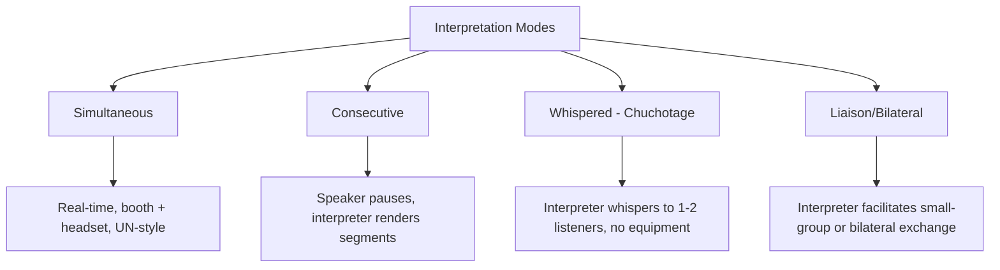
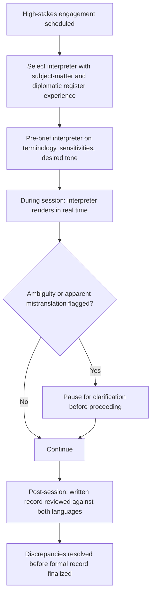

## Language, Interpretation, and Translation in Diplomacy

### Overview

Language mediation is a structural component of diplomatic practice, not a peripheral logistical service. The choice of working language, mode of interpretation, and quality of translation directly shape what is negotiable, what is recorded as agreed, and how relationships are built or strained. Diplomatic language services span interpretation (spoken, real-time) and translation (written, deliberative), each with distinct methods, risks, and protocol conventions.

### Interpretation vs. Translation: Core Distinction

| Aspect | Interpretation | Translation |
| --- | --- | --- |
| Medium | Spoken/signed language | Written text |
| Timing | Real-time or near-real-time | Deliberative, allows revision |
| Output | Ephemeral (unless recorded) | Fixed, reviewable document |
| Typical diplomatic use | Live negotiation, summits, press conferences | Treaties, communiqués, diplomatic notes, legal instruments |
| Error correction | Limited, in-the-moment | Extensive, through drafting/review cycles |

### Modes of Interpretation

**Key Points**

- **Simultaneous interpretation**: Used in large multilateral settings (UN General Assembly, Security Council) where time efficiency is paramount; requires soundproof booths, specialized training, and typically two interpreters per language pair alternating every 20–30 minutes due to cognitive load.
- **Consecutive interpretation**: Common in bilateral meetings, toasts, and press conferences; allows the interpreter to take notes and render longer, more nuanced segments, but roughly doubles meeting duration.
- **Whispered interpretation (chuchotage)**: Used for one or two delegates in a predominantly single-language setting; logistically light but physically demanding and limited to very small audiences.
- **Liaison interpretation**: Used in informal or small-group diplomatic exchanges, often bidirectional within the same session.

### The UN and Major Institutional Language Regimes

**Key Points**

- The United Nations operates with six official languages (Arabic, Chinese, English, French, Russian, Spanish); documents and simultaneous interpretation are provided across these, though not all UN bodies use all six for every function. [Inference: general institutional structure; specific body-level practices vary and should be verified against current UN documentation for precise application]
- The European Union operates one of the world's largest institutional translation regimes, with all official EU languages carrying equal legal status for regulations and treaties — a structure driven by the principle that EU citizens must be able to access binding law in their own language.
- Bilateral diplomacy typically negotiates a working language per engagement — often a shared third language, one party's language with interpretation, or parallel use of both parties' languages with interpretation in both directions.

### Translation in Treaty and Legal Instrument Drafting

**Key Points**

- Multilingual treaties often designate multiple "authentic" language versions with equal legal weight, alongside a stipulated procedure for resolving discrepancies between versions (frequently reference to a working or "authoritative" text, or interpretive rules under international law such as those reflected in the Vienna Convention on the Law of Treaties).
- Legal-linguistic precision is critical: a single ambiguous term across language versions can create genuine interpretive disputes with material legal consequences — treaty drafting therefore typically involves dedicated legal-linguistic review distinct from general translation.
- "Authentic text" disputes have historically arisen where two official-language versions of the same treaty carry subtly different legal implications due to translation choices, underscoring why treaty language is negotiated with the same rigor as substantive terms. [Inference: general pattern documented in international law scholarship; specific historical instances vary by treaty and would require case-specific verification]

### Risks and Failure Modes in Diplomatic Language Mediation

| Risk | Description |
| --- | --- |
| Semantic non-equivalence | Some concepts (legal, cultural, political) lack a direct equivalent in the target language, forcing approximation |
| Register mismatch | Interpreter renders formal diplomatic register as overly casual, or vice versa, altering perceived tone |
| Omission under cognitive load | Simultaneous interpreters under time pressure may compress or drop qualifying language (hedges, conditionals) that carries diplomatic significance |
| Politicized retranslation | State media or political actors selectively retranslating a diplomatic statement to shift its apparent meaning for domestic audiences |
| Interpreter positioning bias | An interpreter perceived (rightly or wrongly) as aligned with one party can undermine trust in the neutrality of the exchange |
| False fluency assumption | Assuming a counterpart's conversational fluency in a shared language extends to full command of legal/technical register, leading to unconfirmed misunderstanding |

**Example**

In a bilateral negotiation, a diplomat uses a hedge phrase such as "we would be inclined to consider" — carrying significant diplomatic weight as a conditional, non-binding signal. Under time pressure, a simultaneous interpreter renders this as a flatter "we will," dropping the conditional. The counterpart delegation proceeds as though a commitment has been made, creating a diplomatic dispute traceable not to bad faith on either side but to a single dropped qualifier in real-time interpretation.

### Managing Interpretation Quality in High-Stakes Settings

**Key Points**

- **Pre-briefing interpreters** on subject matter, sensitive terminology, and desired register is standard diplomatic practice, particularly for technical or legally consequential negotiations.
- **Dual-language note-taking**: Delegations commonly maintain their own language's record alongside the interpreted exchange, cross-checking for discrepancies before any joint communiqué is finalized.
- **Neutral-party interpreters**: In sensitive negotiations, using an interpreter without institutional affiliation to either party (e.g., contracted through a neutral international body) can reduce perceived bias risk.

### Language Choice as a Diplomatic Signal

**Key Points**

- The choice of which language a leader speaks in a given context (native tongue vs. counterpart's language vs. neutral third language such as English or French) is itself a communicative act, signaling relative status, goodwill, formality, or deference.
- A head of state addressing a counterpart nation in that nation's own language is frequently read as a deliberate goodwill gesture; conversely, insisting on one's own language in a context where a shared language is available can be read as an assertion of status or institutional convention (e.g., French diplomatic tradition's historical emphasis on French as the language of diplomacy).
- Code-switching (alternating languages within a single exchange) can signal in-group solidarity, topic-sensitivity shifts, or an attempt to communicate around an interpreter for a more direct rapport-building moment.

### Machine Translation and AI-Assisted Interpretation: Current Diplomatic Use

**Key Points**

- Machine translation tools are increasingly used for rapid triage of large volumes of open-source or lower-stakes diplomatic correspondence, but institutional practice generally reserves human interpretation/translation for legally binding, high-sensitivity, or high-visibility exchanges due to nuance, liability, and confidentiality concerns. [Inference: general institutional trend; specific policies vary by government and are evolving]
- Confidentiality and data-sovereignty concerns around cloud-based machine translation tools are a live and evolving policy consideration for diplomatic services, given the sensitivity of unclassified-but-privileged diplomatic communications. [Unverified: specific current-year policy positions vary by institution and require direct verification against current guidance]

### Common Failure Modes

**Key Points**

- **Treating interpretation as transparent**: Assuming the interpreted message is a perfectly neutral pass-through rather than an act of real-time linguistic and cultural mediation with inherent compression and approximation.
- **Skipping interpreter briefing**: Entering technical or sensitive negotiations without pre-briefing the interpreter, increasing the risk of terminology drift or dropped nuance.
- **Single-language record reliance**: Finalizing a joint communiqué based on only one party's language version without cross-verification, risking later "authentic text" disputes.
- **Ignoring register**: Failing to specify desired formality/tone to an interpreter, resulting in a rendered message that reads as inappropriately casual or stiff relative to the diplomatic occasion.
- **Overreliance on shared-language fluency**: Proceeding without interpretation support based on conversational fluency alone in a legally or technically consequential exchange.

### Conclusion

Language mediation in diplomacy is an active, high-stakes discipline requiring deliberate management rather than passive delegation. Precision in interpretation mode selection, interpreter briefing, dual-language documentation, and awareness of language choice as a signal in its own right are all necessary to prevent linguistic mediation from becoming an unacknowledged source of diplomatic misunderstanding or dispute.

**Related Topics**

- High-Context Versus Low-Context Communication Cultures
- Managing Cultural Bias and Stereotyping
- Treaty Drafting and Multilingual Legal Instruments
- The Vienna Convention on the Law of Treaties
- Protocol and Etiquette in Multilateral Institutions
- Machine Translation Policy in Government Communications
- Register and Formality in Diplomatic Correspondence
- Code-Switching as a Diplomatic Communicative Strategy