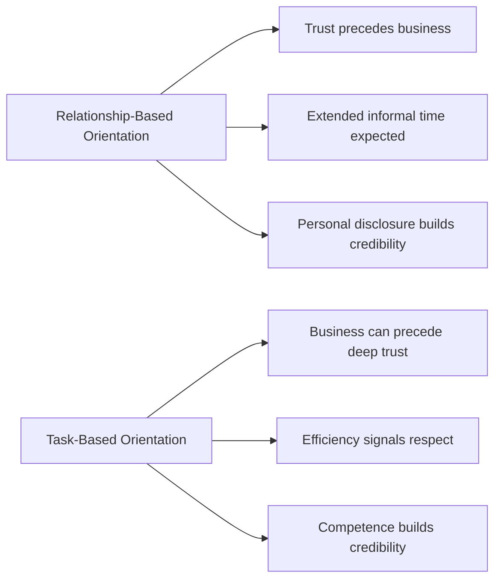
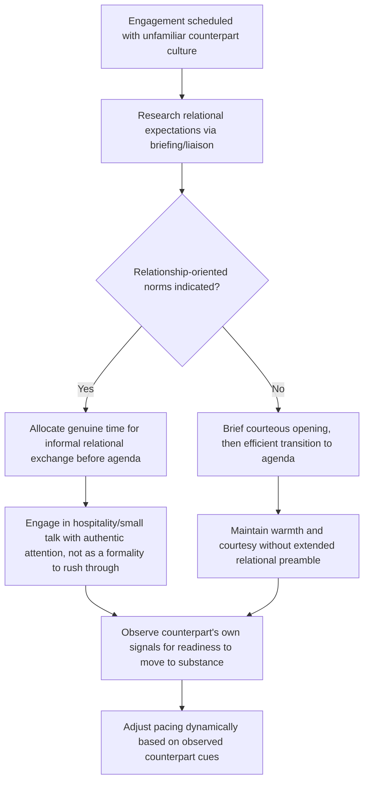

## Building Rapport Across Cultural Boundaries

### Overview

Rapport — a sense of mutual trust, comfort, and connection between parties — is a functional precondition for effective diplomacy, not a soft add-on to substantive negotiation. Rapport-building mechanisms are culturally variable: what signals trustworthiness, warmth, and good faith in one culture may read as irrelevant, presumptuous, or even suspicious in another. Diplomatic rapport-building therefore requires deliberate calibration rather than reliance on a single, universal relational style.

### Why Rapport Matters Diplomatically

**Key Points**

- Rapport lowers the perceived risk of information-sharing, candor, and flexibility in negotiation — parties who trust each other are more willing to reveal underlying interests rather than only stated positions.
- In relationship-based (often high-context, particularist) cultures, rapport is frequently a *precondition* for substantive negotiation to begin at all, rather than something that develops alongside it.
- In task-based (often low-context, universalist) cultures, rapport can develop *through* successful transactional cooperation, making early relational investment feel less urgent to those parties — though still valuable.
- Misjudging how much relational investment a given counterpart expects before substantive discussion is a recurring source of diplomatic friction and stalled negotiations.

### Relationship-Based vs. Task-Based Rapport Orientations

**Key Points**

- This maps closely onto Erin Meyer's "Trusting" scale (task-based vs. relationship-based) and onto high-context/low-context tendencies, but should be treated as a spectrum with significant individual and situational variation, not a fixed national rule.
- A single delegation may shift orientation depending on context — the same counterpart may expect relational warm-up in an informal reception but efficient task focus in a working-group session.

### Core Rapport-Building Mechanisms Across Cultures

| Mechanism | Relationship-Oriented Emphasis | Task-Oriented Emphasis |
| --- | --- | --- |
| Shared meals/hospitality | Central, often extensive, precedes substantive talk | Present but typically brief, may follow rather than precede business |
| Small talk duration | Extended, expected before topic shift | Minimal, quick transition to agenda |
| Gift exchange | Symbolically significant, protocol-governed | Often minimal or absent, sometimes restricted by ethics rules |
| Personal disclosure | Builds credibility and trust | May be seen as irrelevant or unprofessional if excessive |
| Punctuality/efficiency | Secondary to relational cultivation | Itself a signal of respect and competence |
| Third-party introductions | Often essential for credibility ("vouching") | Useful but not usually a precondition |

**Example**

A diplomat scheduled for a one-hour bilateral meeting with a relationship-oriented counterpart delegation spends the first 40 minutes on hospitality, personal conversation, and general goodwill exchange before any substantive agenda item is raised. A task-oriented diplomat unfamiliar with this norm may grow anxious about time and attempt to redirect to the agenda prematurely — a move that can be read by the counterpart as impatience or a lack of genuine relational investment, potentially undermining the very trust needed for the negotiation to proceed well.

### A Calibrated Approach to Cross-Cultural Rapport

**Key Points**

- Genuine engagement in relationship-building rituals (rather than visibly impatient tolerance of them) is itself detectable and consequential — counterparts often read insincere or rushed relational gestures as more damaging than skipping them entirely.
- Reading counterpart cues in real time (their own pacing toward substance) is more reliable than rigidly following a pre-set script, since individual and situational variation within any culture is significant.

### Specific Rapport-Building Practices in Diplomatic Settings

**Hospitality and Shared Meals**

- Widely used across cultures as a rapport mechanism, but with varying weight: in many Middle Eastern, East Asian, and Latin American diplomatic traditions, shared meals are a substantive relational event, not merely logistical; declining or rushing through hospitality can be read as a meaningful rebuff.
- Dietary and alcohol protocol awareness (religious dietary law, abstinence norms) is a baseline diplomatic competency for hospitality-based rapport-building.

**Gift Exchange Protocol**

- Governed by both cultural expectation and, in many governments, formal ethics/gift-value regulations that diplomats must navigate simultaneously.
- Symbolic appropriateness matters as much as monetary value — certain colors, numbers, or objects carry negative connotations in specific cultures (e.g., clocks as gifts in some Chinese contexts, due to phonetic association with death-related terms) and should be avoided regardless of the giver's intent. [Inference: commonly cited cultural gift-taboo example; regional and generational variation exists]

**Third-Party Introduction and "Vouching"**

- In many high-context and relationship-based diplomatic cultures, being introduced by a mutually trusted third party substantially accelerates rapport, functioning as a form of social collateral.
- Diplomats operating in such contexts often invest in cultivating intermediary relationships specifically to enable this kind of introduction for future engagements.

**Humor and Self-Disclosure**

- Humor can build rapport rapidly but carries elevated cross-cultural risk (see Nonverbal Communication and Managing Cultural Bias) due to varying norms around what is appropriate, especially self-deprecating vs. other-directed humor, and topics considered off-limits for levity (politics, religion, national symbols).
- Personal self-disclosure (family, personal background) is a stronger trust-building tool in relationship-oriented cultures; in more task-oriented or formal diplomatic cultures, professional self-disclosure (shared institutional experience, mutual acquaintances) may be a safer and equally effective substitute.

### Rapport Maintenance Over Time

**Key Points**

- Diplomatic rapport is not a one-time achievement but requires ongoing maintenance across multiple engagements — consistency, follow-through on commitments, and continuity of relationship (e.g., the same diplomat maintaining contact over time) reinforce trust cumulatively.
- Personnel rotation (a structural feature of many foreign services) can disrupt accumulated rapport; institutions often mitigate this through structured handover practices, joint transition meetings, and continuity documentation shared between outgoing and incoming diplomats.
- Rapport built in favorable conditions should be understood as a resource that can buffer, but not eliminate, strain during periods of substantive disagreement or crisis.

### Risks and Failure Modes

**Key Points**

- **Rushing relational investment**: Treating rapport-building rituals as an obstacle to "get through" before real work begins, in cultures where the rapport-building *is* part of the real work.
- **Performative rapport**: Engaging in relational gestures (hospitality, small talk) with visible impatience or insincerity, which is often perceived as worse than not attempting them.
- **Overfamiliarity**: Misjudging pace and escalating informality (excessive personal disclosure, premature first-name use, physical closeness) faster than the counterpart's own relational cues indicate is welcome.
- **Rapport-substance conflation**: Assuming strong interpersonal rapport with an individual counterpart guarantees institutional or national-level agreement, when the individual may lack authority to bind their government.
- **Uneven investment across a delegation**: Building strong rapport with one delegation member while neglecting others in a hierarchical culture, potentially causing face-related friction if protocol expects broader engagement.

### Conclusion

Rapport-building across cultural boundaries requires treating relational investment as a variable, calibratable input rather than applying a single default style. Effective diplomats research counterpart relational expectations in advance, invest genuinely rather than performatively in whatever relational rituals are indicated, and remain attentive to real-time cues for pacing the transition to substantive engagement — recognizing that in many diplomatic contexts, the relationship-building process is inseparable from, rather than preliminary to, the negotiation itself.

**Related Topics**

- High-Context Versus Low-Context Communication Cultures
- Hofstede and Other Cultural Dimension Models
- Nonverbal Communication Across Cultures
- Managing Cultural Bias and Stereotyping
- Gift-Giving Protocol and Diplomatic Ethics Regulations
- Face and Face-Saving Behavior in Negotiation
- Personnel Rotation and Institutional Continuity in Foreign Service
- Hospitality Norms in Multilateral Diplomatic Settings