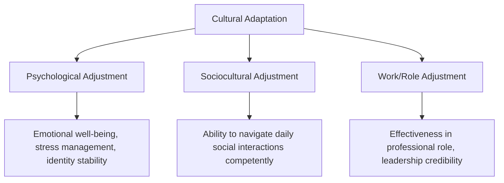
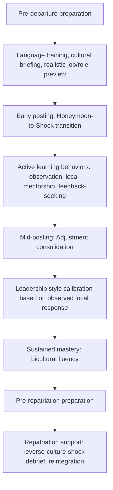

## Cultural Adaptation and Expatriate Leadership

### Overview

Cultural adaptation refers to the psychological, behavioral, and social process by which individuals posted abroad — diplomats, foreign service officers, and expatriate leaders — adjust to an unfamiliar cultural environment while continuing to perform effectively in a leadership or representational role. Unlike short-term cross-cultural encounters, expatriate leadership requires sustained functioning across an extended adjustment arc, making adaptation itself a leadership competency rather than a one-time orientation task.

### The Cultural Adjustment Curve

The most widely referenced model of expatriate adaptation is the U-curve (Lysgaard, 1955), later extended into a W-curve to account for repatriation.

| Phase | Characteristics |
| --- | --- |
| Honeymoon | Novelty, excitement, superficial engagement with host culture |
| Culture Shock / Crisis | Frustration, fatigue, perceived incompetence, withdrawal tendencies |
| Adjustment / Recovery | Growing comprehension, coping strategies develop, functional competence returns |
| Mastery / Adaptation | Effective bicultural functioning, nuanced judgment, sustained comfort |
| Reverse Culture Shock | Disorientation upon return to home culture, which has itself changed and to which the individual has changed relative |

**Key Points**

- The U-curve model, while foundational and widely taught, has faced empirical critique for inconsistent support across studies — actual adjustment trajectories vary significantly by individual, posting, and context, and not all expatriates experience a clean, uniform curve. [Inference: reflects a substantial body of critique in expatriate-adjustment research; the model is best treated as an illustrative heuristic rather than a predictive law]
- Reverse culture shock (the W-curve's added phase) is frequently underestimated in institutional preparation, despite evidence that repatriation adjustment can be as psychologically demanding as initial deployment. [Inference: commonly cited finding in expatriate management literature]

### Dimensions of Cultural Adaptation

**Key Points**

- These three dimensions, drawn from Black, Mendenhall, and Oddou's expatriate adjustment framework, do not necessarily progress in tandem — an expatriate diplomat may achieve strong work-role adjustment quickly (due to institutional structure) while sociocultural and psychological adjustment lag significantly behind.
- Family adjustment (spouse/partner and children) is a major, well-documented predictor of overall expatriate success or premature return, often more so than the posted individual's own adjustment. [Inference: widely cited finding in expatriate management and foreign service literature]

### Leadership-Specific Adaptation Demands

Expatriate leadership adds a layer of complexity beyond individual adjustment: the leader must adapt personally while also leading — and often representing home-country interests to — a host-country or multinational team/counterpart environment.

| Challenge | Description |
| --- | --- |
| Authority legitimacy | Leadership styles effective at home (e.g., consultative, egalitarian) may be read as weak or indecisive in high Power Distance contexts, and vice versa |
| Trust-building under scrutiny | Expatriate leaders are often evaluated more skeptically initially, given outsider status, requiring accelerated credibility-building |
| Bicultural code-switching | Leading requires fluidly shifting between home-institution expectations and host-context norms, sometimes within a single day |
| Symbolic representation | An expatriate diplomat's personal conduct is often read as representative of their home institution/nation, raising the stakes of individual adaptation choices |
| Decision authority ambiguity | Uncertainty about how much local autonomy to exercise versus deferring to home-institution guidance, especially under time pressure |

**Example**

A diplomat trained in a low Power Distance, consensus-driven leadership style is posted to a high Power Distance host environment and continues soliciting broad team input before making decisions, as is customary at home. Local staff, accustomed to directive leadership as the marker of competence, may interpret this consultative style as uncertainty or lack of authority — illustrating that the *same* leadership behavior can carry opposite legitimacy signals depending on host cultural context, requiring the leader to adapt style rather than assume universal validity of a home-trained approach.

### Models of Cultural Adaptation Strategy

Building on acculturation research (notably Berry's acculturation model), expatriate leaders can be understood as adopting one of several broad orientations toward host and home culture simultaneously.

| Strategy | Host Culture Engagement | Home Culture Retention |
| --- | --- | --- |
| Integration | High | High |
| Assimilation | High | Low |
| Separation | Low | High |
| Marginalization | Low | Low |

**Key Points**

- **Integration** (high engagement with host culture while retaining home-culture identity) is generally associated with the most favorable adjustment and effectiveness outcomes in expatriate research, though outcomes are context-dependent. [Inference: general pattern in acculturation research; not a universal guarantee for every individual or posting]
- **Assimilation** (fully adopting host norms, downplaying home identity) can build local rapport but risks eroding the distinct representational role a diplomat is meant to serve, and may be viewed with suspicion by the home institution.
- **Separation** (retaining home-culture practices with minimal host engagement, e.g., insulated expatriate communities) is associated with weaker sociocultural adjustment and reduced local effectiveness.
- **Marginalization** (low engagement with both) is generally the least functional outcome, associated with poor psychological adjustment and diminished professional effectiveness.

### Building Cultural Adaptation Capacity: A Leadership Development Framework

**Key Points**

- **Realistic preview and preparation**: Institutions that provide accurate, non-idealized previews of posting conditions (rather than only positive framing) are associated with better subsequent adjustment, since expectation mismatch amplifies culture-shock severity. [Inference: consistent finding across expatriate-preparation literature]
- **Local mentorship and sponsorship**: Pairing incoming expatriate leaders with trusted local or experienced bicultural staff accelerates sociocultural learning and reduces early missteps.
- **Feedback-seeking orientation**: Leaders who actively solicit feedback on their own cross-cultural conduct (rather than assuming competence) adapt leadership style more effectively than those who do not.
- **Family and support-system investment**: Given the strong link between family adjustment and expatriate success, institutional support (schooling, spousal employment assistance, community integration) is a substantive leadership-enablement factor, not a peripheral benefit.

### Institutional Practices Supporting Expatriate Diplomatic Leadership

**Key Points**

- **Structured pre-posting training**: Language instruction, cultural briefings, and often area-studies education are standard components of foreign service preparation pipelines in many countries' diplomatic training institutions.
- **In-country onboarding and mentorship**: Formal or informal pairing with experienced personnel already adapted to the host environment.
- **Ongoing psychological and wellbeing support**: Some foreign services provide access to counseling or peer-support structures specifically addressing the cumulative stress of repeated relocation and adaptation cycles.
- **Structured repatriation support**: Debriefing and reintegration assistance addressing reverse culture shock and reincorporation of overseas experience into subsequent career roles.

### Common Failure Modes

**Key Points**

- **Underestimating adjustment demands**: Assuming professional competence and general intelligence substitute for deliberate cultural learning, leading to avoidable early missteps.
- **Style rigidity**: Continuing to apply a home-culture leadership style without calibration despite clear signals it is undermining credibility in the host context.
- **Overcorrection into assimilation**: Abandoning home-institution representational responsibilities in pursuit of local acceptance, compromising the diplomat's functional role.
- **Neglecting family/support-system adjustment**: Treating the posted individual's adaptation as the sole variable of concern, overlooking well-documented family-adjustment effects on overall success.
- **Repatriation neglect**: Treating return to the home institution as administratively simple, underestimating the reverse-culture-shock burden and the risk of talent attrition when returning expatriates feel unsupported or undervalued for their overseas-acquired expertise.

### Conclusion

Cultural adaptation is a sustained developmental process, not a discrete orientation event, and expatriate diplomatic leadership requires simultaneously managing personal psychological adjustment, sociocultural learning, and professional credibility-building in an unfamiliar context. Leaders who pursue an integrative adaptation strategy — engaging deeply with host norms while retaining institutional identity and representational clarity — combined with institutional support across the full posting-to-repatriation cycle, are best positioned to lead effectively across the adjustment arc.

**Related Topics**

- High-Context Versus Low-Context Communication Cultures
- Hofstede and Other Cultural Dimension Models
- Building Rapport Across Cultural Boundaries
- Managing Cultural Bias and Stereotyping
- Berry's Acculturation Model
- Reverse Culture Shock and Repatriation Management
- Leadership Style Calibration Across Power Distance Contexts
- Foreign Service Pre-Departure Training Design