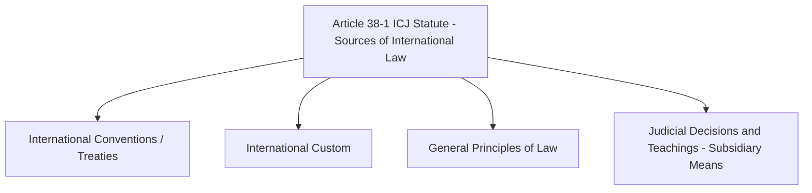
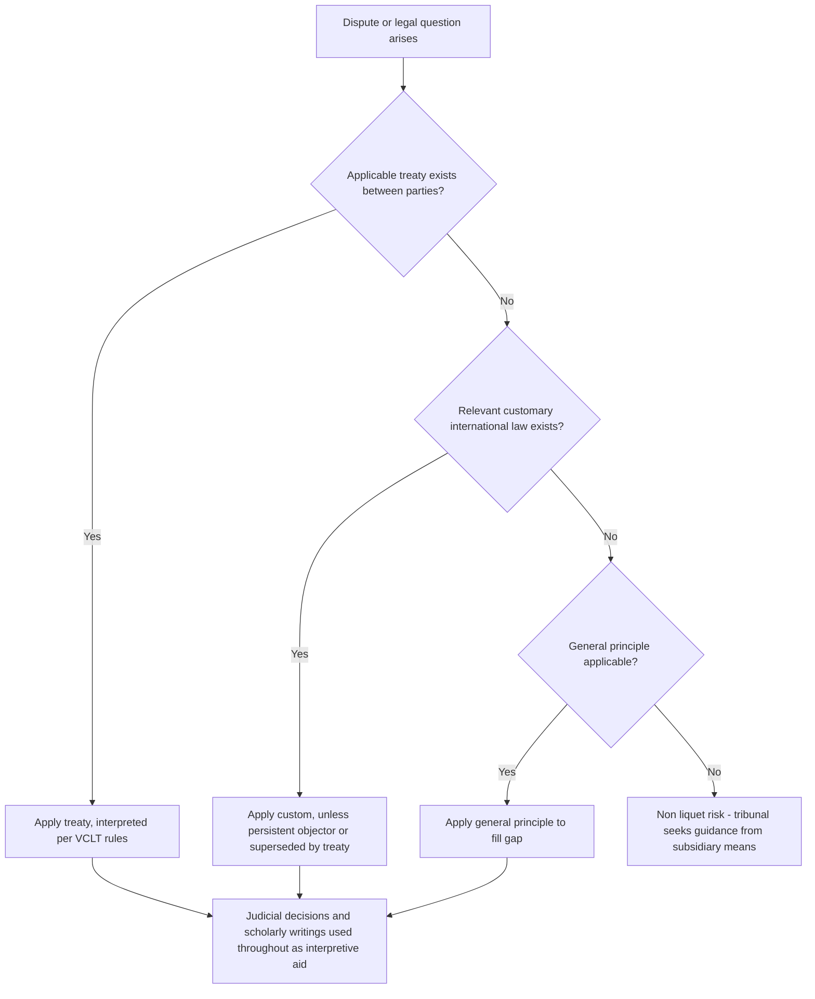

## Sources of International Law

### Overview

International law lacks a single centralized legislature, making the identification of legally binding norms dependent on a defined set of recognized "sources" — the mechanisms through which international legal obligations come into existence and can be identified. The foundational and most widely cited enumeration of these sources is Article 38(1) of the Statute of the International Court of Justice (ICJ), which, though formally addressed to the Court's own decision-making, is broadly treated as an authoritative statement of the sources of international law generally.

### Article 38(1) of the ICJ Statute

| Source | Article 38(1) Provision | Nature |
| --- | --- | --- |
| Treaties/Conventions | 38(1)(a) | Primary, consent-based, written |
| Customary International Law | 38(1)(b) | Primary, unwritten, practice-derived |
| General Principles of Law | 38(1)(c) | Primary, gap-filling |
| Judicial Decisions & Scholarly Writings | 38(1)(d) | Subsidiary, interpretive aid, not law-creating in themselves |

**Key Points**

- Treaties and custom are generally regarded as the two principal sources in practice, with general principles serving a supplementary, gap-filling role.
- Article 38(1)(d) explicitly designates judicial decisions and the writings of highly qualified publicists as "subsidiary means for the determination of rules of law" — they help identify or clarify law but are not, strictly, independent law-creating sources.
- The list is not explicitly hierarchical in the treaty text, though in practice treaties (as specific, consent-based instruments) often take precedence over custom in a given dispute unless a customary norm has attained *jus cogens* status.

### Treaties (International Conventions)

Treaties are written agreements between states (or between states and international organizations) governed by international law, binding upon the parties per the principle *pacta sunt servanda* ("agreements must be kept").

**Key Points**

- Governed comprehensively by the **Vienna Convention on the Law of Treaties (VCLT, 1969)**, which codifies rules on treaty formation, interpretation, reservation, amendment, and termination.
- Can be **bilateral** (two parties) or **multilateral** (three or more parties), and may be self-executing or require domestic implementing legislation depending on a state's constitutional order (monist vs. dualist systems).
- Only binding on parties that have consented (signed and ratified, or acceded), reflecting international law's fundamentally consent-based structure — a key distinction from domestic legislation, which binds subjects regardless of individual consent.
- **Reservations**: States may, subject to treaty terms and VCLT rules, exclude or modify the legal effect of specific provisions upon ratification, provided the reservation is not incompatible with the treaty's object and purpose.

**Example**

The 1961 Vienna Convention on Diplomatic Relations codifies diplomatic immunity and privileges; a state that ratifies it is bound to its terms toward other parties, but a non-ratifying state is not directly bound by the treaty itself — though many of its core provisions are also considered to reflect customary international law, independently binding even non-parties.

### Customary International Law

Custom arises from general and consistent state practice, undertaken out of a sense of legal obligation, rather than from a written instrument.

**Key Points**

- Requires two cumulative elements, per the ICJ's *North Sea Continental Shelf* jurisprudence and widely accepted doctrine:
  - **State practice** (*usus*): Consistent, general, and widespread conduct by states.
  - ***Opinio juris sive necessitatis***: The subjective belief that the practice is followed out of a sense of legal obligation, not mere habit, courtesy, or convenience.
- Both elements are required; consistent practice alone (e.g., diplomatic courtesy) without *opinio juris* does not create binding custom.
- Custom binds states generally, including those that did not participate in creating it, **except** where a state has been a **persistent objector** — consistently and openly objecting to the emerging norm from its inception — a doctrine that provides a (narrow and contested) escape from an otherwise binding custom. [Inference: the persistent objector doctrine's precise scope and application remain debated in international law scholarship]
- Some customary norms achieve the elevated status of ***jus cogens*** (peremptory norms) — rules from which no derogation is permitted, even by treaty (e.g., prohibitions on genocide, slavery, torture) — per VCLT Article 53.

### General Principles of Law

Principles common to major legal systems of the world, invoked primarily to fill gaps where neither treaty nor custom provides a clear rule.

**Key Points**

- Typically drawn from principles recognized across domestic legal systems (e.g., good faith, *res judicata*, estoppel, proportionality, the prohibition on unjust enrichment) rather than created directly at the international level.
- Functions as a residual source, invoked relatively rarely in practice compared to treaty and custom, but important for preventing *non liquet* (a situation where a tribunal has no applicable rule to decide a dispute).

### Subsidiary Means: Judicial Decisions and Scholarly Writings

**Key Points**

- **Judicial decisions**: Includes ICJ judgments, arbitral awards, and decisions of other international tribunals. Under Article 59 of the ICJ Statute, ICJ decisions formally bind only the parties to that specific case and have no binding precedential effect under a strict *stare decisis* doctrine — but in practice, ICJ jurisprudence carries substantial persuasive authority and heavily influences subsequent interpretation of custom and treaty law.
- **Scholarly writings**: The teachings of "the most highly qualified publicists" (leading international law scholars) serve as an interpretive and evidentiary aid, particularly useful for identifying the content and existence of customary norms, though they do not themselves create binding law.

### Additional and Contested Sources

Beyond the Article 38(1) framework, several additional mechanisms are increasingly discussed in international law scholarship, though their status as independent "sources" remains more contested.

| Additional Source | Status |
| --- | --- |
| Unilateral declarations by states | Can bind the declaring state under certain conditions (per ICJ's *Nuclear Tests* jurisprudence), though narrower than a full independent source category |
| Resolutions of international organizations (e.g., UN General Assembly resolutions) | Generally non-binding ("soft law"), but can contribute evidence of *opinio juris* or crystallize emerging custom |
| "Soft law" instruments (guidelines, codes of conduct, declarations) | Not independently binding, but can influence state behavior and later hardening into custom or treaty |
| Equity (*ex aequo et bono*) | Available to the ICJ only if the parties expressly agree, per Article 38(2) — a distinct decision-making basis rather than a source of general law |

**Key Points**

- UN Security Council resolutions adopted under Chapter VII of the UN Charter are a distinct and important category: they are binding on UN member states as a matter of treaty obligation (via the Charter itself, to which nearly all states are party), rather than as customary or general-principle law. [Inference: general and well-established structural point, though specific resolution scope and interpretation are case-dependent]
- The proliferation of "soft law" instruments reflects ongoing scholarly debate about whether the Article 38(1) framework, drafted in 1920 for the Permanent Court of International Justice and carried into the 1945 ICJ Statute, fully captures the contemporary international lawmaking landscape.

### Relationship and Hierarchy Among Sources

**Key Points**

- No formal hierarchy is codified among treaty, custom, and general principles in Article 38(1) itself, though *jus cogens* norms take precedence over any conflicting treaty or ordinary custom by definition (VCLT Article 53).
- As between treaty and custom of equal status, the specific/later rule often prevails over the general/earlier one (*lex specialis* and *lex posterior* principles), though outcomes are context- and fact-dependent.

### Diplomatic Relevance

**Key Points**

- Diplomats routinely operate within this source framework when negotiating, interpreting, or invoking legal obligations: understanding whether a given norm is treaty-based (and thus consent-dependent) or customary (and thus potentially binding regardless of that state's specific consent) directly affects negotiating leverage and legal argumentation.
- Diplomatic practice itself (state statements, protests, acquiescence, or acceptance) is a recognized form of "state practice" that can contribute to the formation or crystallization of customary international law — making diplomatic conduct not merely a response to international law but, cumulatively, a contributor to its formation.

### Conclusion

The sources of international law — treaty, custom, general principles, and subsidiary interpretive means — together form a decentralized but structured system for identifying binding international obligations in the absence of a central global legislature. Diplomatic practitioners benefit from fluency in this framework both to correctly characterize the legal status of norms they invoke or negotiate around, and because diplomatic conduct itself actively participates in the ongoing formation of customary international law.

**Related Topics**

- The Vienna Convention on the Law of Treaties
- Customary International Law and Opinio Juris
- Jus Cogens and Peremptory Norms
- The International Court of Justice: Jurisdiction and Function
- UN Security Council Resolutions and Chapter VII Authority
- Soft Law Instruments in International Relations
- State Practice and the Formation of Custom
- Treaty Reservations and the VCLT Framework