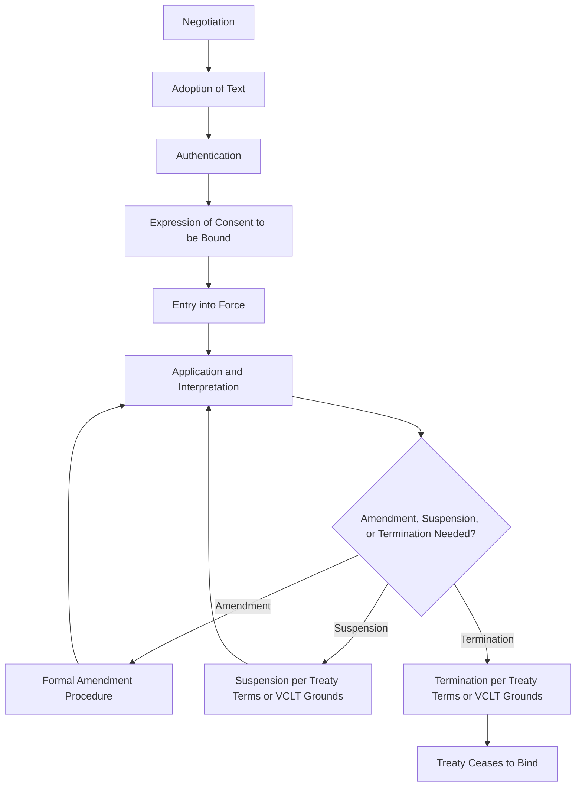
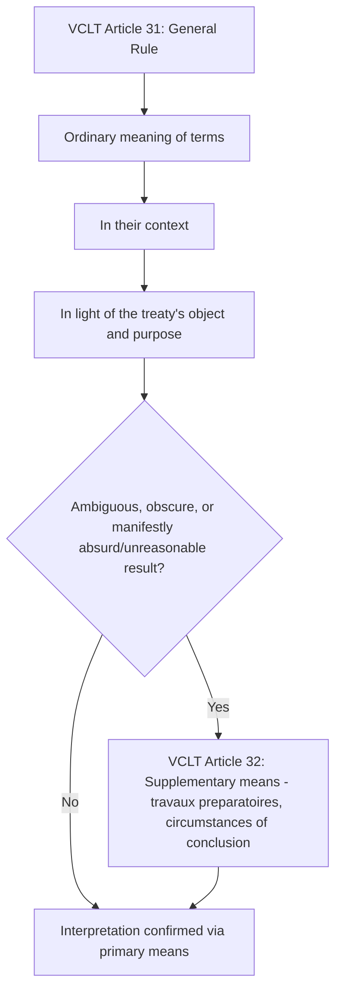

## The Law of Treaties

### Overview

The law of treaties is the body of international law governing how treaties are made, interpreted, applied, amended, and terminated. It is the principal legal framework through which states create binding obligations by consent, and its dominant codification is the **Vienna Convention on the Law of Treaties (VCLT, 1969)**, often described as a "treaty on treaties." The VCLT entered into force in 1980 and, even for non-parties (including some major states), is widely regarded as substantially reflecting customary international law, extending its practical reach well beyond its formal membership.

### Definition and Scope

**Key Points**

- Per VCLT Article 2(1)(a), a treaty is "an international agreement concluded between States in written form and governed by international law, whether embodied in a single instrument or in two or more related instruments and whatever its particular designation."
- The VCLT applies to treaties between **states**; a separate 1986 convention addresses treaties involving international organizations, though it has narrower ratification.
- Designation is irrelevant to legal status: instruments titled "convention," "protocol," "covenant," "charter," "agreement," "exchange of notes," or "memorandum" can all constitute treaties if they meet the substantive definition — intended to create legally binding obligations under international law.
- Oral agreements between states can, in principle, also be binding under international law (as affirmed in the ICJ's *Qatar v. Bahrain* case), though the VCLT itself governs only written treaties.

### The Treaty Lifecycle

### Formation: Negotiation, Adoption, and Authentication

**Key Points**

- **Negotiation**: Conducted by state representatives holding "full powers" (formal authorization) or by heads of state/government, heads of diplomatic missions, and certain other officials who are presumed to represent their state without needing to produce full powers (VCLT Article 7).
- **Adoption**: The text is formally adopted, typically by consent of all negotiating states, or by a two-thirds majority vote at an international conference unless a different rule is agreed (VCLT Article 9).
- **Authentication**: The text is established as final and authoritative, typically through signature, signature *ad referendum*, or initialing (VCLT Article 10).

### Expressing Consent to Be Bound

A state is not bound by a treaty merely by participating in its negotiation or signing it (unless the treaty specifies signature alone suffices); binding consent is expressed through defined mechanisms.

| Method | Description |
| --- | --- |
| Signature | Binding only where the treaty so provides, or where the parties agreed signature would have that effect |
| Ratification | Formal act, typically requiring domestic constitutional process, confirming the state's consent following signature |
| Accession | Method by which a state becomes party to a treaty it did not sign during the negotiation/adoption phase |
| Acceptance/Approval | Functionally similar to ratification, used by some states per domestic procedural preference |
| Exchange of instruments | Consent expressed through mutual exchange of instruments constituting the treaty itself |

**Key Points**

- The distinction between signature and ratification reflects the "two-step" consent structure common in many treaties: signature often signals intent and creates an interim obligation not to defeat the treaty's object and purpose (VCLT Article 18), while ratification constitutes full legal commitment.
- Domestic ratification procedures (e.g., legislative approval, referendum) are governed by each state's own constitutional law, not by the VCLT itself, though the VCLT addresses the international legal consequences of that process.

### Reservations

A reservation is a unilateral statement made by a state when signing, ratifying, or acceding to a treaty, purporting to exclude or modify the legal effect of certain provisions in their application to that state (VCLT Article 2(1)(d)).

**Key Points**

- Reservations are permitted unless: (a) the treaty prohibits reservations generally, (b) the treaty permits only specified reservations not including the one in question, or (c) the reservation is incompatible with the treaty's object and purpose (VCLT Article 19).
- Other parties may accept or object to a reservation; an objecting state may nonetheless allow the treaty to enter into force between itself and the reserving state, excluding the reserved provision, unless it clearly indicates otherwise (VCLT Article 20-21).
- Multilateral human rights treaties have generated significant doctrinal debate over the "object and purpose" compatibility test, given the difficulty of severing an incompatible reservation without either invalidating it entirely or excluding the reserving state from the treaty relationship altogether. [Inference: reflects ongoing scholarly and institutional debate, notably around human rights treaty bodies' practice, rather than a fully settled doctrinal consensus]

### Entry into Force and Provisional Application

**Key Points**

- Entry into force occurs as the treaty itself specifies — commonly upon a defined number of ratifications, on a fixed date, or immediately upon signature for some bilateral agreements (VCLT Article 24).
- **Provisional application** (VCLT Article 25) allows a treaty, or part of it, to apply before formal entry into force if the treaty so provides or the negotiating states otherwise agree — used where states wish obligations to take practical effect while domestic ratification is pending.

### Interpretation of Treaties

The VCLT's interpretive rules (Articles 31-33) are widely regarded as themselves reflecting customary international law and are routinely applied by international tribunals, including the ICJ and WTO dispute panels.

**Key Points**

- **Article 31 (general rule)**: A treaty is to be interpreted in good faith, in accordance with the ordinary meaning of its terms in their context, and in light of its object and purpose — integrating textual, contextual, and teleological approaches within a single "general rule" rather than treating them as competing schools.
- **Article 32 (supplementary means)**: Preparatory work (*travaux préparatoires*) and the circumstances of the treaty's conclusion may be used to confirm the Article 31 meaning, or to determine meaning where Article 31 leaves it ambiguous, obscure, or leads to a manifestly absurd or unreasonable result.
- **Article 33** addresses interpretation of treaties authenticated in two or more languages, generally presuming equal authority of each authentic text absent contrary agreement, with reconciliation principles where discrepancies arise.

### Third States and the Pacta Tertiis Principle

**Key Points**

- The foundational principle *pacta tertiis nec nocent nec prosunt* ("agreements neither harm nor benefit third parties") means a treaty does not create obligations or rights for a non-party state without that state's consent (VCLT Article 34).
- Exceptions exist: a treaty may create obligations for a third state if that state expressly accepts them in writing (Article 35), or may create rights for a third state if the parties intend to confer them and the third state assents (Article 36), such intent presumed absent contrary indication.

### Amendment and Modification

**Key Points**

- **Amendment** (Articles 39-41) alters the treaty for all parties, generally following the same procedure as treaty conclusion unless the treaty specifies otherwise.
- **Modification** allows two or more parties to a multilateral treaty to alter its terms as between themselves alone, subject to conditions ensuring it does not affect other parties' rights/obligations or contradict the treaty's object and purpose (Article 41).

### Invalidity, Termination, and Suspension

| Ground | Category | Description |
| --- | --- | --- |
| Violation of internal law on treaty-making competence | Invalidity | Narrow exception; internal law violation must be manifest and concern a rule of fundamental importance (Art. 46) |
| Error | Invalidity | Error of fact that formed an essential basis of consent (Art. 48) |
| Fraud / Corruption of a representative | Invalidity | Fraudulent conduct or corruption inducing consent (Arts. 49-50) |
| Coercion of a state representative or of the state itself | Invalidity | Renders treaty void (Arts. 51-52) |
| Conflict with a peremptory norm (*jus cogens*) | Invalidity | Treaty is void if it conflicts with existing *jus cogens*; becomes void and terminates if a new *jus cogens* norm emerges (Arts. 53, 64) |
| Material breach | Termination/Suspension | Entitles the other party(ies) to invoke termination or suspension (Art. 60) |
| Supervening impossibility of performance | Termination | E.g., permanent disappearance of an object indispensable to execution (Art. 61) |
| Fundamental change of circumstances (*rebus sic stantibus*) | Termination | Narrowly construed exception; unforeseen fundamental change radically transforming the extent of obligations (Art. 62) |
| Termination per treaty's own terms or by mutual consent | Termination | Withdrawal/denunciation clauses, or agreement of all parties (Arts. 54, 56) |

**Key Points**

- The *rebus sic stantibus* doctrine (Article 62) is deliberately narrow: it explicitly cannot be invoked for boundary treaties, and cannot be invoked if the fundamental change results from the invoking party's own breach of an obligation.
- Invalidity, termination, and suspension for the grounds above generally must be invoked through the procedural mechanism in VCLT Articles 65-68 (notification, opportunity for objection, and — absent resolution — recourse to dispute settlement mechanisms including potential ICJ referral for *jus cogens*-related disputes).
- *Jus cogens* conflict (Articles 53 and 64) is treated distinctly and severely: unlike other invalidity grounds, it renders the treaty void in its entirety, without the separability option available for some other grounds (Article 44).

### Diplomatic Relevance

**Key Points**

- Diplomats directly apply VCLT procedural rules throughout treaty negotiation, from determining who holds authority to negotiate (full powers) to managing the ratification and reservation process with domestic legislatures.
- Understanding the narrow scope of grounds for invalidity, termination, and suspension is essential for diplomats assessing the durability of negotiated commitments and for advising on treaty exit strategy risk.
- VCLT interpretive rules (Articles 31-33) are the operative framework diplomats and legal advisers use when disputes arise over ambiguous treaty language, including in the drafting stage to preempt future interpretive disputes.

### Conclusion

The law of treaties, substantially codified in the VCLT, provides the structural rules governing how binding international agreements are formed, interpreted, and unwound. Its emphasis on state consent at every stage — from negotiation authority through ratification, reservation, and termination — reflects international law's foundational reliance on sovereign agreement rather than centralized legislative authority, making treaty-law literacy a core competency for diplomatic practice.

**Related Topics**

- Sources of International Law
- Customary International Law and Opinio Juris
- Jus Cogens and Peremptory Norms
- Treaty Reservations and Compatibility with Object and Purpose
- The Vienna Convention on Diplomatic Relations
- Dispute Settlement Mechanisms in International Law
- State Succession and Treaty Obligations
- Multilateral Treaty Negotiation Procedure