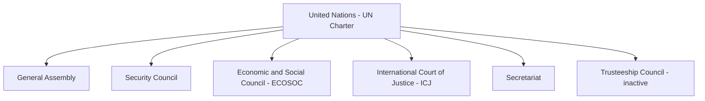
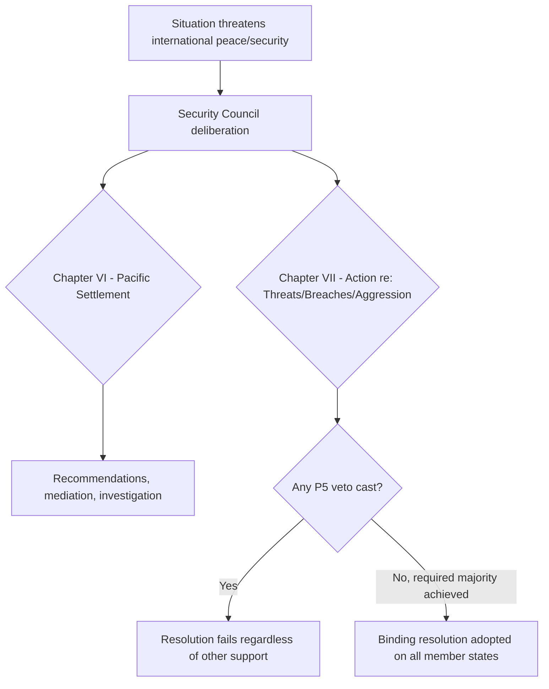
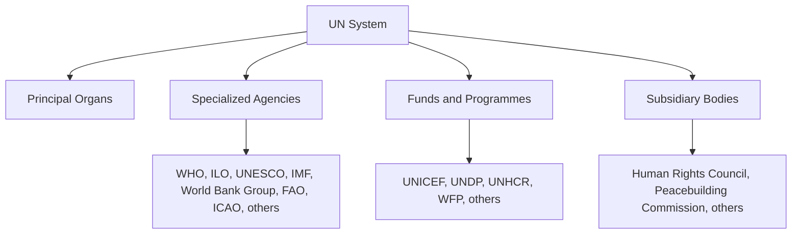

## The United Nations System and Its Organs

### Overview

The United Nations is the principal universal international organization, established by the **UN Charter**, signed on 26 June 1945 in San Francisco and entering into force on 24 October 1945. It provides the institutional architecture for collective security, international law development, human rights promotion, humanitarian coordination, and multilateral diplomacy. The "UN system" encompasses not only the six principal organs established directly by the Charter but also a broader network of specialized agencies, programmes, and funds with varying degrees of legal and operational independence.

### The Six Principal Organs

| Organ | Charter Basis | Core Function |
| --- | --- | --- |
| General Assembly (GA) | Chapter IV | Deliberative plenary body; all member states represented equally |
| Security Council (SC) | Chapter V | Primary responsibility for international peace and security; binding decisions under Chapter VII |
| Economic and Social Council (ECOSOC) | Chapter X | Coordinates economic, social, and related work of the UN system |
| International Court of Justice (ICJ) | Chapter XIV | Principal judicial organ; settles state disputes and issues advisory opinions |
| Secretariat | Chapter XV | Administrative and executive arm, headed by the Secretary-General |
| Trusteeship Council | Chapter XIII | Suspended operations in 1994 upon completion of its decolonization mandate |

### The General Assembly

**Key Points**

- Composed of all UN member states, each holding one vote regardless of size or power — a structural contrast to the Security Council's differentiated permanent-member status.
- Decisions on "important questions" (e.g., peace and security recommendations, admission of new members, budgetary matters) require a two-thirds majority; other questions require a simple majority (Charter Article 18).
- GA resolutions are generally **non-binding recommendations**, though they carry significant political weight and can contribute to the formation or crystallization of customary international law as evidence of state practice and *opinio juris*.
- Exercises budgetary authority over the Organization and elects non-permanent Security Council members, ECOSOC members, and (jointly with the Security Council) ICJ judges.

### The Security Council

**Key Points**

- Composed of **15 members**: five permanent members (China, France, Russia, the United Kingdom, and the United States — the "P5") and ten non-permanent members elected by the General Assembly for two-year terms.
- Each P5 member holds a **veto power** over substantive (non-procedural) resolutions, per Charter Article 27 — a single P5 negative vote blocks adoption regardless of support from other members.
- Resolutions adopted under **Chapter VII** (addressing threats to peace, breaches of peace, and acts of aggression) are **legally binding** on all UN member states, distinguishing them sharply from the General Assembly's recommendatory role.
- Powers under Chapter VII include authorizing sanctions, arms embargoes, and — in defined circumstances — the use of force, as well as establishing peacekeeping operations (though peacekeeping itself is not explicitly enumerated in the Charter and is sometimes informally termed a "Chapter VI½" activity).

### The Economic and Social Council (ECOSOC)

**Key Points**

- Composed of 54 member states elected by the General Assembly for staggered three-year terms.
- Serves as the central coordinating platform for the UN's economic, social, humanitarian, and cultural work, including oversight linkages to numerous specialized agencies, functional commissions, and regional commissions.
- Its decisions are generally recommendatory rather than binding, consistent with its coordinating rather than enforcement-oriented mandate.

### The International Court of Justice (ICJ)

**Key Points**

- Seated at the Peace Palace in The Hague, the ICJ is the UN's principal judicial organ, operating under its own Statute (annexed to and forming an integral part of the UN Charter).
- Exercises two distinct functions: **contentious jurisdiction** (settling legal disputes between states that consent to its jurisdiction) and **advisory jurisdiction** (issuing non-binding advisory opinions at the request of authorized UN organs and specialized agencies).
- Contentious jurisdiction requires state consent, expressed through special agreement, a jurisdictional clause in a treaty, or declarations under the "optional clause" (Statute Article 36(2)); the Court has no compulsory jurisdiction over disputes absent such consent.
- Judgments in contentious cases are binding on the parties (Charter Article 94), though the Court has no independent enforcement mechanism — enforcement, where sought, runs through the Security Council, itself subject to the veto.
- Distinct from the **International Criminal Court (ICC)**, which is not a UN organ but a separate treaty-based institution (Rome Statute, 1998) with jurisdiction over individuals for specified international crimes.

### The Secretariat

**Key Points**

- Headed by the **Secretary-General**, appointed by the General Assembly on Security Council recommendation for a (customarily, though not Charter-mandated) five-year renewable term.
- Functions as the UN's administrative and executive arm, implementing programs and decisions of other organs, and providing the Secretary-General with a distinct diplomatic role under Charter Article 99, which permits bringing to the Security Council's attention any matter threatening international peace and security.
- Staffed by international civil servants bound by an oath of independence from national instruction (Charter Article 100), reflecting the Secretariat's intended institutional neutrality.

### The Trusteeship Council

**Key Points**

- Originally established to supervise the administration of Trust Territories toward self-government or independence; suspended operation in 1994 following Palau's independence, the last remaining trust territory.
- Remains formally established under the Charter but has no active substantive function, with periodic proposals (not adopted) to repurpose or formally abolish it.

### The Broader UN System: Specialized Agencies, Funds, and Programmes

Beyond the six principal organs, the UN system includes numerous affiliated bodies with varying legal and financial independence.

**Key Points**

- **Specialized agencies** (e.g., the World Health Organization, International Labour Organization, UNESCO, the World Bank Group, the International Monetary Fund) are independent international organizations with their own governing structures, budgets, and founding treaties, linked to the UN through formal relationship agreements under Charter Articles 57 and 63 — they are not subordinate departments of the UN itself.
- **Funds and programmes** (e.g., UNICEF, UNDP, UNHCR, the World Food Programme) are typically subsidiary organs of the General Assembly, generally funded through voluntary rather than assessed contributions, and operate with greater integration into the UN's direct organizational structure than the specialized agencies.
- The **Human Rights Council**, established in 2006 as a subsidiary body of the General Assembly (replacing the earlier Commission on Human Rights), conducts the Universal Periodic Review and other human rights monitoring mechanisms, though it is not one of the six Charter-established principal organs.

### Institutional Reform Debates

**Key Points**

- Security Council reform — particularly expansion of permanent or semi-permanent membership and modification or abolition of the veto — has been a long-standing subject of member-state negotiation without resolution, given the P5's own veto over Charter amendment. [Inference: general, well-documented institutional stalemate; specific reform proposals and diplomatic positions shift and should be checked against current negotiating status]
- Charter amendment itself requires adoption by two-thirds of the General Assembly and ratification by two-thirds of member states, **including all five permanent Security Council members** (Charter Article 108) — a structural feature that gives the P5 an effective veto over most substantive structural reform of the Organization itself.

### Diplomatic Relevance

**Key Points**

- Understanding the binding/non-binding distinction between Security Council Chapter VII resolutions and General Assembly resolutions is fundamental to assessing the legal weight of any given UN diplomatic outcome.
- P5 veto dynamics shape a significant share of practical multilateral diplomatic strategy at the UN, including the frequent use of the General Assembly's "Uniting for Peace" mechanism as a (non-binding) alternative avenue when Security Council action is blocked.
- Diplomats working across the specialized-agency landscape must navigate each agency's distinct governance structure, membership, and voting rules, which often differ meaningfully from core UN organ procedures (e.g., weighted voting in the IMF and World Bank Group, contrasted with the GA's one-state-one-vote structure).

### Conclusion

The UN system's institutional architecture — a plenary deliberative body, an empowered but veto-constrained security organ, a judicial organ dependent on state consent, an administrative Secretariat, and a wide constellation of specialized agencies and programmes — reflects a deliberate balance between universal participation and great-power accommodation struck at the Organization's 1945 founding. Diplomatic practitioners require working fluency across this structure to correctly assess the legal weight, procedural pathway, and political leverage available within any given UN forum.

**Related Topics**

- Sources of International Law
- The Law of Treaties
- The Security Council Veto and Chapter VII Powers
- The International Criminal Court and the Rome Statute
- Specialized Agency Governance Structures
- UN Charter Amendment Procedures
- The Uniting for Peace Resolution
- Human Rights Council and Universal Periodic Review