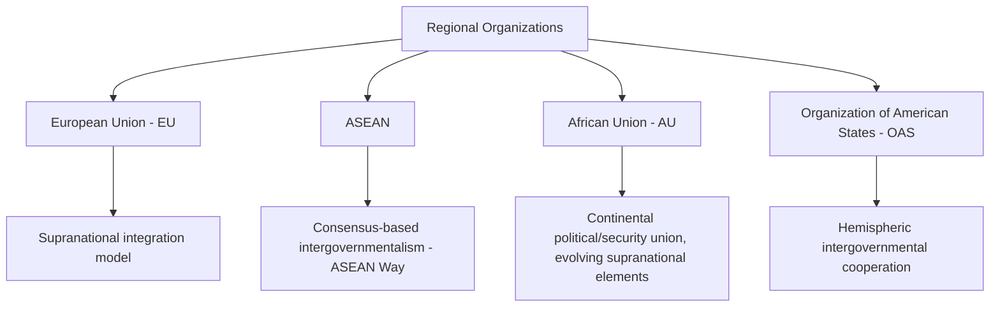
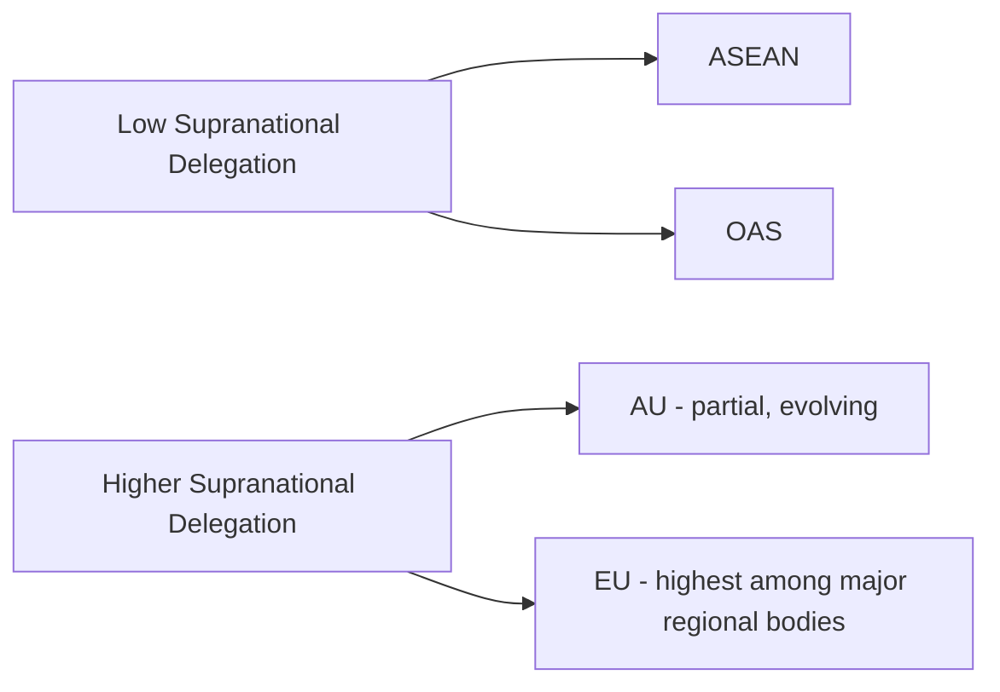

## Regional Organizations: EU, ASEAN, AU, and OAS

### Overview

Regional international organizations complement the universal UN system by pursuing political, economic, and security cooperation among states sharing geographic proximity, and often historical, cultural, or economic ties. The four organizations examined here — the European Union (EU), the Association of Southeast Asian Nations (ASEAN), the African Union (AU), and the Organization of American States (OAS) — represent substantially different institutional models, ranging from deep supranational integration to consensus-based intergovernmental cooperation, offering a comparative lens on regional governance design.

### Comparative Institutional Overview

| Organization | Founded | Member States (approx.) | Core Model |
| --- | --- | --- | --- |
| European Union | 1993 (Maastricht Treaty); institutional roots to 1950s | 27 | Supranational — binding law, pooled sovereignty |
| ASEAN | 1967 (Bangkok Declaration) | 10 | Intergovernmental — consensus, non-interference |
| African Union | 2002 (succeeding OAU, est. 1963) | 55 | Intergovernmental with growing supranational elements |
| OAS | 1948 (Bogotá Charter) | 35 (Cuba's participation suspended/contested; Nicaragua withdrawn) | Intergovernmental — political/security cooperation |

[Inference: current member counts and participation status are subject to change and should be verified against current sources for precision, particularly regarding disputed or suspended memberships]

### The European Union (EU)

**Key Points**

- Uniquely among major regional organizations, the EU is a **supranational** entity: EU law (regulations, and to a lesser extent directives) can have direct effect and supremacy over conflicting national law within member states, a structure established through foundational Court of Justice of the European Union (CJEU) jurisprudence (notably *Van Gend en Loos* and *Costa v. ENEL*).
- Institutional architecture centers on the **European Commission** (executive, proposes legislation), the **Council of the European Union** (member-state ministers, co-legislator), the **European Parliament** (directly elected, co-legislator), and the **CJEU** (judicial interpretation and enforcement) — often summarized as a distinctive "institutional triangle" plus judiciary.
- Operates the **eurozone** (shared currency, 20 of 27 members as of recent membership) and the **Schengen Area** (passport-free internal movement) as flagship — though not universal — integration projects, illustrating the EU's variable-geometry approach to deep integration.
- The **Treaty on European Union (TEU)** and **Treaty on the Functioning of the European Union (TFEU)** form the EU's primary constitutional framework, amendable only through unanimous member-state agreement and subsequent domestic ratification.
- Brexit (UK withdrawal, effective 2020, following Article 50 TEU procedures) demonstrated the EU's first use of its formal member-state withdrawal mechanism, underscoring that supranational integration remains ultimately grounded in continued state consent.

### ASEAN (Association of Southeast Asian Nations)

**Key Points**

- Explicitly organized around **intergovernmentalism** and consensus rather than supranational delegation — often described as the "ASEAN Way," emphasizing non-interference in internal affairs, consensus-based decision-making, and informal, consultative processes over binding legalism.
- The **ASEAN Charter** (2007, entered into force 2008) gave the organization formal legal personality for the first time, but decision-making remains fundamentally consensus-driven, without a supranational court possessing compulsory jurisdiction comparable to the CJEU.
- Core institutional bodies include the **ASEAN Summit** (heads of state/government, apex decision-making), the **ASEAN Coordinating Council**, and the **ASEAN Secretariat** (Jakarta-based, coordinating rather than executive in character).
- Economic integration is pursued primarily through the **ASEAN Economic Community (AEC)**, aiming at a single market and production base, though implementation has proceeded unevenly across a highly economically diverse membership. [Inference: pace and depth of AEC implementation is contested and evolving; specific current status should be verified]
- The principle of **non-interference** has drawn sustained criticism for constraining ASEAN's capacity to address internal member-state crises (e.g., responses to Myanmar's post-2021 political crisis), illustrating a structural tension between the organization's founding norms and demands for more assertive collective action. [Inference: reflects widely reported diplomatic and scholarly critique; characterization of specific ongoing situations should be checked against current reporting]

### The African Union (AU)

**Key Points**

- Established in 2002 as successor to the **Organisation of African Unity (OAU, 1963)**, with an explicitly broader mandate encompassing political and economic integration, not solely anti-colonial solidarity and territorial-integrity norms as under the OAU.
- Institutional structure includes the **Assembly of the African Union** (heads of state/government, supreme organ), the **AU Commission** (Addis Ababa-based secretariat/executive), the **Pan-African Parliament** (currently advisory/consultative rather than fully legislative), and the **Peace and Security Council** (analogous in function, though not authority, to the UN Security Council).
- Notably departs from strict non-interference: the **AU Constitutive Act** (Article 4(h)) asserts a right of the Union to intervene in a member state in respect of grave circumstances — war crimes, genocide, and crimes against humanity — representing a significant normative shift from the OAU's near-absolute sovereignty deference.
- Pursues continental economic integration through initiatives including the **African Continental Free Trade Area (AfCFTA)**, one of the world's largest free trade areas by membership, aimed at boosting intra-African trade. [Inference: implementation pace and specific trade-flow outcomes are evolving and should be verified against current data]
- Faces persistent capacity and funding constraints, with substantial reliance on external partner funding for peace and security operations, raising ongoing questions about operational autonomy. [Inference: widely noted structural characteristic in AU institutional analysis]

### The Organization of American States (OAS)

**Key Points**

- Established by the **Charter of the OAS** (Bogotá, 1948), building on earlier Pan-American cooperation frameworks dating to the late 19th century (the International Union of American Republics).
- Core purposes include strengthening hemispheric peace and security, promoting representative democracy, and resolving disputes among member states, operating primarily through the **General Assembly** (principal decision-making body), the **Permanent Council** (ongoing Washington-based deliberation), and the **Inter-American Commission on Human Rights** and **Inter-American Court of Human Rights** (a distinct human rights architecture with its own treaty basis, the American Convention on Human Rights).
- The **Inter-American Democratic Charter** (2001) formalizes collective commitment to democratic governance and provides mechanisms for responding to unconstitutional interruptions of democratic order in member states — though its practical invocation has been diplomatically contested in specific cases. [Inference: application and effectiveness of the Democratic Charter in specific historical instances is subject to differing assessments and should be checked against current scholarship for any particular case]
- Membership has been affected by significant political contestation: Cuba's government was excluded from active participation for decades following a 1962 suspension (later subject to a 2009 resolution revoking the exclusion, though Cuba has not sought to rejoin active participation), and Nicaragua formally withdrew from the OAS in 2023. [Inference: specific status details evolve; verify current membership status against up-to-date sources]

### Comparative Analysis: Integration Depth and Decision-Making

| Dimension | EU | ASEAN | AU | OAS |
| --- | --- | --- | --- | --- |
| Binding supranational law | Yes (regulations directly effective) | No | Limited | No |
| Independent judicial enforcement | Yes (CJEU) | No | Limited (African Court on Human and Peoples' Rights, human-rights specific) | Yes, for human rights (Inter-American Court) |
| Non-interference norm strength | Weak (deep pooled sovereignty) | Strong (foundational principle) | Moderated (Art. 4(h) intervention right) | Moderate (democracy-clause mechanisms) |
| Common currency/market integration | Deep (eurozone, single market) | Developing (AEC) | Developing (AfCFTA) | Limited (no common market) |

### Diplomatic Relevance

**Key Points**

- Diplomats engaging with the EU must distinguish between competencies exercised at the supranational level (e.g., trade policy, competition law) versus those remaining with member states (e.g., much of foreign and security policy, which operates on an intergovernmental unanimity basis under the Common Foreign and Security Policy framework) — a distinction with direct consequences for who holds negotiating authority.
- Engagement with ASEAN requires calibration to consensus-based, non-confrontational diplomatic norms consistent with the "ASEAN Way," where public pressure tactics common in more adversarial diplomatic traditions may be counterproductive.
- The AU's Article 4(h) intervention principle is diplomatically significant as a rare instance of a regional body formally asserting authority to override strict sovereign non-interference in defined grave circumstances, relevant to conflict-prevention diplomacy on the continent.
- OAS engagement often intersects with the distinct Inter-American human rights system, requiring diplomats to track obligations and proceedings that operate somewhat independently of the OAS's core political organs.

### Conclusion

The EU, ASEAN, AU, and OAS illustrate a spectrum of regional institutional design, from the EU's deep supranational pooling of sovereignty to ASEAN's consensus-driven intergovernmentalism, with the AU and OAS occupying intermediate positions shaped by distinct historical and normative trajectories. Diplomatic engagement with any of these bodies requires understanding not only their formal competencies but the underlying decision-making culture — legalistic and binding in the EU's case, consultative and consensus-oriented in ASEAN's, and variably assertive on sovereignty questions in the AU and OAS — that shapes what outcomes are diplomatically achievable within each forum.

**Related Topics**

- The United Nations System and Its Organs
- Supranationalism Versus Intergovernmentalism in International Organizations
- The ASEAN Way and Non-Interference Norms
- The African Union's Constitutive Act and Article 4(h)
- The Inter-American Human Rights System
- Regional Economic Integration and Free Trade Areas
- Sovereignty and Collective Intervention Norms
- Brexit and Withdrawal Mechanisms in Regional Organizations