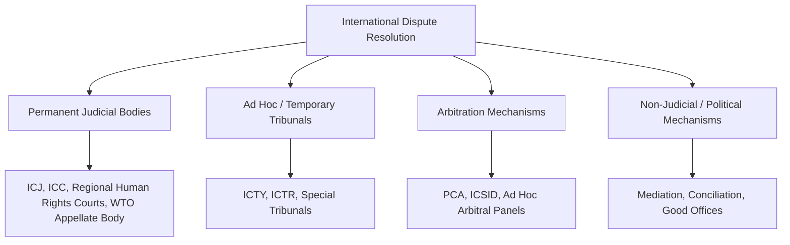
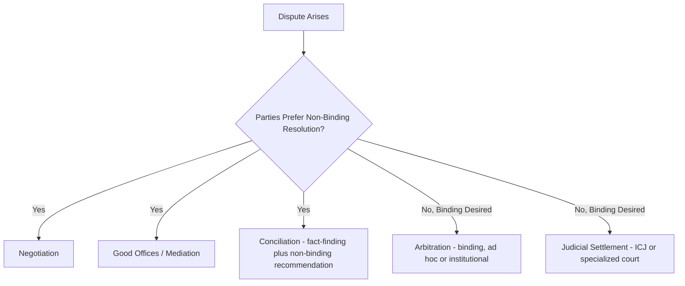

## International Courts and Dispute Resolution Bodies

### Overview

International courts and dispute resolution bodies provide institutionalized mechanisms for resolving disagreements between states, and in some cases between states and individuals, corporations, or international organizations, without recourse to unilateral action or force. Unlike domestic legal systems, the international judicial landscape is fragmented across multiple specialized institutions with differing jurisdictional bases, subject-matter competence, and enforcement capacity, reflecting international law's decentralized and largely consent-based structure.

### The Landscape of International Dispute Resolution

### The International Court of Justice (ICJ)

**Key Points**

- The UN's principal judicial organ (see The United Nations System and Its Organs), seated in The Hague, resolving legal disputes **between states** and issuing advisory opinions to authorized UN organs and agencies.
- Contentious jurisdiction is strictly **consent-based**, established through a special agreement (*compromis*), a jurisdictional clause within a treaty, or a state's optional-clause declaration under Statute Article 36(2); the Court cannot compel a state to appear absent such consent.
- Judgments bind only the parties to the specific case (Statute Article 59) and carry no formal *stare decisis* effect, though ICJ jurisprudence exercises substantial de facto persuasive authority on subsequent interpretation of custom and treaty law.
- Enforcement of ICJ judgments runs through the UN Security Council (Charter Article 94), which is itself subject to the P5 veto — meaning judgment compliance ultimately depends significantly on state cooperation rather than centralized coercive enforcement.

### The International Criminal Court (ICC)

**Key Points**

- Established by the **Rome Statute** (1998, entered into force 2002), the ICC is **not a UN organ** but an independent treaty-based institution, though it maintains a formal relationship agreement with the UN.
- Distinct from the ICJ in a fundamental respect: the ICC prosecutes **individuals**, not states, for four categories of international crimes — genocide, crimes against humanity, war crimes, and the crime of aggression (the latter subject to more limited jurisdictional conditions).
- Operates on the principle of **complementarity**: the ICC exercises jurisdiction only where national courts are "unwilling or unable" genuinely to investigate or prosecute, positioning it as a court of last resort rather than a primary enforcement body.
- Jurisdiction generally requires either that the accused's state of nationality or the state where the crime occurred is a Rome Statute party (or has accepted jurisdiction), or that the situation is referred by the UN Security Council — the latter mechanism notably allowing jurisdiction over non-party states' nationals in specific referred situations.
- Several major states, including the United States, China, and Russia, are not parties to the Rome Statute, a structural limitation frequently cited in assessments of the Court's universal reach and enforcement capacity. [Inference: non-membership status is factual and stable as of available information, though specific state positions and any policy shifts should be checked against current sources]

### Ad Hoc and Hybrid International Criminal Tribunals

**Key Points**

- Preceding and complementing the ICC, the UN Security Council established **ad hoc tribunals** for specific conflicts under Chapter VII authority, notably the **International Criminal Tribunal for the former Yugoslavia (ICTY)** and the **International Criminal Tribunal for Rwanda (ICTR)**, both now concluded, with residual functions handled by the **International Residual Mechanism for Criminal Tribunals**.
- **Hybrid/mixed tribunals** combine international and domestic law and personnel (e.g., the Special Court for Sierra Leone, Extraordinary Chambers in the Courts of Cambodia), offering a middle path between purely international and purely domestic prosecution of atrocity crimes.
- These tribunals demonstrated that Security Council Chapter VII authority could be used to establish binding judicial mechanisms even absent a prior multilateral treaty, a distinct institutional pathway from the ICC's treaty-based foundation.

### The Permanent Court of Arbitration (PCA)

**Key Points**

- Established by the **1899 and 1907 Hague Conventions**, the PCA is the oldest institution for international dispute resolution still operating, though it functions as a **facilitating framework** rather than a standing court with permanent judges — it maintains a panel of potential arbitrators and administrative support for ad hoc tribunals constituted per dispute.
- Handles a broad range of disputes: state-to-state, state-to-investor, and cases involving international organizations, offering procedural flexibility that formal standing courts do not.
- Prominent recent PCA-administered cases have included maritime boundary and law-of-the-sea disputes, illustrating its continued relevance for technically complex, sovereignty-sensitive matters. [Inference: general institutional role; specific case outcomes and current caseload should be verified against current PCA records]

### Investor-State Dispute Settlement (ISDS): ICSID and Related Mechanisms

**Key Points**

- The **International Centre for Settlement of Investment Disputes (ICSID)**, established under the 1965 **ICSID Convention** and part of the World Bank Group, provides a specialized forum for disputes between foreign investors and host states, typically arising under bilateral investment treaties (BITs) or investment chapters of broader trade agreements.
- ISDS represents a significant departure from the state-centric model of the ICJ: private investors can bring claims directly against sovereign states without requiring their home state to exercise diplomatic protection on their behalf.
- ISDS has become a subject of considerable policy controversy, with critics raising concerns about regulatory chilling effects on host-state public policy and calls for reform (including proposals for a standing multilateral investment court to replace ad hoc arbitral panels). [Inference: reflects an active, ongoing, and contested policy debate; specific reform proposals and their status are evolving and should be verified against current sources]

### The WTO Dispute Settlement System

**Key Points**

- Operating under the **Dispute Settlement Understanding (DSU)**, the WTO's system is often cited as one of the most legalized and frequently used mechanisms in international economic law, combining panel adjudication with an **Appellate Body** review stage.
- The Appellate Body has faced significant operational disruption due to the blocking of new judicial appointments by certain WTO members (notably the United States), resulting in periods of effective non-functionality for appeals — a prominent example of how member-state cooperation, even within a well-institutionalized system, remains essential to functional dispute resolution. [Inference: reflects a well-documented institutional crisis; current operational status should be verified against up-to-date WTO reporting, as reform efforts have continued]
- WTO panel and Appellate Body rulings do not directly override domestic law but authorize compliance measures and, where non-compliance persists, proportionate retaliatory trade measures by the prevailing party.

### Regional Human Rights Courts

| Court | Region | Founding Instrument |
| --- | --- | --- |
| European Court of Human Rights (ECtHR) | Council of Europe | European Convention on Human Rights (1950) |
| Inter-American Court of Human Rights | OAS states (subset) | American Convention on Human Rights (1969) |
| African Court on Human and Peoples' Rights | AU states (subset) | Protocol to the African Charter (1998/2004) |

**Key Points**

- These courts allow individual petitioners (subject to jurisdictional and admissibility conditions) to bring claims against states for human rights violations, a significant departure from the state-to-state model dominant elsewhere in international adjudication.
- Jurisdiction and individual petition rights vary considerably by court and by state's specific ratification and declaration status, making case-by-case jurisdictional verification essential rather than assuming uniform applicability across a region's member states.

### Diplomatic Mechanisms Short of Adjudication

**Key Points**

- **Negotiation** remains the most common dispute-resolution method in practice, requiring no third-party institution and preserving maximum party control over outcome and process.
- **Good offices and mediation** involve a third party facilitating (good offices) or actively proposing solutions (mediation) without binding authority — historically exercised by individual states, the UN Secretary-General, or eminent individuals.
- **Conciliation** combines fact-finding with formal, though still non-binding, settlement recommendations, occupying a middle position between mediation and adjudication.
- Charter Article 33 obligates UN member states to seek resolution of disputes likely to endanger international peace through negotiation, inquiry, mediation, conciliation, arbitration, judicial settlement, or other peaceful means of their choice — reflecting the principle that states retain broad freedom to select their preferred dispute-resolution mechanism.

### Comparative Summary

| Body | Parties | Binding? | Consent Basis |
| --- | --- | --- | --- |
| ICJ | States | Yes, for parties to that case | Case-specific or treaty/declaration-based |
| ICC | Individuals (prosecuted) | Yes | Rome Statute party, ad hoc acceptance, or SC referral |
| PCA/ICSID Arbitration | States, investors, organizations | Yes, per arbitration agreement | Agreement to arbitrate (treaty or contract clause) |
| WTO DSU | States (as trade actors) | Yes, with compliance/retaliation structure | WTO membership |
| Regional Human Rights Courts | Individuals vs. states | Yes, for the respondent state | Treaty ratification, sometimes additional declarations |
| Mediation/Good Offices/Conciliation | Any | No | Voluntary participation |

### Diplomatic Relevance

**Key Points**

- Selecting the appropriate dispute-resolution forum is itself a significant diplomatic and legal strategy decision, weighing binding force, enforcement realism, procedural speed, confidentiality, and precedential/reputational consequences.
- Diplomats must distinguish between mechanisms requiring advance consent embedded in existing treaties (e.g., ICJ optional-clause declarations, BIT arbitration clauses) versus those requiring fresh, dispute-specific agreement — a distinction with major implications for whether a dispute can be brought to adjudication at all.
- Non-adjudicative mechanisms (negotiation, mediation, good offices) often remain diplomatically preferable even where binding forums are available, given the sovereignty-sensitive, reputational, and relationship-preserving considerations at stake in interstate disputes.

### Conclusion

The international dispute resolution landscape is deliberately pluralistic, offering states and other actors a spectrum of mechanisms ranging from purely voluntary diplomatic negotiation to binding judicial and arbitral adjudication, each with distinct consent requirements, subject-matter scope, and enforcement realities. Effective diplomatic practice requires matching the nature of a given dispute to the institution best suited to resolve it, with binding forums generally reserved for disputes where the parties value legal certainty and durability of outcome over the flexibility and relationship-preservation advantages of non-adjudicative methods.

**Related Topics**

- Sources of International Law
- The Law of Treaties
- The United Nations System and Its Organs
- The International Criminal Court and the Rome Statute
- Investor-State Dispute Settlement Reform Debates
- The WTO Appellate Body Crisis
- Regional Human Rights Courts and Individual Petition Rights
- UN Charter Article 33 and Peaceful Settlement Obligations