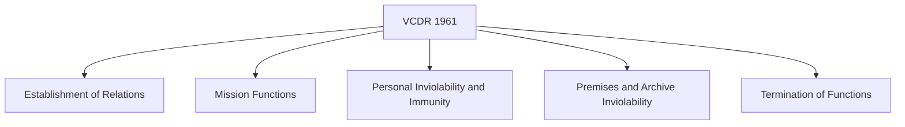
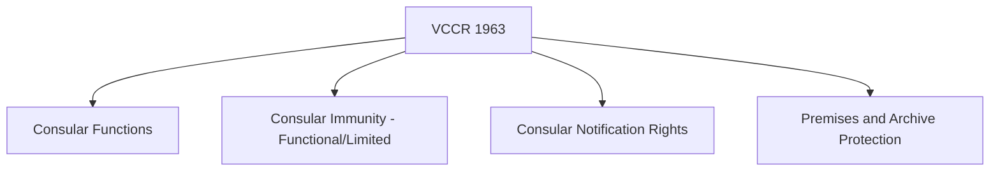
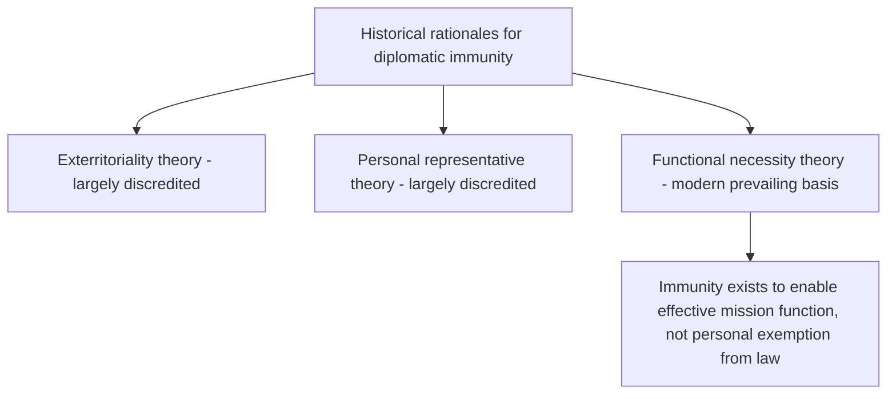

## Diplomatic and Consular Law

### Overview

Diplomatic and consular law is the body of international law governing the establishment, conduct, privileges, and protections of official state representation abroad. It is among the oldest and most consistently observed branches of international law, reflecting the practical necessity — recognized across virtually all historical diplomatic traditions — of enabling states to communicate and maintain relations without representatives being subject to coercion by the receiving state. The field is substantially codified in two foundational treaties: the **Vienna Convention on Diplomatic Relations (VCDR, 1961)** and the **Vienna Convention on Consular Relations (VCCR, 1963)**.

### Diplomatic Law vs. Consular Law: Core Distinction

| Aspect | Diplomatic Missions (VCDR) | Consular Posts (VCCR) |
| --- | --- | --- |
| Primary function | Political representation, negotiation, formal state-to-state relations | Protection of nationals, visas, trade/commercial facilitation, notarial functions |
| Head of mission | Ambassador/High Commissioner (to head of state) | Consul-General/Consul (to designated local authorities) |
| Scope of immunity | Broader, near-absolute for diplomatic agents | Narrower, generally limited to official acts |
| Number of posts | Typically one per receiving state (embassy) | Can be multiple (consulates in various cities) |

**Key Points**

- The two regimes are related but legally distinct; a state's diplomatic mission and consular posts operate under different privilege and immunity thresholds, even though in practice some functions overlap and diplomatic missions may perform consular functions.

### The Vienna Convention on Diplomatic Relations (VCDR, 1961)

**Establishment and Functions**

- Diplomatic relations are established by **mutual consent** between states (VCDR Article 2); no state is obligated to establish or maintain relations with another.
- Core mission functions (Article 3) include representing the sending state, protecting its interests and nationals, negotiating with the receiving state, ascertaining conditions and developments by lawful means, and promoting friendly relations.
- The receiving state's consent (**agrément**) is required for the appointment of a head of mission (Article 4); a state may decline agrément without providing reasons, and may also declare any mission member *persona non grata* at any time, without justification (Article 9), requiring recall or termination of function.

**Personal Inviolability and Immunity**

- The **person of a diplomatic agent is inviolable** (Article 29): they cannot be arrested, detained, or subjected to any form of physical restraint by the receiving state, which is under an affirmative duty to protect diplomats from any attack on person, freedom, or dignity.
- Diplomatic agents enjoy **immunity from the criminal jurisdiction** of the receiving state (Article 31(1)), which is essentially absolute, and also enjoy immunity from civil and administrative jurisdiction, subject to defined exceptions (real property held privately, succession matters, and professional/commercial activity outside official functions).
- Immunity belongs to the **sending state**, not the individual diplomat personally, and may be **waived** by the sending state (Article 32) — the individual cannot waive their own immunity.
- Family members forming part of a diplomatic agent's household generally enjoy equivalent privileges and immunities (Article 37), subject to receiving-state nationality exceptions.

**Premises, Archives, and Communications**

- Mission premises are **inviolable** (Article 22): receiving-state agents may not enter without mission consent, and the receiving state bears a special duty to protect the premises against intrusion or damage.
- Mission archives and documents are inviolable at all times, regardless of location (Article 24).
- Diplomatic correspondence and the **diplomatic bag** enjoy inviolability and may not be opened or detained (Article 27), though this protection is contingent on the bag containing only permitted diplomatic documents/articles for official use — a point of periodic diplomatic controversy where receiving states suspect abuse. [Inference: the tension between bag inviolability and suspected misuse is a recurring, well-documented diplomatic friction point, though specific incidents and their resolution vary by case]

**Termination and Limits**

- Diplomatic functions terminate through recall by the sending state, declaration by the receiving state that the diplomat is no longer acceptable (persona non grata), notification of termination, or severance/absence of diplomatic relations (Article 43).
- Even after termination of relations or an armed conflict, the receiving state must respect and protect mission premises, property, and archives, and must grant facilities for departure of mission members (Article 45) — reflecting the principle that diplomatic inviolability is designed to survive even breakdowns in the underlying relationship.

### The Vienna Convention on Consular Relations (VCCR, 1963)

**Consular Functions**

- Article 5 enumerates a broad range of consular functions: protecting the interests of the sending state and its nationals (individuals and corporations), issuing passports and visas, assisting nationals in distress, performing notarial and civil-status functions, and supervising vessels/aircraft registered in the sending state.
- Unlike diplomatic missions, which are limited to a single mission per receiving state, a sending state may establish multiple consular posts in different cities of the receiving state, subject to receiving-state consent.

**Consular Immunity: Narrower than Diplomatic Immunity**

- Consular officers enjoy immunity from jurisdiction only in respect of acts performed in the **exercise of consular functions** (Article 43) — a materially narrower "functional immunity" standard compared to diplomatic agents' broader personal immunity.
- Consular officers may be arrested or detained pending trial for grave crimes pursuant to a decision by competent judicial authority (Article 41), a further contrast with the near-absolute personal inviolability of diplomatic agents.
- Consular premises and archives are inviolable, though the specific protections and exceptions differ in detail from the diplomatic regime (Articles 31 and 33).

**Consular Notification (Article 36)**

- A receiving state must, without delay, inform a detained or arrested foreign national of their right to have their consular post notified, and must facilitate consular access and assistance if the national so requests.
- This provision has been the subject of significant international litigation, including ICJ cases addressing failures of consular notification in death-penalty cases, underscoring its practical human-rights significance beyond pure interstate diplomatic formality. [Inference: general pattern well-documented in ICJ jurisprudence; specific case details and outcomes should be verified against current legal sources for precision]

### Diplomatic Immunity: Categories and Gradations

**Key Points**

- Immunity is not uniform across all mission personnel; the VCDR distinguishes among **diplomatic agents** (full personal immunity), **administrative and technical staff** (immunity from criminal jurisdiction, more limited civil immunity for official acts only), and **service staff** (immunity limited to acts performed in official duties) (Articles 37).
- This graduated structure reflects a functional rationale underlying the entire regime: immunity exists to enable effective performance of official functions, not as a personal privilege — a principle reflected in the VCDR's preamble.

### Rationale: The Functional Necessity Theory

**Key Points**

- The modern, VCDR-endorsed rationale is **functional necessity**: immunities and privileges exist not to benefit individuals personally but to ensure the efficient performance of diplomatic missions on behalf of sending states — explicitly stated in the Convention's preamble.
- This superseded earlier theories (extraterritoriality — treating mission premises as sovereign territory of the sending state — and the "personal representative" theory), both now generally regarded as doctrinally outdated, though echoes persist in popular usage (e.g., informal references to embassies as "foreign soil").

### Abuse of Immunity and Accountability Mechanisms

**Key Points**

- Diplomatic immunity is not impunity in the sense of eliminating underlying legal responsibility: the sending state retains obligations, and the receiving state's principal remedies for serious misconduct are declaring the individual persona non grata (compelling recall) or requesting immunity waiver for prosecution.
- High-profile cases of diplomats committing serious offenses while shielded by immunity have generated recurring public and diplomatic controversy, illustrating the practical tension between the system's functional rationale and case-specific perceptions of injustice. [Inference: general, well-documented tension in diplomatic law discourse; specific case outcomes vary and should be verified individually]
- Some states maintain reciprocal practices of routinely requesting waiver for serious criminal conduct, though sending states retain full discretion to refuse.

### Diplomatic Relevance and Practical Application

**Key Points**

- Understanding the precise scope of immunity by personnel category (diplomatic agent vs. administrative/technical vs. service staff, and the narrower consular functional immunity) is essential for diplomats and legal advisers assessing both their own protections and the boundaries of appropriate conduct abroad.
- The persona non grata mechanism functions as a significant, frequently used diplomatic tool short of severing relations entirely — commonly deployed in response to espionage allegations, serious misconduct, or as a reciprocal/retaliatory diplomatic signal.
- Consular notification obligations under VCCR Article 36 carry direct operational significance for diplomats supporting detained nationals abroad, requiring active monitoring of receiving-state compliance with notification duties.

### Conclusion

Diplomatic and consular law, anchored in the VCDR and VCCR, provides a carefully graduated system of privileges and immunities designed to enable effective international representation while preserving meaningful (if narrower) accountability mechanisms, particularly for consular officials. Its enduring, near-universal observance — even amid periodic controversy over immunity abuse — reflects the field's grounding in a functional rationale broadly recognized as essential to the practical conduct of international relations, rather than as an unconditional personal exemption from law.

**Related Topics**

- Sources of International Law
- The Law of Treaties
- The United Nations System and Its Organs
- Persona Non Grata and Diplomatic Expulsion Practice
- Consular Notification and the Article 36 VCCR Litigation
- Functional Necessity Theory of Diplomatic Immunity
- Immunity Waiver Procedures and State Practice
- Diplomatic Bag Inviolability and Alleged Misuse Controversies