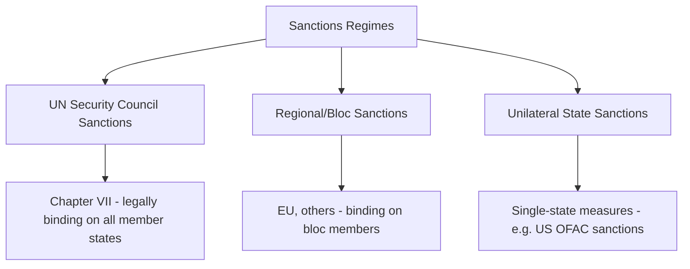
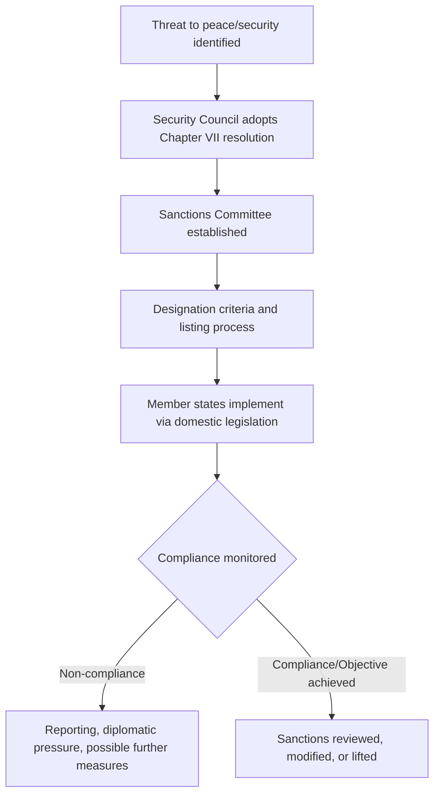

## Sanctions Regimes and Enforcement Mechanisms

### Overview

Sanctions are coercive measures short of armed force imposed by states or international organizations to compel a change in behavior, punish violations of international norms, or contain a threat, in the absence of a centralized global enforcement authority. Sanctions regimes operate across three principal levels — multilateral (UN), regional/bloc (e.g., EU), and unilateral (single-state) — each with distinct legal bases, enforcement mechanisms, and effectiveness constraints.

### Categories of Sanctions

| Level | Legal Basis | Binding Scope |
| --- | --- | --- |
| UN Security Council | UN Charter Chapter VII | All UN member states |
| Regional/Bloc (e.g., EU) | Bloc-specific legal instruments | Bloc member states |
| Unilateral | Domestic law of imposing state | Persons/entities within that state's jurisdiction (with extraterritorial reach in some cases) |

### UN Security Council Sanctions

**Key Points**

- Authorized under **Article 41** of the UN Charter, which empowers the Security Council to decide "measures not involving the use of armed force" to give effect to its decisions, distinguishing sanctions from the armed-force measures addressed separately under Article 42.
- Because they derive from Chapter VII, UN sanctions resolutions are **legally binding on all UN member states** (Charter Article 25 and 103), not merely on parties who consent — a critical distinction from most other international legal obligations, which are generally consent-based (see Sources of International Law).
- Each sanctions regime is typically administered by a dedicated **Sanctions Committee** established by the authorizing resolution, responsible for maintaining designation lists, considering exemption requests, and monitoring implementation.
- Common measure types include: arms embargoes, asset freezes, travel bans on designated individuals, trade restrictions on specific goods (e.g., commodities linked to conflict financing), and sectoral financial restrictions.
- Sanctions design has evolved significantly from broad, comprehensive country-wide embargoes (as used in earlier UN practice, e.g., against Iraq in the 1990s) toward **"targeted" or "smart" sanctions** aimed at specific individuals, entities, or economic sectors, partly in response to documented humanitarian consequences of comprehensive sanctions regimes. [Inference: widely documented policy evolution and rationale in sanctions scholarship]

### The UN Sanctions Process

**Key Points**

- Individual or entity **designation** (listing) for targeted sanctions typically requires Sanctions Committee consensus or a defined voting procedure, and has generated significant due-process critique regarding the fairness of listing and delisting procedures for named individuals. [Inference: reflects a substantial, well-documented body of legal and policy critique, notably regarding procedural fairness standards, rather than a fully resolved consensus position]
- The **UN Office of the Ombudsperson** (established initially for the Al-Qaida/ISIL sanctions regime) represents a specific institutional response to due-process concerns, providing an independent review mechanism for delisting petitions in that particular regime, though comparable mechanisms are not uniformly available across all UN sanctions regimes. [Inference: general institutional structure; scope and current application should be verified against current UN documentation]
- Implementation depends on domestic legislative and administrative action by member states, meaning practical enforcement effectiveness varies considerably based on individual states' capacity and political will.

### Regional and Bloc Sanctions: The EU Model

**Key Points**

- The EU maintains an autonomous sanctions capacity, both implementing UN Security Council sanctions into binding EU law and adopting independent "autonomous" EU sanctions regimes not mandated by any UN resolution.
- EU sanctions require unanimous agreement among member states under the Common Foreign and Security Policy framework, subsequently implemented through binding EU regulations directly applicable across member states — illustrating the EU's supranational legal architecture (see Regional Organizations) applied to sanctions policy.
- The EU maintains both country-specific sanctions regimes and thematic regimes (e.g., addressing human rights violations, chemical weapons use, or cyberattacks), reflecting a trend toward issue-based rather than purely country-based sanctions design. [Inference: general characterization of EU sanctions architecture and its evolution; specific current regimes should be verified against current EU sanctions maps]

### Unilateral Sanctions: The US Model

**Key Points**

- The United States maintains one of the world's most extensive unilateral sanctions architectures, administered principally by the Treasury Department's **Office of Foreign Assets Control (OFAC)**, alongside export control mechanisms administered by the Commerce and State Departments.
- US sanctions frequently include **secondary sanctions** provisions, which penalize third-country persons or entities for transactions with sanctioned targets even absent a direct US nexus — a significant source of extraterritoriality controversy, given the effective global reach such measures can exert through the centrality of the US financial system and dollar-clearing infrastructure. [Inference: well-documented feature and controversy in sanctions scholarship and diplomatic practice; specific regime details evolve and should be verified against current OFAC guidance]
- Legal bases for US sanctions typically derive from statutory authority such as the International Emergency Economic Powers Act (IEEPA), often triggered by a presidentially declared national emergency, combined with specific sanctions statutes addressing particular countries or conduct.
- Because unilateral sanctions lack UN Charter-derived binding force on other states, their practical effectiveness depends heavily on the imposing state's economic weight and the willingness (or coerced compliance, via secondary sanctions exposure) of third states and private actors to comply.

### Effectiveness and Critique of Sanctions as a Policy Tool

**Key Points**

- Empirical sanctions-effectiveness research presents a genuinely mixed picture: sanctions have documented success in some cases (e.g., contributing to negotiated outcomes) and documented failure or limited impact in others, with effectiveness heavily dependent on factors including target-state regime type, sanctions comprehensiveness, multilateral coordination, and the specificity of stated objectives. [Inference: reflects a substantial and genuinely contested body of sanctions-effectiveness scholarship, without a single settled consensus figure or finding]
- **Humanitarian impact concerns**: Comprehensive sanctions regimes have historically drawn significant criticism for disproportionate humanitarian harm to general populations relative to their impact on targeted decision-makers, a central driver of the shift toward targeted/smart sanctions design.
- **Sanctions-busting and evasion**: Target states and designated entities frequently develop evasion strategies (alternative payment channels, shell entities, third-country intermediaries), an ongoing enforcement challenge requiring continuous adaptation of sanctions design and monitoring.
- **Humanitarian exemptions**: Most sanctions regimes include carve-outs or licensing mechanisms for humanitarian goods (food, medicine), though implementation challenges (e.g., financial institutions' risk-averse "de-risking" behavior even where exemptions technically apply) have been a persistent practical concern. [Inference: well-documented practical implementation challenge in humanitarian and sanctions policy literature]

### Sanctions and International Law Legality Questions

**Key Points**

- UN Security Council sanctions derive clear legal authority from the Charter itself; their legality is generally not contested on that basis, though specific designation decisions have faced due-process legal challenges in domestic and regional courts (notably before the CJEU regarding EU implementation of UN-listed individuals).
- **Unilateral sanctions' legality** under international law is more contested: proponents point to the general principle that states retain broad freedom to regulate their own economic relations absent a specific prohibitive treaty obligation; critics — including some UN human rights mechanisms — have characterized certain broad unilateral sanctions regimes as potentially inconsistent with international law principles, particularly regarding humanitarian impact and extraterritorial secondary-sanctions reach. [Inference: reflects a genuinely disputed area of international law and policy, with positions varying significantly by state and institutional perspective; this should not be read as a settled legal conclusion]

### Diplomatic Relevance

**Key Points**

- Diplomats are frequently involved in both the negotiation of sanctions resolutions/regimes and in advocacy for exemptions, delisting, or sanctions relief on behalf of their own or partner states.
- Understanding the binding/non-binding and multilateral/unilateral distinctions is essential for accurately advising on compliance obligations, since a state's obligations under UN sanctions differ fundamentally from its (non-)obligations regarding another state's unilateral measures.
- Sanctions diplomacy often functions as a calibrated signaling tool short of military action, with graduated escalation (targeted individual designations, sectoral measures, comprehensive embargoes) used to communicate resolve while preserving negotiating off-ramps.
- Secondary sanctions exposure has become a significant factor in third-state diplomatic calculus, as states and private entities weigh compliance with a major power's unilateral sanctions against their own bilateral relationships with the sanctioned target.

### Conclusion

Sanctions regimes occupy a distinctive space between diplomatic persuasion and armed force, deriving binding authority at the UN level from Charter-based collective security powers while operating with more contested legal and political standing at the unilateral level. Their design has evolved substantially toward targeted, evidence-informed approaches aimed at mitigating humanitarian harm while preserving coercive leverage, though enforcement effectiveness remains constrained by evasion, uneven multilateral coordination, and ongoing debate over the appropriate scope of extraterritorial reach.

**Related Topics**

- Sources of International Law
- The United Nations System and Its Organs
- The Law of Treaties
- Article 41 and Chapter VII Enforcement Measures
- Due Process in UN Sanctions Listing and Delisting
- Secondary Sanctions and Extraterritoriality Debates
- Humanitarian Exemptions in Sanctions Design
- EU Common Foreign and Security Policy Sanctions Procedure