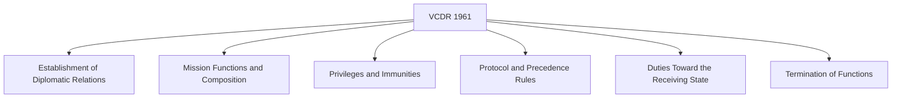
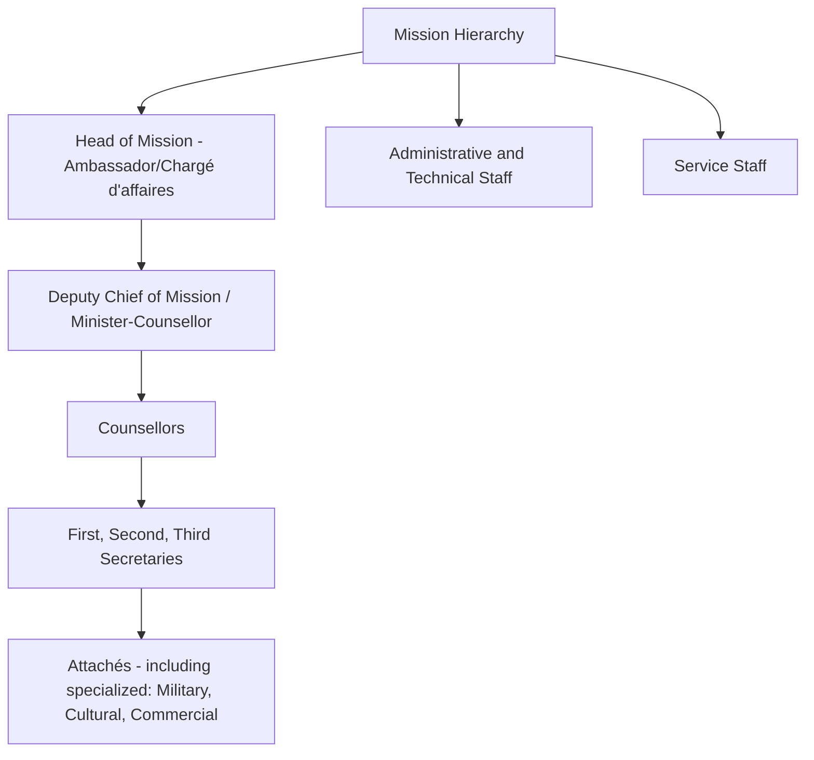
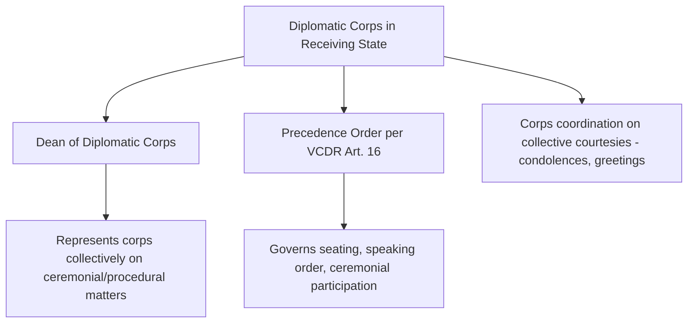

## The Vienna Convention on Diplomatic Relations

### Overview

The Vienna Convention on Diplomatic Relations (VCDR), adopted on 18 April 1961 and entering into force on 24 April 1964, is the foundational multilateral treaty codifying the rules of diplomatic intercourse between states. It consolidated centuries of customary diplomatic practice into a single, near-universally ratified instrument and remains the principal legal framework underpinning diplomatic protocol, privilege, and immunity worldwide. While covered substantively under international law, the VCDR is treated here specifically through the lens of protocol and etiquette practice, since much of embassy operational life, ceremonial precedence, and diplomat conduct is directly shaped by its provisions.

### Structure and Core Provisions

**Key Points**

- Comprises 53 articles addressing the full lifecycle of diplomatic representation, from establishment of relations through termination, and is widely regarded as having achieved near-universal ratification, making its rules broadly applicable as both treaty law and, for many provisions, reflective customary international law.
- Preceded by, and substantially building on, the 1815 Congress of Vienna and 1818 Congress of Aix-la-Chapelle regulations on diplomatic rank, which the VCDR's precedence provisions directly incorporate.

### Establishment of Diplomatic Relations and Mission

**Key Points**

- Diplomatic relations and the establishment of permanent missions occur by **mutual consent** (Article 2) — no state is obligated to accept or maintain a mission from another state.
- The receiving state's **agrément** (approval) is required before a sending state formally appoints a head of mission (Article 4); a receiving state may decline agrément without providing reasons, a discretion generally respected in practice.
- Mission size may be regulated by the receiving state where no specific agreement exists, requiring it be kept within limits considered "reasonable and normal" given circumstances and conditions in the receiving state (Article 11) — a provision diplomats invoke when negotiating mission staffing levels.

### Classes and Precedence of Heads of Mission

Article 14 establishes a formal, protocol-defining classification of heads of mission — directly governing ceremonial precedence, seating order, and diplomatic corps protocol in receiving states.

| Class | Title | Presents Credentials To |
| --- | --- | --- |
| First class | Ambassadors or Nuncios (papal) accredited to Heads of State, and other heads of mission of equivalent rank | Head of State |
| Second class | Envoys, Ministers, and Internuncios accredited to Heads of State | Head of State |
| Third class | Chargés d'affaires | Minister of Foreign Affairs |

**Key Points**

- Article 16 establishes that precedence **within each class** is determined by the date and time of taking up functions (typically presentation of credentials or notification of arrival, per receiving-state practice) — meaning the longest-serving ambassador in a capital typically holds seniority within the diplomatic corps, often informally recognized as **"Dean of the Diplomatic Corps"** (with some Catholic-majority states following the tradition of the Apostolic Nuncio automatically holding this role by custom rather than strict seniority).
- Article 15 confirms that the class to which heads of mission are assigned shall be agreed between states, but explicitly states that no distinction shall be made between states based on the class of their head of mission — a formal equality principle preventing precedence class from implying differential state status.
- This precedence structure directly governs practical protocol matters: seating at state functions, order of speaking at multilateral gatherings hosted by the receiving state, and order of credential presentation ceremonies.

### Diplomatic Rank Structure Within a Mission

**Key Points**

- While the VCDR itself does not exhaustively define every internal mission rank, Article 1 defines core categories — "diplomatic staff," "administrative and technical staff," and "service staff" — that carry differentiated privilege and immunity levels (see Diplomatic and Consular Law), and these categories directly map onto internal mission protocol hierarchy and precedence at diplomatic functions.
- **Chargé d'affaires** exists in two distinct senses: a *chargé d'affaires ad interim* (temporarily leading a mission in the substantive ambassador's absence) and a *chargé d'affaires en pied* (a permanent, third-class head of mission per Article 14) — a distinction with protocol significance for how the individual is seated, addressed, and ranked.

### Presentation of Credentials Ceremony

**Key Points**

- The formal ceremony by which a new ambassador presents **letters of credence** (*lettres de créance*) to the receiving state's Head of State (or, per Article 14, the Minister of Foreign Affairs for a chargé d'affaires) is the formal act marking the commencement of the ambassador's functions and their precedence-determining date under Article 16.
- Specific ceremonial format (procession, honors, exchange of remarks) varies considerably by receiving-state national protocol tradition, though the underlying legal function — formal notification of the ambassador's accreditation — is consistent across states as a matter of established diplomatic custom. [Inference: general and well-established pattern; specific national ceremonial variations are numerous and not exhaustively catalogued in the Convention itself]

### Mission Premises and Protocol-Relevant Inviolability

**Key Points**

- **Inviolability of premises** (Article 22) has direct protocol implications: the flag and emblem of the sending state may be displayed on mission premises, the residence of the head of mission, and the head of mission's means of transport (Article 20) — a visible protocol marker of the mission's protected status.
- Precedence and protocol also extend to diplomatic vehicles, which conventionally carry distinctive diplomatic plates and, per widespread state practice (though not itself a VCDR requirement), often receive certain traffic and parking accommodations as a matter of receiving-state courtesy and reciprocal practice. [Inference: common diplomatic practice, but implementation and scope vary significantly by receiving state and is not uniformly mandated by the Convention]

### Duties of Diplomatic Missions and Personnel Toward the Receiving State

**Key Points**

- Article 41 imposes reciprocal obligations: all persons enjoying privileges and immunities have a **duty to respect the laws and regulations** of the receiving state, and a duty not to interfere in its internal affairs — immunity is a procedural bar to enforcement, not a substantive license for unlawful conduct.
- Mission premises must not be used in any manner incompatible with the mission's functions as set out in the Convention or other applicable international law rules (Article 41(3)) — a provision protocol officers reference when addressing disputes over mission activity scope.
- Official communication with receiving-state authorities is generally conducted through, or with the knowledge of, the receiving state's Ministry of Foreign Affairs, "or such other ministry as may be agreed" (Article 41(2)) — a norm structuring the standard channel for diplomatic communication and protocol coordination.

### Termination of Diplomatic Functions and Protocol Implications

**Key Points**

- Functions of a diplomatic agent terminate through notification by the sending state that functions have ended, notification by the receiving state (refusing to continue recognition per Article 9's persona non grata mechanism), or through severance of diplomatic relations (Article 43).
- Even upon severance of relations or in armed conflict, the receiving state must respect and protect mission premises, property, and archives, and facilitate departure of mission members and their families "at the earliest possible moment" (Article 45) — reflecting the Convention's design to insulate diplomatic protection from the vicissitudes of the underlying political relationship.
- Departure protocol (farewell calls, formal notification to the Ministry of Foreign Affairs and diplomatic corps, precedence adjustments for remaining heads of mission) is governed by receiving-state customary practice built around the Convention's termination framework rather than the Convention's own text.

### The Diplomatic Corps as a Protocol Institution

**Key Points**

- The **Dean of the Diplomatic Corps** (*doyen*) traditionally serves as spokesperson for the diplomatic corps collectively on ceremonial and procedural matters with the receiving state's protocol office, a role derived from, but not itself explicitly created by, the VCDR's precedence framework.
- Diplomatic corps precedence directly shapes practical protocol logistics at state functions: seating charts, order of receiving-line greetings, and processional order at national ceremonies are all conventionally derived from Article 16 seniority.

### Diplomatic Relevance and Protocol Practice

**Key Points**

- National protocol offices (typically housed within a Ministry of Foreign Affairs) operationalize VCDR provisions into detailed domestic protocol manuals covering precedence tables, credential ceremony choreography, flag and emblem display rules, and diplomatic corps event coordination.
- Protocol officers rely on Article 16 seniority data as the technical basis for resolving precedence disputes at multilateral or state functions, making accurate tracking of credential-presentation dates a genuine operational protocol function, not merely ceremonial trivia.
- Disputes over agrément refusal, persona non grata declarations, or mission-size limitations, while substantively governed by the Convention's legal provisions, are frequently managed and communicated through carefully calibrated protocol channels designed to minimize public diplomatic friction.

### Conclusion

The Vienna Convention on Diplomatic Relations functions simultaneously as a foundational legal instrument and as the structural basis for the ceremonial and hierarchical protocol systems that govern day-to-day diplomatic interaction in virtually every capital worldwide. Its precedence rules, credential-presentation framework, and premises/emblem provisions translate directly into the observable protocol practices — seating order, credential ceremonies, flag display, diplomatic corps coordination — that define formal diplomatic life, making fluency in the Convention essential not only for legal compliance but for competent protocol practice itself.

**Related Topics**

- Diplomatic and Consular Law
- Sources of International Law
- The Law of Treaties
- Precedence and Protocol at State Functions
- The Presentation of Credentials Ceremony
- The Dean of the Diplomatic Corps
- Persona Non Grata and Diplomatic Expulsion Practice
- Flag and Emblem Protocol for Diplomatic Missions