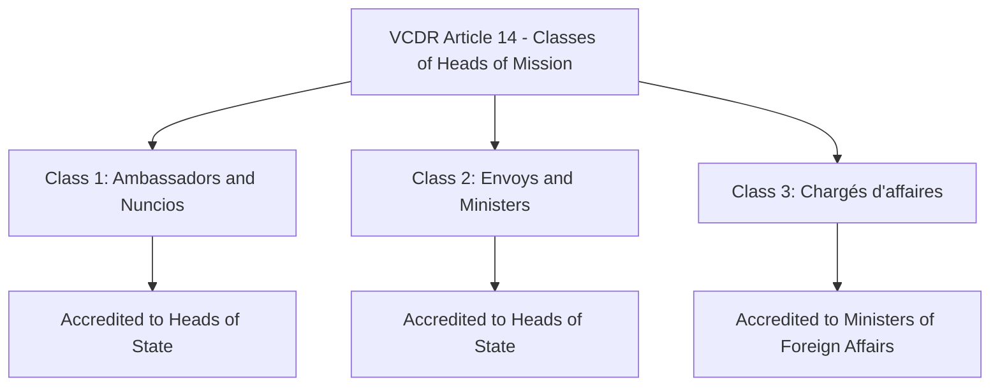
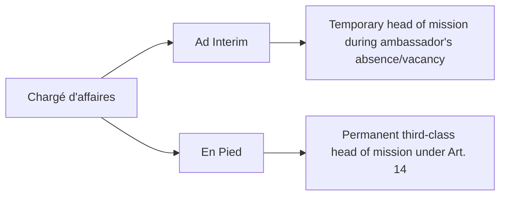
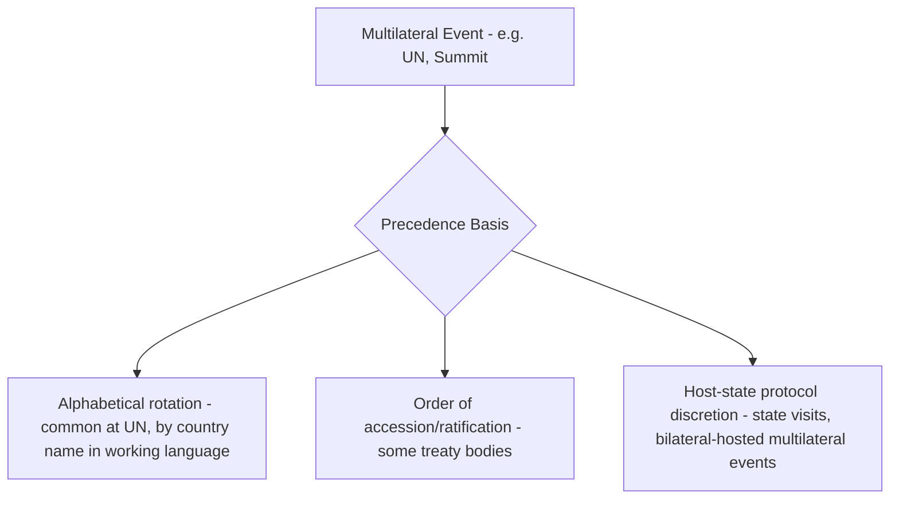

## Order of Precedence and Diplomatic Ranks

### Overview

Order of precedence is the formal system determining the relative seniority, seating, and sequencing of officials, diplomats, and dignitaries at ceremonial and official occasions. In diplomacy, precedence is not merely ceremonial etiquette but a legally structured system — rooted primarily in the Vienna Convention on Diplomatic Relations (VCDR) for diplomatic ranks, and in each state's own domestic protocol order for broader official precedence — that carries real diplomatic significance, since perceived precedence slights have historically triggered genuine diplomatic friction.

### Historical Foundations

**Key Points**

- Modern diplomatic precedence rules trace to the **1815 Congress of Vienna** (Regulation concerning the Relative Rank of Diplomatic Agents) and its 1818 supplement at the **Congress of Aix-la-Chapelle**, adopted specifically to resolve chronic disputes among European courts over ambassadorial rank and seating precedence.
- These 19th-century regulations established the principle that precedence within a diplomatic rank class should be determined by objective, non-discretionary criteria (date of arrival/notification) rather than by the relative power or prestige of the sending state — a principle carried forward into the VCDR.

### The VCDR Three-Class System

Article 14 of the VCDR establishes the formal classification of heads of mission that remains the universal legal basis for diplomatic precedence today.

| Class | Title(s) | Modern Prevalence |
| --- | --- | --- |
| First | Ambassador (or Papal Nuncio) | Overwhelmingly the standard modern practice for permanent missions |
| Second | Envoy Extraordinary and Minister Plenipotentiary; Internuncio | Largely historical; rarely used in contemporary practice |
| Third | Chargé d'affaires (en pied) | Used for lower-level permanent representation or when full ambassadorial relations are not established |

**Key Points**

- The overwhelming majority of contemporary bilateral diplomatic relations are conducted at the first-class (ambassadorial) level; the second class has become largely vestigial in modern practice. [Inference: general, well-documented trend in modern diplomatic practice]
- Article 15 requires agreement between states on the class assigned, but explicitly prohibits distinctions between states on the basis of that class — precedence class reflects the individual head of mission's formal rank, not the relative status of the sending state.

### Determining Seniority Within a Class

**Key Points**

- Per Article 16(1), precedence among heads of mission of the **same class** is determined by the date and time they took up their functions — typically the date of formal notification of arrival to the receiving state's Ministry of Foreign Affairs, or the date of credential presentation, depending on receiving-state practice.
- This creates a continuously evolving seniority ranking within any capital's diplomatic corps: the longest-serving ambassador of the first class typically holds the most senior position, regardless of their country's size, wealth, or global influence — a deliberate leveling mechanism inherited from the 1815/1818 regulations.
- Article 16(3) confirms that the established practice in the receiving state regarding precedence — where not otherwise specified by the Convention — governs, allowing for some national protocol variation within the Convention's overall framework.

### Chargé d'Affaires: Two Distinct Roles with Precedence Implications

**Key Points**

- A **chargé d'affaires ad interim** is a temporary designation (typically the deputy chief of mission) stepping in during an ambassador's absence, reassignment, or before a successor's arrival — this individual does not hold independent Article 14 precedence class status but generally handles routine mission business with appropriate deference to protocol norms during the interim period.
- A **chargé d'affaires en pied** is a substantively different, permanent third-class head of mission appointment under Article 14, used when a sending state chooses not to establish (or a receiving state does not wish to receive) representation at ambassadorial level — this is comparatively rare in contemporary bilateral practice.

### The Dean of the Diplomatic Corps

**Key Points**

- The **Dean** (*doyen*) is conventionally the most senior first-class head of mission by date of accreditation in a given capital, serving as an informal but functionally significant representative and spokesperson for the diplomatic corps on collective ceremonial and procedural matters with the receiving state's protocol authorities.
- In many predominantly Catholic states, established custom (rather than Article 16 seniority) automatically confers the Dean role on the **Apostolic Nuncio** (the Holy See's representative) regardless of tenure length — a notable, widely observed exception to strict seniority-based precedence. [Inference: well-documented custom in numerous states, though specific application varies by country and should be verified for any particular receiving state]

### Domestic (National) Order of Precedence

Beyond diplomatic corps precedence, each state maintains its own **domestic order of precedence** governing the relative ranking of the state's own officials (head of state, head of government, legislative leaders, judiciary, military leadership, and others) at official functions — into which visiting diplomats and accredited ambassadors are typically integrated at a designated position.

**Key Points**

- Domestic precedence orders are established by each state's own constitutional, statutory, or protocol-office rules and vary considerably by country — there is no international treaty standardizing domestic precedence beyond the diplomatic corps' own internal ordering under the VCDR. [Inference: general structural point; specific national precedence tables differ substantially and require country-specific verification]
- Ambassadors are typically positioned within domestic precedence tables at a rank reflecting their VCDR-derived status, often placed relatively high in ceremonial order (frequently near senior cabinet-level officials), though exact placement is a matter of each receiving state's own protocol determination.

### Precedence in Multilateral Settings

**Key Points**

- Many multilateral institutions (notably the UN General Assembly) use **alphabetical seating rotation** (in the working language, with the starting letter drawn randomly each session) specifically to avoid the precedence disputes that a fixed hierarchical order would invite among sovereign equals.
- This reflects a structural design choice distinct from bilateral diplomatic corps precedence: multilateral forums built on the principle of sovereign equality between member states generally avoid seniority-based precedence among states themselves, reserving VCDR-style precedence logic for individual diplomatic agents' relative rank rather than for states as such.

### Practical Protocol Applications of Precedence

**Key Points**

- **Seating arrangements**: At state dinners, official ceremonies, and diplomatic receptions, precedence order directly determines seating proximity to the host and overall table arrangement — a frequent source of meticulous advance protocol-office planning.
- **Receiving lines and greeting order**: Formal receiving lines at state functions typically follow precedence order, with more senior figures greeted or introduced earlier or given more prominent positioning.
- **Speaking order**: At diplomatic corps functions or multilateral gatherings hosted bilaterally, speaking order (e.g., toasts, remarks) often follows precedence, with the Dean of the Diplomatic Corps customarily speaking on behalf of the corps at certain ceremonial occasions.
- **Processional order**: State ceremonies, credential-presentation days, and national day observances frequently involve formal processions where order directly reflects precedence rank.

### Precedence Disputes and Their Diplomatic Management

**Key Points**

- Precedence disputes, while seemingly minor, have historical significance as sources of genuine diplomatic friction — the 1815/1818 regulations themselves were adopted specifically because unresolved precedence disputes among European courts had caused recurring diplomatic incidents.
- Modern protocol offices generally manage precedence questions through established, rule-based systems (VCDR Article 16 seniority, documented domestic precedence tables) specifically to minimize discretionary decision-making that could otherwise be read as a deliberate diplomatic signal or slight.
- Where genuine ambiguity exists (e.g., simultaneous credential presentations, disputed accreditation dates), receiving-state protocol offices typically resolve disputes through direct, low-visibility diplomatic channels rather than public determination, reflecting the sensitivity of precedence questions to broader bilateral relations.

### Diplomatic Relevance

**Key Points**

- Protocol officers maintain detailed, continuously updated precedence records (accreditation dates, class assignments) as core operational infrastructure for planning any official function involving the diplomatic corps.
- Diplomats and mission staff benefit from understanding precedence rules both to correctly interpret their own positioning at official events (avoiding misreading routine protocol placement as an intentional slight) and to appropriately extend recognition to more senior counterparts per established convention.
- Precedence awareness is particularly relevant when planning multilateral or corps-wide diplomatic events hosted by a mission itself, where getting seating and speaking order wrong can generate avoidable friction independent of the event's substantive purpose.

### Conclusion

Order of precedence and diplomatic rank, formalized through the VCDR's three-class system and seniority-by-accreditation-date rule, provide an objective, largely self-executing framework designed to prevent the recurring precedence disputes that plagued pre-1815 diplomatic practice. Effective protocol practice requires fluency in both this VCDR-derived diplomatic corps precedence and each receiving state's own domestic precedence conventions, since the two systems operate in parallel and together govern the vast majority of formal diplomatic ceremonial practice.

**Related Topics**

- The Vienna Convention on Diplomatic Relations
- Diplomatic and Consular Law
- The Presentation of Credentials Ceremony
- The Dean of the Diplomatic Corps
- State Visit and Ceremonial Protocol Design
- Seating Arrangements and Diplomatic Etiquette
- Multilateral Institution Seating and Rotation Practices
- Historical Origins: The Congress of Vienna Precedence Regulations