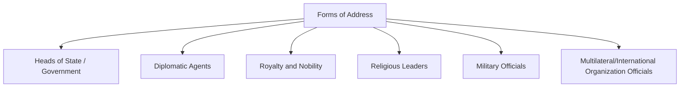
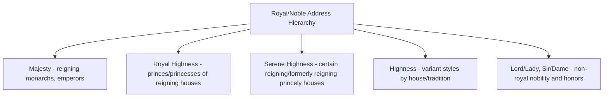
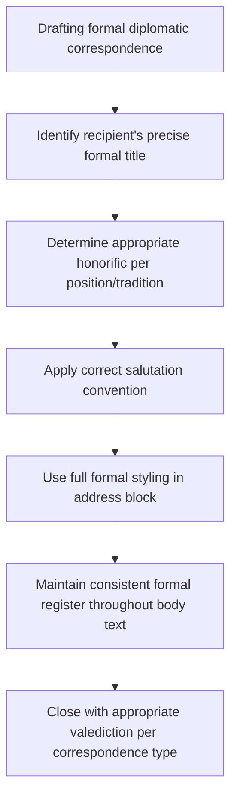

## Forms of Address and Titles

### Overview

Forms of address are the codified conventions governing how officials, dignitaries, and diplomatic personnel are formally addressed in speech, correspondence, and ceremonial contexts. Correct usage is a core protocol competency: errors in title or address are among the most immediately visible protocol mistakes, and while rarely diplomatically catastrophic in isolation, they signal a lack of preparation and can be perceived as disrespect, particularly in cultures where title and status carry significant relational weight (see High-Context Versus Low-Context Communication Cultures).

### Categories of Forms of Address

### Heads of State and Government

| Position | Spoken Address | Written/Formal Address |
| --- | --- | --- |
| Monarch (King/Queen/Emperor) | "Your Majesty" | "His/Her Majesty [Name]" |
| President (republic) | "Mr./Madam President" or "Your Excellency" | "His/Her Excellency [Name], President of [State]" |
| Prime Minister | "Prime Minister" or "Mr./Madam Prime Minister" | "The Honourable [Name], Prime Minister of [State]" (varies by country) |
| Reigning Prince/Grand Duke | "Your Serene/Royal Highness" (varies by title) | "His/Her [Serene/Royal] Highness" |

**Key Points**

- **"Excellency"** is among the most widely used honorifics in diplomatic address, conventionally applied to heads of state, heads of government (in many though not all traditions), government ministers, and ambassadors — but its precise scope of application varies meaningfully by country and institutional convention, making country-specific protocol verification essential rather than universal assumption. [Inference: general convention, but specific national practice on which officials receive "Excellency" varies and should be confirmed against the relevant country's protocol guidance]
- Republics vary considerably in domestic address convention for heads of state and government — some favor formal styles ("Excellency," "The Honourable"), others favor plainer address ("Mr./Madam President") even in fairly formal settings, reflecting underlying national political culture (e.g., more egalitarian versus more hierarchical political traditions).

### Diplomatic Agents

| Rank | Spoken Address | Written Address |
| --- | --- | --- |
| Ambassador | "Your Excellency" (in many traditions) or "Mr./Madam Ambassador" | "His/Her Excellency [Name], Ambassador of [State]" |
| Chargé d'affaires | "Mr./Madam Chargé d'affaires" (Excellency generally not applied) | "[Name], Chargé d'affaires of [State]" |
| Counsellor/Secretary-level staff | "Mr./Madam [Surname]" | Full name and title per mission listing |

**Key Points**

- Per widespread (though not universally uniform) diplomatic protocol convention, "Excellency" is generally reserved for ambassadors (as heads of mission holding first-class VCDR status) and not extended to chargés d'affaires or lower-ranking mission staff — reflecting the VCDR's own precedence class distinctions (see Order of Precedence and Diplomatic Ranks). [Inference: widely observed convention with some national variation; specific receiving-state or sending-state practice should be verified where precision matters]
- Once formally introduced, subsequent address in a conversation often shifts to a less formal but still respectful form ("Ambassador [Surname]"), particularly in ongoing working relationships, though initial formal address typically follows the fuller convention.

### Royalty and Nobility

**Key Points**

- Royal address conventions are highly **house- and country-specific**: styles such as "Majesty," "Royal Highness," and "Serene Highness" are not interchangeable and reflect specific, sometimes historically contested, gradations of rank within and between royal houses — protocol offices maintain detailed reference guides for correct application per specific royal family. [Inference: general structural point; exact styling for any specific royal or noble figure requires case-specific verification against current, authoritative protocol sources]
- Non-royal honors and titles (e.g., knighthoods, "Lord/Lady" styles from peerages) carry their own distinct address conventions, generally separate from and not to be conflated with royal address forms.

### Religious Leaders

| Position | Common Address |
| --- | --- |
| Pope | "Your Holiness" |
| Cardinal | "Your Eminence" |
| Archbishop/Bishop | "Your Grace" or "Your Excellency" (varies by denomination/tradition) |
| Chief Rabbi | "Rabbi" or honorific per specific tradition |
| Grand Mufti / senior Islamic scholars | Title varies significantly by country and school of jurisprudence |
| Dalai Lama | "Your Holiness" |

**Key Points**

- Religious address conventions vary substantially across faith traditions and even within a single tradition across different national or denominational contexts, making this one of the higher-risk categories for protocol error absent specific research on the individual figure's own tradition. [Inference: general caution reflecting the genuine diversity of religious title conventions; specific current usage should be verified per tradition and figure]
- The **Apostolic Nuncio**, as the Holy See's diplomatic representative, is addressed using standard ambassadorial diplomatic conventions ("Your Excellency," or specific ecclesiastical address depending on context) while also holding the customary Dean of the Diplomatic Corps role in many Catholic-majority states (see Order of Precedence and Diplomatic Ranks).

### Military Officials

**Key Points**

- Military rank address follows each country's own service-specific conventions (e.g., "General," "Admiral," "Colonel"), generally used with surname in formal introduction and often with the full rank title in written correspondence.
- In diplomatic and multilateral contexts involving defense attachés or military delegations, correct rank address requires attention to potential rank-title differences across countries' armed forces structures (e.g., naval versus army rank equivalencies), which are not standardized internationally.

### Multilateral and International Organization Officials

| Position | Common Address |
| --- | --- |
| UN Secretary-General | "Mr./Madam Secretary-General" or "Excellency" in formal written correspondence |
| Heads of specialized agencies (e.g., WHO Director-General) | Position-specific title, e.g., "Director-General" |
| EU Commission President | "President [Surname]" or "Mr./Madam President" |
| Permanent Representatives to the UN | "Ambassador" (holding ambassadorial rank per their accreditation) |

**Key Points**

- International organization officials are generally addressed by their institutional title (Secretary-General, Director-General, President, Commissioner) rather than by a separate honorific system, though many such officials also concurrently hold or have held ambassadorial rank, which can create dual-convention address situations requiring context-sensitive judgment.

### Written Correspondence Conventions

**Key Points**

- Formal diplomatic correspondence (notes verbales, letters of credence, formal state correspondence) follows highly conventionalized structural and address formats specific to each type of instrument, with note verbale format traditionally using third-person, impersonal formal language rather than direct first/second-person address.
- Valediction conventions (closing formulas) in diplomatic correspondence are similarly conventionalized and vary by correspondence type and receiving-state tradition, often more elaborate than standard business correspondence closings.

### Gender-Neutral and Evolving Address Conventions

**Key Points**

- Many protocol systems have adapted traditional gendered address forms ("Mr./Madam," "His/Her Excellency") to accommodate officials' stated preferences, though the pace and consistency of this adaptation varies by country and institution. [Inference: general and ongoing trend in protocol practice; specific current institutional policy should be verified where precision is required]
- Best protocol practice involves confirming an individual's preferred address directly (through their office or protocol liaison) in cases of genuine ambiguity, rather than defaulting to assumption.

### Common Protocol Errors and Mitigation

**Key Points**

- **Downgrading address**: Using a less formal address than warranted (e.g., omitting "Excellency" for an ambassador in a formal written context) can read as a status slight, particularly in more hierarchically attentive diplomatic cultures.
- **Overgrading address**: Applying an honorific to an official not entitled to it under that country's or institution's convention (e.g., "Excellency" for a chargé d'affaires) can appear either as a factual protocol error or, in some readings, as presumptuous.
- **Cross-tradition conflation**: Applying one faith tradition's or royal house's address convention to a different tradition/house due to superficial similarity, a frequent error given the genuine diversity within these categories.
- **Static reliance on memory**: Forms of address are subject to periodic institutional and cultural change; protocol offices generally maintain updated reference materials rather than relying on generalized memorized convention, particularly for royal, religious, and country-specific titles.

### Diplomatic Relevance

**Key Points**

- Protocol offices and diplomatic staff typically maintain, and continuously update, detailed address reference guides for frequently engaged counterparts, given both the genuine complexity of the field and the reputational risk of visible errors.
- Correct forms of address function as a low-cost, high-visibility signal of preparation and respect — get right, it is unremarkable; get wrong, it draws attention disproportionate to its substantive importance, making diligence in this area a consistently good investment of diplomatic preparation time.
- In cross-cultural engagement, forms of address intersect directly with broader cultural competence considerations (see Hofstede and Other Cultural Dimension Models, particularly Power Distance) — cultures with stronger status-hierarchy orientation often attach correspondingly greater weight to address precision.

### Conclusion

Forms of address and titles constitute a detailed, tradition-specific protocol domain spanning heads of state, diplomatic agents, royalty, religious leaders, military officials, and international organization officials, each governed by its own conventions that resist easy generalization across categories. Diplomatic competence in this area requires not memorization of a single universal system but disciplined verification practice — confirming precise, current, tradition-appropriate address for each specific individual and context rather than relying on assumed or generalized convention.

**Related Topics**

- The Vienna Convention on Diplomatic Relations
- Order of Precedence and Diplomatic Ranks
- The Presentation of Credentials Ceremony
- Diplomatic Correspondence: Notes Verbales and Formal Instruments
- Cross-Cultural Competence and Power Distance
- Royal Protocol and Address Conventions by House
- Gender-Inclusive Protocol Practice
- The Dean of the Diplomatic Corps