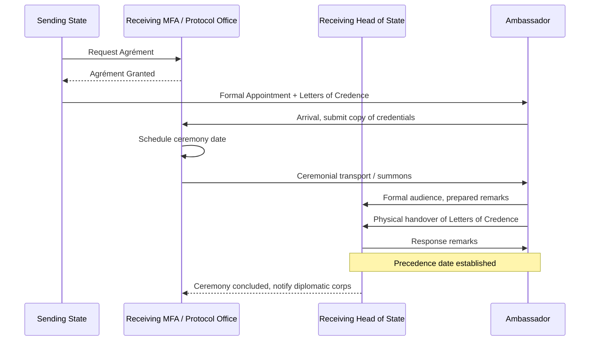

## Credentials Presentation Ceremonies

### Overview and Diplomatic Function

A credentials presentation ceremony (also termed accreditation ceremony) is the formal diplomatic procedure by which a newly appointed ambassador or head of mission officially begins their diplomatic function in the receiving state. The ceremony centers on the physical delivery of **Letters of Credence** (lettres de créance) from the sending head of state to the receiving head of state, formally certifying the ambassador's authority to represent their government.

The ceremony is governed principally by the **Vienna Convention on Diplomatic Relations (1961)**, which establishes the legal framework for accreditation, though the specific ceremonial choreography is left to the receiving state's protocol authority and varies significantly by country, monarchy versus republic status, and bilateral tradition.

**Key Points**

- The ambassador has no formal diplomatic standing to conduct official business until credentials are presented
- The date of presentation establishes the ambassador's precedence ranking (seniority) among the diplomatic corps in that capital
- The ceremony is symbolic and legal simultaneously: it confirms both the personal legitimacy of the envoy and the continuity of interstate relations

### Legal and Procedural Basis

Article 13 of the Vienna Convention on Diplomatic Relations specifies that the head of mission is considered to have taken up their functions in the receiving state either upon presentation of credentials or upon notification of arrival and submission of a true copy of credentials to the receiving state's Ministry of Foreign Affairs, according to that state's prevailing practice, applied uniformly.

This creates two operative models:

1. **Presentation-triggers-function model**: Diplomatic functions formally begin only at the moment of the credentials ceremony itself (common in states with elaborate monarchical or presidential ceremonial traditions, e.g., the United Kingdom, Japan, Thailand)
2. **Notification-triggers-function model**: Functions begin upon submission of a copy of credentials to the foreign ministry, with the formal ceremony occurring later as a ratifying formality (more common in states seeking administrative efficiency, e.g., some EU member states for intra-EU postings)

**[Unverified]** The exact classification of which model a given state uses is a matter of that state's declared practice and can change with administrative reform; verifying current practice via the receiving state's protocol office or foreign ministry is advisable before assuming a model.

### Pre-Ceremony Sequence

**Step 1: Agrément Request**

Before an ambassador is even formally appointed, the sending state confidentially requests the receiving state's agrément (approval) for the proposed candidate. This occurs before any public announcement.

**Step 2: Formal Appointment and Notification**

Once agrément is granted, the sending state formally appoints the ambassador and prepares the Letters of Credence, signed by the head of state (or, in some systems, the head of government/foreign minister depending on constitutional arrangement).

**Step 3: Arrival and Provisional Recognition**

Upon physical arrival in the receiving state, the ambassador typically submits a certified true copy of the credentials to the Ministry of Foreign Affairs (Chief of Protocol's office). This allows limited liaison activity to begin, though full ceremonial standing is pending.

**Step 4: Scheduling**

The Chief of Protocol coordinates a ceremony date with the head of state's household or office. Multiple ambassadors are frequently grouped into a single ceremonial day or week, especially in monarchies with dedicated "credentials days."

### Ceremonial Choreography (Comparative Models)

**Model A — Monarchical Ceremony (e.g., United Kingdom, Japan, Sweden, Netherlands)**

- Ambassador is transported via state conveyance (historically horse-drawn carriage; increasingly a state car) from the ambassador's residence or a designated departure point to the palace
- Formal escort, often mounted or ceremonial guard, accompanies the procession
- Ambassador is received in a formal audience with the monarch, sometimes with family/senior mission staff present
- Ambassador delivers a short prepared address; the head of state responds
- Physical handover of the Letters of Credence, sometimes accompanied by "Letters of Recall" for the outgoing predecessor
- Formal photograph, exchange of pleasantries, informal conversation follows in some traditions

**Model B — Republican/Presidential Ceremony (e.g., United States, France, Germany, most republics)**

- Ceremony held at the presidential palace/residence (White House, Élysée Palace, etc.)
- Typically more streamlined: arrival, brief remarks, formal handover, group photograph
- Multiple ambassadors may present credentials in a single group ceremony, each with an individual moment of handover
- **[Inference]** Republican ceremonies tend toward shorter overall duration and reduced pageantry relative to monarchical ceremonies, reflecting differing constitutional traditions around the symbolic weight of the head-of-state office, though this varies by country and should not be treated as a strict rule

**Model C — Ceremonial Head of State Distinct from Head of Government**

In parliamentary systems where the monarch or president is a ceremonial figure (e.g., India, Germany), credentials are presented to that ceremonial head of state even though substantive bilateral relations are conducted through the head of government and foreign ministry.

### Precedence and the Diplomatic Corps

The date (and in some capitals, exact time) of credentials presentation determines an ambassador's **order of precedence** within the local diplomatic corps, distinct from the precedence of their home state. This precedence governs:

- Seating order at state functions and diplomatic receptions
- Speaking order when the diplomatic corps addresses the host government collectively (e.g., New Year greetings delivered by the Doyen)
- Eligibility to serve as **Dean (Doyen) of the Diplomatic Corps** — traditionally the longest-serving ambassador by presentation date, except in states (chiefly Catholic-majority or historically Catholic states) where the Apostolic Nuncio holds automatic deanship by convention rather than by seniority

**Example**

If Ambassador A presents credentials on 3 March and Ambassador B presents on 15 March in the same capital, Ambassador A outranks Ambassador B in diplomatic corps precedence regardless of their countries' relative size, power, or the personal seniority of the diplomats themselves.

### Content and Structure of Letters of Credence

Letters of Credence conventionally follow a fixed diplomatic formula:

1. **Salutation**: Head of state to head of state, using appropriate honorifics
2. **Notification clause**: States that the bearer has been appointed as Ambassador Extraordinary and Plenipotentiary
3. **Request for credence**: Asks the receiving head of state to give full credence to what the ambassador communicates on behalf of the sending government
4. **Closing protestation of friendship**: Formal expression of the sending state's desire for continued friendly relations
5. **Signature block**: Signed by the head of state, often countersigned by the foreign minister

A parallel **Letter of Recall** for the outgoing ambassador is frequently presented alongside the new ambassador's credentials, formally closing out the predecessor's mission.

### Protocol Sensitivities and Variations

**Rank Designations**

Not all heads of mission hold ambassadorial rank. The Vienna Convention (Article 14) recognizes three classes:

- Ambassadors/Nuncios accredited to heads of state
- Envoys/Ministers accredited to heads of state
- Chargés d'affaires accredited to ministers of foreign affairs

Chargés d'affaires present a simpler **Letter of Introduction** to the foreign minister rather than Letters of Credence to the head of state, reflecting their accreditation to the ministry rather than the head of state directly.

**Multilateral/International Organization Accreditation**

Ambassadors to international organizations (UN, EU, AU, OAS) follow analogous but distinct procedures: credentials are presented to the Secretary-General or organization head rather than a head of state, and precedence rules are set by the organization's own protocol rules rather than national diplomatic corps convention.

**Dual or Multiple Accreditation**

An ambassador may be accredited non-resident to multiple states simultaneously (common for smaller states with limited missions). Each receiving state requires a separate credentials ceremony, even if the ambassador's residence is in a third country.

**Reciprocity and Political Sensitivity**

- Refusal to schedule a credentials ceremony, or indefinite delay, functions as an informal diplomatic signal short of outright rejection of an ambassador (which would occur at the agrément stage)
- **[Inference]** Prolonged delay in scheduling a ceremony after arrival is sometimes read by diplomatic observers as a signal of strained bilateral relations, though delays also commonly result from routine scheduling logistics, so such inferences should be treated cautiously and weighed against other bilateral indicators

### Illustrative Diagram: Precedence Timeline (svg_diagram)

<svg xmlns="http://www.w3.org/2000/svg" viewBox="0 0 700 220">
<rect x="0" y="0" width="700" height="220" fill="#ffffff" />
<text x="350" y="25" font-family="sans-serif" font-size="16" font-weight="bold" text-anchor="middle" fill="#1a1a1a">Diplomatic Corps Precedence Timeline (svg_diagram)</text>
<line x1="50" y1="120" x2="650" y2="120" stroke="#333333" stroke-width="2" />
<circle cx="120" cy="120" r="8" fill="#2563eb" />
<text x="120" y="150" font-family="sans-serif" font-size="12" text-anchor="middle" fill="#1a1a1a">Ambassador A</text>
<text x="120" y="168" font-family="sans-serif" font-size="11" text-anchor="middle" fill="#555555">Presents 3 Mar</text>
<text x="120" y="100" font-family="sans-serif" font-size="11" font-weight="bold" text-anchor="middle" fill="#2563eb">Rank 1</text>
<circle cx="320" cy="120" r="8" fill="#16a34a" />
<text x="320" y="150" font-family="sans-serif" font-size="12" text-anchor="middle" fill="#1a1a1a">Ambassador B</text>
<text x="320" y="168" font-family="sans-serif" font-size="11" text-anchor="middle" fill="#555555">Presents 15 Mar</text>
<text x="320" y="100" font-family="sans-serif" font-size="11" font-weight="bold" text-anchor="middle" fill="#16a34a">Rank 2</text>
<circle cx="520" cy="120" r="8" fill="#dc2626" />
<text x="520" y="150" font-family="sans-serif" font-size="12" text-anchor="middle" fill="#1a1a1a">Ambassador C</text>
<text x="520" y="168" font-family="sans-serif" font-size="11" text-anchor="middle" fill="#555555">Presents 2 Apr</text>
<text x="520" y="100" font-family="sans-serif" font-size="11" font-weight="bold" text-anchor="middle" fill="#dc2626">Rank 3</text>

<text x="350" y="200" font-family="sans-serif" font-size="11" font-style="italic" text-anchor="middle" fill="`#555555`">Earlier presentation date = higher precedence, independent of country size or power</text>

</svg>

### Practical Preparation Checklist for Missions

**Next Steps**

- Confirm the receiving state's specific model (presentation-triggers vs. notification-triggers function) with the Chief of Protocol's office
- Prepare Letters of Credence and Letters of Recall in the format and language required by the receiving state (often bilingual or in the receiving state's official language plus the sending state's)
- Coordinate transport, dress code (morning dress, national dress, or business formal depending on host tradition), and any required gift or ceremonial exchange protocol
- Prepare a short prepared remarks text (typically 2-4 minutes) appropriate to the bilateral relationship's tone
- Verify precedence implications for immediate diplomatic corps activities (seating charts, upcoming state functions)
- Coordinate with the outgoing ambassador (if applicable) regarding the Letter of Recall handover

**Related Topics**

- Vienna Convention on Diplomatic Relations (1961) — full framework
- Agrément and Persona Non Grata procedures
- Diplomatic Corps Dean (Doyen) conventions
- Order of Precedence at multilateral organizations
- Letters of Recall and mission termination procedures
- National honors and gift protocol during diplomatic ceremonies