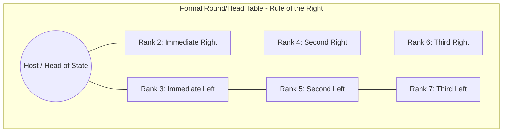
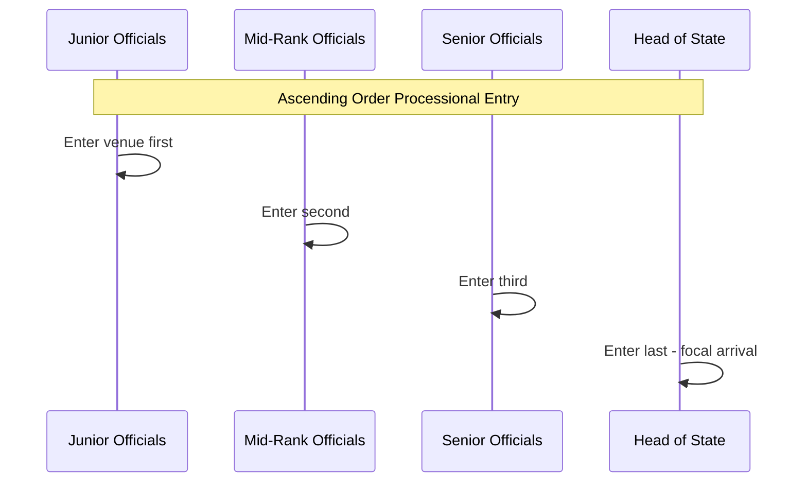

## Seating Arrangements and Processions

### Overview and Diplomatic Function

Seating arrangements and processions constitute the physical, spatial encoding of diplomatic precedence. Where a person sits, stands, or walks relative to others at an official function is not incidental staging — it is a formal, legible statement of rank, sovereignty recognition, and bilateral standing. Errors in this domain are among the most common sources of diplomatic friction because they are immediately visible to all attendees and, increasingly, to media and camera.

**Key Points**

- Precedence governs both seating and processional order, but the two follow different practical logics (fixed table geometry vs. sequential movement)
- Precedence systems combine international convention (Vienna Convention rank classes), national law (host state's official table of precedence), and ad hoc host discretion for unlisted categories
- The "rule of the wall" and "rule of the right" are the two dominant spatial conventions used to resolve seating order

### Legal and Conventional Basis

The **Vienna Convention on Diplomatic Relations (1961)**, Articles 13-16, establishes the baseline: precedence within each class of head of mission (ambassadors, envoys, chargés d'affaires) is determined by the date and time of assumption of function (see Credentials Presentation Ceremonies). However, the Vienna Convention governs precedence *among diplomats*, not the full precedence table of a state, which also includes domestic constitutional officers (heads of state, legislative leaders, judiciary, military, clergy, nobility where applicable).

Each state therefore maintains its own **Table of Precedence** (or "Order of Precedence"), a domestically codified or customary ranking of all official positions, into which the accredited diplomatic corps is slotted at an appropriate tier — typically ambassadors rank immediately below or alongside senior cabinet-equivalent officials, varying by state.

**[Unverified]** The exact insertion point of ambassadors within a domestic precedence table is state-specific and subject to periodic revision; current tables should be verified against the host Ministry of Foreign Affairs or Chief of Protocol's published order rather than assumed from general convention.

### Core Seating Conventions

**1. Rule of the Right (Droit du Fauteuil / Right-Hand Precedence)**

The most widespread convention: the position to the immediate right of the most senior person present is the second most senior position, with seniority decreasing as distance from the senior figure's right hand increases, alternating right-then-left outward.

$$\text{Seat}_n = \begin{cases} \text{Host} & n = 0 \\ \text{Right}(n) & n \text{ odd} \\ \text{Left}(n) & n \text{ even} \end{cases}$$

**2. Rule of the Wall (Alternation by Distance from Entry/Head Table)**

In long-table banquet settings, distance from the head of the table (or from the room's ceremonial focal point) determines rank, independent of left/right side.

**3. Alternation of Nationalities (Diplomatic Dinners)**

At mixed diplomatic functions, hosts commonly alternate genders and nationalities around the table to avoid clustering compatriots or creating the appearance of bloc-seating, while still respecting the underlying precedence order.

**4. En Face Seating (Bilateral Negotiation Format)**

For formal bilateral meetings (as opposed to social functions), delegations face each other across a table, with the head of each delegation seated centrally opposite their counterpart, and subordinate officials arrayed outward by rank on their own side.

### Precedence Resolution for Ambiguous or Novel Cases

When an event includes attendees whose relative rank is not explicitly codified (e.g., a visiting head of state alongside the host's own cabinet, or officials from an international organization alongside national diplomats), the Chief of Protocol applies a resolution hierarchy:

1. Explicit constitutional/statutory precedence (if applicable to domestic officials)
2. Vienna Convention class and presentation date (for accredited diplomats)
3. Reciprocity and courtesy toward the visiting delegation's stated preference
4. Host discretion, exercised to avoid the appearance of favoritism among peer-ranked attendees

**Example**

At a state banquet where a visiting president's foreign minister and the host's own deputy prime minister are both present, and no bilateral precedent exists, the Chief of Protocol typically confers with both delegations' protocol officers in advance to agree seating, rather than issuing a unilateral ruling on the day.

### Processional Order

Processions (formal walking sequences into a venue, onto a stage, or into a chamber) follow inverse or matching logic depending on convention:

**Ascending Order Entry (most common)**: Junior-most officials enter first, with the most senior figure entering last, so that the room's attention culminates on the highest-ranking arrival. Used in state ceremonies, formal openings, and investitures.

**Descending Order Entry**: The most senior figure enters first, followed by decreasing rank. More common in religious and some legislative processions (e.g., ecclesiastical processions where the senior clergy leads).

**Paired/Escorted Processions**: In state visits, the host head of state and visiting head of state process together, side by side or with the host slightly forward-left as a gesture of ceremonial welcome, followed by their respective spouses/partners, then senior delegation members in descending rank.

### Flag and Positional Sovereignty Markers

Seating and processional protocol intersect with **flag protocol**: the positioning of national flags at bilateral or multilateral events follows precedence rules parallel to seating (alphabetical order in the working language of the host, rotation systems in some multilateral bodies, or host-flag-central conventions), and flags are never permitted to imply subordination of one sovereign state to another through height, position, or condition.

**[Inference]** Because flag positioning errors carry similar diplomatic weight to seating errors, protocol offices frequently cross-check flag order against the seating chart during event preparation, though the specific verification workflow is an internal administrative practice not standardized across states.

### Common Sources of Protocol Error

- Failure to update seating charts when a delegation's composition changes at the last minute (a substitute attending in place of the originally listed principal)
- Treating precedence as static across event *types* — an individual's precedence at a state dinner may differ from their precedence at a working lunch or a multilateral summit with its own house rules
- Overlooking spousal/partner precedence conventions, which vary significantly by state (some states extend a derivative precedence to spouses; others do not recognize spousal precedence at all)
- Failure to reconcile host-state precedence rules with a visiting delegation's own internal hierarchy when the two do not map cleanly

### Practical Preparation Workflow

**Next Steps**

- Obtain and verify the current Table of Precedence from the host Chief of Protocol before drafting any seating chart
- Confirm attendee list and titles as close to the event date as feasible, given substitution risk
- Draft seating chart using the appropriate convention (rule of the right for head tables; en face for bilateral negotiations)
- Cross-check flag order and physical flag placement against the finalized seating/processional order
- Brief all delegation members on processional entry order and cueing (who enters on which signal)
- Maintain a contingency seating adjustment protocol for last-minute delegation changes

**Related Topics**

- Vienna Convention on Diplomatic Relations — precedence provisions
- Credentials Presentation Ceremonies and precedence dating
- Flag Protocol and National Symbol Etiquette
- State Visit Choreography and Honor Guard Procedures
- Table of Precedence — comparative national systems
- Multilateral Summit Protocol (UN, G7/G20, ASEAN rotation conventions)