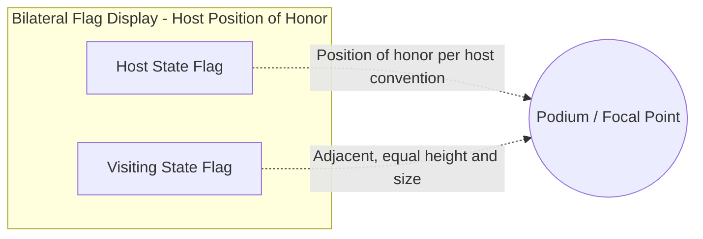
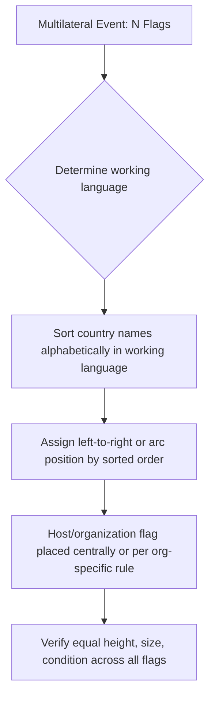

## Flag Protocol and National Symbols

### Overview and Diplomatic Function

Flag protocol governs the display, positioning, handling, and disposal of national flags and other state symbols (emblems, anthems, seals) in diplomatic contexts. Because a flag functions as a direct visual proxy for national sovereignty, errors in flag protocol are treated with a severity disproportionate to their apparent physical scale — a flag flown upside down, placed in a subordinate position, or damaged during a ceremony can constitute a genuine diplomatic incident.

**Key Points**

- No flag may be displayed in a manner that visually implies the subordination of one sovereign state to another
- Flag order at multilateral events is typically resolved by alphabetical sequence in a designated working language, not by political or economic weight
- Domestic flag law (governing the sending state's own flag) and host-state protocol law both apply simultaneously in diplomatic settings, and the two can occasionally be in tension

### Legal and Conventional Basis

Unlike seating precedence, which the Vienna Convention on Diplomatic Relations addresses directly, flag protocol is governed by a combination of:

1. **Customary international law and diplomatic usage** — the principle of sovereign equality (reflected in UN Charter Article 2(1)) underpins the rule against implying subordination through flag placement
2. **Domestic flag statutes** — most states maintain a national flag code (e.g., the US Flag Code, though non-binding as federal law for most provisions) governing display, folding, and disposal of their own flag
3. **Host-state protocol codes** — issued by the Chief of Protocol or equivalent, governing flag display order and positioning at official functions on that state's territory
4. **Organizational protocol rules** — multilateral bodies (UN, EU, AU, NATO, ASEAN) maintain their own flag protocol distinct from bilateral national practice

**[Unverified]** The precise legal status (binding vs. customary/advisory) of a given state's flag code varies by jurisdiction and should be verified against that state's current statutes rather than assumed uniform across states.

### Core Positional Rules

**Rule of Alphabetical Precedence**

At multilateral events with multiple national flags displayed together, the standard resolution is alphabetical order by country name in the working language designated by the host or organization (commonly English or French at UN functions, rotating by official UN language in some settings). This avoids embedding political hierarchy into flag order.

**Rule of the Dexter Position (Bilateral Display)**

In a two-flag bilateral display, the host state's flag traditionally occupies the position of honor — heraldically termed the "dexter" position, which from the flags' own perspective (i.e., as if the flags were facing the viewer) is stage-right, appearing as the *viewer's left* when the flags face outward toward an audience. Convention varies by state on whether host-flag-right or host-flag-left is used; the operative test is that the arrangement not read as demoting the visiting state.

**Equal Elevation and Condition Rule**

Flags of equal-status states displayed together must be:

- Of comparable size (no flag may be conspicuously larger than another sovereign's flag in the same display)
- Flown at equal height (no national flag positioned physically higher than another, except where one state's flag is deliberately given a place of ceremonial honor by mutual agreement, e.g., a host state's flag on a taller central pole flanked by equal-height guest flags)
- In comparable physical condition (a faded, torn, or soiled flag displayed alongside a pristine flag of another state can itself be read as a slight)

### Flag Handling and Ceremonial Conduct

**Raising and Lowering**

- Flags are raised briskly and lowered slowly and ceremonially in most national traditions, though the specific tempo and accompanying music (national anthem, bugle call) is state-specific
- Simultaneous raising of two or more national flags (e.g., at a state visit welcoming ceremony) requires careful mechanical or personnel coordination to avoid one flag reaching height before another, which can be perceived as an unintended precedence statement

**Half-Mast/Half-Staff Protocol**

- Lowering a flag to half-mast signals mourning and is governed by strict domestic rules regarding which flags, on what occasions, and for what duration
- **[Inference]** When a foreign dignitary's death prompts a receiving state to lower the visiting state's flag to half-mast as a courtesy, this is typically done only with the visiting state's concurrence or established bilateral custom, to avoid inadvertently signaling an unintended political message, though exact practice is state-specific and not centrally codified

**Draping and Coffin Use**

Flags used to drape a coffin in state or military funerals follow specific national folding and handling procedures (e.g., the triangular fold used in US military honors) and are never permitted to touch the ground during handling.

**Damage, Disposal, and Retirement**

Most national flag codes specify a dignified disposal method for a flag no longer fit for display (commonly by burning in a private ceremony, per US and several other traditions), and a flag damaged during an official ceremony is typically replaced immediately rather than continuing in use.

### National Symbols Beyond the Flag

**National Emblem/Coat of Arms**

Displayed on official seals, letterhead, and building facades; carries similar precedence-sensitivity rules to flags in shared or multilateral displays, though generally with less rigid alphabetical-ordering convention than flags.

**National Anthem**

- Played in order of precedence when multiple anthems are performed at one event (commonly visiting state's anthem before host state's anthem, as a gesture of welcome, though the reverse convention exists in some traditions)
- Attendees are expected to stand for both the host and any visiting state's anthem, including diplomatic staff of unrelated third states present

**Official Seal**

Used to authenticate diplomatic correspondence and documents (including Letters of Credence); unauthorized reproduction or use of another state's official seal carries both protocol and, in many jurisdictions, legal (trademark/insignia protection) implications.

### Common Sources of Protocol Error

- Displaying a flag upside down (a design-dependent error more likely with flags lacking obvious up/down asymmetry) — for some states this is considered a distress signal or grave insult, not merely a design mistake
- Using an outdated version of a national flag (following a change in government, independence, or design revision) — protocol offices are expected to maintain current flag references and update stock promptly after any officially notified change
- Failing to consult the visiting delegation's own protocol office on preferred flag positioning conventions before finalizing bilateral display arrangements
- Mixing flag sizes or materials (e.g., printed vs. embroidered) in a way that creates a visually unequal impression between attending states' flags

### Practical Preparation Workflow

**Next Steps**

- Confirm current, correct flag design and proportions for all attending states via official government or embassy sources before procurement
- Verify host-state flag protocol code for bilateral or multilateral positioning rules applicable to the specific event type
- Coordinate simultaneous raising/lowering logistics where multiple flags are involved
- Cross-check flag display order against the finalized seating and processional charts for internal consistency
- Establish a rapid-replacement contingency for damaged or soiled flags before and during the event
- Confirm anthem order and duration with the host's ceremonial/military band office in advance

**Related Topics**

- Vienna Convention on Diplomatic Relations — sovereignty and equality principles
- Seating Arrangements and Processions
- State Visit Choreography and Honor Guard Procedures
- National Mourning Protocol and Half-Mast Conventions
- Diplomatic Correspondence and Seal Authentication
- Comparative National Flag Codes