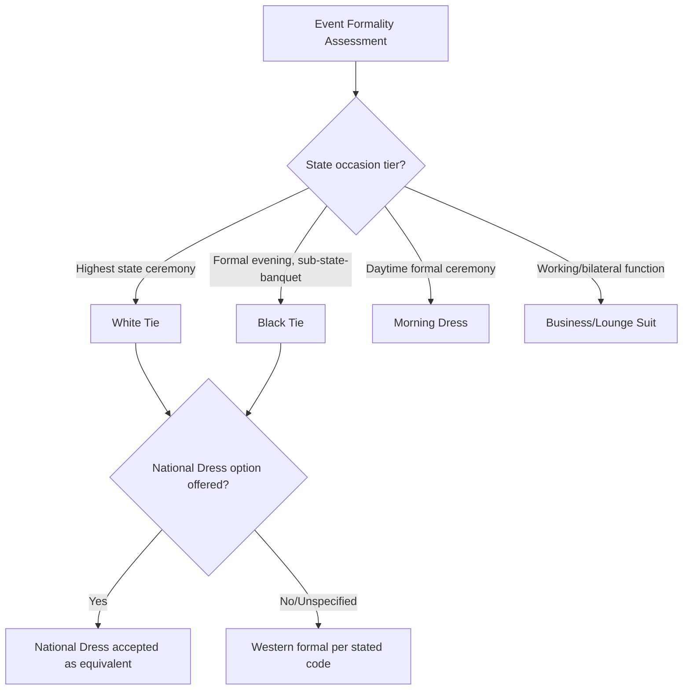

## Invitations, Dress Codes, and Gift-Giving Conventions


### Overview and Diplomatic Function

This domain covers the three interlocking social-protocol mechanisms through which diplomatic events are formally organized and conducted: the invitation instrument that establishes who attends and under what status, the dress code that signals the register and formality of the occasion, and the gift-giving conventions that mediate courtesy exchange without creating legal, ethical, or reciprocity complications. Unlike credentials or precedence protocol, this domain intersects heavily with each state's domestic ethics and anti-corruption law, making it one of the more legally sensitive areas of diplomatic etiquette.

**Key Points**

- Invitations are formal instruments with defined response obligations (RSVP protocol), not casual social requests
- Dress codes in diplomatic settings follow a codified formality hierarchy, distinct from general Western social convention
- Gift-giving is constrained by both cultural reciprocity expectations and increasingly strict domestic gift-acceptance regulations for public officials

### Invitations: Structure and Protocol

**Formal Elements**

A diplomatic invitation conventionally specifies:

- Issuing authority (head of state, foreign minister, ambassador, or institution) in the third person for the most formal instruments
- Event type and purpose (state dinner, reception, working lunch, national day celebration)
- Precise date, time, and venue
- Dress code designation (see below)
- RSVP instructions, deadline, and contact
- Any security/accreditation requirements (particularly for state functions)

**RSVP Obligation**

"R.S.V.P." (répondez s'il vous plaît) on a diplomatic invitation is not optional courtesy but a formal protocol requirement; failure to respond by the stated deadline is itself considered a protocol lapse. Regret declines are conventionally issued in the same register as the invitation (formal written reply for formal written invitations).

**Invitation Hierarchy by Formality**

| Instrument Type | Typical Use | Response Register |
| --- | --- | --- |
| Engraved/formal card, third person | State dinners, national day events | Formal written reply, third person |
| Printed card with fill-in blanks | Receptions, working functions | Written or verbal per instructions |
| Personal letter | Head-of-state to head-of-state occasions | Personal written reply |
| Official note verbale | Inter-ministry or inter-mission formal notice | Note verbale in reply |

**[Unverified]** The precise formatting conventions (typeface, third-person phrasing rules, card stock) vary by state and protocol office; current house style should be verified against the issuing chancery's protocol guidance rather than assumed universal.

### Dress Codes: Formality Hierarchy

Diplomatic dress codes follow a descending formality scale, though exact terminology and expectations vary by state, climate, and cultural context:

1. **White Tie (Full Evening Dress)** — the most formal designation; men in tailcoat, white waistcoat, white bow tie; women in full-length evening gowns, often with designated formal jewelry/orders. Reserved for state banquets, coronations, and comparable highest-tier state occasions.
2. **Black Tie (Dinner/Tuxedo)** — formal evening functions below state-banquet tier; dinner jacket/tuxedo for men, cocktail or evening dress for women.
3. **Morning Dress** — daytime formal wear (morning coat, waistcoat, striped trousers for men) used for daytime state ceremonies in states retaining this convention (notably credentials ceremonies in some monarchies).
4. **Business/Lounge Suit (Diplomatic Formal)** — standard formal business attire, the default for working diplomatic functions, bilateral meetings, and many receptions.
5. **National Dress** — explicitly invited as an alternative to Western formal wear at many international functions, reflecting the host or attendee's cultural dress; invitations frequently state "National Dress or Black Tie" to signal parity between the options.

**Example**

An invitation marked "Black Tie / National Dress" for a national day reception signals that Western black-tie attire and the invitee's own national formal dress are treated as equally appropriate — refusing this equivalence by insisting on Western dress in a mixed-nationality context can itself read as a minor cultural slight.



### Gift-Giving Conventions

**Cultural Reciprocity Principles**

- Gifts in diplomatic exchange traditionally symbolize goodwill and continuity of relations rather than personal favor, and are typically modest relative to the wealth of either party, emphasizing symbolic or craft value over monetary value
- Common categories: state-crafted or artisanal items reflecting national heritage, books, decorative objects bearing national symbols, or items reflecting the recipient's known personal interests (researched in advance by protocol staff)
- Gifts are frequently exchanged simultaneously or in immediate sequence to avoid one party appearing to "receive" without reciprocating in the same encounter

**Items Conventionally Avoided**

- Anything bearing unintended religious, political, or culturally sensitive connotations in the recipient's culture (color symbolism, numerology, animal imagery, and floral symbolism vary significantly by culture and require research)
- Sharp objects (knives, scissors) in several gift-giving traditions, held to symbolize severing a relationship unless neutralized by a symbolic coin exchange in that tradition
- Alcohol, where the recipient's state or personal practice prohibits its use
- Clocks, in Chinese gift-giving tradition, due to homophonic association with death-related terms in Mandarin

**[Inference]** Because gift symbolism is highly culture-specific and can shift in meaning even within a single country's regional or religious subcultures, protocol offices typically commission targeted cultural-sensitivity research before finalizing a state gift rather than relying on generalized guidance, though the specific research process is an internal administrative practice not standardized across states.

**Domestic Gift-Acceptance Law**

Most states impose statutory or regulatory limits on gifts their own officials may accept from foreign governments, commonly requiring:

- Disclosure of gifts above a specified monetary threshold
- Surrender of gifts above that threshold to the state (with the option, in some systems, for the official to purchase the gift at assessed value to retain it personally)
- Distinct rules for gifts exchanged head-of-state-to-head-of-state versus working-level diplomatic gifts

**[Unverified]** Specific monetary thresholds and disclosure procedures differ by state and are periodically revised; current limits should be verified against the receiving official's own government ethics regulations rather than assumed from a general figure.

```mermaid
sequenceDiagram
    participant SP as Sending Protocol Office
    participant Gift as Proposed Gift
    participant RP as Receiving Protocol Office
    participant Off as Receiving Official

    SP->>Gift: Research recipient's cultural/personal context
    SP->>Gift: Screen against taboo symbolism list
    SP->>RP: Discreetly confirm appropriateness (optional, high-stakes cases)
    SP->>Off: Present gift at ceremonial moment
    Off->>RP: Disclose gift per domestic threshold rules
    RP->>RP: Determine retention vs. surrender per regulation
```

### Common Sources of Protocol Error

- Issuing an invitation without a clear dress code designation, forcing guests to guess and risking a formality mismatch
- Treating RSVP deadlines as flexible for diplomatic invitations, which can be read as discourtesy toward the host mission
- Selecting a gift based on the sending state's own cultural associations without screening against the receiving culture's symbolism
- Presenting a gift whose monetary value creates disclosure or surrender complications for the receiving official, inadvertently placing them in an awkward regulatory position
- Failing to account for reciprocal-value expectations, where a conspicuously more lavish gift from one side can create an implicit and unwelcome obligation

### Practical Preparation Workflow

**Next Steps**

- Confirm invitation formality tier and dress code designation before drafting or accepting
- Verify RSVP deadline and required response register (written/verbal, formal/informal)
- Commission cultural-sensitivity screening for any proposed gift before procurement
- Cross-check proposed gift value against the receiving official's domestic gift-acceptance regulations
- Coordinate simultaneous gift exchange timing where bilateral reciprocity is expected
- Maintain a standing reference file per bilateral partner of known dress and gift sensitivities for future events

**Related Topics**

- Seating Arrangements and Processions
- Flag Protocol and National Symbols
- Cultural Sensitivity Research in Diplomatic Preparation
- Anti-Corruption and Gift-Disclosure Regulation (Comparative)
- State Banquet and National Day Event Planning
- Diplomatic Correspondence Formats (Note Verbale, Aide-Mémoire)