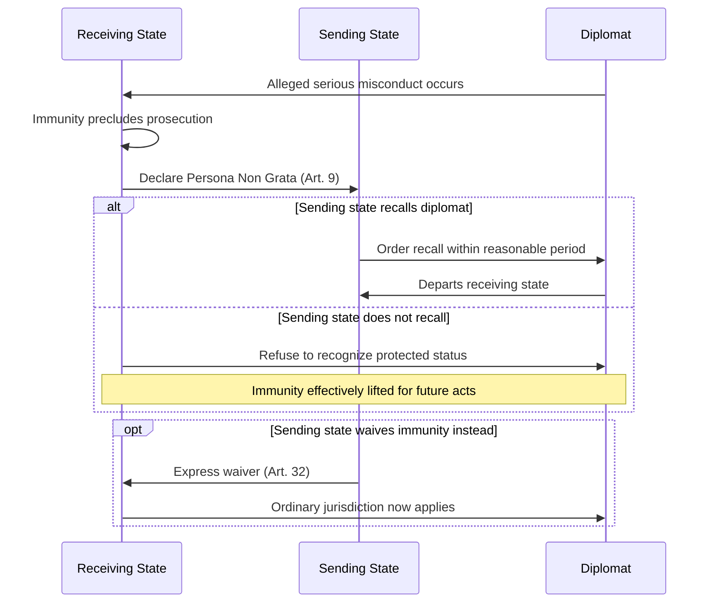

## Diplomatic Immunity and Privileges

### Overview and Legal Function

Diplomatic immunity and privileges constitute the legal framework that shields diplomatic agents and missions from the jurisdiction and administrative burden of the receiving state, enabling diplomatic functions to be performed without fear of coercion, harassment, or interference. The framework rests on a functional rationale — immunity exists to protect the *function* of diplomacy, not to grant personal exemption from law as an end in itself — codified primarily in the **Vienna Convention on Diplomatic Relations (1961)** and, for consular officers, the **Vienna Convention on Consular Relations (1963)**.

**Key Points**

- Immunity is granted by the receiving state and can be waived by the sending state, but never unilaterally claimed as absolute by the individual diplomat
- Diplomatic immunity (VCDR 1961) and consular immunity (VCCR 1963) are distinct, overlapping but non-identical regimes, with consular immunity generally narrower
- The receiving state's remedy for diplomat misconduct is not prosecution but declaration of *persona non grata*, forcing recall by the sending state

### Legal and Conventional Basis

The **Vienna Convention on Diplomatic Relations (1961)**, ratified by nearly all UN member states, is the near-universal codification of diplomatic law, itself substantially a codification of pre-existing customary international law rather than a wholly novel creation. Key operative articles:

- **Article 22**: Inviolability of mission premises
- **Article 24**: Inviolability of mission archives and documents, at all times and wherever located
- **Article 27**: Inviolability of official correspondence and the diplomatic bag
- **Article 29**: Personal inviolability of the diplomatic agent — not liable to any form of arrest or detention
- **Article 31**: Immunity from criminal, civil, and administrative jurisdiction, with specified exceptions
- **Article 32**: Waiver of immunity, which must be express and is the sending state's prerogative, not the individual's
- **Article 37**: Extension of privileges to family members forming part of the diplomat's household, and to administrative/technical staff (with narrower scope)
- **Article 39**: Immunity commences upon entry into the receiving state to take up the post (or notification, if already present) and persists after function ends only for acts performed in the exercise of official functions

### Categories of Mission Personnel and Corresponding Immunity Tiers

| Category | Personal Immunity | Civil/Admin Immunity | Inviolability |
| --- | --- | --- | --- |
| Head of Mission / Diplomatic Agents | Full — not liable to arrest/detention | Full, subject to Art. 31 exceptions | Person, residence, papers |
| Administrative and Technical Staff | Full personal inviolability | Immunity limited to official acts | Residence inviolable |
| Service Staff | None from arrest | Immunity limited to official acts only | Not extended |
| Private Servants of Diplomats | None, unless separately agreed | None, unless separately agreed | Not extended |
| Consular Officers (VCCR 1963) | Limited — arrest permitted for grave crimes pursuant to a competent judicial authority decision | Immunity limited to official/consular acts | Consular premises and archives, narrower than diplomatic |

**[Unverified]** The precise threshold defining a "grave crime" permitting arrest of a consular officer under VCCR Article 41 is not uniformly defined across jurisdictions and depends on the receiving state's implementing law and judicial interpretation; specific case assessment should reference current legal counsel rather than a general threshold.

### Scope and Exceptions to Civil Immunity (Article 31)

Diplomatic agents are not immune from the receiving state's civil and administrative jurisdiction in three specified categories:

1. **Real property actions** — private immovable property held in the receiving state, unless held on behalf of the sending state for mission purposes
2. **Succession matters** — where the diplomat is executor, administrator, heir, or legatee as a private person
3. **Professional or commercial activity** — any private professional or commercial activity conducted by the diplomat outside their official functions

$$\text{Immunity}(x) = \begin{cases} \text{Full} & x \in \text{official function} \\ \text{Excepted (Art. 31)} & x \in \{\text{real property}, \text{succession}, \text{private commerce}\} \\ \text{None (post-tenure)} & x \notin \text{official function}, \, t > t_{\text{departure}} \end{cases}$$

### Persona Non Grata Mechanism

Because a receiving state cannot prosecute a diplomat who retains immunity, the primary enforcement tool for diplomat misconduct is the **persona non grata (PNG)** declaration under Article 9 of the VCDR:

- The receiving state may, at any time and without explanation, notify the sending state that a diplomat is no longer acceptable
- The sending state must then recall the individual within a reasonable period, or the receiving state may refuse to recognize the person as a member of the mission, effectively stripping their protected status
- PNG declarations are also used diplomatically as a reciprocal or retaliatory measure unrelated to individual misconduct, particularly during periods of bilateral tension (mass expulsions)

### Waiver of Immunity

- Waiver must be **express** — silence, failure to object, or the diplomat's own consent does not constitute waiver
- Waiver of immunity from jurisdiction in respect of civil or administrative proceedings does not automatically imply waiver of immunity in respect of the *execution* of the judgment, which requires a separate express waiver (Article 32(4))
- Waiver is exercised by the sending state, typically through its foreign ministry, not by the individual diplomat unilaterally

**Example**

If a diplomat is involved in a traffic collision and the sending state wishes to allow civil liability proceedings to go forward in the receiving state's courts, the sending state must issue an express diplomatic note waiving immunity for that specific proceeding; the diplomat's personal willingness to appear in court does not itself constitute a valid waiver.

### Mission Inviolability

- Receiving state authorities may not enter mission premises without the consent of the head of mission (Article 22), including for purposes such as fire or medical emergency, absent that consent, though states typically maintain informal understandings for genuine life-safety emergencies
- The receiving state has a special duty to protect mission premises against intrusion, damage, and disturbance of the mission's dignity, extending beyond mere non-interference to affirmative protective obligation
- Mission premises, furnishings, and property (along with the mission's means of transport) are immune from search, requisition, attachment, or execution

**[Inference]** The informal understandings some states maintain permitting emergency responders to enter mission premises during a genuine life-threatening emergency are generally treated as an extension of the head of mission's implied consent rather than an exception to Article 22 itself, though this characterization is not uniformly settled across all states' practice and should not be assumed to apply absent explicit prior agreement or real-time consent.

### Diplomatic Bag and Correspondence

- The diplomatic bag (official mission correspondence and materials) may not be opened or detained by receiving state authorities (Article 27)
- Bags must bear visible external marks of their character and may contain only diplomatic documents or articles intended for official use — receiving states retain the right to request return of a bag reasonably suspected of misuse, though not to open it unilaterally
- **[Unverified]** Practice regarding electronic scanning (as opposed to physical opening) of diplomatic bags for security screening purposes is contested and varies by bilateral arrangement and airport/border authority; no single universally accepted standard governs this specific practice

### Common Sources of Misunderstanding

- Conflating immunity from *prosecution* with immunity from *the underlying law* — a diplomat who commits an offense has still broken the law; immunity is a procedural bar to enforcement, not a substantive legal exception
- Assuming immunity is permanent and unconditional, when it is functionally tied to official status and subject to waiver, PNG declaration, and post-tenure limitation to official acts only
- Treating consular immunity (VCCR 1963) as equivalent in scope to full diplomatic immunity (VCDR 1961), when consular immunity is materially narrower
- Overlooking that administrative/technical and service staff hold progressively narrower immunity than accredited diplomatic agents

### Practical Considerations for Missions

**Next Steps**

- Maintain accurate, current notification to the receiving state's Ministry of Foreign Affairs of all mission personnel and their category (diplomatic, administrative/technical, service), since immunity tier depends on correct classification
- Establish clear internal guidance distinguishing official-function conduct from private conduct for staff, given the Article 31 exceptions and post-tenure limitations
- Maintain protocols for responding to receiving-state requests regarding alleged staff misconduct, including sending-state channels for considering waiver
- Ensure diplomatic bag procedures comply with visible-marking requirements to avoid legitimate inspection disputes
- Brief incoming diplomatic staff explicitly on the functional (not personal) rationale for immunity, to reduce risk of behavioral misunderstanding

**Related Topics**

- Vienna Convention on Diplomatic Relations — full text and structure
- Vienna Convention on Consular Relations — comparative immunity scope
- Persona Non Grata Declarations and State Practice
- Credentials Presentation Ceremonies
- Diplomatic Correspondence and the Diplomatic Bag
- Termination of Diplomatic Relations and Mission Closure Procedures