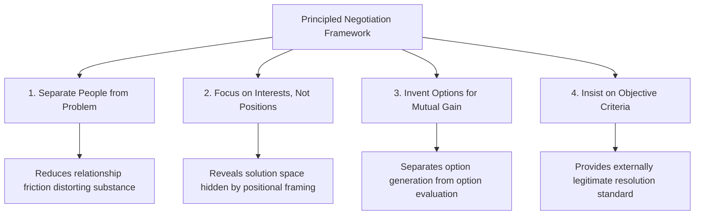
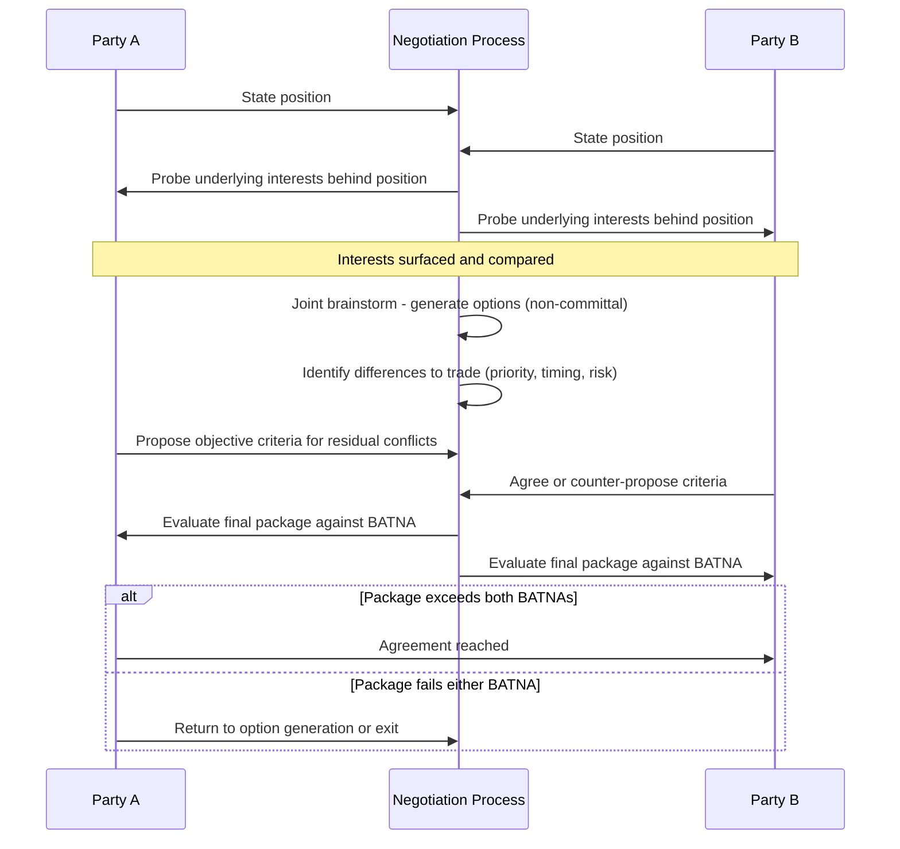

## Principled Negotiation and Interest-Based Bargaining

### Overview and Theoretical Function

Principled negotiation, most influentially articulated in Roger Fisher and William Ury's *Getting to Yes* (Harvard Negotiation Project), is a framework that reorients negotiation away from positional bargaining (competing demands, sequential concessions) toward the identification and reconciliation of underlying interests. Interest-based bargaining is the practical method by which this reorientation is executed. In diplomatic contexts, the framework provides a structured alternative to zero-sum positional haggling, aiming to produce agreements that are efficient, durable, and less corrosive to the ongoing relationship between negotiating parties.

**Key Points**

- The framework distinguishes sharply between **positions** (stated demands) and **interests** (underlying needs, concerns, and motivations driving those demands)
- It is designed to produce outcomes assessed against three criteria: wise (meeting legitimate interests, resolving conflicting interests fairly, durable), efficient, and relationship-preserving
- The framework does not assume good faith or symmetry of power; it includes explicit mechanisms (BATNA) for negotiating with parties who may not reciprocate the approach

### The Four Core Principles

**1. Separate the People from the Problem**

Negotiators are treated as problem-solving partners addressing a shared substantive issue, rather than adversaries. This principle addresses the tendency for relationship friction (ego, face-saving, historical grievance) to become entangled with the substantive dispute, distorting both.

**[Inference]** In diplomatic settings, where negotiators represent states rather than personal interests, this principle is often harder to operationalize than in interpersonal or commercial negotiation, since national dignity, historical narrative, and domestic political audiences can make "the people" and "the problem" functionally inseparable for a delegation, even when the individual negotiators personally maintain a collaborative disposition.

**2. Focus on Interests, Not Positions**

A position is a demanded outcome; an interest is the need the position is meant to satisfy. Multiple positions can often satisfy the same interest, and reconciling interests directly — rather than splitting the difference between positions — frequently reveals options invisible when the negotiation remains framed around competing demands.

**Example**

Two states dispute a shared border river's water allocation. Position A: "We demand 60% of the flow." Position B: "We demand 60% of the flow." These positions are mutually exclusive and sum to more than 100%. Underlying interests may differ substantially: State A's interest may be agricultural irrigation timing during a specific season, while State B's interest may be hydroelectric generation capacity year-round. An interest-based solution (seasonal allocation favoring A during planting months, B retaining generation-priority allocation the rest of the year) can satisfy both interests fully without either side "winning" the positional 60% figure.

**3. Invent Options for Mutual Gain**

Before evaluating or committing to any single solution, parties are encouraged to generate a wide range of possible options separately from the decision to adopt them — deliberately separating the divergent (option-generating) phase from the convergent (option-selecting) phase to avoid premature judgment suppressing creative options.

Techniques associated with this principle include:

- Brainstorming sessions structured explicitly as non-committal
- Identifying differences in priorities, risk tolerance, timing preference, or forecasting between parties that can be traded (each side conceding on what it values less to gain on what it values more)
- Looking for options that expand the total value available before dividing it ("expanding the pie")

**4. Insist on Objective Criteria**

Where interests genuinely conflict, resolution should be sought through externally legitimate, independent standards rather than a contest of will or relative power. Objective criteria might include: market value, precedent, expert judgment, legal or scientific standard, or reciprocal/comparable treatment in analogous prior agreements.

**Example**

In a diplomatic compensation dispute, rather than negotiating from arbitrary opening figures, parties might agree to be bound by an internationally recognized valuation methodology or refer to a comparable settlement previously reached in an analogous dispute between other states, lending the outcome legitimacy independent of either side's negotiating leverage.

### BATNA: Best Alternative to a Negotiated Agreement

BATNA is the framework's central power-and-leverage concept: the course of action a party will pursue if the current negotiation fails to produce an agreement. It functions as the benchmark against which any proposed agreement is measured — a party should not accept any deal worse than its BATNA.

$$\text{Accept Agreement} \iff \text{Value}(\text{Proposed Agreement}) > \text{Value}(\text{BATNA})$$

**Key Functions of BATNA**

- Establishes a floor below which a party has no rational reason to settle
- Determines negotiating power independent of apparent size, wealth, or status — a materially "weaker" party with a strong BATNA (viable alternative courses of action) can out-negotiate a nominally "stronger" party with a poor BATNA (few viable alternatives)
- Should be actively developed and strengthened *before* and *during* negotiation, not treated as a fixed given

**Diplomatic Application**

In interstate negotiation, a state's BATNA might include: alternative alliance arrangements, unilateral action, appeal to a multilateral forum or international court, continuation of the status quo, or economic/diplomatic measures independent of the counterpart's cooperation. **[Inference]** Because a credible BATNA strengthens negotiating position, states are frequently observed to cultivate visible alternatives (parallel negotiating tracks, alternative partnerships) partly as leverage-signaling during an active negotiation, though the specific intent behind any given diplomatic maneuver is not directly observable and such interpretations remain inferential.

**Reservation Value vs. BATNA**

BATNA should not be conflated with a state's "walk-away point" or reservation value, though the two are related — BATNA is the alternative course of action itself, while reservation value is the specific quantitative or qualitative threshold derived from assessing that alternative's worth.

### Interest-Based Bargaining: Process Structure

### Handling Asymmetric or Non-Reciprocal Negotiation

Fisher and Ury explicitly address negotiation with counterparts who do not adopt principled methods (positional bargainers, or parties employing pressure tactics), proposing:

- **Negotiation jujitsu**: Deflecting positional attacks by refusing to counter-attack or defend the position itself, instead redirecting toward the interests and merits, and inviting criticism of one's own proposal to surface the counterpart's real concerns
- **One-text procedure**: A neutral third party (or one side acting in a facilitative capacity) drafts a single evolving text that both parties critique and refine iteratively, reducing the dynamic of competitive counter-drafting
- **Explicit process negotiation**: Naming the counterpart's tactic aloud (e.g., identifying an anchoring extreme opening offer as such) to shift the interaction from the substantive game to a negotiation about the negotiating process itself

### Limitations and Critiques

**[Inference]** Several limitations are commonly raised in negotiation theory literature regarding principled negotiation's applicability to diplomatic contexts specifically:

- The framework assumes interests are discoverable and reconcilable, but in disputes involving indivisible goods (sovereignty over contested territory, recognition of statehood) interests may be genuinely and irreducibly zero-sum, limiting the technique's applicability
- Domestic political constraints on diplomatic negotiators (need to demonstrate resolve to a domestic audience) can make positional rigidity strategically rational even when interest-based solutions exist, since perceived concession may carry domestic political cost independent of the settlement's substantive merit
- The framework presumes a degree of good-faith information-sharing about interests that may be strategically disadvantageous for a party to provide in an adversarial or low-trust diplomatic relationship

These are presented as recognized critiques within negotiation theory discourse rather than settled empirical findings, and specific applicability should be assessed case-by-case against the particular negotiation's structure and trust environment.

### Common Sources of Practical Error

- Conflating stated interests with actual interests — parties, particularly in diplomatic settings with domestic audiences, may publicly assert interests that differ from their private underlying motivations
- Treating BATNA as static rather than actively developing alternatives throughout the negotiation to strengthen leverage
- Skipping the divergent option-generation phase and moving directly to evaluating a single proposed solution, foreclosing potentially superior mutual-gain options
- Selecting "objective criteria" that are only objective from one party's frame of reference, undermining the criterion's legitimacy to the other side

### Practical Application Workflow

**Next Steps**

- Before entering negotiation, map both the stated position and the inferred underlying interests for all parties involved
- Develop and continuously strengthen an independent BATNA rather than treating existing alternatives as fixed
- Structure at least one dedicated session or phase for non-committal option generation, explicitly separated from evaluation
- Identify candidate objective criteria (precedent, expert standard, market benchmark) before conflict points are reached, so they are available as a fallback resolution mechanism
- Prepare responses to positional or pressure tactics using jujitsu and process-naming techniques, particularly where a counterpart is known to negotiate positionally

**Related Topics**

- BATNA Development and Negotiation Power Analysis
- Positional Bargaining vs. Interest-Based Bargaining (Comparative Models)
- Multi-Track Diplomacy and Track II Negotiation
- Mediation and Third-Party Facilitation Techniques
- Cross-Cultural Negotiation Styles
- Negotiating Indivisible Goods: Sovereignty and Territorial Disputes