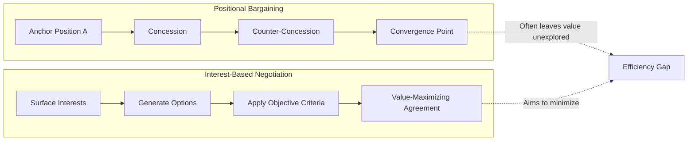
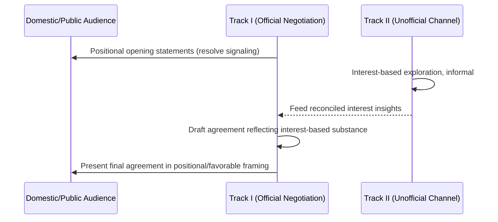

## Positional Versus Interest-Based Negotiation

### Overview and Theoretical Function

This topic provides a direct comparative analysis of the two dominant negotiation paradigms: **positional bargaining**, the traditional model of sequential concessions from anchored opening demands, and **interest-based (principled) negotiation**, which reframes the process around underlying needs rather than stated demands. While treated in detail individually elsewhere in this curriculum (interest-based bargaining specifically), this item's function is to isolate the structural, strategic, and outcome-level differences between the two models so a negotiator can diagnose which mode is operative in a given encounter and adapt accordingly.

**Key Points**

- The two models are not merely different tactics but different underlying theories of what a negotiation *is* — a contest of will and leverage versus a joint problem-solving exercise
- Real-world diplomatic negotiations frequently exhibit both modes simultaneously or in sequence, rather than existing as pure types
- The choice of model has measurable consequences for negotiation efficiency, relationship durability, and the likelihood of reaching a mutually value-maximizing outcome versus a merely mutually acceptable one

### Defining Characteristics: Positional Bargaining

Positional bargaining is characterized by parties adopting and defending fixed demands (positions), with agreement reached through sequential, reciprocal concession from those initial anchors toward a convergence point.

**Structural Features**

- **Anchoring**: Initial offers are set deliberately extreme relative to the party's actual reservation value, to shift the eventual convergence point in the anchoring party's favor
- **Sequential concession**: Each party incrementally moves from their anchor, typically in a pattern of diminishing concession size, signaling approach to a reservation limit
- **Zero-sum framing**: Value is treated as fixed (a "fixed pie"), such that one party's gain is assumed to be the other's loss
- **Commitment tactics**: Public commitment to a position (sometimes irrevocable-seeming) is used strategically to constrain one's own future flexibility, thereby forcing the counterpart to make the greater concession

**[Inference]** Positional bargaining is frequently observed in contexts involving single-issue, purely distributive disputes (e.g., a one-time price negotiation with no ongoing relationship at stake), where the absence of integrative potential (no trade-offs across multiple interests) reduces the practical advantage interest-based methods would otherwise offer, though this is a generalization about typical conditions rather than a fixed rule determining which method will be used in any specific case.

### Defining Characteristics: Interest-Based Negotiation

Interest-based negotiation (detailed fully under Principled Negotiation and Interest-Based Bargaining) is characterized by:

- Explicit inquiry into the *why* behind each party's stated position
- Treatment of value as potentially expandable through trade-offs across differently prioritized interests ("expanding the pie") before any division occurs
- Use of objective, externally legitimate criteria to resolve residual conflicts rather than relative bargaining power
- Explicit separation of relationship management from substantive dispute resolution

### Direct Comparative Analysis

| Dimension | Positional Bargaining | Interest-Based Negotiation |
| --- | --- | --- |
| Unit of analysis | Stated demands/positions | Underlying interests and needs |
| Framing of value | Fixed pie (zero-sum default) | Potentially expandable pie |
| Primary mechanism | Sequential concession from anchors | Joint option generation, then evaluation |
| Resolution of conflict | Relative power/will/patience | Objective, externally legitimate criteria |
| Information sharing | Strategically withheld/misrepresented | Selectively disclosed to enable trade-offs |
| Relationship treatment | Often entangled with substance | Deliberately separated from substance |
| Typical outcome quality | Mutually acceptable, not necessarily efficient | Aims for mutually efficient and durable |
| Vulnerability | Exploitable by aggressive counter-anchoring | Exploitable by bad-faith counterpart exploiting disclosed interests |

### Efficiency and Outcome-Quality Differences

The Harvard Negotiation Project's central claim, reflected widely in subsequent negotiation theory, is that positional bargaining tends toward outcomes assessed on three criteria as inferior relative to interest-based methods under comparable conditions:

1. **Efficiency** — Positional bargaining consumes time and resources on symbolic anchoring and concession-management that could otherwise be directed at value-creating trade-offs
2. **Wisdom of outcome** — Because positions may only imperfectly proxy true interests, a positional settlement can leave value "on the table" that an interest-based process would have captured through trade-offs across differently weighted priorities
3. **Relationship durability** — The adversarial framing inherent in positional bargaining, especially where commitment tactics or pressure are used, can generate resentment or perceived bad faith that persists beyond the immediate negotiation, complicating future interaction between the same parties

**[Inference]** This claimed efficiency advantage for interest-based negotiation is best understood as a theoretical proposition well-supported in negotiation pedagogy and widely adopted in practice, rather than a universally quantified empirical law; actual outcome quality in any specific negotiation depends heavily on factors such as trust, information asymmetry, and the presence of genuinely integrative potential across the issues at stake.

### Hybrid and Sequential Real-World Patterns

Diplomatic negotiations rarely occur as pure instances of either model. Common hybrid patterns include:

**Positional Opening, Interest-Based Middle**

Parties may open with anchored, positional statements for domestic political audiences (demonstrating resolve), then shift toward interest-based exploration once initial posturing has been satisfied and substantive working-level talks begin.

**Interest-Based Substance, Positional Closing**

Where substantive interests have been reconciled through interest-based methods, the final agreement is sometimes re-framed publicly in positional terms (as a "win" on specific numbers or demands) to satisfy domestic political optics, even though the underlying process was interest-based.

**Track-Dependent Variation**

In multi-track diplomatic processes, official (Track I) channels may remain positional for public-facing reasons, while parallel unofficial (Track II) channels explore interests more freely, with insights feeding back into the official track's eventual positions.

### Diagnostic Framework: Identifying Which Mode Is Operative

A negotiator can diagnose the operative mode by observing:

- Whether the counterpart responds to *why* questions about their position with genuine explanation or evasive restatement of the demand
- Whether concessions are offered contingent on reciprocal information about interests, or offered unconditionally as part of a fixed sequential pattern
- Whether proposed solutions are drawn from a jointly generated option set or presented as fixed, non-negotiable packages
- Whether appeals are made to external, verifiable standards or solely to relative power, urgency, or precedent internal to one party's narrative

### Common Sources of Practical Error

- Applying interest-based disclosure unilaterally against a counterpart who remains purely positional, creating an information asymmetry the positional party can exploit
- Assuming a hybrid pattern (positional public framing over interest-based substance) indicates negotiating bad faith, when it may simply reflect legitimate domestic political constraint distinct from the substantive negotiating stance
- Misreading an opening anchor as the counterpart's true reservation value, leading to premature over-concession or unnecessary impasse
- Failing to adapt method mid-negotiation when the counterpart's mode shifts (e.g., moving from interest-based exploration back to positional hardening as a deadline approaches)

### Practical Application Workflow

**Next Steps**

- Diagnose the counterpart's operative mode early using the observational indicators above, rather than assuming symmetry with one's own approach
- Where the counterpart is positional, consider negotiation jujitsu and process-naming techniques (detailed under Principled Negotiation and Interest-Based Bargaining) rather than mirroring purely positional tactics
- Anticipate and plan for hybrid patterns, particularly the need to translate interest-based substantive agreements into positionally-framed public messaging for domestic audiences
- Maintain independent BATNA development regardless of which mode is operative, since it remains the leverage benchmark under both paradigms
- Build in explicit checkpoints during extended negotiations to reassess whether the operative mode has shifted

**Related Topics**

- Principled Negotiation and Interest-Based Bargaining
- BATNA Development and Negotiation Power Analysis
- Anchoring and Concession-Pattern Analysis
- Multi-Track Diplomacy and Track II Negotiation
- Negotiating Under Domestic Political Constraint
- Game-Theoretic Models of Bargaining (Zero-Sum vs. Integrative)