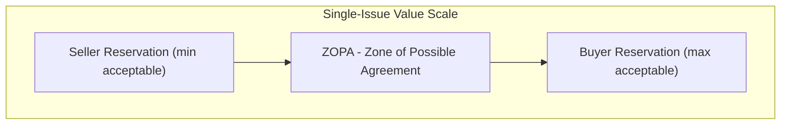
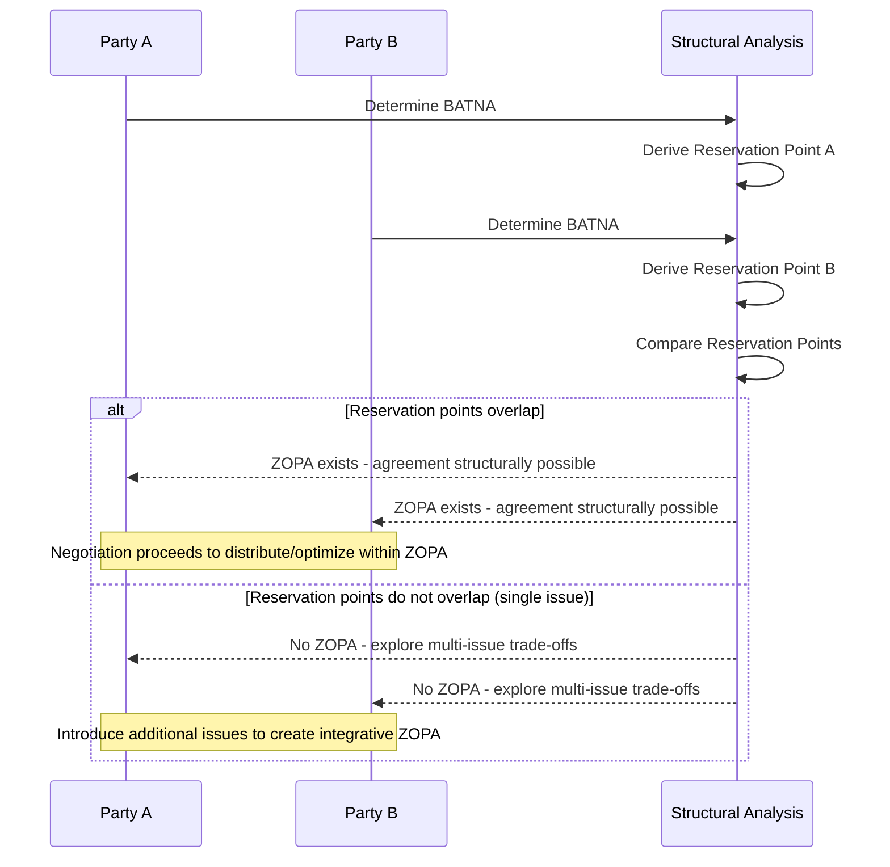

## BATNA, ZOPA, and Reservation Points

### Overview and Analytical Function

BATNA, ZOPA, and reservation points form the core quantitative/structural toolkit for assessing negotiating power, feasibility, and outcome boundaries in any bargaining encounter, distinct from the process-oriented principles of interest-based bargaining covered elsewhere in this curriculum. Where principled negotiation describes *how* parties should interact, this toolkit describes the *structural conditions* — what alternatives exist, what thresholds bound acceptable agreement, and whether an agreement is even mathematically possible — that determine whether and on what terms a negotiation can succeed.

**Key Points**

- BATNA (Best Alternative to a Negotiated Agreement) is the benchmark against which any proposed deal is measured
- Reservation point (or reservation value) is the specific quantitative threshold derived from a party's BATNA, below which no rational agreement should be accepted
- ZOPA (Zone of Possible Agreement) exists only when the parties' reservation points overlap; absent this overlap, no agreement is achievable regardless of negotiating skill

### BATNA: Definition and Function

BATNA, a term introduced by Roger Fisher and William Ury in *Getting to Yes*, denotes the course of action a party will pursue if the current negotiation fails to produce an agreement. It is not a number but a concrete alternative course of action, from which a reservation value is subsequently derived.

**Core Functions**

- Establishes the floor below which continued negotiation is irrational — a party is never obligated to accept a deal worse than its own next-best alternative
- Determines relative negotiating power independent of apparent size, wealth, or formal status: a nominally weaker party with a strong, credible BATNA can out-negotiate a nominally stronger party with a poor BATNA
- Functions as a dynamic variable that should be actively developed and strengthened before and during negotiation, not treated as a static given

**Diplomatic Application**

In interstate negotiation, a state's BATNA may consist of: alternative alliance or partnership arrangements, unilateral action, recourse to a multilateral forum or international judicial body, continuation of the status quo, or independent economic/security measures not requiring the counterpart's cooperation.

**[Inference]** Because a credible BATNA strengthens negotiating position, states are frequently observed cultivating visible alternatives (parallel negotiating tracks, alternative partnerships) partly as a leverage-signaling function during active negotiations, though the specific strategic intent behind any given diplomatic maneuver is not directly observable, and such interpretations remain inferential rather than confirmed motive.

### Reservation Point: Definition and Derivation

The reservation point (also termed reservation value, resistance point, or walk-away point) is the specific quantitative or qualitative threshold at which a party is indifferent between accepting a negotiated agreement and pursuing its BATNA instead.

$$\text{Reservation Point} = \text{Value}(\text{BATNA})$$

$$\text{Accept Agreement} \iff \text{Value}(\text{Proposed Terms}) \geq \text{Reservation Point}$$

**Distinguishing BATNA from Reservation Point**

BATNA is the alternative course of action itself (e.g., "pursue a bilateral agreement with a third state instead"); the reservation point is the specific value assessment derived from that alternative (e.g., "any agreement worth less than the estimated value of that alternative arrangement should be rejected"). Conflating the two is a common analytical error — a party can have a clearly identified BATNA while still misjudging its reservation value, particularly where the BATNA's worth is difficult to quantify (e.g., comparing a certain negotiated outcome against an uncertain unilateral course of action).

**Aspiration Point vs. Reservation Point**

A related but distinct concept is the **aspiration point** — the outcome a party hopes to achieve, typically set well above the reservation point to leave room for concession during bargaining. The gap between a party's aspiration point and reservation point defines its own internal negotiating range.

### ZOPA: Zone of Possible Agreement

ZOPA is the range of terms that would be acceptable to both (or all) parties simultaneously — the overlap, if any, between each party's reservation point.

**Single-Issue (Distributive) ZOPA**

In a single-value negotiation (e.g., a price), ZOPA exists only if the buyer's maximum acceptable price exceeds the seller's minimum acceptable price:

$$\text{ZOPA exists} \iff \text{Reservation}_{\text{Buyer}} \geq \text{Reservation}_{\text{Seller}}$$

$$\text{ZOPA} = [\text{Reservation}_{\text{Seller}}, \, \text{Reservation}_{\text{Buyer}}]$$

If the seller's minimum exceeds the buyer's maximum, no ZOPA exists, and no rational agreement is possible regardless of negotiating skill — this is a structural, not tactical, barrier to agreement.

**Multi-Issue (Integrative) ZOPA**

In negotiations involving multiple issues with differently weighted priorities across parties, ZOPA becomes a multidimensional space rather than a single interval — trade-offs across issues (one party conceding on a low-priority issue in exchange for gains on a high-priority issue) can create viable agreement zones even where no single-issue ZOPA would exist in isolation. This is the structural basis for the "expanding the pie" concept central to interest-based bargaining.

### Information Asymmetry and ZOPA Estimation

A critical practical complication: parties typically do not know each other's actual reservation points with certainty, and revealing one's own reservation point prematurely surrenders negotiating leverage. Much of positional bargaining's anchoring and concession-pattern behavior (see Positional Versus Interest-Based Negotiation) functions as an attempt to probe or estimate the counterpart's reservation point without revealing one's own.

**[Inference]** Because reservation points are typically private information, both parties in a negotiation often operate with only an estimated range for the counterpart's true reservation point rather than an exact figure, and the eventual agreement point within an actual ZOPA is frequently determined more by relative negotiating skill, patience, and information-gathering than by the ZOPA's objective midpoint, though the precise mechanism by which any specific agreement point is reached within a given ZOPA depends on case-specific dynamics not reducible to a single general rule.

### Diplomatic Application: Multilateral Complexity

In multilateral diplomatic negotiations (as opposed to bilateral), the ZOPA concept extends to require overlap across *all* participating parties' reservation points simultaneously, substantially increasing the structural difficulty of reaching agreement as the number of parties grows, since each additional party's reservation constraints must be satisfied concurrently.

**Example**

A multilateral trade or climate agreement requiring consensus among many states must find agreement terms falling within the reservation-point overlap of every participating state simultaneously; a bilateral ZOPA existing between any two subset states does not guarantee a viable multilateral ZOPA exists across the full group, which is a structural reason multilateral consensus processes are frequently more protracted than bilateral counterparts.

### Strengthening and Managing BATNA in Practice

- **Actively developing alternatives**: Treating BATNA as a variable to be improved throughout the negotiation (e.g., pursuing parallel discussions with alternative partners) rather than a fixed starting condition
- **Protecting BATNA information**: Avoiding premature or unnecessary disclosure of one's own BATNA's strength or weakness, since a revealed weak BATNA undermines negotiating leverage
- **Assessing (not assuming) the counterpart's BATNA**: Investing in intelligence-gathering or analysis regarding the counterpart's realistic alternatives, since misjudging a counterpart's BATNA as stronger or weaker than it actually is leads to miscalibrated concessions
- **Avoiding reservation-point drift**: Maintaining discipline against gradually revising one's own reservation point downward under negotiating pressure or fatigue, absent an actual change in the underlying BATNA's value

### Common Sources of Practical Error

- Conflating BATNA (the alternative course of action) with reservation point (the derived value threshold), leading to imprecise negotiating discipline
- Treating BATNA as static across an extended negotiation, rather than actively strengthening it through parallel efforts
- Assuming a ZOPA exists without structural verification, leading to wasted negotiating effort on a fundamentally infeasible single-issue agreement
- In multilateral settings, focusing analysis only on the most vocal or largest parties' reservation points while overlooking smaller parties whose reservation constraints can equally block a consensus-based agreement
- Prematurely revealing reservation point information through anchoring or concession patterns that are transparent to a sophisticated counterpart

### Practical Application Workflow

**Next Steps**

- Explicitly identify and document the realistic BATNA before entering any negotiation, distinguishing it from mere aspiration
- Derive an explicit reservation point value or range from the identified BATNA, and treat it as a hard floor during negotiation
- Where feasible, estimate the counterpart's (or all multilateral parties') likely reservation points using available intelligence, prior precedent, or observed behavior
- Verify structurally whether a single-issue ZOPA exists before investing further negotiating effort; if none exists, pivot toward introducing additional issues to construct a multi-issue integrative ZOPA
- Continuously reassess and strengthen BATNA throughout an extended negotiation, rather than treating it as fixed at the outset

**Related Topics**

- Principled Negotiation and Interest-Based Bargaining
- Positional Versus Interest-Based Negotiation
- Multilateral Consensus-Building and Coalition Dynamics
- Anchoring and Concession-Pattern Analysis
- Game-Theoretic Models of Bargaining (Zero-Sum vs. Integrative)
- Information Asymmetry in Diplomatic Negotiation