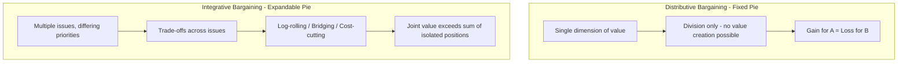
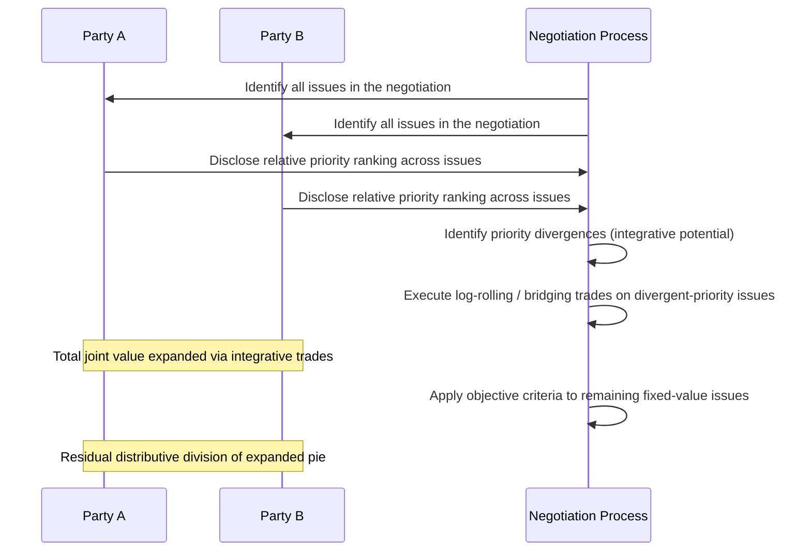

## Distributive Versus Integrative Bargaining

### Overview and Analytical Function

Distributive and integrative bargaining are the two foundational structural models describing how value is created and divided in a negotiation, distinct from — though closely related to — the process-level distinction between positional and interest-based negotiation covered elsewhere in this curriculum. Where the positional/interest-based distinction concerns *behavioral approach*, the distributive/integrative distinction concerns the *underlying structure of the negotiation problem itself*: specifically, whether the total value available is fixed or expandable, and whether multiple issues exist across which trade-offs are possible.

**Key Points**

- Distributive bargaining assumes a fixed total value ("fixed pie") to be divided between parties, making one party's gain arithmetically equivalent to the other's loss
- Integrative bargaining exploits differences in parties' relative priorities across multiple issues to create value beyond what either party's isolated position would allow, before any division occurs
- Most real-world negotiations, including diplomatic ones, contain both distributive and integrative elements simultaneously across different issues within the same overall negotiation

### Distributive Bargaining: Structure and Logic

Distributive bargaining (also termed competitive, win-lose, or zero-sum bargaining) applies to situations where the total value at stake is fixed and cannot be increased through negotiation — the negotiating task is purely one of division.

$$\text{Value}_A + \text{Value}_B = \text{Constant}$$

**Structural Preconditions**

- A single issue, or multiple issues that cannot be meaningfully traded against each other
- No differences in party priorities across issues that could be exploited for mutual gain
- Value that is genuinely fixed rather than merely perceived as fixed (a critical distinction, since negotiators frequently misperceive an integrative situation as distributive — termed the "fixed-pie bias" in negotiation psychology)

**Characteristic Tactics**

- Anchoring with extreme initial offers to shift the eventual division point
- Sequential, diminishing concessions signaling approach to a reservation limit
- Strategic information control, since revealing one's true reservation point surrenders leverage
- Commitment tactics (public, seemingly irrevocable stances) to constrain one's own flexibility and thereby extract greater concession from the counterpart

**Example**

Division of a fixed reparations sum between claimant states with no other issues on the table is a canonical distributive scenario: every unit of currency allocated to one state is necessarily unavailable to the other, and no reframing of interests changes this underlying arithmetic constraint.

### Integrative Bargaining: Structure and Logic

Integrative bargaining (also termed collaborative, win-win, or value-creating bargaining) applies where multiple issues exist and parties place different relative priority on those issues, enabling trade-offs that increase total joint value before any division occurs.

$$\text{Value}_A + \text{Value}_B \leq \text{Constant} + \Delta(\text{Trade-offs})$$

**Structural Preconditions for Integrative Potential**

- **Multiple issues** — a single-issue negotiation has no dimension across which to trade
- **Differing priorities** — if both parties weight all issues identically, no mutually beneficial trade exists; integrative potential arises specifically from priority *divergence*
- **Willingness to disclose priority information** — parties must share enough about their relative priorities (without necessarily disclosing exact reservation values) to identify where trades are possible

**Mechanisms for Value Creation**

- **Log-rolling**: Each party concedes on issues it weights lightly in exchange for gains on issues it weights heavily, where the counterpart's weighting is reversed
- **Bridging**: Inventing a new option that satisfies the underlying interests behind each party's position without either party achieving their originally stated position
- **Cost-cutting**: Structuring the agreement so that one party achieves its interest while the other's cost of accommodating that interest is minimized
- **Non-specific compensation**: One party achieves its primary interest fully, while the other is compensated on an unrelated dimension outside the original issue set

**Example**

Returning to a shared border river dispute: if State A prioritizes seasonal agricultural water access far more than year-round volume, while State B prioritizes consistent hydroelectric generation capacity far more than seasonal timing, an integrative agreement (seasonal allocation favoring A during planting months, generation-priority allocation favoring B the remainder of the year) can satisfy both parties' primary interests more fully than any single-number division of a "fixed" total flow figure would allow.

### The Fixed-Pie Bias

A well-documented cognitive tendency in negotiation psychology is the **fixed-pie bias**: the default assumption that a negotiation is distributive even when integrative potential genuinely exists. This bias arises because:

- Negotiators anchor on their own priorities and assume (often incorrectly) that the counterpart shares an identical priority structure
- Adversarial framing (common at the outset of many negotiations, particularly diplomatically sensitive ones) discourages the information-sharing needed to discover priority divergence
- Positional opening statements often obscure rather than reveal the underlying interest structure that would expose integrative potential

**[Inference]** Diagnosing whether a negotiation is genuinely distributive or merely perceived as distributive due to this bias is one of the more consequential early-stage analytical tasks in negotiation preparation, since misdiagnosing an integrative situation as distributive forecloses value-creating trades that a more accurate diagnosis would have revealed, though confirming genuine integrative potential requires actual information exchange with the counterpart and cannot be determined from one side's analysis alone.

### Mixed-Motive Negotiations: The Realistic Composite

Most real-world negotiations — and virtually all substantive diplomatic negotiations — are **mixed-motive**: they contain both distributive and integrative elements simultaneously, typically because:

- Some issues within the broader negotiation are genuinely fixed-value (e.g., a specific monetary figure, a fixed territorial boundary line) while other issues within the same negotiation are genuinely tradeable (e.g., implementation timeline, verification mechanisms, side agreements)
- Even after integrative value-creating trades have expanded the total available value, the resulting larger "pie" must still ultimately be divided between the parties — a residual distributive task
- Parties must cooperate sufficiently to discover and realize integrative value while simultaneously competing over how that expanded value is ultimately allocated, creating an inherent tension between the cooperative and competitive postures required within the same negotiation

### Diplomatic Application and Multi-Issue Package Deals

Diplomatic negotiations frequently take the form of **package deals** precisely to exploit integrative potential: rather than resolving issues sequentially (which risks each issue being treated as independently distributive), multiple issues are negotiated as a linked package, allowing concessions on a lower-priority issue for one party to be exchanged for gains on a higher-priority issue, within a single agreed instrument.

**[Inference]** The prevalence of multi-issue package-deal structures in complex diplomatic agreements (trade agreements, peace settlements, multilateral treaties) is consistent with negotiators deliberately structuring the process to access integrative potential across linked issues rather than resolving each issue in isolation, though the specific negotiating strategy behind any particular agreement's structure is not always explicitly documented and such interpretation remains analytical rather than confirmed from primary negotiating records in every case.

### Common Sources of Practical Error

- Defaulting to distributive tactics (anchoring, concession-sequencing) in a negotiation that in fact contains substantial integrative potential, thereby foreclosing value-creating trades
- Failing to distinguish which specific issues within a broader multi-issue negotiation are genuinely distributive versus genuinely integrative, applying a uniform strategy across a mixed-motive negotiation
- Prematurely disclosing priority information in a way that allows a counterpart to extract concessions on integrative trades without reciprocating genuine priority information themselves
- Treating an expanded, integratively-created pie as though its subsequent division no longer involves genuine distributive tension, underestimating the difficulty of the final allocation stage

### Practical Application Workflow

**Next Steps**

- Map all issues within a prospective negotiation individually, and classify each as likely distributive, likely integrative, or requiring further diagnosis
- Actively test for fixed-pie bias by seeking information (directly or through intelligence-gathering) about the counterpart's relative priority ranking across issues, rather than assuming a mirrored priority structure
- Where integrative potential is identified, structure the negotiation as a linked package rather than resolving issues sequentially in isolation
- Apply distributive tactics (anchoring, objective-criteria appeals) specifically to the residual genuinely fixed-value issues, rather than uniformly across the full negotiation
- Prepare for the final distributive allocation stage of an integratively-expanded agreement as a distinct negotiating phase requiring its own strategy

**Related Topics**

- Principled Negotiation and Interest-Based Bargaining
- BATNA, ZOPA, and Reservation Points
- Positional Versus Interest-Based Negotiation
- Package Deals and Issue Linkage in Multilateral Treaties
- Fixed-Pie Bias and Negotiator Cognition
- Coalition Formation in Multi-Party Negotiation