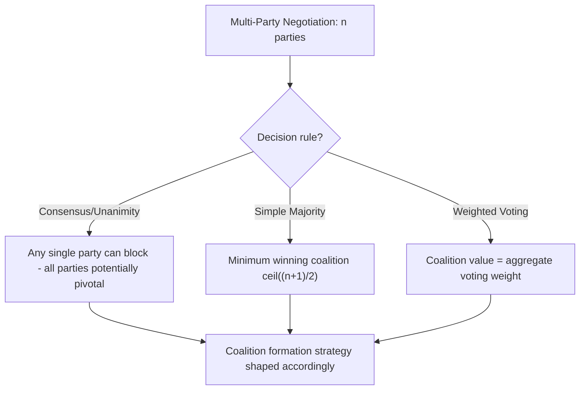
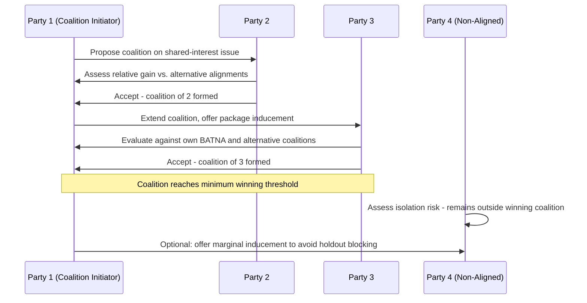

## Multi-Party and Coalition Negotiation Dynamics

### Overview and Analytical Function

Multi-party negotiation introduces structural complexity absent from the bilateral models covered elsewhere in this curriculum (BATNA/ZOPA analysis, distributive/integrative bargaining): the possibility of **coalition formation**, in which subsets of parties align to increase their collective bargaining power relative to non-aligned parties. This transforms the negotiation from a single bilateral value-division or value-creation problem into a combinatorial one, where the identity, stability, and relative power of coalitions themselves become primary strategic variables alongside the substantive issues being negotiated.

**Key Points**

- Multi-party negotiation requires all analytical tools from bilateral negotiation (BATNA, ZOPA, distributive/integrative structure) to be extended across every possible subset of parties, not merely the full group
- Coalitions form around shared interests but are frequently unstable, since a coalition member may have an incentive to defect if a better arrangement becomes available with a different subset of parties
- Multilateral diplomatic processes (treaty negotiations, international organization decision-making) are the paradigmatic real-world context for this dynamic, and consensus-based or supermajority decision rules fundamentally shape which coalitions are viable

### Structural Differences from Bilateral Negotiation

**Combinatorial Complexity**

Where a bilateral negotiation involves one relationship and one ZOPA, an $n$-party negotiation involves up to $2^n - n - 1$ possible non-trivial coalitions (subsets of two or more parties), each with potentially distinct aggregate interests, combined BATNA, and internal distribution questions.

**Sequential vs. Simultaneous Structure**

Multi-party negotiations may proceed as a single simultaneous plenary process (all parties negotiating together) or through sequential bilateral/sub-group tracks that later converge — the choice of structure itself is a strategic decision, since sequential structures allow early coalition formation to shape the agenda before the full group convenes.

**Decision Rule Dependency**

The specific decision rule governing the multilateral body — unanimity/consensus, simple majority, supermajority, or weighted voting — fundamentally determines which coalitions are strategically relevant:

- Under **consensus/unanimity**, any single party can block agreement, making even small or otherwise "weak" parties potentially pivotal
- Under **simple majority**, the minimum winning coalition size is $\lceil (n+1)/2 \rceil$, and coalitions larger than necessary are typically unstable since excess members dilute the per-member share of value
- Under **weighted voting** (as in some international financial institutions), coalition value is a function of aggregate voting weight rather than headcount

### Coalition Formation Dynamics

**Minimum Winning Coalition Theory**

Drawing from coalition theory in political science (notably William Riker's size principle), rational coalitions under competitive, fixed-value conditions tend toward the *minimum* size necessary to prevail, since each additional member dilutes the per-member share of any distributed value. This prediction applies most cleanly to purely distributive multilateral contexts and is substantially modified where integrative trade-offs across issues are possible.

**[Inference]** The size principle's clean prediction of minimum winning coalitions is most applicable to purely distributive, single-issue multilateral contexts; in integrative multi-issue diplomatic negotiations, coalitions are often observed to be larger than the strict minimum, plausibly because broader coalitions can capture more integrative trade-off value across a wider set of interests or provide greater legitimacy to the eventual agreement, though the specific motivations behind any particular coalition's size in a real diplomatic instance are not always directly observable and remain inferential.

**Coalition Stability**

A coalition is stable only if no subset of its members has an incentive to defect and form an alternative arrangement (with each other or with non-coalition parties) that would leave them better off. Instability commonly arises from:

- Uneven internal distribution of the coalition's collective gains, incentivizing under-rewarded members to seek alternative alignment
- Divergent underlying interests among coalition members that were sufficient to align on the immediate issue but diverge on adjacent or subsequent issues
- External inducements offered by non-coalition parties specifically to peel off a marginal coalition member

**Coalition Formation Strategies**

- **Interest-based coalitions**: Formed around genuinely shared substantive interests on the issue at hand
- **Strategic/opportunistic coalitions**: Formed primarily to achieve a specific voting or blocking threshold, with less durable underlying interest alignment
- **Sequential coalition-building**: Approaching potential coalition partners sequentially, often starting with those whose alignment is least costly to secure, to build momentum before approaching more reluctant potential members
- **Package-based coalition inducement**: Offering a potential coalition member a side-benefit on an unrelated issue (log-rolling extended to the multi-party context) to secure their alignment on the primary issue

### Holdout Power and Blocking Dynamics

Under consensus or high-threshold decision rules, a party (or small coalition) that withholds agreement — a **holdout** — can extract disproportionate concessions relative to its size or substantive stake, since its agreement is a necessary condition for the overall deal to proceed.

**[Inference]** Holdout leverage is generally strongest when the holdout's own BATNA (its cost of remaining outside the agreement) is relatively low compared to the cost the remaining parties bear from continued delay or non-agreement, since this asymmetry allows the holdout to extract concessions without incurring proportionate cost itself, though quantifying this asymmetry precisely in any specific multilateral negotiation requires case-specific assessment rather than a general formula.

**Common Responses to Holdout Behavior**

- Side payments or issue-linkage concessions specifically targeted at the holdout's disclosed priorities
- Reputational or relationship costs imposed through the broader group's collective response to persistent holdout behavior
- Procedural mechanisms (sunset clauses, opt-out provisions, variable geometry/differentiated commitments) that allow the broader group to proceed with committed parties while accommodating a holdout's specific reservations without full veto power

### Communication Structures in Multi-Party Settings

**Plenary vs. Contact Group Structures**

Large multilateral negotiations frequently delegate specific issues to smaller **contact groups** or **friends of the chair** groupings, both to manage the combinatorial complexity of full-plenary negotiation on every issue and to allow more candid interest-disclosure among a smaller, more trusted subset before returning proposals to the full plenary for ratification.

**Chair/Facilitator Role**

In consensus-based multilateral processes, the presiding chair or facilitator frequently plays an outsized structural role — drafting compromise texts (analogous to the one-text procedure in bilateral principled negotiation), managing which issues are addressed in plenary versus delegated to contact groups, and gauging emerging consensus to guide the timing of when to present a text for adoption.

### Common Sources of Practical Error

- Treating a multi-party negotiation analytically as a simple aggregation of bilateral relationships, overlooking coalition-specific dynamics that only emerge at the subset level
- Assuming coalition stability based on initial alignment without accounting for internal distribution tensions or external inducements that could later fracture the coalition
- Underestimating small-party holdout leverage under consensus decision rules, based on the party's substantive size or economic weight rather than its structural blocking position
- Failing to adapt strategy to the specific decision rule in force, applying majority-coalition logic to a consensus-based body or vice versa
- Overlooking the strategic significance of sequential coalition-building order, treating the sequence of outreach as incidental rather than deliberately structured

### Practical Application Workflow

**Next Steps**

- Map the full set of parties and the specific decision rule (consensus, majority, weighted voting) governing the multilateral process before developing coalition strategy
- Assess own party's structural position — pivotal, marginal, or dispensable — under the applicable decision rule, independent of raw size or wealth
- Identify potential coalition partners based on genuine interest alignment first, supplementing with package-based inducements where alignment is only partial
- Anticipate and monitor for coalition instability, particularly uneven internal distribution or external inducements targeting individual coalition members
- Where consensus rules apply, prepare holdout-management strategies (side payments, procedural flexibility mechanisms) in advance of anticipated blocking positions

**Related Topics**

- BATNA, ZOPA, and Reservation Points
- Distributive Versus Integrative Bargaining
- Consensus Decision-Making in International Organizations
- Package Deals and Issue Linkage in Multilateral Treaties
- Mediation and Third-Party Facilitation Techniques
- Voting Power Indices in Weighted Multilateral Bodies