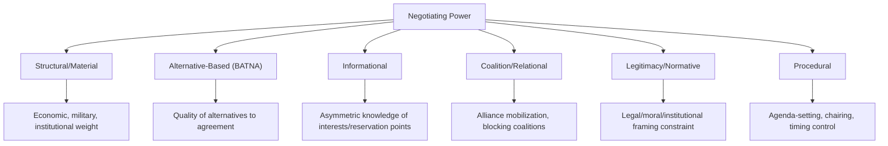
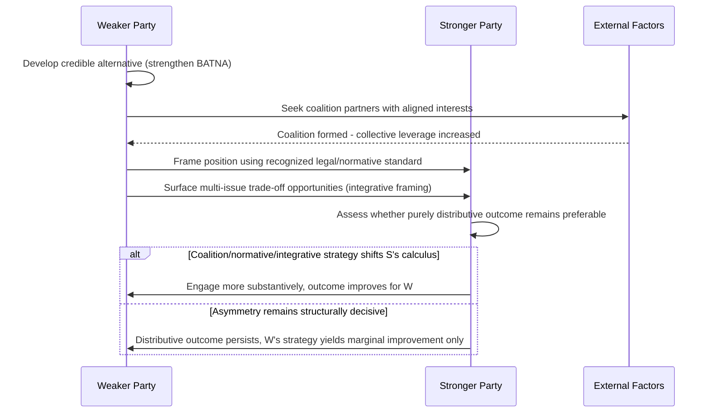

## Power Asymmetries in Negotiation

### Overview and Analytical Function

Power asymmetry refers to structural imbalances between negotiating parties in their relative capacity to influence outcomes, independent of any single negotiation's specific issues. While BATNA analysis (covered elsewhere in this curriculum) provides the core mechanism for assessing negotiating leverage in a given encounter, power asymmetry as a topic addresses the broader, often persistent structural sources of that leverage imbalance — material capability, alternatives, information, coalition access, and legitimacy — and how weaker parties can partially offset structural disadvantage through negotiating strategy rather than raw capability alone.

**Key Points**

- Negotiating power is multidimensional: material/military capability is only one component, and often not the most decisive one in a given negotiation
- A materially weaker party can outperform expected outcomes through superior BATNA development, coalition-building, information asymmetry management, and procedural strategy
- Power asymmetry shapes not only outcome division but which negotiation mode (distributive vs. integrative, positional vs. interest-based) is likely to be operative, since stronger parties often have less incentive to explore integrative alternatives

### Dimensions of Negotiating Power

**Structural/Material Power**

Derived from tangible capability: economic size, military capacity, resource control, population, or institutional weight (e.g., permanent Security Council membership, reserve currency status). This is the most visible but not necessarily the most operative dimension in any specific negotiation.

**Alternative-Based Power (BATNA-Derived)**

As established in BATNA analysis, negotiating power is fundamentally a function of the quality of a party's alternatives to agreement, not its absolute size or wealth. A materially large state with poor alternatives (e.g., high dependency on the specific negotiation succeeding) can hold less negotiating power than a materially smaller state with strong alternatives.

**Informational Power**

Asymmetric access to information — about the counterpart's interests, reservation points, internal political constraints, or about substantive technical matters at issue — can be leveraged independently of material capability.

**Coalition/Relational Power**

The capacity to mobilize allies, form blocking coalitions, or invoke multilateral institutional support (as detailed in Multi-Party and Coalition Negotiation Dynamics) extends a party's effective power beyond its unilateral capability.

**Legitimacy/Normative Power**

The capacity to frame a position as consistent with widely recognized legal, moral, or institutional norms can constrain a materially stronger party's freedom of action, since overt disregard for such norms can carry reputational and coalition-building costs.

**Procedural Power**

Control over negotiation format, agenda-setting, chairing/facilitation roles, or timing can be exercised independently of substantive power, shaping which issues are addressed and in what sequence.

### Power Asymmetry's Effect on Negotiation Mode

**[Inference]** A materially stronger party, facing a weaker counterpart with few alternatives, often has reduced incentive to explore integrative, interest-based approaches, since a purely distributive, positionally imposed outcome may already be favorable without the effort of joint interest exploration; conversely, a weaker party frequently has a stronger structural incentive to seek integrative framing, since expanding the pie through trade-offs may be the only avenue to an outcome better than a purely distributive division would yield, though the specific mode any given stronger party adopts in a real negotiation depends on numerous case-specific factors beyond relative power alone and should not be treated as a fixed rule.

This dynamic has an important implication for the applicability of principled negotiation frameworks: their central claim — that interest-based methods produce more efficient and durable outcomes than positional bargaining — presupposes that value-creating trade-offs exist and that both parties have some incentive to discover them. Where power asymmetry is severe enough that the stronger party can achieve a fully satisfactory outcome without such exploration, that incentive may be structurally absent regardless of the weaker party's preferred approach.

### Strategies for Weaker Parties

**Strengthening BATNA Independent of Material Capability**

Since negotiating power derives substantially from alternatives rather than absolute strength, a materially weaker party's most direct lever is actively developing and signaling credible alternatives — alternative partnerships, appeal to multilateral or judicial forums, or demonstrated capacity for independent action — even where those alternatives are individually less attractive than the primary negotiation succeeding.

**Coalition Formation**

As detailed in Multi-Party and Coalition Negotiation Dynamics, aligning with other similarly positioned parties can convert individually weak bargaining positions into a collectively significant blocking or bargaining coalition, particularly under consensus-based multilateral decision rules where even a coalition of otherwise "weak" parties can hold effective veto power.

**Invoking Legitimacy and Normative Framing**

Framing a position with reference to international law, precedent, or widely recognized normative standards can impose reputational costs on a materially stronger party for disregarding it, partially offsetting pure capability asymmetry — this connects directly to the "objective criteria" principle in principled negotiation, which functions specifically to substitute legitimate external standards for raw power as the basis of resolution.

**Exploiting Integrative Potential**

Because a weaker party often has a stronger incentive to seek value-expanding trade-offs (see above), proactively surfacing multi-issue, differently-prioritized trade opportunities can create negotiating room that a purely distributive framing (favoring the stronger party) would foreclose.

**Managing Information Asymmetry**

Investing in superior information about the counterpart's actual interests, internal constraints, and reservation points can offset material weakness — a well-informed weaker party can negotiate more precisely against a stronger party's actual limits rather than its perceived strength.

### Limits of Strategic Offsetting

**[Inference]** While the strategies above can meaningfully improve a weaker party's outcome relative to a naive baseline, they generally function at the margin rather than fully neutralizing severe underlying structural asymmetry; the negotiation theory literature's claim is that skillful strategy improves outcomes *relative to what unskilled negotiation under the same asymmetry would produce*, not that strategy alone can equalize fundamentally unequal material or alternative-based power, and the degree of achievable offsetting varies substantially by the specific asymmetry's severity and the issue's nature (particularly for issues involving indivisible goods such as territorial sovereignty, where negotiating skill has narrower scope to alter outcomes than in divisible or integrative-issue contexts).

### Common Sources of Practical Error

- Equating negotiating power solely with material/structural capability, overlooking BATNA quality, informational, coalition, and normative dimensions that can substantially modify effective bargaining power
- A weaker party failing to invest in BATNA development, coalition-building, or normative framing under the mistaken assumption that structural weakness makes strategic effort futile
- A stronger party overestimating the durability of a purely distributive outcome imposed on a weaker party, underestimating longer-term relationship, reputational, or coalition-formation costs
- Misreading legitimacy-based or normative appeals as purely rhetorical, when they can carry genuine constraining effect on materially stronger parties concerned with reputation or coalition-building among third parties
- Assuming strategic offsetting can fully neutralize severe underlying asymmetry, leading to unrealistic expectations for a weaker party's achievable outcome

### Practical Application Workflow

**Next Steps**

- Assess negotiating power across all dimensions (material, BATNA-derived, informational, coalition, normative, procedural) rather than defaulting to material capability alone
- For a structurally weaker party, prioritize BATNA development and coalition formation as the most direct available levers before entering substantive negotiation
- Identify and prepare normative or legal framings relevant to the specific issue in advance, to introduce legitimacy-based constraint on a stronger counterpart
- Proactively surface multi-issue trade-off opportunities where a purely distributive framing would structurally favor the stronger party
- Calibrate expectations realistically regarding the achievable degree of outcome improvement given the specific severity of underlying asymmetry and the divisibility of the issues at stake

**Related Topics**

- BATNA, ZOPA, and Reservation Points
- Multi-Party and Coalition Negotiation Dynamics
- Principled Negotiation and Interest-Based Bargaining
- Distributive Versus Integrative Bargaining
- Small State Diplomacy and Strategic Hedging
- International Law as a Constraint on State Behavior