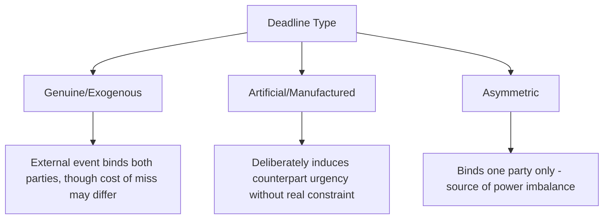
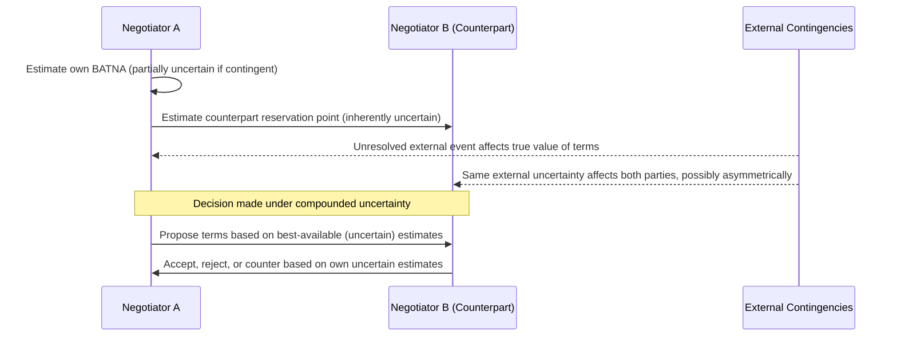

## Negotiating Under Time Pressure and Uncertainty

### Overview and Analytical Function

Time pressure and uncertainty are situational modifiers that interact with — and can substantially distort — the structural and behavioral negotiation dynamics covered elsewhere in this curriculum (BATNA/ZOPA analysis, distributive/integrative structure, power asymmetry). Unlike those topics, which describe relatively stable features of a negotiation's structure, time pressure and uncertainty are *conditions* that can be deliberately manipulated by a negotiating party, imposed by external circumstance, or intrinsic to the subject matter itself, and each materially affects decision quality, concession behavior, and the achievable negotiating outcome.

**Key Points**

- Time pressure and uncertainty are analytically distinct but frequently co-occur and compound each other's effects on negotiator behavior
- Deadlines can be genuine (externally imposed), artificial (tactically manufactured by a party), or asymmetric (binding on one party but not the other), with materially different strategic implications for each
- Uncertainty affects not only outcome values but the reliability of BATNA and reservation-point estimates themselves, compounding the difficulty of rational decision-making under pressure

### Time Pressure: Sources and Typology

**Genuine (Exogenous) Deadlines**

Deadlines arising from circumstances external to either party's negotiating strategy — a treaty's expiration, an upcoming election, a natural or humanitarian crisis timeline, a legislative session's end. These constrain both parties symmetrically if both are bound by the same external timeline, though the *cost* of missing the deadline may still differ substantially between parties.

**Artificial (Tactically Manufactured) Deadlines**

Deadlines deliberately introduced by a negotiating party to induce urgency in the counterpart, without genuine external constraint. A classic distributive/positional tactic, artificial deadlines function to compress the counterpart's decision-making window, reducing their opportunity for full BATNA development, information-gathering, or internal deliberation.

**Asymmetric Deadlines**

Deadlines binding on one party but not the counterpart — for instance, a domestic political calendar requiring one side to reach agreement before a specific date, while the other side faces no equivalent constraint. Asymmetric deadlines are a significant source of negotiating power imbalance, since the unconstrained party can extract disproportionate concessions by simply allowing time to pass.

### Effects of Time Pressure on Negotiator Behavior

**[Inference]** Time pressure is widely observed in negotiation research to compress the negotiating process in ways that generally favor whichever party is less constrained by the deadline, since the constrained party faces increasing incentive to concede as the deadline approaches, independent of whether the terms on offer have genuinely improved; this pattern is a well-established behavioral tendency in negotiation literature rather than a certainty in every specific case, since a well-prepared party can partially resist deadline-induced concession through disciplined adherence to a pre-established reservation point.

**Reduced Information-Gathering and Option Generation**

Time-constrained negotiators have less opportunity to engage in the divergent, non-committal option-generation phase central to interest-based bargaining (see Principled Negotiation and Interest-Based Bargaining), tending to default toward evaluating the first minimally acceptable option rather than exploring the fuller integrative solution space.

**Concession Rate Acceleration Near Deadline**

A frequently observed empirical pattern is that a disproportionate share of total concessions in a negotiation occur in the period immediately preceding a deadline, as parties shift from exploratory to closing-mode behavior — this pattern is sometimes exploited deliberately by parties who withhold their most significant concessions until the deadline's proximity maximizes their leverage effect on the counterpart.

**Deadline-Induced Errors**

Compressed decision timeframes increase the risk of accepting terms below one's actual reservation point (in the rush to conclude), or conversely walking away from a genuinely favorable ZOPA-overlapping agreement due to insufficient time to verify its terms against a properly developed reservation point.

### Uncertainty: Sources and Typology

**Uncertainty About the Counterpart's Interests and Reservation Point**

As established in BATNA/ZOPA analysis, reservation points are typically private information; uncertainty about the counterpart's true reservation point is close to a permanent feature of negotiation rather than a situational modifier, but its *degree* varies and can be deliberately increased or decreased by either party's information-disclosure choices.

**Uncertainty About One's Own BATNA's Value**

Where a party's alternative course of action is itself contingent on unresolved future events (e.g., the outcome of a parallel negotiation track, an uncertain multilateral process, or a contingent unilateral action whose success is not assured), the party's own reservation point becomes difficult to fix with confidence, complicating rational accept/reject decisions.

**Uncertainty About External Contingencies**

Negotiations conducted against a backdrop of unresolved external events (economic conditions, ongoing conflict, pending judicial or legislative outcomes) introduce a further layer of uncertainty, since the eventual value of any negotiated terms may depend on how those external contingencies resolve.

**Uncertainty About Counterpart's Internal Constraints**

In diplomatic settings specifically, uncertainty about a counterpart negotiator's actual authority to bind their government, or about domestic political constraints affecting their genuine flexibility, adds a distinct layer of uncertainty beyond the substantive issues themselves.

### Compounding Effects of Time Pressure and Uncertainty

When time pressure and uncertainty co-occur — a common condition in crisis diplomacy, urgent humanitarian negotiations, or fast-moving security situations — their combined effect is generally more severe than either alone, since compressed time reduces the opportunity to resolve uncertainty through further information-gathering, forcing decisions to be made on the least-refined available estimates of BATNA, reservation points, and counterpart interests.

**Example**

In a crisis negotiation with a genuine, externally imposed deadline (e.g., a hostage situation, an imminent military engagement, or a rapidly deteriorating humanitarian access window), negotiators frequently cannot verify counterpart claims, cannot fully develop alternative courses of action, and cannot await resolution of relevant external contingencies — decisions must be made on provisional, incompletely verified information, with the cost of delay (continued deterioration of the underlying situation) itself factored into the effective reservation point calculation.

### Strategies for Negotiating Under Time Pressure

- **Distinguishing genuine from artificial deadlines**: Investing in verification of whether a stated deadline reflects genuine external constraint or is a tactical construction, since the appropriate response differs substantially (genuine deadlines may require accelerated but still disciplined decision-making; artificial deadlines can often be tested by declining to be rushed)
- **Pre-committing to a reservation point before time pressure intensifies**: Establishing and documenting a reservation point during a calmer preparatory phase, specifically to resist deadline-induced concession drift when pressure peaks
- **Building in procedural time buffers**: Where feasible, negotiating for additional time (an extension, an interim framework, a phased agreement) rather than accepting a compressed final-stage decision under maximal pressure
- **Recognizing and countering deliberate deadline manufacturing**: Naming an apparently artificial deadline explicitly (a technique analogous to the process-naming approach in principled negotiation) can reduce its psychological effect on decision-making

### Strategies for Negotiating Under Uncertainty

- **Explicit scenario planning**: Developing contingent negotiating positions for multiple plausible resolutions of key external uncertainties, rather than committing to a single point-estimate strategy
- **Staged or conditional agreements**: Structuring agreements with built-in review points, sunset clauses, or conditional provisions that allow terms to adjust as uncertainty resolves over time, rather than requiring a single irrevocable commitment under current uncertainty
- **Information-sharing agreements as confidence-building measures**: Where uncertainty stems substantially from counterpart-interest ambiguity rather than genuinely adversarial information withholding, structured mutual disclosure processes can reduce uncertainty for both parties simultaneously
- **Verification and monitoring mechanisms**: For agreements made under uncertainty about future compliance or external contingency resolution, building in verification mechanisms reduces the practical consequence of residual uncertainty at the time of signing

### Common Sources of Practical Error

- Treating all deadlines as equally binding without investigating whether a stated deadline is genuine, artificial, or asymmetric
- Allowing reservation points to drift downward under time pressure without a corresponding actual change in the underlying BATNA's value
- Neglecting scenario planning for key external uncertainties, leading to an agreement optimized for only one possible resolution of a genuinely uncertain contingency
- Over-compressing the option-generation phase under time pressure, defaulting prematurely to the first minimally acceptable option rather than a fuller integrative search
- Failing to build review points or conditional mechanisms into agreements reached under high uncertainty, locking in terms that may prove poorly calibrated once uncertainty resolves

### Practical Application Workflow

**Next Steps**

- Assess and classify any stated deadline as genuine, artificial, or asymmetric before adjusting negotiating strategy in response to it
- Establish and document reservation points during a preparatory phase preceding acute time pressure, to serve as a discipline anchor against concession drift
- Conduct explicit scenario planning for major unresolved external contingencies affecting the negotiation's substantive value
- Where feasible, negotiate for staged, conditional, or reviewable agreement structures rather than single irrevocable commitments under high uncertainty
- Build monitoring or verification provisions into any agreement reached under significant residual uncertainty about future compliance or contingency resolution

**Related Topics**

- BATNA, ZOPA, and Reservation Points
- Principled Negotiation and Interest-Based Bargaining
- Power Asymmetries in Negotiation
- Crisis Diplomacy and Rapid-Response Negotiation
- Confidence-Building Measures in International Relations
- Conditional and Phased Agreement Design in Treaty Drafting