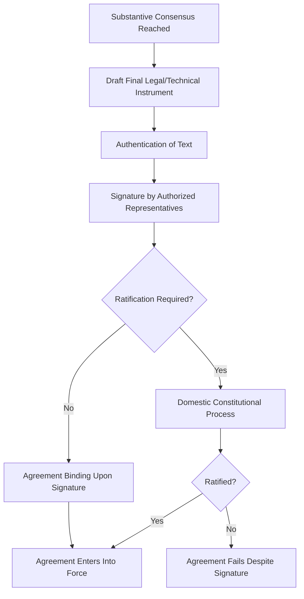
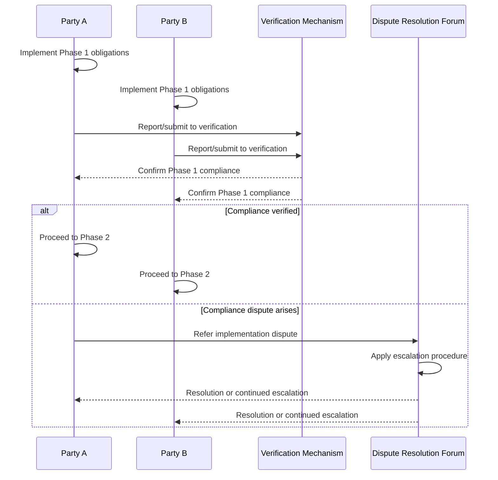

## Closing Agreements and Managing Implementation

### Overview and Analytical Function

Closing agreements and managing implementation address the final and post-agreement phases of the negotiation lifecycle, distinct from the pre-agreement analytical and behavioral frameworks covered elsewhere in this curriculum. A negotiation's substantive success is not fully realized at the moment of signature — an agreement that is poorly closed (ambiguous, inadequately ratified, or unverifiable) or poorly implemented (lacking compliance mechanisms, monitoring, or dispute resolution) can fail to deliver the value that a well-conducted negotiation process achieved on paper. This topic addresses the technical and procedural mechanisms that convert a negotiated understanding into a durable, enforceable, and self-sustaining arrangement.

**Key Points**

- Closing an agreement requires distinguishing between substantive consensus (parties agree on terms) and formal conclusion (the agreement is properly documented, authenticated, and, where required, ratified)
- Implementation failure is a distinct risk category from negotiation failure, and requires its own dedicated design considerations built into the agreement itself, not merely into the negotiating process that produced it
- Ambiguity deliberately or inadvertently left unresolved at closing frequently resurfaces as an implementation dispute, making closing-phase precision a direct determinant of implementation durability

### The Closing Phase: From Consensus to Instrument

**Distinguishing Agreement-in-Principle from Final Instrument**

Negotiators frequently reach substantive consensus on core terms before the full legal or technical instrument is finalized. This gap between agreement-in-principle and a signed, authoritative text is a distinct risk period: positions can shift, domestic political circumstances can change, or drafting choices made in translating consensus into precise legal language can reopen substantive disagreement that appeared resolved.

**Authentication and Signature**

Formal conclusion of a diplomatic agreement typically requires:

- **Authentication** of the final text (confirming the text is the one actually agreed, often through initialing each page or a formal authentication procedure)
- **Signature** by authorized representatives, which may or may not itself create binding obligations depending on the instrument's own terms and the parties' domestic constitutional requirements
- **Ratification** (where required), a subsequent domestic constitutional process (frequently legislative approval) that converts a signed agreement into one binding on the state under international law — the gap between signature and ratification is itself a distinct implementation risk period, since a signed but unratified agreement may ultimately fail domestic approval

**[Unverified]** The specific domestic ratification requirements, timelines, and thresholds vary substantially by state and by the type of instrument (treaty, executive agreement, memorandum of understanding), and should be verified against the specific state's constitutional and statutory framework rather than assumed uniform.

### Precision at Closing: Preventing Deferred Disputes

**Constructive Ambiguity vs. Genuine Ambiguity**

A distinction of practical importance: **constructive ambiguity** is a deliberate drafting choice, where parties knowingly leave a term open to differing interpretation because precise resolution was not achievable at the time, calculating that the agreement's overall value justifies proceeding despite the unresolved point. This differs from **genuine (inadvertent) ambiguity**, where drafters believe a term is settled but it is not, due to imprecise language, translation discrepancies, or unexamined differing assumptions between parties.

**[Inference]** Constructive ambiguity can be a rational and deliberate closing strategy where forcing full precision on a specific point would prevent agreement on the remainder of a valuable overall package, but it carries the acknowledged risk that the deferred issue resurfaces as a genuine implementation dispute once the parties' differing interpretations are tested against real events; whether a specific instance of ambiguity was a wise deliberate trade-off or a costly deferred problem is frequently only assessable in retrospect, after implementation has tested the provision.

**Common Sources of Genuine Ambiguity**

- Differing legal or technical terminology between parties' domestic systems, where a term assumed equivalent across languages or legal traditions in fact carries different substantive content
- Time-pressured final drafting sessions where precision is sacrificed to meet a closing deadline (see Negotiating Under Time Pressure and Uncertainty)
- Multilateral instruments where consensus was reached on general language specifically because more precise language could not secure agreement from all parties simultaneously

### Designing for Implementation at the Closing Stage

Implementation durability is substantially determined by design choices made during closing, not solely by post-agreement diligence. Key mechanisms include:

**Compliance and Verification Mechanisms**

- Reporting requirements (self-reporting by parties on compliance status)
- Independent verification or monitoring bodies (particularly in arms control, environmental, and trade agreements)
- Transparency and information-sharing obligations enabling mutual verification without a dedicated independent body

**Dispute Resolution Provisions**

- Designated forum for resolving implementation disputes (bilateral consultation, arbitration, referral to an international judicial body, or a treaty-specific dispute settlement mechanism)
- Escalation procedures specifying the sequence of steps before a dispute reaches a binding resolution mechanism
- **[Unverified]** The relative effectiveness of different dispute resolution mechanism designs (binding arbitration vs. non-binding consultation, for example) is context-dependent and a subject of ongoing debate in international relations and international law scholarship rather than a settled empirical conclusion applicable uniformly across all agreement types.

**Sunset Clauses, Review Points, and Amendment Procedures**

- Fixed review dates or automatic sunset provisions requiring active renewal, reducing the risk of an agreement persisting unchanged despite substantially changed circumstances
- Amendment procedures specifying how the agreement can be modified without requiring a full renegotiation from first principles

**Sequencing and Phased Implementation**

- Staged implementation schedules, particularly for complex agreements requiring significant domestic legislative or institutional change, with intermediate milestones and corresponding verification checkpoints
- Reciprocal/synchronized implementation provisions, where one party's implementation steps are explicitly contingent on verified implementation steps by the counterpart, reducing the risk of asymmetric compliance

### Managing Implementation Beyond the Agreement Text

**Institutional Ownership and Continuity**

Negotiators who concluded an agreement are frequently not the officials responsible for its implementation, creating a risk of institutional knowledge loss regarding the negotiation's underlying context, intent, and any constructive ambiguities' original rationale. Effective handover from negotiating team to implementing institution is a practical, though often under-formalized, determinant of implementation fidelity.

**Managing Domestic Political Durability**

An agreement's implementation can be disrupted by domestic political change in either party (a change of government with different priorities, shifting legislative majorities affecting funding or ratification of implementing legislation) independent of the agreement's own substantive merit or the counterpart's good faith.

**[Inference]** Because implementation frequently spans a longer timeframe than the negotiation itself, and can outlast the political tenure of the officials who negotiated it, agreements intended for durable implementation are often observed to include institutional or procedural features (independent monitoring bodies, automatic mechanisms not requiring renewed political will at each step) specifically to reduce dependency on the continued political commitment of the original negotiating administrations, though the specific design choices in any given agreement reflect case-specific negotiating judgments not reducible to a single general design principle.

### Common Sources of Practical Error

- Treating signature as equivalent to entry into force, overlooking ratification or other domestic constitutional requirements that may yet cause the agreement to fail
- Allowing constructive ambiguity to be used as a closing-deadline convenience without a clear-eyed assessment of the implementation risk it defers
- Failing to build verification or dispute resolution mechanisms into the agreement itself, relying instead on assumed post-agreement good faith
- Neglecting handover and institutional continuity planning, leaving implementation to officials without access to the original negotiating context and rationale
- Designing implementation timelines and mechanisms without accounting for the risk of domestic political change in either party over the implementation period

### Practical Application Workflow

**Next Steps**

- Distinguish explicitly between agreement-in-principle and final instrument stages, allocating adequate time and precision to the drafting and authentication phase rather than treating it as a formality
- Assess each provision for constructive versus genuine ambiguity risk before finalizing text, consciously deciding where ambiguity is an acceptable trade-off versus where further precision is warranted
- Build verification, dispute resolution, and amendment mechanisms into the agreement's text at the closing stage, rather than deferring these considerations to post-agreement diplomacy
- Establish explicit handover procedures from the negotiating team to the implementing institution, preserving context regarding intent and any deliberate ambiguities
- Where domestic political durability risk is significant, favor institutional or automatic implementation mechanisms less dependent on continued high-level political commitment

**Related Topics**

- Negotiating Under Time Pressure and Uncertainty
- Multi-Party and Coalition Negotiation Dynamics
- Treaty Ratification and Domestic Constitutional Procedures
- Dispute Settlement Mechanisms in International Agreements
- Confidence-Building Measures in International Relations
- Diplomatic Correspondence and Instrument Authentication