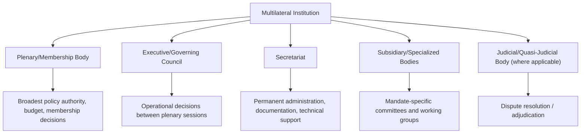
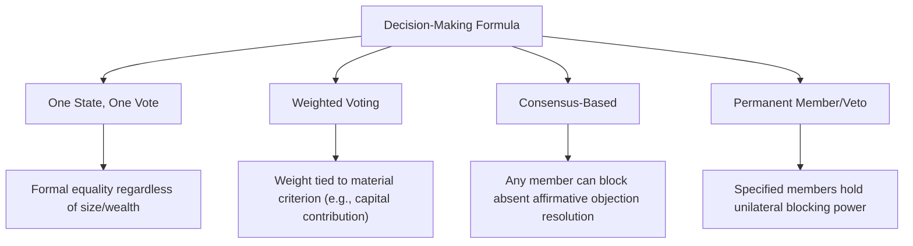

## Structure and Function of Multilateral Institutions

### Overview and Institutional Function

Multilateral institutions are formalized organizational structures through which three or more states (and, increasingly, non-state actors in observer or associated capacities) coordinate policy, negotiate agreements, and manage collective action on matters of shared interest. This topic addresses the generic structural anatomy common across multilateral institutions — irrespective of specific mandate (security, economic, humanitarian, technical) — providing the organizational vocabulary and design logic that underpins later, more specific treatment of individual institutions and conference management practice in this curriculum.

**Key Points**

- Multilateral institutions vary enormously in legal form (treaty-based international organization, informal grouping, ad hoc conference mechanism) but share recurring structural components: a plenary/membership body, an executive or governing council, a secretariat, and subsidiary bodies
- Institutional design choices (membership rules, voting formulas, mandate scope) are themselves the product of negotiation among founding states and continue to shape the institution's practical function long after establishment
- The formal legal structure of an institution and its actual operative influence frequently diverge, since informal practice, dominant-member influence, and evolving custom can substantially modify how a formally symmetric structure functions in practice

### Legal Basis and Institutional Personality

**Treaty-Based International Organizations**

Most formal multilateral institutions are established by a founding treaty (charter, statute, or constitutive instrument) that defines the organization's mandate, membership criteria, organs, and decision-making procedures. Such organizations typically acquire **international legal personality**, enabling them to enter into agreements, hold property, and in some cases be party to legal proceedings independent of any single member state.

**Informal and Non-Treaty Groupings**

Not all multilateral coordination occurs through formal treaty-based organizations. Informal groupings (e.g., summit-level forums without a founding treaty or standing secretariat) coordinate through periodic meetings, rotating chairmanships, and non-binding communiqués, offering flexibility at the cost of the institutional continuity and legal personality a treaty-based body provides.

**[Unverified]** The precise boundary between "informal grouping" and "international organization" in legal scholarship is not always sharply defined, and specific institutions' classification can be contested or evolve over time as practice develops; classification of any specific body should be assessed against its founding instrument (if any) and prevailing international law scholarship rather than assumed from its common informal designation.

### Common Structural Components

**Plenary/Membership Body**

The full assembly of all member states, typically the institution's highest formal authority, responsible for the broadest policy decisions, budget approval, and (where applicable) admission of new members. Meeting frequency varies from continuous session to periodic (annual or less frequent) convening.

**Executive/Governing Council**

A smaller body, often with rotating or partially permanent membership, responsible for more frequent operational decision-making between plenary sessions. Composition may be elected on a rotational basis, weighted by specific criteria (financial contribution, regional representation), or include permanent seats for specified founding or major powers.

**Secretariat**

The institution's permanent administrative and technical staff, headed by a Secretary-General, Director-General, or equivalent, responsible for day-to-day operations, documentation, and often for exercising a degree of independent initiative (good offices, technical proposals) distinct from the political direction of member states.

**Subsidiary and Specialized Bodies**

Committees, working groups, technical commissions, and specialized agencies established under the parent institution's authority to address specific mandate areas in greater depth than the plenary or council can manage directly.

**Judicial or Quasi-Judicial Bodies (where applicable)**

Some multilateral institutions include a dedicated dispute-resolution or adjudicative body, ranging from formal international courts to more limited arbitration or panel mechanisms specific to the institution's mandate (e.g., trade dispute panels).

### Membership Structures and Criteria

**Universal vs. Restricted Membership**

Some institutions (the United Nations being the paradigmatic example) aspire to universal or near-universal state membership, while others are deliberately restricted by region, economic criteria, security alliance, or specific functional qualification.

**Membership Categories**

Beyond full voting membership, institutions frequently define intermediate categories: observer status (participation without full voting rights, often extended to non-member states, other international organizations, or non-state entities), associate membership, and various forms of partnership or dialogue-partner status short of full accession.

**Accession Procedures**

Formal admission of new members typically requires a specified procedure (application, review against membership criteria, vote or consensus of existing members) which can itself become a significant point of negotiation, particularly where existing members hold divergent views on an applicant's eligibility.

### Voting and Decision-Making Formulas

**One State, One Vote**

The most common formula in universal-membership political bodies (e.g., the UN General Assembly), treating all member states as formally equal regardless of size, wealth, or power — though as covered in Power Asymmetries in Negotiation, formal voting equality does not eliminate substantive power asymmetry in practice.

**Weighted Voting**

Used particularly in international financial institutions (e.g., voting shares tied to capital contribution), explicitly linking formal decision-making weight to a specified material criterion rather than treating all members symmetrically.

**Consensus-Based Decision-Making**

Widely used in trade, environmental, and many diplomatic multilateral contexts, requiring the absence of formal objection rather than a specific voting threshold — as detailed in Multi-Party and Coalition Negotiation Dynamics, this formula gives even single small parties potential blocking power.

**Permanent Member/Veto Structures**

A small number of institutions grant specified permanent members a unilateral veto over certain categories of decision (most notably the UN Security Council's five permanent members), a structural feature typically reflecting the specific power distribution at the institution's founding rather than a generic design principle.

### Mandate Types and Institutional Function

**Security and Collective Defense**

Institutions oriented toward collective security, conflict prevention, or mutual defense commitments, with mandate scope ranging from binding collective-defense obligations to non-binding security dialogue.

**Economic and Financial Coordination**

Institutions managing trade rules, development finance, monetary stability, or economic policy coordination, frequently featuring more technical, specialist secretariats and voting formulas linked to financial contribution.

**Humanitarian, Development, and Technical Cooperation**

Institutions coordinating humanitarian response, development assistance, or technical/scientific standard-setting, often characterized by broader membership and less politically contentious decision-making relative to security-mandate institutions, though not immune to political contestation.

**Regional vs. Global Scope**

Institutional mandate may be explicitly regional (bounded membership and jurisdiction to a defined geographic area) or global in aspiration, with regional institutions sometimes serving as a testing ground for cooperative frameworks later emulated or referenced at the global level.

### Divergence Between Formal Structure and Operative Function

**[Inference]** A recurring pattern noted in international relations and institutional scholarship is that an institution's formal legal structure (as codified in its founding treaty) frequently understates or overstates its actual operative influence in specific circumstances — dominant member states may exercise informal influence disproportionate to their formal voting weight through resource contribution, secretariat staffing influence, or agenda-setting practice, while formally powerful bodies can become functionally marginalized if key members routinely bypass them in favor of alternative or informal channels; the specific degree and mechanism of this divergence varies substantially by institution and period, and general claims about any specific institution's operative function should be verified against current scholarship and practice rather than inferred solely from its founding charter.

### Institutional Reform and Evolution

Multilateral institutions frequently face pressure to reform structural features (membership composition, voting formulas, mandate scope) established at founding but viewed as increasingly misaligned with a changed distribution of power or changed functional needs among the membership. Reform is typically difficult to achieve precisely because existing structural advantages (permanent seats, weighted voting shares, veto rights) are held by parties with strong incentive to resist dilution of their own institutional position — a structural echo of the coalition-stability dynamics covered in Multi-Party and Coalition Negotiation Dynamics.

### Common Sources of Practical Error

- Assuming an institution's formal voting or membership structure fully determines its actual operative influence, overlooking informal power dynamics, resource dependency, or agenda-setting control
- Conflating "informal grouping" and "formal international organization" without assessing the specific institution's founding instrument and legal personality status
- Treating institutional reform as primarily a technical or administrative matter, underestimating the coalition-stability and power-preservation dynamics that make structural reform politically difficult
- Overlooking the practical significance of observer or intermediate membership categories, which can carry substantive participatory rights despite lacking full voting status
- Assuming uniform decision-making procedures across an institution's various organs, when plenary, council, and subsidiary bodies frequently operate under distinct voting or consensus formulas within the same institution

### Practical Application Workflow

**Next Steps**

- Identify the specific legal basis (treaty-based vs. informal) and resulting legal personality status of any institution before assessing its binding capacity
- Map the institution's full organizational anatomy — plenary, council, secretariat, subsidiary bodies, and any judicial mechanism — rather than assuming a uniform generic structure
- Determine the specific voting/decision-making formula applicable to each relevant organ within the institution, since these frequently differ within a single institution
- Assess actual operative influence through current practice and scholarship, rather than inferring functional power solely from formal structural provisions
- Where engaging with institutional reform processes, anticipate resistance from structurally advantaged members and plan coalition or incremental-reform strategies accordingly

**Related Topics**

- Multi-Party and Coalition Negotiation Dynamics
- Consensus Decision-Making in International Organizations
- Voting Power Indices in Weighted Multilateral Bodies
- Secretariat Independence and Good Offices Functions
- Regional Organizations and Subsidiarity in Global Governance
- Treaty Ratification and Domestic Constitutional Procedures