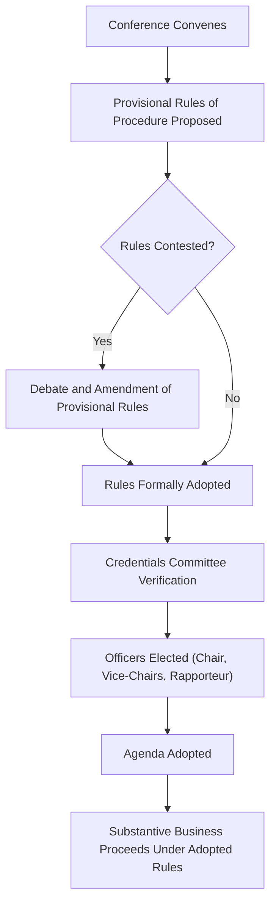
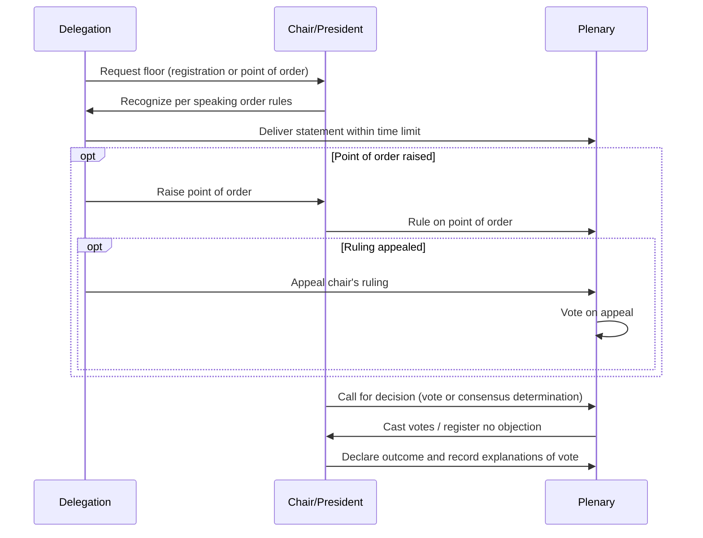

## Conference Diplomacy and Procedural Rules

### Overview and Analytical Function

Conference diplomacy refers to the conduct of multilateral negotiation and decision-making through formally convened, time-bounded gatherings — as distinct from the standing institutional structures covered in Structure and Function of Multilateral Institutions. While standing institutions provide the ongoing organizational architecture, conference diplomacy concerns the specific procedural machinery (rules of procedure, agenda control, credentials, voting mechanics) that governs how a particular convened meeting or negotiating round actually functions from opening to closure. Mastery of procedural rules is frequently as consequential to outcomes as substantive negotiating skill, since control over process can determine which proposals receive a hearing, in what sequence, and under what decision threshold.

**Key Points**

- Rules of procedure are typically adopted at the outset of a conference and, once adopted, constrain the conduct of all subsequent business, making the procedural adoption stage itself a significant point of strategic contest
- Agenda-setting, credentials verification, and the sequencing of debate are procedural levers with substantive consequence, frequently underappreciated relative to the negotiation of substantive text itself
- Formal procedural rules coexist with informal conference practice (corridor diplomacy, contact groups, chair's compromise texts) that often does the actual substantive work the formal plenary later ratifies

### Rules of Procedure: Adoption and Function

**Provisional vs. Permanent Rules**

Conferences typically open under provisional rules of procedure (often carried over from a predecessor conference or a model set proposed by the host/secretariat), which are then formally adopted, amended, or replaced by the assembled parties as an early item of business. This adoption stage is itself substantively consequential: a party seeking to shape subsequent proceedings favorably has strong incentive to contest procedural rules before they are locked in, since procedural change becomes markedly harder to secure once rules are adopted and precedent begins to accumulate.

**Core Elements Typically Governed by Rules of Procedure**

- Composition and credentialing of delegations
- Officers of the conference (President/Chair, Vice-Chairs, Rapporteur) and their powers
- Agenda adoption and modification procedures
- Committee and subsidiary body structure
- Rules governing debate (speaking order, time limits, right of reply)
- Voting procedures and required majorities/thresholds
- Rules for amendments, motions, and points of order
- Provisions for observer participation

### Credentials and Representation

**Credentials Verification**

Before a delegation may participate with full rights (particularly voting rights), most conferences require verification that its representatives hold proper authorization from their government — typically reviewed by a dedicated Credentials Committee, whose report is then adopted (or, occasionally, contested) by the plenary.

**Credentials Disputes as Political Contests**

Credentials challenges are occasionally used as a proxy mechanism for broader political disputes — challenging a delegation's credentials can function as an indirect means of contesting the legitimacy of the government it represents, particularly in cases of contested governmental authority (post-coup situations, competing claimant governments) — rather than reflecting a genuine technical defect in the documentary credentials themselves.

**[Inference]** Because credentials challenges can serve this dual technical/political function, a credentials dispute's resolution frequently carries significance well beyond the specific conference at hand, potentially functioning as a broader signal of collective recognition or non-recognition of a contested government, though the specific political weight attached to any particular credentials decision depends on the surrounding diplomatic context and is not a fixed or automatic legal consequence of the credentials ruling itself.

### Agenda Control

**Agenda-Setting as Strategic Leverage**

Control over what is included on, or excluded from, a conference agenda — and the sequence in which agenda items are addressed — is a significant procedural lever, since an item never placed on the agenda cannot be substantively negotiated, and sequencing can affect which issues are resolved (and thus which parties' negotiating leverage is spent) before other issues are reached.

**Agenda Amendment Procedures**

Most rules of procedure specify a threshold and process for amending an adopted agenda (adding, removing, or reordering items), which is typically higher than the threshold for ordinary decisions, reflecting agenda stability's role in enabling orderly preparation by all parties.

### Officers and the Role of the Chair

**Election and Powers of the Chair/President**

The presiding officer, typically elected at the conference's outset (sometimes through regional rotation conventions rather than open contest), holds significant procedural authority: recognizing speakers, ruling on points of order, determining when consensus has been reached (in consensus-based bodies), and often playing a central role in drafting compromise text.

**The Chair's Text and Facilitative Drafting**

In many multilateral negotiations, the chair (or an appointed facilitator) produces a "chair's text" — a single evolving draft that synthesizes proposals and disagreement into one document for the parties to react to, functioning analogously to the one-text procedure described in Principled Negotiation and Interest-Based Bargaining, but exercised through a formally recognized procedural office rather than an ad hoc facilitator.

**Impartiality Expectations and Limits**

While chairs are conventionally expected to exercise their procedural powers impartially, the chair's discretion over recognition order, timing of consensus determination, and text drafting inevitably carries substantive influence — **[Inference]** the degree to which any specific chair's exercise of discretion is perceived as neutral facilitation versus subtle advancement of a particular substantive outcome is frequently contested among parties in real conference practice, and general claims about chair impartiality should not be assumed uniformly true across all instances without case-specific assessment.

### Rules Governing Debate

**Speaking Order and Time Limits**

Rules of procedure typically specify how the floor is allocated (registration order, regional group rotation, or a combination), and often impose time limits on individual statements, particularly at conferences with many participating delegations and limited plenary time.

**Points of Order**

A procedural mechanism allowing a delegate to interrupt ongoing proceedings to raise a claimed violation of the rules of procedure themselves, distinct from substantive debate; the chair rules on points of order, subject in most rules to an appeal mechanism to the full body.

**Right of Reply**

A specific procedural allowance, typically granted after general debate has concluded, permitting a delegation to respond to statements made by other delegations that directly referenced or criticized it, usually subject to tighter time limits than general statements.

### Voting Procedures and Thresholds

As detailed more fully in Structure and Function of Multilateral Institutions, conferences may operate under one-state-one-vote, weighted voting, or consensus formulas; procedurally, rules of procedure additionally specify:

- **Quorum requirements**: The minimum attendance or representation threshold required for a vote (or sometimes for the conference to conduct any business) to be validly conducted
- **Methods of voting**: Show of hands, roll call, or secret ballot, with the chosen method sometimes itself a point of procedural contest since visibility of individual votes carries different political consequences than anonymous balloting
- **Explanation of vote**: A procedural allowance for delegations to place their reasoning for a vote (particularly abstentions or votes against an otherwise widely supported measure) on the formal record

### Informal Mechanisms Operating Alongside Formal Procedure

**Contact Groups and Informal Consultations**

As noted in Multi-Party and Coalition Negotiation Dynamics, much substantive negotiation at large conferences occurs in smaller contact groups, "friends of the chair" groupings, or informal corridor consultations, with the formal plenary session frequently serving primarily to ratify agreements substantially reached through these informal channels rather than to conduct the actual negotiation itself.

**[Inference]** This divergence between formal procedural venue and actual site of substantive negotiation is a widely recognized feature of large multilateral conference practice, reflecting the practical difficulty of conducting genuine multi-party negotiation (as opposed to formal statement-reading) within a large plenary format, though the specific balance between formal and informal negotiating activity varies by conference size, mandate, and institutional culture.

### Common Sources of Practical Error

- Underestimating the strategic significance of the rules-of-procedure adoption stage, treating it as a mere formality rather than an opportunity to shape subsequent proceedings favorably
- Failing to anticipate credentials challenges as potential proxy contests for broader political disputes, particularly regarding delegations from states with contested governmental legitimacy
- Neglecting early engagement in informal contact-group or corridor consultation processes, relying instead on formal plenary statements to advance substantive positions
- Assuming chair impartiality without accounting for the chair's genuine discretionary influence over recognition, text drafting, and consensus determination
- Overlooking agenda-control opportunities at the conference's outset, allowing unfavorable issue sequencing to be locked in before substantive engagement begins

### Practical Application Workflow

**Next Steps**

- Review and, where advantageous, contest provisional rules of procedure before their formal adoption, rather than treating this stage as procedural formality
- Verify credentials procedures and anticipate potential credentials disputes, particularly regarding delegations whose governmental legitimacy may be contested by other parties
- Engage proactively in agenda-setting negotiations at the conference's outset, since sequencing and inclusion decisions shape the substantive negotiating landscape that follows
- Prioritize early participation in informal contact groups and chair consultations, recognizing that substantive resolution frequently occurs outside the formal plenary
- Prepare procedural tools (points of order, rights of reply, voting method preferences) in advance for use at appropriate moments during formal proceedings

**Related Topics**

- Structure and Function of Multilateral Institutions
- Multi-Party and Coalition Negotiation Dynamics
- Consensus Decision-Making in International Organizations
- Credentials Presentation Ceremonies
- Principled Negotiation and Interest-Based Bargaining
- Recognition of Governments and Contested Legitimacy in International Law