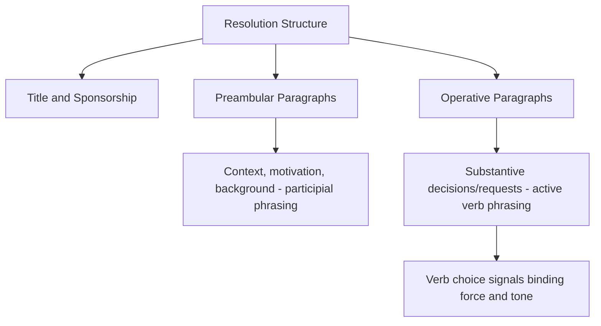
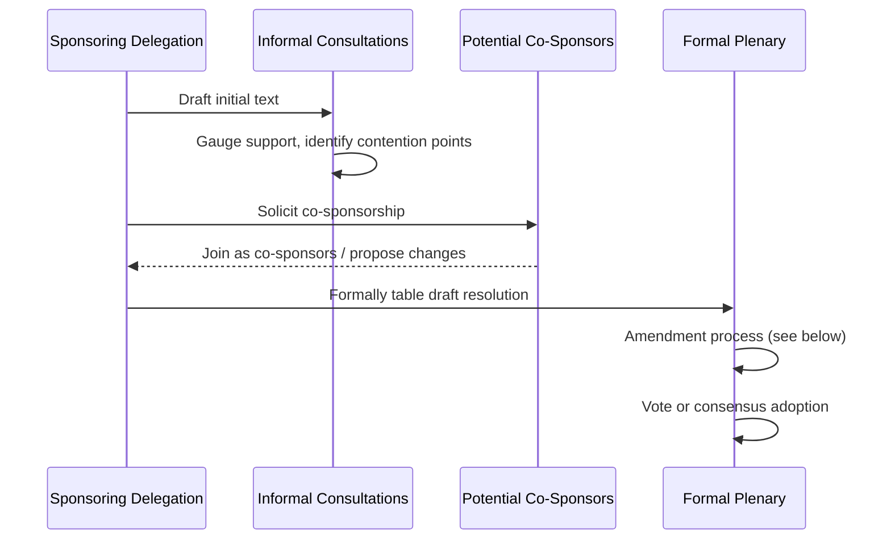

## Drafting and Adopting Resolutions

### Overview and Analytical Function

Resolutions are the primary written output through which multilateral bodies formally record decisions, express collective positions, or authorize action, operating within the procedural framework established under Conference Diplomacy and Procedural Rules. This topic addresses the specific technical craft of resolution drafting — structural conventions, language calibration, and the amendment and adoption process — which determines both a resolution's substantive content and its practical legal or political weight once adopted.

**Key Points**

- Resolution drafting follows highly conventionalized structural and linguistic patterns that carry specific interpretive significance, meaning departures from convention are themselves substantively meaningful
- The distinction between binding and non-binding resolutions is a critical determinant of legal effect, and depends on the specific institution's constitutive instrument rather than a resolution's language alone
- The amendment process during adoption is frequently where a resolution's actual substantive content is finally settled, often diverging significantly from the originally tabled draft

### Structural Anatomy of a Resolution

**Title and Sponsorship**

A resolution's title identifies its subject matter and typically records its sponsoring delegation(s) or the body adopting it; co-sponsorship (additional delegations formally joining as sponsors before adoption) is itself a signal of building political support and is often actively solicited during the drafting phase.

**Preambular Paragraphs**

The preamble sets out context, motivation, and relevant background — recalling prior resolutions or legal instruments, noting relevant facts or circumstances, and expressing the sponsoring party's or body's underlying concerns. Preambular paragraphs conventionally begin with a participial or gerund phrase (e.g., "Recalling," "Noting with concern," "Reaffirming," "Emphasizing") and are not typically understood as themselves creating binding obligations, but rather as establishing interpretive context for the operative paragraphs that follow.

**Operative Paragraphs**

The substantive core of the resolution, setting out decisions, requests, recommendations, or authorizations. Operative paragraphs are numbered sequentially and conventionally begin with an active verb (e.g., "Decides," "Calls upon," "Requests," "Urges," "Authorizes," "Condemns"), with the specific verb chosen carrying significant interpretive weight regarding the resolution's intended binding force and tone.

### Verb Choice and Interpretive Significance

The specific verbs used in operative paragraphs are highly conventionalized and carry differentiated interpretive weight, roughly ordered here from strongest to more suggestive:

- **"Decides"** — typically the strongest formulation, used where the adopting body intends to establish a binding determination (subject to the institution's own constitutive rules regarding which bodies can adopt binding decisions)
- **"Demands"** — a strong, non-negotiable-toned formulation, frequently used in security-related resolutions directed at a specific party's conduct
- **"Authorizes"** — grants permission or mandate for specific action, commonly used to empower a subsidiary body, secretariat, or member states to take defined action
- **"Calls upon" / "Urges"** — a strong exhortation falling short of a binding demand, frequently used where the adopting body lacks binding authority over the addressed party or chooses not to exercise it
- **"Requests"** — typically directed at the institution's own secretariat or subsidiary bodies, asking for a report, study, or specific administrative action
- **"Encourages" / "Invites"** — among the softer formulations, signaling support for a course of action without asserting binding or even strongly exhortative force
- **"Notes" / "Takes note of"** — among the weakest operative formulations, often used to acknowledge a report or development without expressing either approval or binding consequence, and sometimes deployed as a deliberately ambiguous compromise formulation

**[Inference]** Because verb selection carries this differentiated interpretive weight, the specific verb used in a contested operative paragraph is frequently itself a significant point of negotiation during resolution drafting, since parties favoring stronger action will push for verbs like "decides" or "demands" while parties seeking to moderate the resolution's force will push toward "calls upon," "encourages," or "notes"; the eventual verb choice is often as much a negotiated outcome as the substantive content it introduces, though the precise interpretive consequence of any specific verb choice also depends on the adopting body's own constitutional authority and established institutional practice.

### Binding vs. Non-Binding Resolutions

**Institutional Authority as the Determining Factor**

Whether a resolution creates binding legal obligations depends fundamentally on the adopting body's constitutive authority to create binding decisions in the relevant subject area — not on the resolution's own language alone. A resolution phrased with strong operative language ("decides," "demands") adopted by a body lacking constitutional authority to bind member states in that domain remains non-binding as a matter of law, however forcefully worded, though it may carry significant political weight.

**Example**

Resolutions of the UN Security Council adopted under Chapter VII of the UN Charter are widely recognized as creating binding obligations on member states, reflecting the Security Council's specific constitutional authority in matters of international peace and security; resolutions of the UN General Assembly, by contrast, are conventionally understood as recommendatory rather than binding, reflecting the General Assembly's more limited constitutional authority, irrespective of how strongly worded a specific General Assembly resolution's operative paragraphs may be.

**[Unverified]** The precise legal effect of specific resolutions, particularly regarding contested questions of customary international law formation through repeated General Assembly practice, remains a subject of ongoing debate in international law scholarship rather than a settled and uniform rule; assessment of any specific resolution's legal weight should reference current international law scholarship and the specific institution's constitutive instrument rather than a general assumption.

### The Drafting and Sponsorship Process

**Initial Drafting**

Resolutions are typically drafted by a sponsoring delegation or group of delegations, frequently in informal consultation with likely supporters before formal tabling, to gauge support and identify likely points of contention in advance.

**Co-Sponsorship Solicitation**

Sponsors actively solicit additional co-sponsors before and during formal consideration, since a broader co-sponsorship base signals wider political support and can influence the resolution's eventual reception, independent of its substantive content.

**Informal Negotiation and Contact Groups**

As detailed in Conference Diplomacy and Procedural Rules, much of the substantive negotiation over a resolution's text occurs in informal consultations or contact groups rather than in formal plenary debate, with the plenary session frequently functioning primarily to formally table, amend, and adopt a text substantially settled through prior informal process.

### Amendment Procedures During Adoption

**Formal Amendment Process**

Rules of procedure (see Conference Diplomacy and Procedural Rules) typically specify how amendments to a tabled draft resolution may be proposed, the required notice period, and the voting sequence — amendments are conventionally voted upon before the resolution as a whole, since their adoption or rejection determines the final text subsequently voted on in its entirety.

**Friendly vs. Contested Amendments**

A "friendly amendment," accepted by the original sponsor(s) without requiring a separate vote, differs from a contested amendment, which requires the formal amendment voting procedure and may pass or fail independent of the sponsor's preference, potentially altering the resolution against its original sponsors' wishes.

**Paragraph-by-Paragraph vs. En Bloc Voting**

Some rules of procedure permit delegations to request a separate vote on specific paragraphs of a resolution (rather than only an up-or-down vote on the whole text), allowing a delegation to formally register opposition to a specific provision while still supporting (or not blocking) the resolution's adoption overall.

### Adoption Formalities

**Vote or Consensus**

Consistent with the applicable decision-making formula (see Structure and Function of Multilateral Institutions), a resolution is adopted either through a formal vote meeting the required threshold or through consensus (absence of formal objection).

**Explanations of Vote and Position**

Delegations dissenting from, abstaining on, or otherwise wishing to qualify their support for an adopted resolution frequently deliver a formal explanation of vote or explanation of position for the record — this allows a delegation to formally register reservations about specific interpretive points even while joining consensus or voting in favor overall.

### Common Sources of Practical Error

- Treating a resolution's strong operative language as conclusive evidence of binding legal effect, without verifying the adopting body's actual constitutional authority
- Underestimating the negotiating significance of verb choice in contested operative paragraphs, treating language differences as merely stylistic rather than substantively consequential
- Neglecting early informal consultation and co-sponsorship solicitation, relying instead on the formal plenary process to build support for a tabled draft
- Failing to anticipate and prepare for contested amendments that could substantially alter a resolution's content during the adoption process
- Overlooking the availability of paragraph-by-paragraph voting or explanations of position as tools for registering qualified support without blocking overall adoption

### Practical Application Workflow

**Next Steps**

- Draft resolution text using conventional preambular/operative structure, deliberately selecting operative verbs calibrated to the intended binding force and political tone
- Verify the adopting body's constitutional authority to create binding obligations in the relevant subject area before assuming a specific verb choice will carry binding legal effect
- Conduct informal consultations and solicit co-sponsorship before formal tabling, to build support and identify contentious provisions in advance
- Anticipate likely contested amendments and prepare negotiating positions on which provisions are open to friendly amendment versus firm sponsor positions
- Prepare an explanation of vote or position where qualified support, abstention, or dissent on specific provisions is anticipated

**Related Topics**

- Conference Diplomacy and Procedural Rules
- Structure and Function of Multilateral Institutions
- Multi-Party and Coalition Negotiation Dynamics
- Consensus Decision-Making in International Organizations
- Chapter VII Authority and UN Security Council Binding Decisions
- Customary International Law Formation Through State Practice