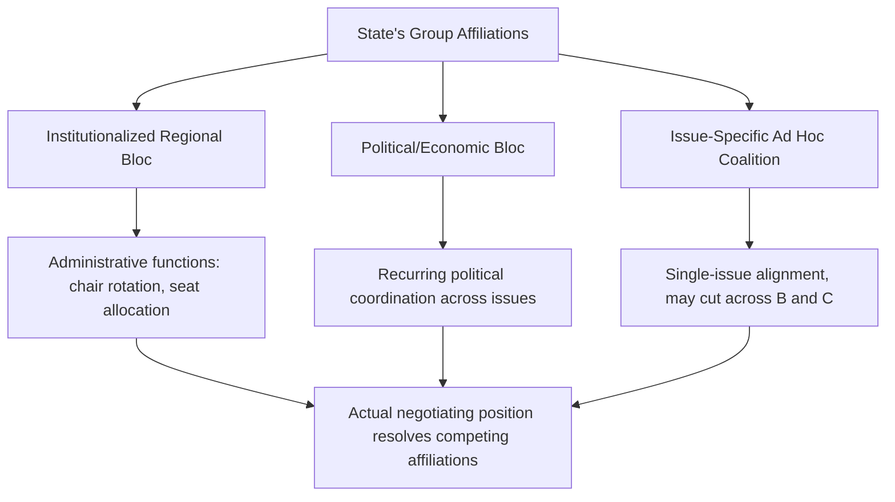
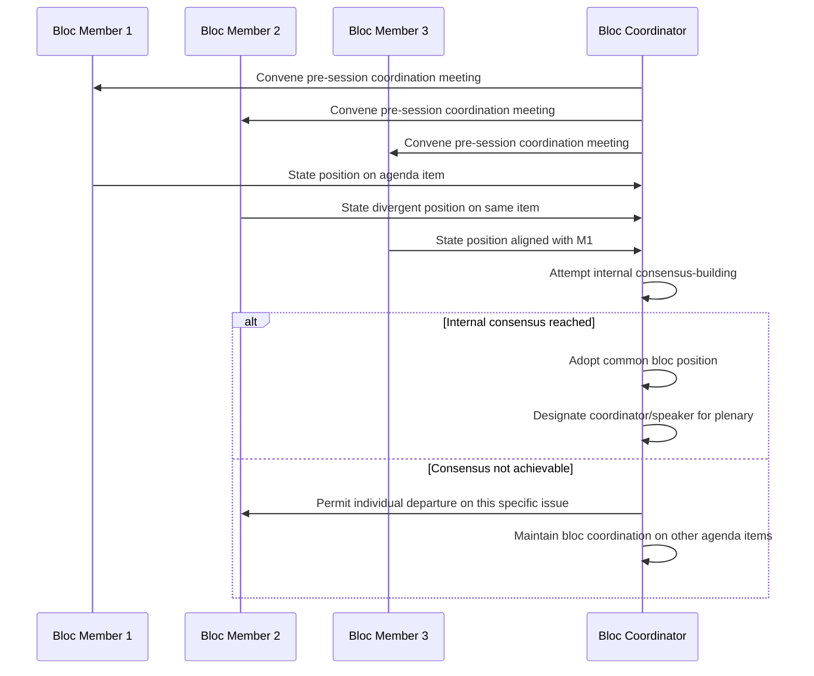

## Coalition-Building and Bloc Politics

### Overview and Analytical Function

Coalition-building and bloc politics address the durable, institutionalized forms of multi-party alignment that operate within and across multilateral conferences and institutions, extending the more general coalition-formation dynamics introduced under Multi-Party and Coalition Negotiation Dynamics into their specific multilateral-diplomacy manifestation. Where the earlier treatment addressed coalition formation as a generic negotiating phenomenon, this topic focuses on **blocs** — relatively stable, often institutionalized groupings that persist across multiple negotiations and conferences, shaping agenda-setting, speaking order, and voting behavior as a matter of established diplomatic practice rather than issue-specific tactical alignment.

**Key Points**

- Blocs differ from ad hoc coalitions primarily in durability and institutionalization: blocs persist across issues and over time, while coalitions in the generic sense may form around a single issue and dissolve once it is resolved
- Regional groups, in many multilateral institutions, perform formal administrative functions (rotating chairmanships, candidate slating) in addition to their informal political coordination role
- Bloc discipline is never absolute — internal divergence on specific issues is common, and a bloc's practical negotiating weight depends heavily on the degree of internal cohesion it can maintain on any given matter

### Blocs vs. Ad Hoc Coalitions: Structural Distinction

**Institutionalized Regional and Political Blocs**

Many multilateral institutions formally recognize regional or political groupings as part of their institutional architecture — used for administrative purposes such as rotating committee chairmanships, allocating seats on governing councils, or organizing regional consultation meetings ahead of plenary sessions. These groupings typically have a long institutional history, established internal coordination practices, and often a semi-permanent coordinating mechanism (a rotating regional chair, a group secretariat, or regular pre-session coordination meetings).

**Issue-Specific or Ad Hoc Coalitions**

As detailed in Multi-Party and Coalition Negotiation Dynamics, coalitions may also form around a specific negotiating issue, cutting across established regional or political blocs, and dissolve once that issue is resolved. Such coalitions may draw members from multiple institutionalized blocs simultaneously where shared interest on the specific issue outweighs bloc affiliation.

**Overlapping Membership**

A single state is frequently a member of multiple blocs and potential ad hoc coalitions simultaneously (a regional group, an economic-interest grouping, an issue-specific coalition), and its actual negotiating behavior on any given matter reflects a resolution of these potentially competing affiliations rather than membership in a single determining group.

### Functions of Institutionalized Blocs

**Pre-Session Coordination**

Regional and political blocs frequently hold internal coordination meetings before formal plenary sessions to develop common positions, identify internal divergences requiring further negotiation within the bloc, and select speakers or coordinators to represent agreed common positions in plenary.

**Administrative Slating and Rotation**

Many institutions allocate committee chairmanships, governing council seats, or other institutional positions on a rotating basis among recognized regional groups, with the specific individual or state nominee typically determined through internal bloc consultation before formal presentation to the wider body — reducing open contest over positions that could otherwise consume significant plenary time and generate cross-bloc friction.

**Collective Bargaining Weight**

A cohesive bloc speaking with a coordinated position carries negotiating weight beyond the sum of its individual members' isolated influence, consistent with the coalition-power dynamics described in Multi-Party and Coalition Negotiation Dynamics — this is a primary incentive for smaller or less individually influential states to invest in bloc coordination.

**Agenda and Procedural Influence**

Blocs frequently coordinate on procedural matters (rules of procedure adoption, agenda sequencing, credentials positions) as described in Conference Diplomacy and Procedural Rules, since procedural coordination requires less substantive internal agreement than full policy alignment and can still yield meaningful collective influence.

### Bloc Cohesion and Internal Divergence

**[Inference]** Bloc cohesion is rarely complete across all issues, since member states within even a well-institutionalized bloc frequently retain distinct national interests that diverge on specific substantive matters even while sharing regional or political affiliation for administrative and general coordination purposes; the practical negotiating weight a bloc can bring to bear on any specific issue is therefore contingent on the degree of internal consensus achieved on that particular matter, which varies issue by issue rather than being a fixed characteristic of the bloc itself.

**Sources of Internal Divergence**

- Differing levels of economic development or strategic interest among bloc members on a specific issue
- Bilateral relationships with external parties that create cross-cutting pressure inconsistent with the bloc's general position
- Domestic political considerations specific to an individual member state that are not shared by the bloc as a whole
- Historical or ongoing bilateral disputes between bloc members themselves, limiting the depth of coordination achievable even on matters of general regional interest

**Managing Internal Divergence**

Blocs typically employ internal consensus-building mechanisms analogous to the multilateral consensus-building addressed in Consensus Decision-Making in International Organizations, scaled down to the bloc level — internal negotiation to develop a common position, or, where full consensus is unachievable, an agreement to "agree to disagree" and allow individual members to depart from the general bloc position on the specific contested point without withdrawing from the bloc's broader coordination on other matters.

### Cross-Bloc Coalition Formation

**Issue-Specific Cross-Bloc Alignment**

Because institutionalized blocs are frequently organized around regional or historical-political criteria rather than substantive policy alignment on every issue, ad hoc coalitions frequently form across bloc lines where states from different regional or political groupings share a specific interest on a particular matter (e.g., states with a shared economic profile, environmental vulnerability, or security concern spanning multiple regions).

**Bridging and Coordinating Roles**

States with membership or strong relationships across multiple blocs sometimes play a bridging role, facilitating communication or compromise text development between blocs that might otherwise have limited direct coordination channels — a function related to but distinct from the chair's facilitative role described in Conference Diplomacy and Procedural Rules, since a bridging state acts from within its own negotiating position rather than from a position of procedural neutrality.

### Bloc Politics and Voting Behavior

**Bloc Voting as a Predictive and Analytical Tool**

Observing historical bloc voting patterns is a common analytical technique for anticipating likely outcomes on a pending resolution or decision, since bloc cohesion on a given issue type can often be estimated from prior voting behavior on comparable matters — though, consistent with the internal divergence discussion above, such predictions carry meaningful uncertainty and should not be treated as deterministic.

**Strategic Implications for Non-Bloc-Aligned Parties**

A state or delegation without strong bloc affiliation, or facing a matter where its own bloc is internally divided, must rely more heavily on the generic coalition-building and BATNA-based negotiating strategies described elsewhere in this curriculum, since it cannot draw on institutionalized bloc coordination and collective weight in the same manner as a state with strong, cohesive bloc backing on the specific issue at hand.

### Common Sources of Practical Error

- Assuming uniform bloc cohesion across all issues, leading to inaccurate predictions of a bloc's collective position or voting behavior on a specific contested matter
- Overlooking the distinct administrative functions institutionalized blocs perform (chair rotation, seat slating) as separate from their informal political coordination role, conflating the two functions inappropriately
- Failing to identify potential cross-bloc coalition opportunities on issues where regional or political bloc lines do not align with the substantive interest structure at stake
- Treating a bridging state's facilitative role as equivalent to a procedurally neutral chair's role, overlooking that a bridging state continues to act from its own negotiating position
- Relying on historical bloc voting patterns as a deterministic predictor without accounting for issue-specific internal divergence that may deviate from historical pattern

### Practical Application Workflow

**Next Steps**

- Map relevant institutionalized bloc structures and administrative functions (chair rotation, seat allocation conventions) applicable to the specific multilateral body in question
- Assess likely internal bloc cohesion on the specific issue at hand, rather than assuming uniform bloc-wide alignment based on general regional or political affiliation
- Identify potential cross-bloc coalition opportunities where substantive interest alignment cuts across institutionalized bloc lines
- Where representing a state with weak or internally divided bloc affiliation, prioritize generic coalition-building and BATNA development strategies over reliance on bloc coordination
- Use historical bloc voting pattern analysis as one input among several for outcome prediction, calibrated against issue-specific factors likely to produce divergence from historical pattern

**Related Topics**

- Multi-Party and Coalition Negotiation Dynamics
- Conference Diplomacy and Procedural Rules
- Structure and Function of Multilateral Institutions
- Consensus Decision-Making in International Organizations
- Drafting and Adopting Resolutions
- Power Asymmetries in Negotiation