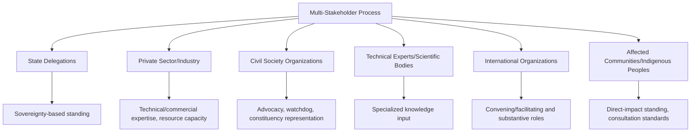
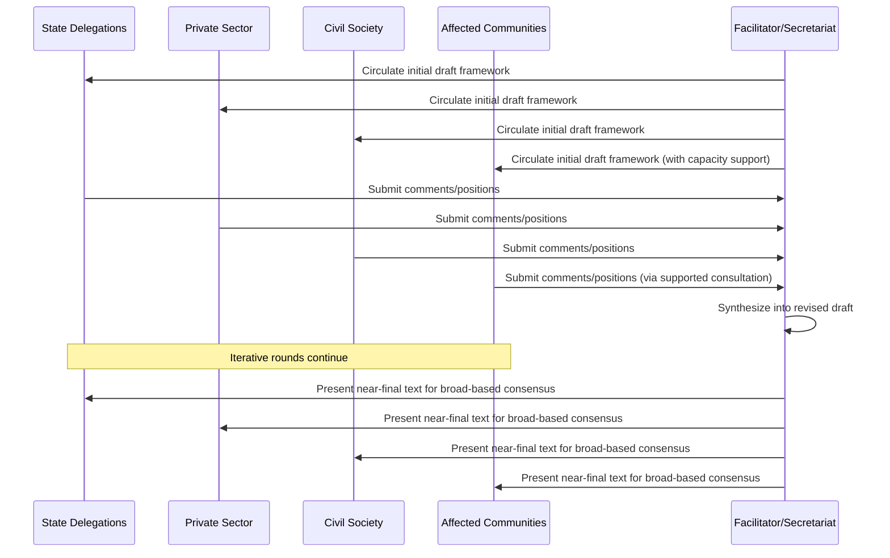

## Consensus-Building in Multi-Stakeholder Settings

### Overview and Analytical Function

Multi-stakeholder settings extend the consensus-building challenge beyond the state-centric multilateral diplomacy addressed elsewhere in this curriculum to encompass negotiating environments where non-state actors — civil society organizations, private sector representatives, technical experts, international organizations, and sometimes affected communities directly — participate alongside or instead of states as principal negotiating parties. This topic addresses the distinct structural and procedural challenges this expanded participant base introduces, building on but materially extending the state-focused consensus and coalition frameworks covered under Consensus Decision-Making in International Organizations and Multi-Party and Coalition Negotiation Dynamics.

**Key Points**

- Multi-stakeholder processes typically lack a single, uniform decision-making authority equivalent to state sovereignty, requiring bespoke legitimacy and participation frameworks rather than relying on established state-diplomatic procedure
- Power and resource asymmetries between stakeholder categories (well-resourced private sector actors versus under-resourced civil society or affected-community representatives) introduce a distinct fairness and legitimacy dimension beyond the state-to-state power asymmetries addressed elsewhere
- Consensus in multi-stakeholder settings frequently serves a legitimacy-generating function beyond its decision-making function, since broad-based agreement across diverse stakeholder categories can confer implementation credibility that a purely intergovernmental agreement might lack

### Distinguishing Multi-Stakeholder from Purely Intergovernmental Processes

**Participant Diversity and Standing**

Unlike purely intergovernmental conferences (addressed in Conference Diplomacy and Procedural Rules), multi-stakeholder processes must establish criteria for which non-state actors receive standing to participate, and with what degree of formal influence — ranging from full negotiating participation to observer status to purely consultative input mechanisms.

**Absence of a Uniform Sovereignty-Based Legitimacy Frame**

State delegations derive formal negotiating standing from sovereign statehood itself; non-state stakeholders lack an equivalent uniform basis for standing, requiring the convening body to construct bespoke legitimacy criteria (representativeness, technical expertise, affected-party status, resource contribution) that are themselves frequently contested.

**[Unverified]** The specific criteria and thresholds used to grant stakeholder standing vary substantially across different multi-stakeholder processes and institutions, and no single universally accepted standard governs stakeholder accreditation; specific process design should be assessed against the particular convening institution's own accreditation framework rather than assumed uniform.

### Stakeholder Categories and Characteristic Interests

**Private Sector/Industry**

Typically bring technical and commercial expertise and resource capacity, but may be perceived (accurately or not, depending on context) as pursuing commercial interest that diverges from broader public interest framing — a perception that can affect their standing and influence in processes with strong public-interest legitimacy requirements.

**Civil Society Organizations**

Encompass a wide range of advocacy, humanitarian, and public-interest organizations, frequently serving a watchdog, advocacy, or affected-constituency representation function, though civil society representation itself raises its own representativeness questions (which organizations legitimately represent which broader constituencies is frequently contested).

**Technical Experts and Academic/Scientific Bodies**

Contribute specialized knowledge intended to inform substantive decision-making independent of any particular stakeholder interest, though the framing and interpretation of technical input can itself become a point of contest among stakeholders with differing substantive positions.

**International Organizations and Secretariats**

May participate both as convening or facilitating bodies and as substantive stakeholders with their own institutional interests and mandates.

**Affected Communities and Indigenous Peoples**

Increasingly recognized as a distinct stakeholder category in processes directly affecting their interests (environmental, resource extraction, and development contexts particularly), raising specific participation and consultation standards, including in some frameworks a recognized principle of free, prior, and informed consent for indigenous communities.

### Power and Resource Asymmetries Among Stakeholders

**Resource Disparities**

Well-resourced private-sector or large international NGO participants can typically sustain more extensive participation (dedicated staff, sustained presence across multi-year processes, technical capacity to engage with complex draft text) than smaller civil society organizations or affected-community representatives, creating a participation-capacity asymmetry layered on top of any substantive interest divergence.

**[Inference]** This capacity asymmetry can translate into unequal practical influence over outcomes even where formal participation rules grant nominally equal standing to different stakeholder categories, since sustained, well-resourced engagement across a lengthy drafting or negotiating process generally allows greater practical opportunity to shape text and build alliances than intermittent or under-resourced participation, though the degree to which this translates into actual outcome influence in any specific process depends on the process's specific design safeguards and cannot be assumed uniform across all multi-stakeholder settings.

**Design Responses to Resource Asymmetry**

- Dedicated funding or logistical support mechanisms enabling under-resourced stakeholder categories (particularly affected-community representatives) to participate meaningfully
- Structured consultation phases specifically reserved for otherwise under-resourced categories, separate from the general open participation process
- Capacity-building support (technical briefings, simplified documentation) intended to reduce the practical barrier to substantive engagement with complex negotiating text

### Legitimacy Functions of Multi-Stakeholder Consensus

**Beyond Decision-Making: Legitimacy and Implementation Credibility**

Where a purely intergovernmental agreement can, in principle, be adopted through state consensus alone, multi-stakeholder consensus frequently serves an additional function: generating broader legitimacy and implementation buy-in from actors (private sector compliance, civil society monitoring cooperation, affected-community acceptance) whose cooperation is practically necessary for effective implementation regardless of their formal legal standing in the adopting instrument.

**Example**

A voluntary industry standard or multi-stakeholder governance framework (in areas such as environmental certification, internet governance, or corporate human-rights conduct standards) frequently derives its practical effectiveness substantially from the perceived legitimacy of its multi-stakeholder consensus process, since the framework may lack binding legal enforcement mechanisms and instead relies on broad-based buy-in and reputational/market pressure for compliance.

### Process Design Mechanisms Specific to Multi-Stakeholder Settings

**Multi-Chamber or Weighted-Category Structures**

Some processes organize stakeholders into distinct chambers or categories, requiring a form of consensus or approval within each category separately before an overall outcome is adopted, intended to prevent a single well-resourced or numerically dominant category from simply outvoting or outlasting others in a single undifferentiated body.

**Facilitated Dialogue and Mediation**

Given the absence of established state-diplomatic procedural convention across a diverse stakeholder base, multi-stakeholder processes frequently rely more heavily on professional facilitation or mediation techniques (structured dialogue design, active listening protocols, facilitated small-group breakout sessions) than the more codified rules-of-procedure approach common in purely intergovernmental conferences.

**Iterative, Multi-Round Consultation**

Rather than a single negotiating conference, many multi-stakeholder processes are structured as iterative multi-round consultations over an extended period, allowing successive draft texts to be circulated, commented upon, and revised — a structure that can partially offset resource asymmetry by extending the effective participation window, though it also extends the overall process timeline substantially.

### Common Sources of Practical Error

- Applying purely intergovernmental consensus procedures without adaptation to a multi-stakeholder context, overlooking the absence of a uniform sovereignty-based legitimacy frame for non-state participants
- Underestimating resource and capacity asymmetries between stakeholder categories, resulting in outcomes disproportionately shaped by well-resourced participants despite nominally equal formal standing
- Treating any single stakeholder category (civil society, private sector) as internally homogeneous, overlooking significant representativeness and internal-divergence questions analogous to bloc cohesion issues in purely intergovernmental settings
- Neglecting to design specific capacity-support or consultation mechanisms for under-resourced or directly affected stakeholder categories, undermining both practical participation and the process's eventual legitimacy claims
- Assuming multi-stakeholder consensus automatically confers legal bindingness equivalent to a formal intergovernmental treaty, when such consensus frequently operates through reputational, market, or voluntary compliance mechanisms rather than binding legal enforcement

### Practical Application Workflow

**Next Steps**

- Establish explicit, transparent standing and accreditation criteria for non-state stakeholder participation before substantive negotiation begins
- Assess and proactively address resource and capacity asymmetries among stakeholder categories through dedicated support mechanisms, particularly for affected-community representatives
- Consider multi-chamber or category-based consensus structures where a single undifferentiated body risks allowing numerically or resource-dominant categories to overwhelm others
- Design the process with realistic expectations regarding the legal versus reputational/voluntary nature of eventual consensus outcomes, communicating this clearly to all participating stakeholders
- Build in iterative, multi-round consultation structures where feasible, to offset participation-capacity asymmetry across an extended engagement timeline

**Related Topics**

- Consensus Decision-Making in International Organizations
- Multi-Party and Coalition Negotiation Dynamics
- Coalition-Building and Bloc Politics
- Power Asymmetries in Negotiation
- Corporate Social Responsibility and Voluntary Governance Frameworks
- Indigenous Peoples' Rights and Free, Prior, and Informed Consent