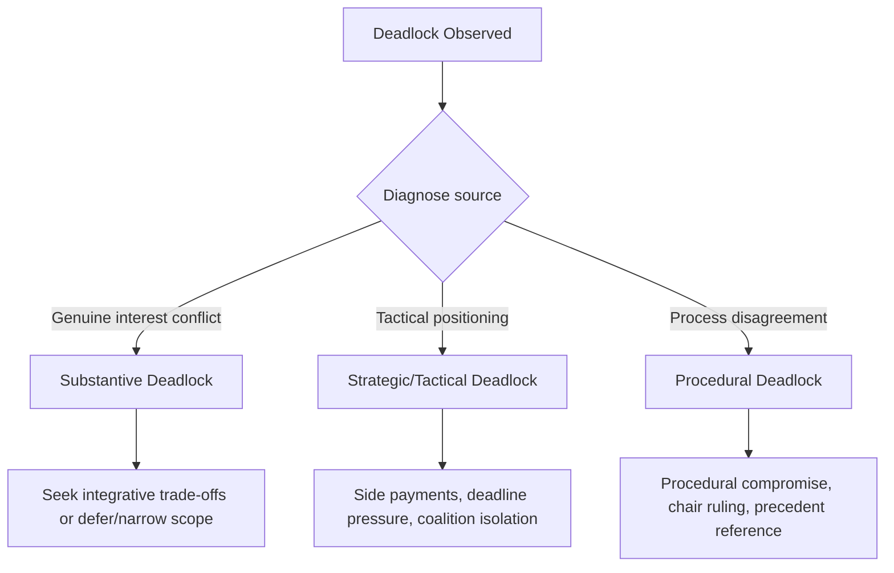
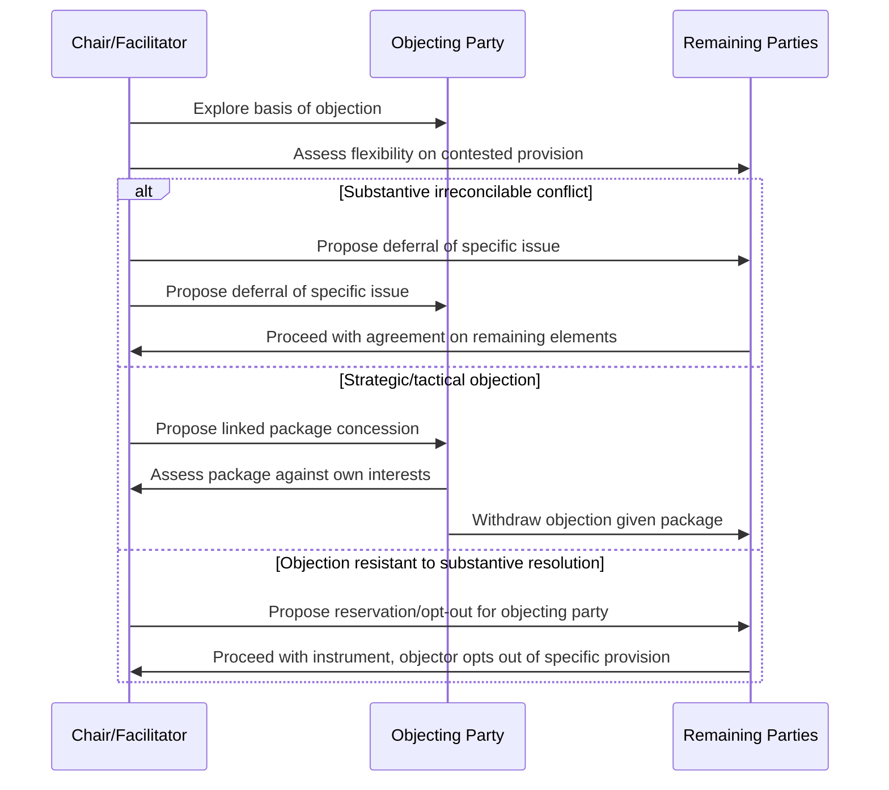

## Managing Dissent and Deadlock

### Overview and Analytical Function

Managing dissent and deadlock addresses the procedural and strategic techniques used to prevent, contain, or resolve situations in which a multilateral process cannot proceed to agreement because one or more parties withhold consent, block consensus, or otherwise obstruct progress. This topic synthesizes and extends several threads covered elsewhere in this curriculum — holdout power (Multi-Party and Coalition Negotiation Dynamics), consensus decision rules (Structure and Function of Multilateral Institutions), and procedural mechanics (Conference Diplomacy and Procedural Rules) — into a focused treatment of deadlock specifically as a recurring operational challenge in conference management, distinct from the general negotiating dynamics that precede it.

**Key Points**

- Deadlock can arise from genuinely irreconcilable substantive interests, from strategic obstruction disconnected from the substance at hand, or from procedural rather than substantive disagreement, and the appropriate response differs by cause
- Consensus-based decision rules, while valued for the legitimacy and buy-in they generate, structurally create heightened deadlock risk relative to majority-vote systems, since a single objecting party can block outcomes
- A range of established procedural and diplomatic techniques exist specifically to manage deadlock without abandoning consensus-oriented process, though each carries its own trade-offs regarding inclusiveness, speed, and outcome durability

### Diagnosing the Source of Deadlock

**Substantive Deadlock**

Arises where parties' underlying interests are genuinely and, at least for the time being, irreconcilably opposed on a specific issue — most acute where the issue involves an indivisible good (as discussed in Principled Negotiation and Interest-Based Bargaining) or where no viable integrative trade-off exists to expand the available value.

**Strategic/Tactical Deadlock**

Arises where a party's stated objection reflects a negotiating tactic (extracting concessions on an unrelated matter, delaying to await a more favorable external circumstance, or signaling domestic audiences) rather than a genuine, fixed substantive limit — this form of deadlock is often responsive to procedural or diplomatic management even without substantive movement on the underlying issue itself.

**Procedural Deadlock**

Arises from disagreement over process itself (rules of procedure, agenda sequencing, credentials disputes as covered in Conference Diplomacy and Procedural Rules) rather than the substantive matter under negotiation — procedural deadlock can sometimes mask or serve as a proxy for underlying substantive disagreement that parties are unwilling to contest directly.

**[Inference]** Accurately diagnosing which category (or combination) is producing a specific deadlock is a critical, though not always straightforward, first step in selecting an appropriate management technique, since applying a technique suited to strategic deadlock (e.g., side payments) to a genuinely substantive, indivisible-good deadlock is unlikely to succeed, while a technique suited to substantive deadlock (e.g., deferring the issue) may unnecessarily prolong a resolvable strategic or procedural impasse; in practice, a party's own stated reason for objection is not always a reliable guide to the true underlying cause and often requires independent assessment.

### Consensus Decision Rules and Structural Deadlock Risk

As established in Structure and Function of Multilateral Institutions, consensus-based decision rules grant any single objecting party effective blocking power, structurally elevating deadlock risk relative to majority or weighted-voting systems. This trade-off is generally understood as deliberate: consensus procedures are favored specifically because unanimous or near-unanimous buy-in generates stronger implementation legitimacy (see Consensus-Building in Multi-Stakeholder Settings) than a majority-imposed outcome, even at the cost of higher deadlock risk.

**[Inference]** This trade-off between deadlock risk and outcome legitimacy is a recognized structural feature of consensus-based multilateral design rather than an incidental flaw, meaning that deadlock-management techniques applied within consensus-based processes generally aim to preserve the consensus principle's legitimacy benefits while reducing blocking risk, rather than abandoning consensus in favor of majority voting, which would sacrifice the legitimacy rationale the consensus rule was adopted to secure.

### Procedural Techniques for Managing Deadlock

**Constructive Ambiguity**

As detailed in Closing Agreements and Managing Implementation, deliberately leaving a contested point open to differing interpretation can allow overall agreement to proceed despite an unresolved specific disagreement, deferring rather than resolving the underlying substantive conflict.

**Issue Deferral and Phased/Sequenced Agreement**

Separating a blocking issue from the broader package, allowing agreement to proceed on the remaining, non-blocked elements while referring the specific contested issue to further study, a subsidiary body, or a future session — consistent with the phased implementation design discussed in Closing Agreements and Managing Implementation.

**Package Deals and Issue Linkage**

As discussed under Distributive Versus Integrative Bargaining, linking a blocked issue to trade-offs on other, unrelated issues can create integrative value sufficient to overcome an objecting party's resistance, particularly effective against strategic rather than genuinely substantive deadlock.

**Chair's Compromise Text**

The presiding chair or facilitator (see Conference Diplomacy and Procedural Rules) can propose a compromise formulation intended to bridge the specific point of disagreement, leveraging the chair's procedural authority and perceived (if imperfect) neutrality to propose language the parties themselves might find harder to propose directly without appearing to concede first.

**Silence Procedure**

A specific procedural device in which a proposed text is circulated with a specified deadline, and absence of formal objection by that deadline is treated as acceptance — shifting the burden of active objection onto a blocking party and sometimes reducing deadlock where opposition is more passive or tactical than firmly held.

**Reservations and Opt-Outs**

Permitting a specific objecting party to record a formal reservation or opt out of a specific provision while allowing the broader instrument to proceed for the remaining parties — a variable-geometry approach that sacrifices full uniformity to avoid complete deadlock, as noted in Closing Agreements and Managing Implementation regarding procedural flexibility mechanisms.

**Sunset or Review Clauses as Deadlock-Breakers**

Where parties cannot agree on a permanent resolution, agreeing to a time-limited or provisional arrangement subject to mandatory future review can break deadlock by reducing the perceived stakes of the immediate decision, since the arrangement is not treated as permanently binding.

### Diplomatic and Relational Techniques

**Bilateral Side Consultations**

Direct, often confidential bilateral engagement with the specific objecting party, separate from the full plenary or contact group setting, to explore the objection's true basis and potential accommodation without the reputational pressure of a public negotiating forum.

**Coalition Isolation and Peer Pressure**

Where an objecting party's position is isolated relative to a broad emerging consensus among other parties, informal peer pressure — communicated through bilateral channels, regional bloc coordination (see Coalition-Building and Bloc Politics), or public statements noting the isolation — can incentivize reconsideration, particularly where the objecting party has interest in avoiding reputational cost from being seen as the sole obstacle to an otherwise broadly supported outcome.

**Face-Saving Formulations**

Providing an objecting party a formulation or narrative that allows it to withdraw its objection without appearing to have simply capitulated — often through language adjustments, additional non-binding preambular acknowledgment of its underlying concern, or a parallel but separate statement or declaration addressing its specific concern outside the main instrument.

**Extending or Adjusting Timelines**

Where deadlock stems partly from time pressure (see Negotiating Under Time Pressure and Uncertainty) rather than purely substantive limits, extending the negotiating timeline or adjourning to a future session can allow positions to evolve, external circumstances to shift, or further consultation to occur.

### Risks and Trade-offs of Deadlock-Management Techniques

**[Inference]** Each deadlock-management technique carries a trade-off between resolving the immediate impasse and other values the process may seek to protect — constructive ambiguity risks deferred implementation disputes (as discussed in Closing Agreements and Managing Implementation), issue deferral risks the deferred matter never being adequately resolved, reservations and opt-outs risk undermining the instrument's uniform applicability and potentially inviting further opt-outs by other parties, and coalition-isolation tactics risk generating lasting resentment that damages the isolated party's future cooperation even if the immediate deadlock is resolved; selecting an appropriate technique therefore requires weighing the specific deadlock's characteristics against these differentiated downstream risks rather than defaulting to a single preferred technique in all cases.

### Common Sources of Practical Error

- Applying a uniform deadlock-management technique regardless of whether the underlying deadlock is substantive, strategic, or procedural in origin
- Overusing reservations and opt-outs as a default deadlock-breaker, potentially inviting a proliferation of opt-outs that undermines the instrument's overall coherence and uniform applicability
- Relying on coalition-isolation or peer-pressure tactics without accounting for the relational and reputational cost this may impose on future cooperation with the isolated party
- Treating constructive ambiguity or issue deferral as a genuine resolution rather than a deferral, failing to build in adequate follow-up mechanisms to address the underlying issue later
- Underestimating the specific structural deadlock risk inherent in consensus-based decision rules, and failing to prepare deadlock-management techniques proactively before an actual impasse arises

### Practical Application Workflow

**Next Steps**

- Diagnose the specific source of an emerging deadlock (substantive, strategic, or procedural) before selecting a management technique, rather than applying a default approach uniformly
- For substantive/indivisible-good deadlock, prioritize deferral, phased agreement, or reservation/opt-out mechanisms over techniques better suited to strategic objections
- For strategic/tactical deadlock, explore package linkage, side payments, or bilateral consultation to address the underlying tactical motivation directly
- Prepare face-saving formulations proactively for anticipated objecting parties, particularly where public isolation risk could otherwise harden a position further
- Build follow-up review or further-negotiation mechanisms into any deferred or ambiguity-based resolution, to reduce the risk that a deferred issue is permanently left unresolved

**Related Topics**

- Multi-Party and Coalition Negotiation Dynamics
- Conference Diplomacy and Procedural Rules
- Closing Agreements and Managing Implementation
- Coalition-Building and Bloc Politics
- Distributive Versus Integrative Bargaining
- Negotiating Under Time Pressure and Uncertainty