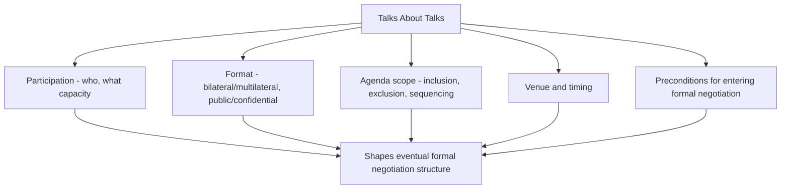

## Informal Consultations and Talks Before Talks


### Overview and Analytical Function

Informal consultations and "talks about talks" (pre-negotiation) constitute the preparatory phase of multilateral engagement that precedes and structures formal negotiation, distinct from but foundational to the formal conference mechanisms addressed elsewhere in this curriculum (Conference Diplomacy and Procedural Rules, Drafting and Adopting Resolutions). This preparatory phase is frequently where the actual determination of whether formal negotiation can succeed — and on what terms it will proceed — is substantially settled, making it a critical and sometimes underappreciated locus of diplomatic activity relative to the more visible formal proceedings that follow.

**Key Points**

- Talks about talks address process and feasibility questions (who participates, under what format, on what agenda) before substantive negotiation begins, and their outcome shapes the entire subsequent formal process
- Informal consultations serve functions the formal plenary structure cannot easily replicate: candid interest disclosure, off-the-record testing of proposals, and relationship-building without the reputational stakes of public positioning
- The boundary between informal and formal process is often deliberately porous and strategically managed, since parties frequently prefer to test contentious positions informally before committing to them on the public record

### Talks About Talks: Function and Scope

**Definitional Scope**

"Talks about talks" refers specifically to pre-negotiation engagement focused on the *terms of engagement* for a prospective formal negotiation, rather than the substantive issues themselves — though in practice the line between discussing process and previewing substance is frequently blurred, since a party's preferred process (participants, format, agenda scope) often reflects and signals its substantive interests.

**Core Questions Addressed**

- **Participation**: Which parties will be included, in what capacity (full negotiating party, observer, consultative role), and under what recognition or credentialing arrangement (particularly sensitive where governmental legitimacy is contested, as discussed in Conference Diplomacy and Procedural Rules)
- **Format**: Bilateral, multilateral, or a combination; plenary versus smaller working-group structure; public or confidential proceedings
- **Agenda scope**: What issues will be included, excluded, or explicitly deferred, and in what sequence — directly connecting to the agenda-control dynamics discussed in Conference Diplomacy and Procedural Rules
- **Venue and timing**: Location (which itself can carry symbolic or practical significance, including perceived neutrality or home-field advantage), and scheduling relative to relevant external events or deadlines
- **Preconditions**: Whether either party requires specific preliminary steps (confidence-building measures, unilateral gestures, or procedural guarantees) before agreeing to enter formal negotiation at all



### Why Preliminary Process Questions Carry Substantive Weight

**[Inference]** Because process choices settled during talks about talks constrain the subsequent formal negotiation's structure, parties frequently treat apparently procedural questions as having substantive consequence worth contesting at this preliminary stage — for example, a party favoring a narrow agenda scope may anticipate that broader issue inclusion would introduce integrative trade-off opportunities (see Distributive Versus Integrative Bargaining) unfavorable to its relative position, and therefore resist agenda breadth at the talks-about-talks stage specifically to avoid that dynamic arising later; the degree to which any specific party's procedural preference reflects this kind of anticipated substantive calculation, however, is not always directly observable and remains inferential absent explicit confirmation.

**Precondition-Setting as Leverage**

A party's insistence on specific preconditions before entering formal talks can function as a genuine confidence-building requirement or as a form of leverage exercised before the counterpart has secured the party's commitment to negotiate at all — since once formal negotiation is underway, a party's own BATNA of "declining to negotiate" is effectively already spent, the pre-negotiation phase is frequently the point of maximum leverage for a party seeking to extract preliminary concessions in exchange for its agreement to negotiate.

### Informal Consultations During Active Negotiation

**Function Distinct from Talks About Talks**

Once formal negotiation has commenced, informal consultations continue to play an ongoing role distinct from the initial pre-negotiation phase — providing candid, off-the-record channels for interest disclosure, proposal-testing, and relationship management that the more procedurally constrained and reputationally exposed formal plenary setting (see Conference Diplomacy and Procedural Rules) does not readily accommodate.

**Candid Interest Disclosure Without Public Commitment**

As established in Principled Negotiation and Interest-Based Bargaining, genuine interest-based negotiation requires some degree of disclosure regarding underlying interests and priorities; parties are frequently more willing to make such disclosures informally, where a floated position can be characterized as merely exploratory rather than a binding public commitment, reducing the domestic political or reputational cost of testing an idea that ultimately proves unworkable.

**Proposal Testing ("Non-Papers")**

A common diplomatic device is the **non-paper** — an unofficial, unattributed written proposal circulated informally to gauge reaction without the formal status or attribution consequences of a tabled official document; a non-paper can be disavowed or withdrawn without the reputational cost of formally retracting an official position, making it a valuable low-risk vehicle for testing contentious ideas.

**Relationship and Trust Building**

Informal settings (working dinners, walks, unstructured margins of formal sessions) frequently serve a relationship-building function independent of specific substantive content, consistent with the "separate the people from the problem" principle in Principled Negotiation and Interest-Based Bargaining — personal rapport developed informally can facilitate more effective formal engagement even where it does not directly resolve specific substantive disagreements.

```plaintext
===antml:parameter name="query"===
===MERMAID_DIAGRAM===
sequenceDiagram
    participant A as Party A
    participant B as Party B
    participant Informal as Informal Channel

    A->>Informal: Circulate non-paper (unattributed proposal)
    Informal->>B: Review informally, no public commitment required
    B->>Informal: Provide off-the-record reaction
    alt Reaction favorable
        Informal->>A: Signal viability
        A->>A: Consider formal tabling
    else Reaction unfavorable
        Informal->>A: Signal need for revision
        A->>A: Revise or withdraw without reputational cost
    end
```

### Managing the Formal/Informal Boundary

**Strategic Porousness**

The boundary between informal and formal process is frequently managed deliberately rather than rigidly maintained — parties may allow informally tested and substantially agreed positions to be formally tabled once sufficient confidence in their reception exists, effectively using the formal plenary primarily to ratify outcomes substantially achieved informally, a pattern also noted in Conference Diplomacy and Procedural Rules regarding contact groups and corridor consultations during active conferences.

**Confidentiality and Its Limits**

Informal consultations frequently proceed on an understood confidentiality basis (Chatham House Rule-type conventions, or explicit off-the-record agreements), though the durability of such confidentiality varies by context and party discipline — **[Unverified]** the specific reliability of confidentiality norms in informal diplomatic consultation is highly context- and relationship-dependent, and no general assurance regarding the durability of any specific informal consultation's confidentiality can be made without reference to the particular parties and setting involved.

**Risk of Leaks and Their Consequences**

Because informal consultations rely on the reduced-stakes premise of non-attribution or confidentiality, unauthorized disclosure (leaks) of informally floated positions can be particularly damaging — both to the immediate negotiation (since a party may need to publicly disavow a leaked position it had only informally floated) and to the broader practice of informal consultation itself, since repeated leaks erode parties' willingness to engage candidly in informal settings going forward.

### Practical Formats for Informal Engagement

- **Track II and Track 1.5 dialogue**: Unofficial or semi-official channels involving former officials, academics, or non-governmental experts, sometimes used to explore ideas politically difficult for sitting officials to raise directly, with insights feeding back into official channels — connecting to the multi-track dynamics noted in Positional Versus Interest-Based Negotiation
- **Margins of formal conferences**: Bilateral or small-group meetings conducted in the physical or scheduling margins of a formal multilateral conference, leveraging the convened gathering's logistical convenience without formal plenary exposure
- **Special envoys and quiet diplomacy**: Dedicated individuals tasked with confidential preliminary engagement specifically to test feasibility before committing principals or full delegations to formal engagement
- **Third-party facilitated informal channels**: A trusted intermediary state or individual facilitating confidential exchange between parties who may not have direct or sufficiently trusted bilateral channels of their own

### Common Sources of Practical Error

- Treating talks-about-talks process questions as merely administrative, underestimating the substantive leverage embedded in preliminary decisions about participation, format, and agenda scope
- Committing to preconditions during pre-negotiation without recognizing this phase as a point of maximum leverage for the party being asked to agree to negotiate at all
- Relying on informal consultation confidentiality without assessing the specific reliability of confidentiality norms in the particular relationship and context involved
- Failing to leverage non-papers or other low-attribution informal vehicles for testing genuinely contentious proposals, instead risking premature formal tabling of an untested position
- Neglecting relationship-building informal engagement as a distinct value separate from substantive progress, underestimating its contribution to effective subsequent formal negotiation

### Practical Application Workflow

**Next Steps**

- Treat talks-about-talks process questions (participation, format, agenda scope, preconditions) as substantively consequential, allocating adequate preparation and negotiating attention to this preliminary phase
- Identify and utilize low-attribution informal vehicles (non-papers, Track II channels) for testing genuinely contentious proposals before formal tabling
- Assess the specific reliability of confidentiality norms applicable to a given informal consultation relationship before disclosing sensitive interest information
- Build in dedicated informal relationship-building opportunities alongside formal negotiating sessions, recognizing their distinct contribution to negotiating effectiveness
- Prepare contingency responses for potential leaks of informally floated positions, including pre-considered disavowal or clarification language

**Related Topics**

- Conference Diplomacy and Procedural Rules
- Principled Negotiation and Interest-Based Bargaining
- Positional Versus Interest-Based Negotiation
- Managing Dissent and Deadlock
- Multi-Party and Coalition Negotiation Dynamics
- Closing Agreements and Managing Implementation