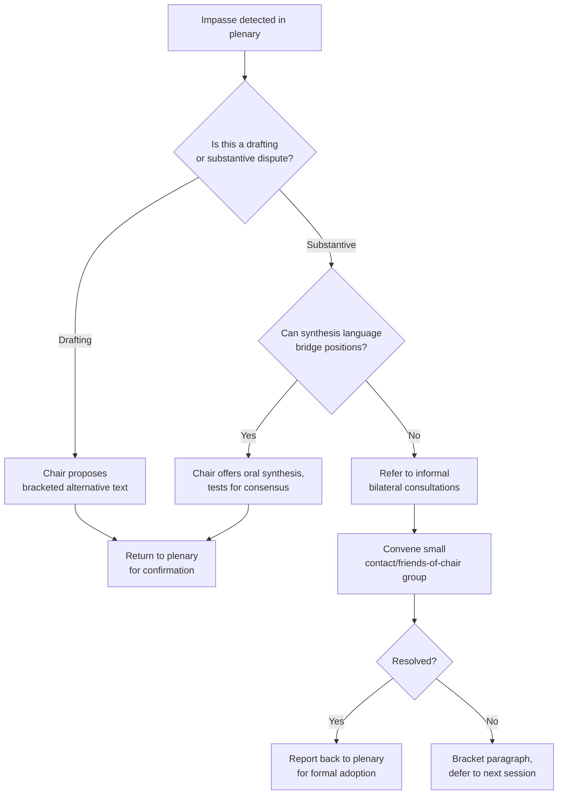

## Chairing and Facilitating Multilateral Sessions

### Overview

Chairing a multilateral session is the exercise of procedural authority over a negotiation or deliberative body composed of multiple sovereign delegations, each with independent instructions, veto-adjacent leverage, and no obligation to defer to the chair's preferences on substance. The chair's power is almost entirely procedural rather than substantive: a chair cannot compel outcomes, but can shape the sequence, framing, and pacing through which outcomes become possible or impossible. Effective chairing sits at the intersection of parliamentary procedure, conflict management, drafting craft, and applied psychology of group dynamics under time pressure.

This differs fundamentally from chairing a corporate meeting or academic panel: participants represent principals who are not in the room, have limited authority to compromise beyond their mandate, and operate under reputational and domestic political constraints that a skilled chair must read and route around.

### Core Responsibilities of the Chair

**Key Points**

- Impartiality (real and perceived) is the chair's primary currency; a chair who is seen as substantively partisan loses the ability to broker
- The chair owns the *process*, not the *content* — substantive positions belong to delegations
- The chair is simultaneously a timekeeper, translator of ambiguity, conflict de-escalator, and drafter of last resort

The formal duties typically include:

1. **Opening and framing** — stating the agenda, the mandate under which the body operates, and the desired outcome (a decision, a report, a negotiated text, a set of recommendations)
2. **Recognition and speaking order** — managing the queue of interventions, typically first-come-first-served, though many chairs use a "hybrid list" that interleaves major groupings, individual states, and observers
3. **Time management** — enforcing speaking limits, often 3–5 minutes for general statements and 1–2 minutes for points of order or rights of reply
4. **Synthesis** — periodically summarizing the state of discussion so delegations can verify their positions have been heard and to move the room toward convergence
5. **Ruling on procedure** — points of order, motions, and challenges to the chair's rulings (which can themselves be put to a vote in some bodies)
6. **Drafting stewardship** — producing or supervising "chair's text," non-papers, or bracketed draft language that reflects (or nudges) the state of convergence
7. **Closure** — declaring consensus, calling a vote, or referring unresolved issues to a smaller contact group or the next session

### Procedural Frameworks

Most multilateral bodies operate under one of a small number of procedural traditions, and a chair's first task is to know precisely which one governs the room, since the rules of procedure determine what tools are legitimately available.

#### Robert's Rules-Derived (common in UN-style plenaries)

- Motions must be seconded before debate
- Amendments are voted before the main motion
- A motion to close debate ("previous question") can end discussion if it obtains the required majority

#### UN General Assembly / ECOSOC style

- Rules of Procedure documents (e.g., A/520/Rev.20 for the UNGA) govern quorum, voting thresholds, and the powers of the presiding officer
- The chair can be overruled by a majority vote if a delegation appeals a procedural ruling

#### Consensus-based bodies (WTO, many UN treaty negotiations, ASEAN)

- No formal vote; the chair's finding of "no objection" constitutes decision
- A single delegation's sustained objection can block outcome, giving individual states asymmetric power relative to voting bodies
- The chair's central skill here is *testing* for consensus without prematurely gaveling and provoking a formal objection that then becomes politically costly to withdraw

#### Committee of the Whole / Contact Group format

- Smaller, often informal, groupings convened to resolve specific bracketed text
- Chairs of contact groups typically report back to the plenary chair rather than closing issues independently

**[Inference]** The specific choice of procedural tradition is frequently itself a subject of pre-negotiation, since the choice advantages different coalitions (voting bodies favor larger blocs; consensus bodies favor status-quo-preserving minorities).

### The Consensus-Testing Technique

A core, learnable skill is testing for consensus without triggering unnecessary formal objection. The standard sequence:

1. Summarize the apparent state of agreement in neutral language
2. Pause and explicitly invite objection ("If I hear no objection, I will take it that...")
3. Hold a visible pause (typically 5–10 seconds) — rushing this step is a common novice error that provokes delegations to object reflexively because they feel steamrolled
4. If a delegation raises a flag, first clarify whether it is a substantive objection or a request for clarification/drafting change, since many apparent objections are resolvable without abandoning the text
5. If genuine objection persists, either bracket the specific point and continue, or suspend to informal consultations

**Example**

> Chair: "I understand from the discussion that delegations can accept the text in paragraph 14 as amended by the delegation of Brazil. If I hear no objection, I will take it that paragraph 14 is adopted as amended." [pause] "Seeing none, paragraph 14 is adopted. We move to paragraph 15."

### Managing Interventions and the Speaking Queue

**Next Steps for a chair building queue discipline:**

- Maintain a visible, published speakers' list (physical or projected) so delegations can gauge how long until their turn
- Distinguish between substantive interventions and points of order; points of order interrupt the queue and must be ruled on immediately
- Use a "rolling list" refresh at natural breakpoints (after each cluster of amendments) rather than only once at the session's start
- Grant rights of reply sparingly and only after all queued speakers, to prevent tit-for-tat escalation from consuming session time

A frequent failure mode is allowing points of order to be used as a backdoor to relitigate substance. The chair's remedy is a firm, consistently applied ruling: a point of order restricted to genuine procedural questions ("is this in order under Rule X"), with a substantive intervention redirected to the regular speakers' list.

### De-escalation and Conflict Management

When two or more delegations reach an impasse in plenary, chairs typically apply an escalation ladder rather than immediately suspending the session:

**Key Points on de-escalation**

- Moving a dispute *out* of plenary (to bilaterals or a small contact group) is usually the single most effective tool a chair has, since public positions taken for domestic audiences are harder to walk back than private ones
- A chair should never publicly characterize a delegation's position as unreasonable, even implicitly, since this collapses the chair's perceived impartiality
- "Friends of the Chair" groups — a small, informally convened set of delegations representing the range of positions — are a standard device for offloading detailed text-wrangling from the full plenary

### Drafting Under Time Pressure: The Chair's Text

When delegations cannot converge on text through direct exchange, the chair (or the secretariat, at the chair's direction) may issue a **chair's text** or **non-paper** — a document that is not itself a negotiated instrument but serves as a basis for further negotiation.

**Output** — a well-constructed chair's text typically:

- Uses square brackets `[...]` to denote unresolved language, with attribution sometimes given in a footnote or informal annex
- Avoids introducing entirely new substantive positions not aired in the room, since this invites accusations of chair overreach
- Is issued with a clear status statement: "under the chair's own responsibility, without prejudice to delegations' positions" — standard formulaic language that preserves the fiction that the chair has not usurped delegations' authority

**[Unverified]** — the precise convention for how much a chair may innovate in a chair's text versus merely reflect the room varies significantly by institution and by the individual chair's accumulated political capital; there is no universal rule, and practice should be verified against the specific body's established custom.

### Time and Agenda Management

$$T_{session} = \sum_{i=1}^{n} t_i + t_{buffer}$$

where $t_i$ is the allotted time per agenda item $i$ and $t_{buffer}$ is reserved contingency time — experienced chairs typically reserve 15–25% of total session time as buffer, since multilateral sessions almost universally run over on contentious items and under on procedural ones.

Practical agenda-management tools:

- **Time-boxing with public countdown** — publishing remaining time per agenda item increases compliance without the chair needing to interrupt speakers repeatedly
- **Provisional versus adopted agenda** — items can be reordered before adoption; once adopted, reordering itself becomes a procedural motion requiring its own decision
- **Night sessions / informal-informals** — used to continue text negotiation outside formal plenary hours when time is short before a mandated close (e.g., COP-style climate negotiations routinely extend past their nominal closing date using this device)

### Facilitator versus Chair: A Key Distinction

| Dimension | Chair | Facilitator |
| --- | --- | --- |
| Formal authority | Derives from rules of procedure; can gavel decisions | Derives from delegations' trust; no formal ruling power |
| Typical setting | Plenary, formal committee | Contact groups, informal consultations |
| Accountability | To the body as a whole (often elected) | To the chair who appointed them |
| Tools | Rulings, votes, formal closure | Shuttle diplomacy, synthesis text, mediated bilaterals |

**[Inference]** In practice the same individual frequently performs both roles across a single conference — chairing plenary formally, then acting as an informal facilitator in a late-night contact group — and the skill sets, while overlapping, are not identical; strong plenary chairs are not automatically strong small-group facilitators, since the latter depends more heavily on interpersonal trust-building than on procedural command.

### Common Failure Modes

**Key Points**

- **Gaveling too early** — declaring consensus before genuinely testing the room, producing a formal objection that is more damaging than a delayed decision would have been
- **Losing perceived neutrality** — even accurate procedural rulings, if they consistently disadvantage one bloc, erode the chair's authority over time
- **Over-drafting** — a chair's text that reads as a fait accompli rather than a genuine synthesis invites wholesale rejection rather than incremental amendment
- **Allowing procedural capture** — permitting points of order or dilatory motions to be used tactically by a delegation seeking to run out the clock on a mandate deadline

### Related Topics

- Rules of Procedure drafting and interpretation (UNGA A/520/Rev.20 as reference model)
- Shuttle diplomacy and informal-informal consultation techniques
- Coalition dynamics and negotiating blocs (G77, EU coordination, regional groupings)
- Consensus versus voting: institutional design trade-offs
- Drafting group management and bracketed-text resolution
- Interpretation and multilingual session management
- Crisis diplomacy under compressed negotiating deadlines (e.g., COP overtime sessions)