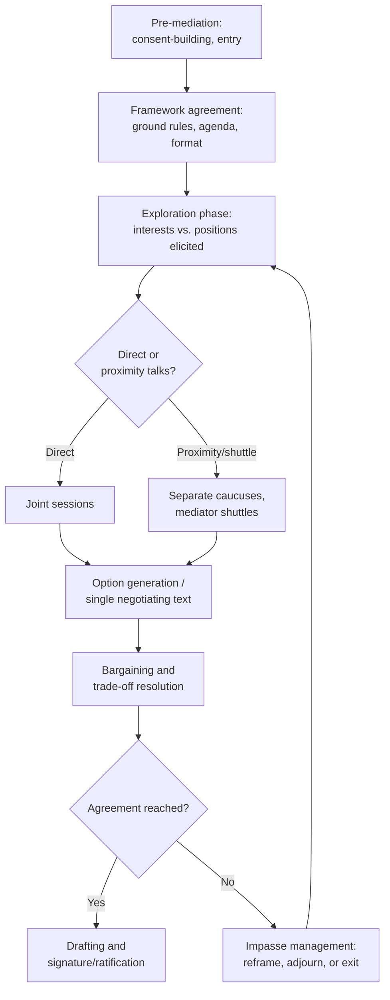

## Mediation Theory and Third-Party Intervention

### Overview

Mediation is a form of assisted negotiation in which a third party, lacking binding decision-making authority over the disputants, helps the parties reach a voluntary resolution. This distinguishes it sharply from arbitration or adjudication, where the third party issues a binding determination. In diplomatic contexts, mediation and broader "third-party intervention" span a spectrum from light-touch good offices to deeply engaged, resource-backed peacemaking, and the theoretical frameworks used to analyze this spectrum draw from international relations, social psychology, negotiation theory, and conflict resolution studies.

The central theoretical puzzle mediation theory addresses is: why would rational, sovereign, or armed disputants accept the involvement of an outside party who has no power to compel them, and under what conditions does that involvement actually change outcomes rather than merely delaying them?

### The Spectrum of Third-Party Intervention

Third-party roles are conventionally arrayed along a continuum of increasing intervention intensity:

1. **Good offices** — the third party merely provides a channel or venue for communication, without engaging in substantive proposals
2. **Conciliation** — the third party facilitates dialogue and may offer non-binding suggestions but does not press for acceptance
3. **Mediation** — the third party actively shapes the process, proposes options, and may apply persuasive (though not coercive) pressure
4. **Arbitration** — the third party renders a binding decision the parties have pre-agreed to accept
5. **Peace enforcement / imposed settlement** — the third party uses coercive leverage (sanctions, military force, conditionality) to compel acceptance

**[Inference]** These categories are typically presented as discrete stages in introductory literature, but in practice interventions migrate along the spectrum within a single process — a mediator may begin with good offices and, as trust builds or as leverage becomes available, escalate toward more directive mediation.

### Major Theoretical Models of Mediator Behavior

#### Facilitative vs. Evaluative vs. Transformative Mediation

- **Facilitative mediation** — the mediator manages process only, refraining from suggesting substantive outcomes; associated with the Harvard/interest-based negotiation tradition (Fisher, Ury, and Patton's *Getting to Yes*)
- **Evaluative mediation** — the mediator offers assessments of the merits of each side's position, sometimes including likely outcomes if the dispute is not resolved (more common in legal/commercial mediation, present but less dominant in diplomatic mediation)
- **Transformative mediation** — the mediator's goal is to change the relationship and communication patterns between parties, treating resolution of the immediate dispute as secondary to durable relational change (Bush and Folger)

#### Touval and Zartman's Strategic Model

William Zartman and Saadia Touval's foundational framework frames mediation as fundamentally about **leverage and interest**, not altruism: mediators intervene because they have a stake in the outcome or process, and their effectiveness derives from their ability to bring leverage (informational, formulative, or manipulative) to bear.

- **Informational leverage** — the mediator's ability to communicate proposals, gauge true underlying interests, and correct misperceptions between parties who cannot or will not communicate directly
- **Formulative leverage** — the mediator's ability to construct new proposals, reframe the issues, and identify options the parties themselves have not generated
- **Manipulative leverage** — the mediator's ability to change the disputants' cost-benefit calculations by adding incentives (aid, security guarantees) or disincentives (sanctions, withdrawal of support)

#### Ripeness Theory (Zartman)

Mediation succeeds or fails largely as a function of timing rather than mediator skill alone. A dispute is "ripe" for resolution when both parties perceive a **Mutually Hurting Stalemate (MHS)** — a situation in which continuing the conflict is more costly than negotiating, and both sides see a **Way Out (WO)**, a viable negotiated exit that does not require unilateral capitulation.

$$\text{Ripeness} = f(\text{MHS}, \text{WO})$$

**[Inference]** Ripeness theory is widely taught and cited, but is also criticized on the grounds that it is difficult to identify ripeness prospectively (only retrospectively, once mediation has succeeded or failed) — a limitation that should be treated as a genuine methodological weakness rather than a settled predictive tool.

#### Contingency Model of Third-Party Intervention (Fisher and Keashly)

Proposes that different intervention types are appropriate to different stages of escalation:

- Low-intensity disputes (misunderstanding-driven) respond best to facilitation/consultation
- Mid-intensity disputes (real conflicts of interest) respond best to mediation
- High-intensity disputes (deep-rooted, identity-based conflict) require sequenced, multi-track intervention combining conciliation, mediation, and sometimes arbitration or peacekeeping

### Sources of Mediator Leverage and Bias

**Key Points**

- Effective mediators are rarely neutral in the sense of having no stake; they are frequently effective *because* they have leverage tied to interest (a major power mediating a regional conflict it wants stabilized, for instance)
- The literature distinguishes **impartiality** (fairness of process) from **neutrality** (absence of interest) — a mediator can be biased in interest yet impartial in process, and this combination is often more effective than a disinterested mediator with no leverage
- "Biased mediation" theory (Kydd, Svensson) argues that a mediator with a known tilt toward one side can be *more* credible to that side (reducing their fear of manipulation) while still being useful to the other side if the mediator can credibly commit resources

### The Mediation Process: Structural Phases

**Example** — the Camp David Accords (1978) illustrate several of these elements simultaneously: the United States entered with clear interest-driven leverage (manipulative and informational), used extensive proximity talks and shuttle diplomacy rather than sustained direct joint sessions after early friction, and moved toward a **single negotiating text procedure** (a drafting technique in which the mediator, not either party, holds the pen on successive draft revisions, reducing the reputational cost either side would bear from proposing concessions directly).

### The Single Negotiating Text (SNT) Technique

A specific, widely-used mediator drafting tool, formalized in the negotiation literature and used prominently at Camp David:

1. Mediator drafts an initial text reflecting a plausible compromise, explicitly not attributed to either party
2. Each party critiques the draft without being asked to accept it, lowering the psychological cost of engagement
3. Mediator revises iteratively based on both sets of critique
4. Process repeats until either convergence or a clear, bounded impasse is reached

**[Inference]** The SNT technique's principal advantage is that it decouples proposing an idea from committing to it — parties can react to a mediator's draft without the domestic political cost of having authored a concession themselves — though its effectiveness depends heavily on the mediator's drafting skill and perceived fairness.

### Track I, Track II, and Multi-Track Diplomacy

- **Track I** — official, government-to-government mediation conducted by states, international organizations (UN, AU, OSCE), or their designated envoys
- **Track II** — unofficial dialogue among influential non-state actors (academics, former officials, religious leaders) that generates ideas and builds relationships that can later be transferred into official channels
- **Track III / multi-track** — grassroots and civil-society-level dialogue, often addressing the social fabric of conflict rather than the negotiating text itself

**[Inference]** Track II processes are generally understood in the literature to be most useful for generating options and testing ideas under lower political risk, rather than for producing binding outcomes directly — their value is typically realized only when insights migrate into a Track I process.

### Conditions Associated with Mediation Success

Empirical conflict-resolution research (e.g., work associated with Bercovitch and Jackson's mediation datasets) has identified recurring correlates of higher success rates, though causal claims in this literature should be treated cautiously given selection effects (mediators may only intervene in cases already more tractable):

- Lower overall conflict intensity and shorter duration prior to intervention
- Mediator with high-ranking status or state-level backing versus lower-status individual mediators
- Presence of a mutually hurting stalemate (see Ripeness Theory above)
- Consent of all principal parties to the mediator's involvement (imposed mediation shows markedly lower success rates)
- Availability of mediator resources to sustain incentives post-agreement (monitoring, guarantees, reconstruction aid)

**[Unverified]** Precise success-rate percentages vary considerably across datasets and coding methodologies in the academic literature; any specific cited statistic should be checked against the primary dataset and its coding rules rather than treated as a universal figure.

### Common Failure Modes in Third-Party Intervention

**Key Points**

- **Premature intervention** — mediating before ripeness conditions exist, producing an agreement that collapses once one side recalculates its stalemate costs
- **Loss of perceived impartiality of process** (even where interest-bias is tolerated) — if the mediator is seen manipulating *process* unfairly, credibility collapses regardless of substantive stake
- **Spoiler dynamics** — parties or factions excluded from the mediation table who have incentive to disrupt any agreement reached without them (Track I processes that ignore key armed factions are especially vulnerable)
- **Mediator overcommitment** — investing prestige in reaching *an* agreement rather than a *durable* one, producing pressure to paper over unresolved core issues

### Related Topics

- Shuttle diplomacy and proximity talks as distinct mediation modalities
- Track II dialogue design and the problem of official transferability
- Spoiler management in peace processes
- Mediator selection and the "insider-partial" versus "outsider-neutral" debate
- Post-agreement implementation and guarantor roles
- Comparative case studies: Camp David (1978), Dayton (1995), Oslo Accords (1993)
- Ripeness assessment and pre-negotiation diagnostics