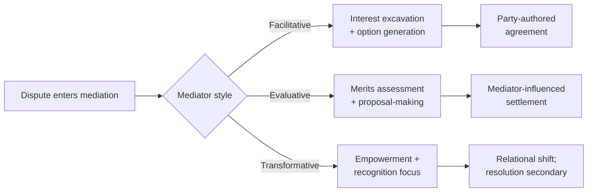

## Facilitative Versus Evaluative Mediation Styles

### Overview

Facilitative and evaluative mediation represent two distinct — and in some formulations, opposed — theories of what a mediator should *do* in the room. The distinction, most systematically articulated in the mediation practice literature by Leonard Riskin's well-known grid, is not merely stylistic; it reflects different assumptions about the mediator's role, the source of legitimate authority in the process, and what "success" means. A third style, transformative mediation, is often introduced alongside these two as a distinct paradigm rather than a midpoint between them, and is treated separately below for completeness.

The distinction matters practically because a mediator's chosen style shapes what techniques are appropriate, what a mediator may permissibly say, and what kind of agreement is likely to result — and mismatched expectations between a mediator's style and the parties' expectations are a recurring, well-documented source of mediation breakdown.

### Facilitative Mediation

**Key Points**

- The mediator controls *process*, not *content* or *outcome*
- The mediator does not offer opinions on the merits of either party's position, predict likely outcomes, or propose specific settlement terms
- Core theoretical grounding is interest-based negotiation (Fisher, Ury, and Patton's *Getting to Yes*): the mediator's job is to help parties move from stated positions to underlying interests and then generate options that satisfy those interests
- Legitimacy of the outcome derives from the parties' own authorship of it — the mediator's restraint is precisely what preserves the parties' sense of ownership and self-determination

**Core techniques:**

1. **Active listening and reflection** — restating each party's statements to confirm understanding and to demonstrate to each side that they have been heard
2. **Interest excavation** — repeated, open-ended questioning ("What is it about that outcome that matters to you?") to surface underlying needs beneath stated positions
3. **Reframing** — restating a party's position in less adversarial, more interest-oriented language without altering its substance
4. **Option generation (brainstorming)** — facilitating joint or separate generation of possible solutions without evaluating them during generation
5. **Reality-testing questions** — asking questions that prompt a party to consider consequences of impasse, without the mediator stating an opinion ("What do you think happens if this isn't resolved by Friday?")

**Example**

> Party A: "They have to issue a public apology or there's no deal."
>
> Facilitative mediator: "It sounds like the public acknowledgment matters a great deal to you. Can you say more about what that acknowledgment would need to accomplish for you?"

The mediator here reframes toward interest without suggesting what an acceptable apology might look like or whether the demand is reasonable.

### Evaluative Mediation

**Key Points**

- The mediator offers assessments of the merits, likely external outcomes (e.g., what a court or arbitral tribunal might decide), or the relative strength of each side's position
- More directive: the mediator may propose specific settlement terms and press parties toward them
- Legitimacy of the outcome derives partly from the mediator's expertise or authority — parties often select an evaluative mediator *because* they want an informed outside assessment, not merely a process manager
- Historically more associated with legal/commercial mediation (particularly court-annexed mediation, where the mediator is often a retired judge or senior practitioner) than with diplomatic mediation, though evaluative elements appear in diplomatic contexts where the mediator has recognized expertise or where power asymmetry makes reality-testing from the mediator carry more weight than reality-testing from either party

**Core techniques:**

1. **Case assessment / reality-testing with opinion** — directly stating an assessment ("Based on what I've heard, I think a tribunal would likely find X")
2. **Proposal-making** — the mediator drafts and presents a specific settlement proposal (sometimes called a "mediator's proposal") for both sides to accept or reject, often simultaneously and confidentially to avoid either side losing face by appearing to concede first
3. **Directive pressure / persuasion** — the mediator may argue against a party's stated position, pointing out weaknesses, risks, or the costs of failing to settle
4. **Bracketing** — asking each party, without disclosing the other's figure, for a range within which they might settle, to test whether ranges overlap

**Example**

> Evaluative mediator (in confidential caucus): "I've mediated a dozen disputes like this one. If this goes to arbitration, I think there's a meaningful chance the tribunal splits the difference roughly along the lines we discussed. I'd recommend seriously considering the figure on the table."

### Riskin's Grid: A Structuring Framework

Riskin proposed a two-dimensional grid distinguishing mediator orientation along two independent axes:

|  | Narrow (positions/legal issues) | Broad (underlying interests, relationships) |
| --- | --- | --- |
| **Evaluative** | Evaluative-narrow: assesses legal merits, predicts adjudicated outcome | Evaluative-broad: assesses and opines on broader interests and consequences |
| **Facilitative** | Facilitative-narrow: helps parties negotiate legal/positional issues without opining | Facilitative-broad: helps parties explore full range of underlying interests without opining |

**[Inference]** In practice, few mediators occupy a single quadrant consistently throughout a process; most competent mediators move fluidly between facilitative and evaluative registers depending on the phase of the process and what the parties signal they want, even though the theoretical literature often presents the styles as a binary choice for pedagogical clarity.

### Transformative Mediation (Third Paradigm)

Bush and Folger's transformative model rejects the facilitative/evaluative axis altogether as the relevant dimension, proposing instead that the mediator's central goal should be fostering:

- **Empowerment** — helping parties recognize and exercise their own capacity for decision-making and self-advocacy
- **Recognition** — helping each party come to a fuller understanding of the other's perspective and situation

Resolution of the immediate dispute is treated as a secondary, sometimes incidental, outcome relative to durable change in how the parties relate to and communicate with one another. This model is more prominent in community and interpersonal mediation than in interstate diplomatic mediation, though its emphasis on relationship transformation has influenced post-conflict reconciliation processes (truth and reconciliation commissions draw conceptually on adjacent ideas, though they are not mediation in the strict sense).

### Comparative Structure

### Choosing a Style: Contextual Fit

| Factor | Favors Facilitative | Favors Evaluative |
| --- | --- | --- |
| Power symmetry between parties | Roughly symmetric | Asymmetric — weaker party may need external reality-testing |
| Nature of dispute | Interest/relationship-driven | Rights/legal-merits-driven |
| Party expectations | Want ownership of outcome | Want expert guidance toward settlement |
| Repeat relationship between parties | Ongoing relationship to preserve | One-off transactional dispute |
| Mediator's substantive expertise | Less central | Central to mediator's selection |

**[Inference]** In interstate diplomatic mediation specifically, purely evaluative mediation in the legal-merits sense (predicting how a court would rule) is less common than in commercial mediation, since most interstate disputes lack a compulsory adjudicative forum whose likely ruling would be a meaningful reference point; evaluative moves in diplomacy more often take the form of a major-power mediator directly asserting what settlement terms it will support or underwrite, which functions evaluatively even though it is not "legal merits" evaluation in the Riskin sense.

### Common Practitioner Pitfalls

**Key Points**

- **Style drift without disclosure** — sliding from facilitative to evaluative mid-process without signaling the shift to parties, which can feel like a breach of the facilitative bargain the parties thought they had agreed to
- **False neutrality claims** — an evaluative mediator claiming pure neutrality while making clearly directive proposals undermines trust when parties perceive the mismatch
- **Premature evaluation** — offering assessments before sufficient information-gathering, damaging credibility if the assessment is later shown to rest on incomplete understanding
- **Over-facilitation in power-asymmetric disputes** — pure facilitative restraint can disadvantage a weaker party who lacks the negotiating sophistication or information the mediator could otherwise help supply through reality-testing

### Related Topics

- Riskin's Grid in full (including the "narrow vs. broad" problem-definition axis)
- Transformative mediation and its application in post-conflict reconciliation
- Mediator's proposal technique and simultaneous confidential offers
- Caucus versus joint-session structuring and its interaction with mediator style
- Power asymmetry management in mediated negotiations
- Cultural variation in mediator role expectations across legal traditions