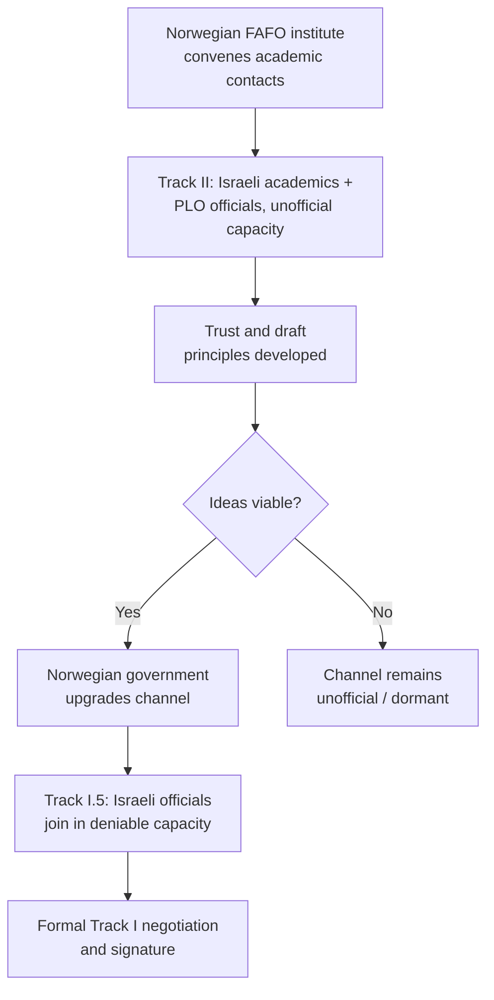

## Track II and Track III Diplomacy in Practice

### Overview

Multi-track diplomacy is a framework for classifying peacemaking and conflict-resolution activity by the nature of the actors conducting it, rather than by the substance of what is discussed. The core distinction — official government-to-government engagement (Track I) versus unofficial engagement by non-state actors (Track II and below) — was popularized by diplomat-scholar Joseph Montville in the early 1980s and later elaborated into a more granular nine-track model by Louise Diamond and John McDonald at the Institute for Multi-Track Diplomacy. In practice, "Track II" and "Track III" are the two terms doing most of the conceptual work in contemporary usage, denoting successively less formal, less elite, and more society-embedded layers of engagement.

The practical value of this framework is that it explains *why* certain conversations can happen outside official channels that cannot happen inside them, and *how* insights generated informally can (or fail to) migrate into binding official processes.

### Definitional Boundaries

| Track | Actors | Authority to bind | Typical purpose |
| --- | --- | --- | --- |
| Track I | Heads of state/government, accredited diplomats, official envoys | Yes — outcomes can be formally adopted | Negotiate binding agreements, formal mediation |
| Track I.5 | Officials participating in an unofficial/personal capacity alongside unofficial actors | Ambiguous/deniable | Test ideas with lower political risk while retaining official expertise in the room |
| Track II | Academics, former officials, retired military, religious leaders, NGO leaders | No | Generate options, build relationships, transfer ideas to Track I |
| Track III | Grassroots organizations, local civil society, community leaders | No | Address the social fabric of conflict at the population level |
| Multi-track (IV–IX per Diamond/McDonald) | Business, media, private citizens, training/education, activism, funding | No | Various — economic peacebuilding, public opinion shaping, resourcing |

**[Inference]** In much contemporary practitioner usage, the finer nine-track distinctions collapse into a simpler Track I / Track II / "civil society" or "grassroots" tripartite framing; the fully elaborated nine-track taxonomy is more common in academic peace-studies literature than in day-to-day diplomatic practice.

### Track II Diplomacy: Mechanics

**Key Points**

- Participants typically hold no current official position, though many are former officials, retired diplomats, or academics with close informal ties to their governments — the deliberate blurring of "unofficial" status is often a design feature, not an accident
- Because participants cannot bind their governments, they can float ideas, test reactions, and explore options that would be politically costly or premature for an official to raise directly
- The chief mechanism of impact is **idea transfer**: insights, drafting language, or relationship trust generated in Track II sessions migrate into Track I channels through informal briefings, participants' subsequent (re-)appointment to official roles, or direct incorporation of language into official texts

**Common Track II formats:**

1. **Workshops and dialogue series** — sustained, multi-session engagement among the same core group over months or years, building cumulative trust (the Pugwash Conferences on Science and World Affairs are a canonical long-running example)
2. **Problem-solving workshops** (associated with Herbert Kelman's work on Israeli-Palestinian dialogue) — structured small-group sessions using facilitated, interest-based negotiation techniques among influential but unofficial participants from both sides
3. **Track II "backchannels"** — discreet unofficial contacts specifically intended to prepare the ground for an eventual official negotiation (the Oslo Channel of 1993 began as academically-framed unofficial contacts between Israeli academics and PLO officials, facilitated by Norwegian intermediaries, before formalizing into Track I)

### The Oslo Channel as a Structural Case Study

**[Inference]** The Oslo case is frequently cited as the paradigmatic success story of Track II-to-Track I migration, but this framing should be treated with some caution: the same channel's later implementation difficulties are sometimes attributed by critics to the very features (secrecy, narrow participant base, limited domestic buy-in) that made the informal channel effective in the first place — a trade-off inherent in the model rather than unique to this case.

### Track III Diplomacy: Mechanics

**Key Points**

- Operates at the level of communities, local civil society organizations, and grassroots populations rather than elites
- The theoretical premise is that durable peace requires change in the social fabric — inter-group attitudes, local-level trust, everyday interaction — not merely elite agreement, since elite-level settlements can unravel without grassroots buy-in (or can be actively undermined by "spoilers" operating at the local level)
- Track III work is often conducted by international and local NGOs, faith-based organizations, and community mediators rather than by diplomats or academics

**Common Track III interventions:**

1. **Intergroup contact programs** — structured encounters between members of conflicting communities, grounded in Gordon Allport's contact hypothesis (contact reduces prejudice under conditions of equal status, common goals, intergroup cooperation, and institutional support)
2. **Local peace committees / community mediation structures** — locally staffed bodies that mediate everyday disputes with potential to escalate along conflict lines (used extensively in Kenya's post-2007-2008 election-violence peacebuilding architecture, for instance)
3. **Trauma healing and reconciliation programming** — psychosocial support programs addressing the population-level effects of violence, sometimes linked to formal transitional justice mechanisms
4. **Economic cooperation and livelihoods programming** — joint economic activity across conflict lines intended to create material interdependence and reduce incentives for renewed violence

### Track II/III Limitations and the Transfer Problem

**Key Points**

- **No binding authority** — the central limitation of both tracks; however sound the ideas generated, they have no formal status until an official process adopts them
- **The transfer problem** — insights generated informally frequently fail to reach official decision-makers, either because participants lack sufficient access, because the political moment is not ripe (see Ripeness Theory), or because officials view Track II output with suspicion as unrepresentative of the population's actual views
- **Representativeness concerns** — Track II participants are often drawn from a narrow, cosmopolitan, dialogue-inclined stratum of society (academics, NGO professionals) whose views may not represent hardline domestic constituencies whose buy-in is ultimately required for implementation
- **Legitimacy and mandate questions** — Track III grassroots processes can be delegitimized by elites (or by spoilers) as unrepresentative or externally imposed if they are not visibly connected to a legitimate local process

### Complementarity Across Tracks

Multi-track diplomacy theory generally frames Track I, II, and III as complementary rather than substitutable — a "systems" view in which each track addresses a level of the conflict the others cannot reach:

$$\text{Durable peace} \approx f(\text{Track I agreement}, \text{Track II option generation}, \text{Track III social buy-in})$$

**Example** — post-conflict Rwanda's *gacaca* community court system for adjudicating genocide-related offenses combined an official Track I legal framework (established by national legislation) with deeply localized, Track III-level community process (village-based hearings using customary participatory forms) — illustrating how tracks can be formally nested rather than operating in entirely separate parallel channels. **[Unverified]** — assessments of gacaca's effectiveness and fairness vary substantially across the scholarly and human-rights literature and should be checked against current, source-specific evaluations rather than treated as a settled success case.

### Practical Design Considerations for Track II/III Initiatives

**Next Steps for practitioners designing a Track II or III process:**

- Establish clear, mutually understood ground rules on confidentiality (the "Chatham House Rule" — comments may be reported but not attributed — is a standard default for Track II sessions)
- Identify a credible transfer mechanism to Track I from the outset, rather than treating transfer as an afterthought once ideas are generated
- Deliberately include participants with genuine informal access to official decision-makers, not merely subject-matter expertise
- For Track III work, invest in locally-led design and implementation to avoid the "external imposition" delegitimization risk
- Sequence Track III grassroots work to run concurrently with, not merely after, Track I negotiation, since a settlement reached without parallel social-fabric work is more vulnerable to spoiler disruption

### Common Failure Modes

**Key Points**

- **Track II as a substitute for, rather than a complement to, Track I** — dialogue processes that persist indefinitely without any transfer mechanism, becoming an end in themselves
- **Elite capture** — Track II processes that recruit the same narrow set of internationally-connected individuals repeatedly, reducing genuine diversity of input over time
- **Security and safety risks for Track III participants** — grassroots peacebuilders and local mediators can face significant personal risk, particularly where spoilers have incentive to disrupt local reconciliation
- **Donor-driven agendas** — externally funded Track II/III programming can be shaped more by funder priorities and reporting cycles than by locally identified conflict-resolution needs

### Related Topics

- Problem-solving workshop methodology (Kelman, Burton)
- The Oslo backchannel as a Track II-to-Track I case study
- Contact hypothesis and its conditions for effective intergroup engagement
- Transitional justice mechanisms and their interaction with Track III reconciliation
- Spoiler management and the risk of elite-grassroots disconnect in peace processes
- Chatham House Rule and confidentiality design in informal dialogue