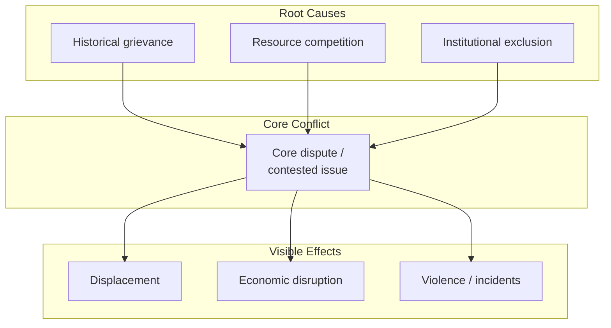

## Conflict Analysis and Mapping

### Overview

Conflict analysis is the systematic diagnostic process of understanding a conflict's actors, causes, dynamics, and structure before designing an intervention — mediation, facilitation, negotiation support, or programmatic peacebuilding. Conflict mapping is the family of visual and structured analytical tools used to conduct and communicate that analysis. The foundational premise shared across the field is that intervention design without rigorous prior analysis tends to misdiagnose root causes as symptoms (or vice versa), misidentify who the relevant parties actually are, and consequently produce interventions that address the wrong problem.

Conflict analysis is not a single technique but a toolkit; practitioners typically combine several of the frameworks below depending on the conflict's scale (interpersonal, communal, national, or interstate) and the intervention being planned.

### Core Analytical Frameworks

#### The ABC Triangle (Johan Galtung)

Galtung's foundational model decomposes conflict into three interacting elements:

- **A — Attitudes** — the psychological states of the parties: perceptions, emotions, misperceptions, dehumanization of the other side
- **B — Behavior** — the observable actions parties take: violence, negotiation, cooperation, coercion
- **C — Contradiction** — the underlying structural incompatibility of interests or goals that constitutes the substantive conflict

$$\text{Conflict} = f(A, B, C)$$

Galtung's key insight is that these three elements interact dynamically — worsening behavior hardens attitudes, hardened attitudes distort perception of the underlying contradiction, and so on — meaning an intervention addressing only one element (e.g., a ceasefire addressing Behavior alone) without addressing Attitudes or the underlying Contradiction is likely to prove unstable.

#### The Conflict Iceberg

A widely used visual heuristic distinguishing visible from hidden conflict elements:

- **Above the waterline (visible)** — positions, stated demands, observable behavior/incidents
- **Below the waterline (hidden)** — underlying interests, needs, values, emotions, history, and identity concerns that are not directly stated but drive the visible conflict

**[Inference]** The iceberg metaphor is primarily a pedagogical device for training facilitators and mediators to probe beneath stated positions rather than a rigorously operationalized analytical instrument; it is rarely cited in more technical conflict-analysis literature but is extremely common in practitioner training curricula.

#### Needs-Based Conflict Theory (John Burton)

Burton's human needs theory argues that many protracted, seemingly intractable conflicts are driven by threats to basic, non-negotiable human needs — identity, security, recognition, autonomy — as distinct from negotiable *interests* (resources, territory boundaries, economic terms). This distinction matters practically: interest-based conflicts are generally amenable to negotiated trade-offs, while needs-based conflicts require approaches (dialogue, recognition, identity accommodation) that address the underlying need rather than merely splitting a disputed resource.

### Structural Mapping Tools

#### Stakeholder / Actor Mapping

Identifies all parties with a stake in the conflict and their relative power and interest, typically visualized on a two-axis grid:

|  | Low interest | High interest |
| --- | --- | --- |
| **High power** | Monitor, keep informed | Manage closely — key players |
| **Low power** | Minimal effort | Keep informed — potential spoilers or allies |

**Key Points**

- Actor mapping must distinguish **primary parties** (directly engaged in the dispute), **secondary parties** (indirectly affected or with derivative interests), and **third parties** (mediators, guarantors, external states) — conflating these categories is a common analytical error that leads to negotiating tables that exclude actors capable of spoiling any agreement reached
- Mapping should explicitly surface **potential spoilers** — actors excluded from or opposed to a prospective settlement who retain the capacity to disrupt it

#### Conflict Tree

A cause-and-effect visualization borrowed from problem-tree analysis in development practice, adapted for conflict:

- **Roots** — underlying/structural causes (economic inequality, historical grievance, institutional exclusion)
- **Trunk** — the core problem/conflict as currently manifest
- **Branches/fruit** — visible effects and consequences (displacement, violence, economic disruption)

#### Timeline / Conflict History Mapping

Chronological mapping of key events, escalation triggers, prior intervention attempts, and turning points. This surfaces recurring escalation patterns and identifies previously attempted (and failed or succeeded) interventions, preventing a new mediator from repeating approaches already tried.

#### Force Field Analysis (Kurt Lewin)

Maps the driving forces pushing toward resolution against the restraining forces sustaining the conflict, weighted by relative strength — used to identify which restraining forces are most tractable to address (rather than assuming the strongest force is necessarily the most actionable one).

### Levels of Analysis

Conflict analysis conventionally operates across nested levels, since causes and dynamics at one level may differ substantially from another:

1. **Individual level** — psychological drivers, leader personality and perception, individual trauma
2. **Group/communal level** — identity dynamics, intergroup attitudes, local resource competition
3. **National level** — institutional structures, governance failures, national political economy of conflict
4. **Regional/international level** — external state interests, regional power dynamics, international resource flows or arms supply

**[Inference]** A frequent analytical failure is applying a single level of analysis (most often the national/state level, since it maps most naturally onto Track I diplomatic actors) to a conflict whose principal drivers actually operate at the communal or regional level — a mismatch that can lead official mediation efforts to negotiate the wrong set of issues with the wrong set of parties.

### Do No Harm / Conflict-Sensitivity Analysis (Mary B. Anderson)

A specific analytical lens developed initially for humanitarian and development actors, now widely adopted in conflict-sensitive programming generally. It maps:

- **Dividers** — factors that separate groups and increase tension (resource competition, discriminatory institutions, hate narratives)
- **Connectors** — factors that unite groups across conflict lines (shared markets, intermarriage, common infrastructure, cross-cutting institutions)

The analytical objective is to design interventions (including humanitarian aid delivery) that strengthen connectors and avoid inadvertently reinforcing dividers — for example, aid distribution mechanisms that unintentionally channel resources disproportionately to one conflict party can themselves become a driver of renewed conflict.

### Process: Conducting a Structured Conflict Analysis

**Next Steps for a practitioner conducting an analysis:**

1. Define the conflict system's boundaries — geographic, temporal, and actor scope — explicitly, since boundary-setting choices significantly shape what the analysis will and will not surface
2. Conduct actor mapping first, before substantive issue analysis, to ensure no relevant party (especially potential spoilers) is analytically excluded from the outset
3. Apply the ABC triangle or needs/interests distinction to separate negotiable interests from non-negotiable needs
4. Construct a conflict tree or timeline to distinguish root causes from proximate triggers and visible effects
5. Cross-check the resulting analysis against multiple sources and, where possible, multiple conflict parties' own perspectives, since single-source analysis is vulnerable to that source's own positional bias
6. Translate the analysis into intervention implications explicitly — an analysis that does not connect to actionable design choices has limited practical value

### Common Pitfalls in Conflict Analysis

**Key Points**

- **Conflating triggers with root causes** — treating the proximate incident that visibly escalated a conflict as its cause, missing the structural conditions that made escalation likely
- **Single-narrative capture** — relying predominantly on one party's or one external actor's framing of the conflict, especially where that source has its own stake in a particular diagnosis
- **Excluding non-elite or non-armed actors from mapping** — analyses conducted solely through elite interviews frequently miss grassroots dynamics that Track III intervention (see related topic) would need to address
- **Static analysis of a dynamic system** — conflict analysis is frequently treated as a one-time exercise at project inception, when conflicts (and the relevant actor landscape) evolve, requiring periodic re-analysis, particularly for protracted interventions

### Related Topics

- Ripeness theory as an application of conflict-analysis findings to intervention timing
- Stakeholder and spoiler mapping in peace-process design
- Do No Harm / conflict-sensitive programming in humanitarian contexts
- Needs-based versus interest-based negotiation theory (Burton, Fisher & Ury)
- Track II/III diplomacy as a response to communal-level conflict drivers
- Early warning and conflict monitoring systems